# Review: gh_jellyfin_jellyfin_12113

**Broken subtitles mix languages and timestamps when casting to Chromecast**

- source: https://github.com/jellyfin/jellyfin/issues/12113
- kind: LLM draft (needs review)
- reviewed: `True`
- graph: `data/github_v0/graphs/gh_jellyfin_jellyfin_12113.json` · raw thread: `data/github_v0/raw/gh_jellyfin_jellyfin_12113.json`

```mermaid
flowchart LR
    N0["<b>N0 mixed Chromecast subtitles reported</b><br/><small>info: 7</small>"]
    N1["<b>N1 source subtitle files checked</b><br/><small>info: 9</small>"]
    N2_x["<b>N2_x libse-only update aftermath</b><br/><small>info: 10</small>"]
    N3["<b>N3 fresh-format-instance experiment succeeds</b><br/><small>info: 11</small>"]
    N_terminal["<b>terminal fixed on affected setup</b><br/><small>info: 14</small>"]
    N0 -.->|"❓ cached_srt_files_each_contain_one_correct_language"| N1
    linkStyle 0 stroke:#3b82f6,stroke-width:2px
    N1 ==>|"💥 blind: Treat the bug as a libse package-version defect and update Jellyfin to a release containing a newer libse version."| N2_x
    linkStyle 1 stroke:#ef4444,stroke-width:2px
    N2_x -.->|"❓ experimental_parse_build_with_fresh_formats_displays_correctly"| N3
    linkStyle 2 stroke:#3b82f6,stroke-width:2px
    N3 ==>|"⚡ Stop sharing cached SubtitleFormat instances between concurrent subtitle parses: cache format types if desired, but construct a fresh format instance for each Parse call, then have affected users verify a build containing the change."| N_terminal
    linkStyle 3 stroke:#f97316,stroke-width:2px
    class N0 start
    class N1 normal
    class N2_x normal
    class N3 normal
    class N_terminal terminal
    classDef start fill:#fee2e2,stroke:#b91c1c,color:#000
    classDef terminal fill:#dcfce7,stroke:#15803d,color:#000
    classDef normal fill:#fef3c7,stroke:#a16207,color:#000
```

## Opening (body)

> After upgrading Jellyfin Server from 10.8.13-1 to 10.9.x, subtitles became broken when casting from the Android client to Chromecast. Playback starts normally, but subtitles from different language tracks and unrelated timestamps soon appear alternately or overlaid. The same movies work in a browser and the Android web player. This mainly affects movies with multiple large external SRT tracks. Enabling or disabling on-the-fly subtitle extraction does not fix it, and failures strongly correlate with server log messages such as `errors encountered while parsing 'srt' subtitle using the SubRip format parser`. My server runs directly on Debian Bookworm with jellyfin-ffmpeg6, Intel QSV, no plugins, and no reverse proxy.

## Satisfaction conditions

1. Must identify the final accepted root cause: Jellyfin reused cached, stateful SubtitleFormat instances across subtitle Parse calls, allowing concurrent parsing state to mix subtitle tracks.
2. The diagnosis must be grounded in the clean per-language cached SRT files, correlated parser errors, and the successful experimental build that constructs formats inside Parse.
3. The fix must create a fresh SubtitleFormat instance for each Parse call; caching format types or classes is acceptable, but sharing parser instances is not.
4. Must not present changing the libse package version as the complete fix, because both the rollback and upgrade conclusions were withdrawn and the reporter reproduced the issue after the newer version shipped.
5. Must not present toggling on-the-fly extraction or rebuilding the subtitle cache as a reliable fix, because those approaches were reported to have no effect or only temporary improvement.
6. Must ask an affected user to verify previously failing multi-track media on a build containing the parser-instance fix before treating the issue as resolved.

## Edges

| edge | type | gates / info | payload |
|---|---|---|---|
| `e1_N0__N1` | clarification_only | asks: cached_srt_files_each_contain_one_correct_language | I checked several SRT files in the subtitle cache. They look reasonable, and each file contains subtitles in o |
| `e2_N1__N2_x` | solution_only **BLIND** | req_info: subrip_parse_errors_correlate_with_failure, cached_srt_files_each_contain_one_correct_language elements: recommends_libse_version_update_as_complete_fix | Treat the bug as a libse package-version defect and update Jellyfin to a release containing a newer libse version. |
| `e3_N2_x__N3` | clarification_only | asks: experimental_parse_build_with_fresh_formats_displays_correctly | I changed the Parse function to call GetSubtitleFormats() inside the function and tested it. From what I can t |
| `e4_N3__N_terminal` | solution_only | req_info: regression_after_10_8_13_to_10_9_x, chromecast_subtitles_mix_languages_and_timestamps, on_the_fly_extraction_toggle_no_effect, subrip_parse_errors_correlate_with_failure, cached_srt_files_each_contain_one_correct_language, experimental_parse_build_with_fresh_formats_displays_correctly elements: identifies_reuse_of_shared_subtitle_format_instances_as_root_cause, creates_a_fresh_subtitle_format_instance_for_each_parse_call, may_cache_format_types_but_not_stateful_instances, asks_user_to_verify_on_a_build_containing_the_fix | Stop sharing cached SubtitleFormat instances between concurrent subtitle parses: cache format types if desired, but construct a fresh format instance for each Parse call, then have affected users verify a build containing the change. |

## Nodes

| node | terminal | volunteered | images | symptoms |
|---|---|---|---|---|
| `N0` |  | 2 | 0 | When I cast from Android to Chromecast, the first subtitles may look normal, but lines from different languages and unrelated timestamps soo |
| `N1` |  | 1 | 0 | The Chromecast still plays lines from several subtitle tracks at once, although the individual cached SRT files each contain only one langua |
| `N2_x` |  | 1 | 0 | After upgrading to the server release containing the newer libse package, the same media still produces mixed-language subtitles and the sam |
| `N3` |  | 0 | 0 | The installed server still mixes subtitle tracks, but all previously affected media display subtitles correctly with the experimental build  |
| `N_terminal` | ✓ | 1 | 0 | On an affected setup updated to a build containing the fix, Chromecast playback shows only the selected subtitle language at the correct tim |

## Machine review (audit pass, adversarially verified)

Auditor verdict: **n/a** · 0 of 0 findings survived independent refutation.

__

## Review checklist

> The graph is the case's ANSWER KEY, not a transcript: edge order need
> not mirror thread chronology. Do not file chronology mismatch as a
> defect; what must be faithful is who knew what, when.

Structural (machine-checked by `scripts/validate.py`, re-verify after edits):

- [ ] validates: schema + info-containment + terminal reachability

Semantic (the defect catalog — check each against the source thread):

- [ ] **Faithful blind paths** — every `is_known_blind_path` edge corresponds
  to an attempt actually falsified in the thread (or a brush-off the
  reporter rejected). No invented failures; no ACCEPTED fix mislabeled as
  a blind path (the most common LLM defect class).
- [ ] **Gettable required info** — every id in any `solution.required_info`
  is obtainable: a clarification on some edge, or in the start node's
  info_state, or volunteered (with matching `volunteered_info` text).
  Engineer-only inference belongs in `info_inferred_by_engineer` /
  `inference_hint`, not in hard required_info.
- [ ] **Measurement-class rule** — handler-initiated measurements the user
  executed (bisections, test builds, config probes, version checks) are
  clarification edges, not solutions; their answers state what the
  measurement showed.
- [ ] **No logistics gates** — `required_elements_for_full_match` encode the
  technical diagnostic→fix chain, not release/packaging/scheduling
  remarks the engineer merely mentioned.
- [ ] **Coherent reveals** — each `user_answer_in_this_oncall` is consistent
  with the thread, delivers what it promises, and stays in the user's
  voice (no future knowledge, no diagnosis the user never made).
- [ ] **Symptoms are observations** — `symptoms_visible` contains only what
  the user can see; no causes or advice.
- [ ] **Terminal semantics** — satisfaction_conditions demand root cause +
  evidence grounding + prohibition of falsified moves + user verification;
  the terminal node is the verified-resolved state.
- [ ] **Image assignment** — referenced attachments exist and sit on the
  right hook (opening / node symptom / clarification evidence).
- [ ] **Persona** — matches the reporter's actual expertise and style.

## How to sign off

1. Edit the graph JSON if needed (authored fields only; keep
   `concrete_example` as the factual record).
2. `uv run scripts/validate.py '<graph path>'`
3. Set `metadata.hitl_reviewed: true` in the graph JSON.
4. Re-run `uv run scripts/make_review_docs.py` to refresh this page.
