# Review: gh_keras-team_keras_19891

**Keras 3 gives incorrect output from evaluate/fit in distributed context**

- source: https://github.com/keras-team/keras/issues/19891
- kind: LLM draft (needs review)
- reviewed: `True`
- graph: `data/github_v0/graphs/gh_keras-team_keras_19891.json` · raw thread: `data/github_v0/raw/gh_keras-team_keras_19891.json`

```mermaid
flowchart LR
    N0["<b>N0 distributed evaluation and training errors reported</b><br/><small>info: 7</small>"]
    N1["<b>N1 Keras 3.5 synchronization retest</b><br/><small>info: 8</small>"]
    N2["<b>N2 latest master still fails training invariant</b><br/><small>info: 9</small>"]
    N2_x["<b>N2_x evaluation-only resolution rejected</b><br/><small>info: 10</small>"]
    N_terminal["<b>terminal reporter confirms distributed fit fix</b><br/><small>info: 12</small>"]
    N0 -.->|"❓ keras35_weights_synced_but_replica_count_changes_result"| N1
    linkStyle 0 stroke:#3b82f6,stroke-width:2px
    N1 -.->|"❓ latest_master_fit_retest_still_replica_dependent"| N2
    linkStyle 1 stroke:#3b82f6,stroke-width:2px
    N2 ==>|"💥 blind: Treat the whole report as resolved because an evaluation-only reproduction returns the expected loss on a current Keras release."| N2_x
    linkStyle 2 stroke:#ef4444,stroke-width:2px
    N2_x ==>|"⚡ Correct distributed gradient aggregation so a MirroredStrategy training step has the same mathematical result regardless of replica count, then ask the reporter to verify the updated per-replica weight reproduction on a build containing the correction."| N_terminal
    linkStyle 3 stroke:#f97316,stroke-width:2px
    class N0 start
    class N1 normal
    class N2 normal
    class N2_x normal
    class N_terminal terminal
    classDef start fill:#fee2e2,stroke:#b91c1c,color:#000
    classDef terminal fill:#dcfce7,stroke:#15803d,color:#000
    classDef normal fill:#fef3c7,stroke:#a16207,color:#000
```

## Opening (body)

> In Keras 3, changing the number of replicas under `tf.distribute.MirroredStrategy` changes the results of `model.evaluate` and `model.fit`, while the same scripts are replica-invariant with `tf-keras`. With one replica, the calculated mean-squared error and `evaluate` both return `0.4300948`; with two or four replicas, `evaluate` instead returns the loss from the first replica (`0.5054660` or `0.5540136`). A training test also shows independent post-fit weights on each replica: with two replicas I get `0.82471704` and `0.5107398`, while `tf-keras` synchronizes both to `0.6677284`. It appears there are two issues: `evaluate` returns only the first replica's loss, and gradient aggregation is not occurring during distributed training.

## Satisfaction conditions

1. Must identify the remaining training root cause at the level established by the thread: Keras 3's distributed gradient aggregation or reduction is incorrect, causing the update for a fixed global batch to change with the number of replicas.
2. Must ground the diagnosis in the collected evidence: replicas were initially independent, and after an intermediate synchronization change they held equal weights within a run but still produced different shared weights for one, two, and four replicas.
3. Must distinguish the separate evaluation symptom from the training defect; a correct `evaluate` value alone does not establish that distributed `fit` is fixed.
4. Must not treat variable synchronization alone as the complete fix, because the Keras 3.5 retest had synchronized replicas while training remained replica-count dependent.
5. Must ask the reporter to rerun the updated fit/weight reproduction on a build containing the distributed-training correction and only declare resolution after the reporter confirms it.

## Edges

| edge | type | gates / info | payload |
|---|---|---|---|
| `e1_N0__N1` | clarification_only | asks: keras35_weights_synced_but_replica_count_changes_result | I did a quick test with Keras 3.5. With one replica I get `[[0.6677284]]`; with two replicas both weights are  |
| `e2_N1__N2` | clarification_only | asks: latest_master_fit_retest_still_replica_dependent | I ran the updated training script on the latest master commit and still see the same incorrect behavior as in  |
| `e3_N2__N2_x` | solution_only **BLIND** | req_info: keras3_evaluate_changes_with_replica_count elements: uses_evaluate_success_to_declare_the_entire_issue_resolved | Treat the whole report as resolved because an evaluation-only reproduction returns the expected loss on a current Keras release. |
| `e4_N2_x__N_terminal` | solution_only | req_info: fit_output_changes_with_replica_count, initial_keras3_replicas_have_independent_weights, tf_keras_results_are_replica_invariant, reporter_separates_evaluate_and_training_issues, keras35_weights_synced_but_replica_count_changes_result, latest_master_fit_retest_still_replica_dependent elements: identifies_incorrect_distributed_gradient_aggregation_as_the_remaining_fit_problem, requires_training_result_to_be_invariant_to_replica_count_for_the_same_global_batch, distinguishes_synced_weights_from_a_correctly_aggregated_update, asks_user_to_verify_on_a_build_containing_the_distributed_training_fix | Correct distributed gradient aggregation so a MirroredStrategy training step has the same mathematical result regardless of replica count, then ask the reporter to verify the updated per-replica weight reproduction on a build containing the correction. |

## Nodes

| node | terminal | volunteered | images | symptoms |
|---|---|---|---|---|
| `N0` |  | 3 | 0 | With Keras 3 and MirroredStrategy, `evaluate` returns 0.4300948 with one replica, 0.5054660 with two replicas, and 0.5540136 with four repli |
| `N1` |  | 0 | 0 | In my Keras 3.5 test, replicas now agree with each other after training, but the shared result is 0.6677284 with one replica, 0.33545685 wit |
| `N2` |  | 0 | 0 | Running the distributed training script on the latest master still gives different post-fit weights when I change the number of replicas. |
| `N2_x` |  | 1 | 0 | The updated reproduction does not call `evaluate`; its post-fit weights still change with the replica count even though an evaluation-only e |
| `N_terminal` | ✓ | 1 | 0 | After testing a build containing the distributed-training correction, the replica-count-dependent `fit` behavior is fixed. |

## Machine review (audit pass, adversarially verified)

Auditor verdict: **n/a** · 0 of 0 findings survived independent refutation.

__

## Review checklist

> The graph is the case's ANSWER KEY, not a transcript: edge order need
> not mirror thread chronology. Do not file chronology mismatch as a
> defect; what must be faithful is who knew what, when.

Structural (machine-checked by `scripts/validate.py`, re-verify after edits):

- [ ] validates: schema + info-containment + terminal reachability

Semantic (the defect catalog — check each against the source thread):

- [ ] **Faithful blind paths** — every `is_known_blind_path` edge corresponds
  to an attempt actually falsified in the thread (or a brush-off the
  reporter rejected). No invented failures; no ACCEPTED fix mislabeled as
  a blind path (the most common LLM defect class).
- [ ] **Gettable required info** — every id in any `solution.required_info`
  is obtainable: a clarification on some edge, or in the start node's
  info_state, or volunteered (with matching `volunteered_info` text).
  Engineer-only inference belongs in `info_inferred_by_engineer` /
  `inference_hint`, not in hard required_info.
- [ ] **Measurement-class rule** — handler-initiated measurements the user
  executed (bisections, test builds, config probes, version checks) are
  clarification edges, not solutions; their answers state what the
  measurement showed.
- [ ] **No logistics gates** — `required_elements_for_full_match` encode the
  technical diagnostic→fix chain, not release/packaging/scheduling
  remarks the engineer merely mentioned.
- [ ] **Coherent reveals** — each `user_answer_in_this_oncall` is consistent
  with the thread, delivers what it promises, and stays in the user's
  voice (no future knowledge, no diagnosis the user never made).
- [ ] **Symptoms are observations** — `symptoms_visible` contains only what
  the user can see; no causes or advice.
- [ ] **Terminal semantics** — satisfaction_conditions demand root cause +
  evidence grounding + prohibition of falsified moves + user verification;
  the terminal node is the verified-resolved state.
- [ ] **Image assignment** — referenced attachments exist and sit on the
  right hook (opening / node symptom / clarification evidence).
- [ ] **Persona** — matches the reporter's actual expertise and style.

## How to sign off

1. Edit the graph JSON if needed (authored fields only; keep
   `concrete_example` as the factual record).
2. `uv run scripts/validate.py '<graph path>'`
3. Set `metadata.hitl_reviewed: true` in the graph JSON.
4. Re-run `uv run scripts/make_review_docs.py` to refresh this page.
