# Review: gh_kubernetes_kubernetes_120622

**scheduler: handle in-flight Pods with less memory**

- source: https://github.com/kubernetes/kubernetes/issues/120622
- kind: LLM draft (needs review)
- reviewed: `True`
- graph: `data/github_v0/graphs/gh_kubernetes_kubernetes_120622.json` · raw thread: `data/github_v0/raw/gh_kubernetes_kubernetes_120622.json`

```mermaid
flowchart LR
    N0["<b>N0 in-flight event memory concern reported</b><br/><small>info: 5</small>"]
    N1["<b>N1 affected cluster reproduction established</b><br/><small>info: 9</small>"]
    N2["<b>N2 profiles and runtime behavior collected</b><br/><small>info: 12</small>"]
    N3["<b>N3 unbounded event retention measured</b><br/><small>info: 14</small>"]
    N3_x["<b>N3_x unsafe unconditional cleanup probe</b><br/><small>info: 16</small>"]
    N4["<b>N4 robust candidate fix verified</b><br/><small>info: 17</small>"]
    N_terminal["<b>terminal memory leak resolved</b><br/><small>info: 20</small>"]
    N0 -.->|"❓ affected_cluster_kubernetes_v1_30_3, qhint_enabled_scheduler_ooms, disabling_qhint_stops_scheduler_oom, heap_profile_and_memory_graphs_shared"| N1
    linkStyle 0 stroke:#3b82f6,stroke-width:2px
    N1 -.->|"❓ pprof_call_graph_images_shared, scheduler_continues_scheduling_during_memory_growth"| N2
    linkStyle 1 stroke:#3b82f6,stroke-width:2px
    N2 -.->|"❓ debug_logs_show_few_inflight_pods_and_over_62000_events, inflight_event_count_keeps_increasing"| N3
    linkStyle 2 stroke:#3b82f6,stroke-width:2px
    N3 ==>|"💥 blind: Unconditionally defer SchedulingQueue.Done for every Pod at the start of ScheduleOne so in-flight entries are removed immediately."| N3_x
    linkStyle 3 stroke:#ef4444,stroke-width:2px
    N3_x -.->|"❓ multi_element_list_candidate_solves_problem"| N4
    linkStyle 4 stroke:#3b82f6,stroke-width:2px
    N4 ==>|"⚡ Make in-flight tracking robust to the same Pod having multiple list entries, so completion removes the correct entries and no orphan can indefinitely retain subsequent events; retain regression coverage that monitors in-flight event growth."| N_terminal
    linkStyle 5 stroke:#f97316,stroke-width:2px
    class N0 start
    class N1 normal
    class N2 normal
    class N3 normal
    class N3_x normal
    class N4 normal
    class N_terminal terminal
    classDef start fill:#fee2e2,stroke:#b91c1c,color:#000
    classDef terminal fill:#dcfce7,stroke:#15803d,color:#000
    classDef normal fill:#fef3c7,stroke:#a16207,color:#000
```

## Opening (body)

> All cluster events during scheduling are piled up in inFlightEvents. The scheduler currently needs them to decide which queue should receive failed Pods, but recording every cluster event during a Pod's scheduling increases scheduler memory consumption, especially in a busy cluster. There may also be a memory leak around inFlightEvents. I want to reduce this memory impact as much as possible.

## Satisfaction conditions

1. Must identify the accepted root cause: the same Pod can have multiple in-flight list entries, but a single map entry is overwritten to point only to the newest element; Done then removes only that element and leaves an older entry that prevents accumulated events from being cleaned.
2. Must ground the diagnosis in the collected evidence: QueueingHint-dependent OOM behavior, very few in-flight Pods alongside more than 62,000 monotonically increasing inFlightEvents, and successful testing of the multi-element list change.
3. Must not recommend unconditionally calling SchedulingQueue.Done at the start of ScheduleOne; that diagnostic probe breaks the required lifetime of Pods that enter the binding cycle.
4. The durable fix must correctly account for multiple in-flight elements per Pod and include metric-based scheduler_perf regression coverage for excessive in-flight event growth.
5. Must treat the issue as resolved only after an affected operator verifies that a build containing the robust queue change no longer exhibits the memory problem.

## Edges

| edge | type | gates / info | payload |
|---|---|---|---|
| `e1_N0__N1` | clarification_only | asks: affected_cluster_kubernetes_v1_30_3, qhint_enabled_scheduler_ooms, disabling_qhint_stops_scheduler_oom, heap_profile_and_memory_graphs_shared | My Kubernetes version is v1.30.3. / Yes, QueueingHint is enabled, and the scheduler eventually OOMs. / After I disabled the QueueingHint feature gate, the scheduler stopped OOMing. These are the memory graphs from / I captured an in-use-space heap profile from kube-scheduler and pasted its allocation table along with the bef |
| `e2_N1__N2` | clarification_only | asks: pprof_call_graph_images_shared, scheduler_continues_scheduling_during_memory_growth | Yes, I reproduced it in this cluster and captured these pprof graph views. / It is still scheduling Pods while the memory is growing. |
| `e3_N2__N3` | clarification_only | asks: debug_logs_show_few_inflight_pods_and_over_62000_events, inflight_event_count_keeps_increasing | I added the debug log. The output repeatedly has only two to five inFlightPods, while inFlightEvents is alread / The inFlightEvents number keeps rising on successive lines: 62741, 62747, 62753, 62765, 62766, 62768, 62773, 6 |
| `e4_N3__N3_x` | solution_only **BLIND** | req_info: debug_logs_show_few_inflight_pods_and_over_62000_events, inflight_event_count_keeps_increasing elements: calls_done_unconditionally_from_scheduleone | Unconditionally defer SchedulingQueue.Done for every Pod at the start of ScheduleOne so in-flight entries are removed immediately. |
| `e5_N3_x__N4` | clarification_only | asks: multi_element_list_candidate_solves_problem | I cherry-picked the proposed change and tried again. The problem is solved by the multi-element-in-the-list ch |
| `e6_N4__N_terminal` | solution_only | req_info: scheduler_records_all_events_for_inflight_pods, busy_clusters_can_accumulate_high_scheduler_memory, scheduler_continues_scheduling_during_memory_growth, debug_logs_show_few_inflight_pods_and_over_62000_events, inflight_event_count_keeps_increasing, multi_element_list_candidate_solves_problem, pprof_call_graph_images_shared elements: identifies_duplicate_inflight_entries_for_one_pod, explains_single_pointer_overwrite_leaves_an_older_entry, removes_or_accounts_for_all_list_elements_without_ending_binding_early, uses_inflight_event_metric_regression_coverage, requires_affected_cluster_verification_before_declaring_resolution | Make in-flight tracking robust to the same Pod having multiple list entries, so completion removes the correct entries and no orphan can indefinitely retain subsequent events; retain regression coverage that monitors in-flight event growth. |

## Nodes

| node | terminal | volunteered | images | symptoms |
|---|---|---|---|---|
| `N0` |  | 1 | 0 | In a busy cluster, events occurring while Pods are being scheduled accumulate in inFlightEvents and increase scheduler memory consumption. |
| `N1` |  | 1 | 0 | On my Kubernetes v1.30.3 cluster, the scheduler runs out of memory with QueueingHint enabled; after I disable that feature gate, it stops OO |
| `N2` |  | 1 | 0 | The scheduler's memory continues growing, but it is still scheduling Pods. We have encountered this on one cluster and I do not know what ma |
| `N3` |  | 0 | 0 | My debug logs show only about two to five in-flight Pods while the inFlightEvents count is already above 62,000 and keeps increasing. |
| `N3_x` |  | 1 | 0 | With a temporary defer that calls Done for every ScheduleOne invocation, my debug output stays around one in-flight Pod and one in-flight ev |
| `N4` |  | 0 | 0 | After testing the proposed multi-element-in-the-list change, the scheduler memory problem no longer occurs on my affected cluster. |
| `N_terminal` | ✓ | 0 | 0 | With the multi-element in-flight tracking fix applied, the affected scheduler no longer accumulates inFlightEvents until it runs out of memo |

## Machine review (audit pass, adversarially verified)

Auditor verdict: **n/a** · 0 of 0 findings survived independent refutation.

__

## Review checklist

> The graph is the case's ANSWER KEY, not a transcript: edge order need
> not mirror thread chronology. Do not file chronology mismatch as a
> defect; what must be faithful is who knew what, when.

Structural (machine-checked by `scripts/validate.py`, re-verify after edits):

- [ ] validates: schema + info-containment + terminal reachability

Semantic (the defect catalog — check each against the source thread):

- [ ] **Faithful blind paths** — every `is_known_blind_path` edge corresponds
  to an attempt actually falsified in the thread (or a brush-off the
  reporter rejected). No invented failures; no ACCEPTED fix mislabeled as
  a blind path (the most common LLM defect class).
- [ ] **Gettable required info** — every id in any `solution.required_info`
  is obtainable: a clarification on some edge, or in the start node's
  info_state, or volunteered (with matching `volunteered_info` text).
  Engineer-only inference belongs in `info_inferred_by_engineer` /
  `inference_hint`, not in hard required_info.
- [ ] **Measurement-class rule** — handler-initiated measurements the user
  executed (bisections, test builds, config probes, version checks) are
  clarification edges, not solutions; their answers state what the
  measurement showed.
- [ ] **No logistics gates** — `required_elements_for_full_match` encode the
  technical diagnostic→fix chain, not release/packaging/scheduling
  remarks the engineer merely mentioned.
- [ ] **Coherent reveals** — each `user_answer_in_this_oncall` is consistent
  with the thread, delivers what it promises, and stays in the user's
  voice (no future knowledge, no diagnosis the user never made).
- [ ] **Symptoms are observations** — `symptoms_visible` contains only what
  the user can see; no causes or advice.
- [ ] **Terminal semantics** — satisfaction_conditions demand root cause +
  evidence grounding + prohibition of falsified moves + user verification;
  the terminal node is the verified-resolved state.
- [ ] **Image assignment** — referenced attachments exist and sit on the
  right hook (opening / node symptom / clarification evidence).
- [ ] **Persona** — matches the reporter's actual expertise and style.

## How to sign off

1. Edit the graph JSON if needed (authored fields only; keep
   `concrete_example` as the factual record).
2. `uv run scripts/validate.py '<graph path>'`
3. Set `metadata.hitl_reviewed: true` in the graph JSON.
4. Re-run `uv run scripts/make_review_docs.py` to refresh this page.
