# Review: gh_llvm_llvm-project_60115

**15.0.7 runtime build fails on armv7l with missing unwinder**

- source: https://github.com/llvm/llvm-project/issues/60115
- kind: LLM draft (needs review)
- reviewed: `True`
- graph: `data/github_v0/graphs/gh_llvm_llvm-project_60115.json` · raw thread: `data/github_v0/raw/gh_llvm_llvm-project_60115.json`

```mermaid
flowchart LR
    N0["<b>N0 armv7l runtime build failure reported</b><br/><small>info: 7</small>"]
    N1["<b>N1 linker version and main branch checked</b><br/><small>info: 10</small>"]
    N2_x["<b>N2_x runtime-order attempt aftermath</b><br/><small>info: 11</small>"]
    N3_x["<b>N3_x GWP-ASan workaround exposes invalid triple</b><br/><small>info: 13</small>"]
    N4["<b>N4 valid runtime triple exposes missing library path</b><br/><small>info: 15</small>"]
    N5["<b>N5 LLVM 15 build passes with local workarounds</b><br/><small>info: 18</small>"]
    N_terminal["<b>terminal upstream fixes verified</b><br/><small>info: 21</small>"]
    N0 -.->|"❓ newer_binutils_removes_dwarf_message_but_runtime_still_fails, main_branch_same_initial_configuration_also_fails"| N1
    linkStyle 0 stroke:#3b82f6,stroke-width:2px
    N1 ==>|"💥 blind: Reorder the entries in LLVM_ENABLE_RUNTIMES so compiler-rt is built after the C++ and unwind runtimes."| N2_x
    linkStyle 1 stroke:#ef4444,stroke-width:2px
    N2_x ==>|"💥 blind: Apply the available runtime-build workaround patches and disable GWP-ASan for the exact Arm target to get past the original compiler-rt failure."| N3_x
    linkStyle 2 stroke:#ef4444,stroke-width:2px
    N3_x ==>|"💥 blind: Force the runtimes build to use the compiler's valid armv7l target instead of the generated armhf target."| N4
    linkStyle 3 stroke:#ef4444,stroke-width:2px
    N4 ==>|"⚡ Use a local LLVM 15 workaround by adding the runtime build's library directory to the linker search path so libc++abi can find libunwind."| N5
    linkStyle 4 stroke:#f97316,stroke-width:2px
    N5 ==>|"⚡ Fix the runtime CMake configuration upstream so dependent runtime links receive the built libunwind search path, while also correcting Arm runtime-target handling, then ask the reporter to verify an updated build with the original scripts."| N_terminal
    linkStyle 5 stroke:#f97316,stroke-width:2px
    class N0 start
    class N1 normal
    class N2_x normal
    class N3_x normal
    class N4 normal
    class N5 normal
    class N_terminal terminal
    classDef start fill:#fee2e2,stroke:#b91c1c,color:#000
    classDef terminal fill:#dcfce7,stroke:#15803d,color:#000
    classDef normal fill:#fef3c7,stroke:#a16207,color:#000
```

## Opening (body)

> I'm maintaining a multi-platform binary distribution and my 32-bit Arm build of LLVM 15.0.7 fails while building the runtimes. I reproduced it on a clean machine with a minimal CMake configuration enabling clang, lld, lldb, clang-tools-extra, polly and the compiler-rt, libc++, libc++abi and libunwind runtimes, with per-target runtime directories enabled. The failure contains missing-unwinder references. It is not an out-of-memory failure. I also see GNU ld messages saying `DWARF error: invalid or unhandled FORM value: 0x25`; this clean machine has GNU ld 2.35.2.

## Satisfaction conditions

1. Must identify the accepted missing-unwinder cause: the runtime CMake configuration failed to propagate the directory containing the in-tree libunwind to the libc++abi link; adding that library path made the LLVM 15 build pass.
2. Must also account for the separate Arm runtime-target defect encountered during diagnosis: per-target handling could transform the valid armv7l target into the invalid armhf target, requiring an explicit valid runtime target as a workaround and an upstream target-handling correction.
3. Must distinguish the GNU ld DWARF FORM 0x25 diagnostic from the missing-unwinder failure: newer binutils removed the DWARF message but did not fix the runtime build.
4. Must not present runtime reordering, disabling GWP-ASan, or specifying the valid target triple alone as the complete fix; each was tried or used in-case without independently resolving the missing libunwind link path.
5. Must ask the reporter to verify the upstream runtime CMake corrections using an updated build before declaring the issue fully resolved; the terminal evidence is the reporter's successful multi-platform build.

## Edges

| edge | type | gates / info | payload |
|---|---|---|---|
| `e1_N0__N1` | clarification_only | asks: newer_binutils_removes_dwarf_message_but_runtime_still_fails, main_branch_same_initial_configuration_also_fails | My production environment uses GCC 12 and binutils 2.39. I don't see the DWARF error there, but the 32-bit Arm / I asked for a build with the latest main branch using the same initial configuration, and it failed with the s |
| `e2_N1__N2_x` | solution_only **BLIND** | req_info: initial_configuration_enables_compiler_rt_libcxx_libcxxabi_libunwind, linker_line_uses_unwindlib_none_but_unwind_references_remain elements: suggests_reordering_the_enabled_runtimes | Reorder the entries in LLVM_ENABLE_RUNTIMES so compiler-rt is built after the C++ and unwind runtimes. |
| `e3_N2_x__N3_x` | solution_only **BLIND** | req_info: llvm_15_0_7_armv7l_runtime_build_fails_on_clean_machine, initial_configuration_enables_compiler_rt_libcxx_libcxxabi_libunwind elements: applies_the_runtime_build_workarounds, disables_gwp_asan_for_the_exact_arm_target | Apply the available runtime-build workaround patches and disable GWP-ASan for the exact Arm target to get past the original compiler-rt failure. |
| `e4_N3_x__N4` | solution_only **BLIND** | req_info: build_generates_invalid_armhf_target_triple, per_target_runtime_directories_enabled elements: uses_the_valid_armv7l_runtime_target, avoids_the_generated_armhf_target | Force the runtimes build to use the compiler's valid armv7l target instead of the generated armhf target. |
| `e5_N4__N5` | solution_only | req_info: libcxxabi_link_still_cannot_find_libunwind, initial_configuration_enables_compiler_rt_libcxx_libcxxabi_libunwind elements: adds_the_directory_containing_built_libunwind_to_the_link_search_path | Use a local LLVM 15 workaround by adding the runtime build's library directory to the linker search path so libc++abi can find libunwind. |
| `e6_N5__N_terminal` | solution_only | req_info: runtime_link_reports_missing_unwinder, cmake_omits_build_lib_search_path_for_libunwind, manual_ldflags_build_lib_path_makes_15_build_pass, linker_line_uses_unwindlib_none_but_unwind_references_remain, newer_binutils_removes_dwarf_message_but_runtime_still_fails, main_branch_same_initial_configuration_also_fails elements: fixes_propagation_of_the_built_libunwind_search_path, corrects_or_safely_disables_the_broken_arm_per_target_triple_handling, distinguishes_the_unrelated_gnu_ld_dwarf_diagnostic, asks_user_to_verify_on_a_build_containing_the_runtime_cmake_fixes | Fix the runtime CMake configuration upstream so dependent runtime links receive the built libunwind search path, while also correcting Arm runtime-target handling, then ask the reporter to verify an updated build with the original scripts. |

## Nodes

| node | terminal | volunteered | images | symptoms |
|---|---|---|---|---|
| `N0` |  | 3 | 0 | My clean 32-bit Arm build of the LLVM 15.0.7 runtimes stops with missing-unwinder references. The same build log also contains `/usr/bin/ld: |
| `N1` |  | 1 | 0 | With GCC 12 and binutils 2.39 I no longer see the DWARF message, but the 32-bit Arm runtime build still fails. The linker line says `--unwin |
| `N2_x` |  | 1 | 0 | After rebuilding with a different order in `LLVM_ENABLE_RUNTIMES`, the 32-bit Arm runtime build still fails. |
| `N3_x` |  | 2 | 0 | After applying the suggested runtime patches and disabling GWP-ASan for `armv7l-unknown-linux-gnueabihf`, the build reaches the fuzzer runti |
| `N4` |  | 2 | 0 | With `LLVM_RUNTIME_TARGETS=armv7l-unknown-linux-gnueabihf`, the invalid `armhf` target error is gone, but linking `libc++abi.so.1.0` fails w |
| `N5` |  | 3 | 0 | After I add the build's `lib` directory to `LDFLAGS`, `libc++abi.so.1.0` finds `libunwind.so` and the LLVM 15 production build completes. Th |
| `N_terminal` | ✓ | 1 | 0 | My normal build scripts complete successfully on x86_64, aarch64 and armv7l with the updated LLVM release. |

## Machine review (audit pass, adversarially verified)

Auditor verdict: **n/a** · 0 of 0 findings survived independent refutation.

__

## Review checklist

> The graph is the case's ANSWER KEY, not a transcript: edge order need
> not mirror thread chronology. Do not file chronology mismatch as a
> defect; what must be faithful is who knew what, when.

Structural (machine-checked by `scripts/validate.py`, re-verify after edits):

- [ ] validates: schema + info-containment + terminal reachability

Semantic (the defect catalog — check each against the source thread):

- [ ] **Faithful blind paths** — every `is_known_blind_path` edge corresponds
  to an attempt actually falsified in the thread (or a brush-off the
  reporter rejected). No invented failures; no ACCEPTED fix mislabeled as
  a blind path (the most common LLM defect class).
- [ ] **Gettable required info** — every id in any `solution.required_info`
  is obtainable: a clarification on some edge, or in the start node's
  info_state, or volunteered (with matching `volunteered_info` text).
  Engineer-only inference belongs in `info_inferred_by_engineer` /
  `inference_hint`, not in hard required_info.
- [ ] **Measurement-class rule** — handler-initiated measurements the user
  executed (bisections, test builds, config probes, version checks) are
  clarification edges, not solutions; their answers state what the
  measurement showed.
- [ ] **No logistics gates** — `required_elements_for_full_match` encode the
  technical diagnostic→fix chain, not release/packaging/scheduling
  remarks the engineer merely mentioned.
- [ ] **Coherent reveals** — each `user_answer_in_this_oncall` is consistent
  with the thread, delivers what it promises, and stays in the user's
  voice (no future knowledge, no diagnosis the user never made).
- [ ] **Symptoms are observations** — `symptoms_visible` contains only what
  the user can see; no causes or advice.
- [ ] **Terminal semantics** — satisfaction_conditions demand root cause +
  evidence grounding + prohibition of falsified moves + user verification;
  the terminal node is the verified-resolved state.
- [ ] **Image assignment** — referenced attachments exist and sit on the
  right hook (opening / node symptom / clarification evidence).
- [ ] **Persona** — matches the reporter's actual expertise and style.

## How to sign off

1. Edit the graph JSON if needed (authored fields only; keep
   `concrete_example` as the factual record).
2. `uv run scripts/validate.py '<graph path>'`
3. Set `metadata.hitl_reviewed: true` in the graph JSON.
4. Re-run `uv run scripts/make_review_docs.py` to refresh this page.
