# Review: gh_micropython_micropython_10335

**m.iMX RT: After a few seconds print() hangs**

- source: https://github.com/micropython/micropython/issues/10335
- kind: LLM draft (needs review)
- reviewed: `False`
- graph: `data/github_v0/graphs/gh_micropython_micropython_10335.json` · raw thread: `data/github_v0/raw/gh_micropython_micropython_10335.json`

```mermaid
flowchart LR
    N0["<b>N0 delayed output hang reported</b><br/><small>info: 4</small>"]
    N1["<b>N1 program execution continues</b><br/><small>info: 6</small>"]
    N2["<b>N2 failure isolated to USB channel</b><br/><small>info: 9</small>"]
    N3["<b>N3 host dependency established</b><br/><small>info: 11</small>"]
    N4["<b>N4 host setting identified and tested</b><br/><small>info: 12</small>"]
    N_terminal["<b>terminal resolved</b><br/><small>info: 12</small>"]
    N0 -.->|"❓ led_turns_off_after_five_seconds_despite_missing_usb_output"| N1
    linkStyle 0 stroke:#3b82f6,stroke-width:2px
    N1 -.->|"❓ uart_receives_finish_and_repl_while_usb_output_stalls, usb_enter_key_can_restore_prompt_without_finish"| N2
    linkStyle 1 stroke:#3b82f6,stroke-width:2px
    N2 -.->|"❓ same_board_works_on_windows10_but_fails_on_manjaro"| N3
    linkStyle 2 stroke:#3b82f6,stroke-width:2px
    N3 -.->|"❓ disabling_linux_usb_autosuspend_removes_problem"| N4
    linkStyle 3 stroke:#3b82f6,stroke-width:2px
    N4 ==>|"⚡ Treat the apparent MicroPython print hang as a host-side Linux USB autosuspend problem: keep autosuspend disabled or exempt the Teensy CDC device, then verify the delayed print and benchmark through USB."| N_terminal
    linkStyle 4 stroke:#f97316,stroke-width:2px
    class N0 start
    class N1 normal
    class N2 normal
    class N3 normal
    class N4 normal
    class N_terminal terminal
    classDef start fill:#fee2e2,stroke:#b91c1c,color:#000
    classDef terminal fill:#dcfce7,stroke:#15803d,color:#000
    classDef normal fill:#fef3c7,stroke:#a16207,color:#000
```

## Opening (body)

> On my Teensy 4.1, simple_benchmarks.py hangs, and I reduced it to a timing and printing problem. A print during each iteration lets the program finish, but allowing it to run for several seconds without printing causes the final print to hang. Even this reproduces it: print 'Start..', sleep for 5 seconds, then print 'Finish'. It is only a question of duration: after more than about 4 seconds the print hangs. I am using MicroPython v1.19.1-782-g699477d12 on a Teensy 4.1 with MIMXRT1062DVJ6A.

## Satisfaction conditions

1. Must identify the accepted root cause as USB autosuspend on the affected Manjaro Linux host, not a Python timing, sleep, floating-point, garbage-collection, or general print failure.
2. The diagnosis must be grounded in the collected evidence: the LED proves execution continues, UART receives the missing output and prompt while USB stalls, the same board works on Windows 10, and disabling USB autosuspend removes the problem.
3. Must recommend disabling host USB autosuspend or exempting the Teensy USB CDC device rather than relying on periodic print calls as the permanent workaround.
4. Must not conflate the separate allocation-related assertion failures discussed during investigation with this no-allocation, USB-only delayed-output issue.
5. Must have the reporter verify both the delayed print test and normal benchmark output over USB after the host-side change before declaring resolution.

## Edges

| edge | type | gates / info | payload |
|---|---|---|---|
| `e1_N0__N1` | clarification_only | asks: led_turns_off_after_five_seconds_despite_missing_usb_output | I added an LED. In test2 it works normally. In test5 the LED switches on and, after five seconds, switches off |
| `e2_N1__N2` | clarification_only | asks: uart_receives_finish_and_repl_while_usb_output_stalls, usb_enter_key_can_restore_prompt_without_finish | I used os.dupterm with UART6. Even when I start test5 from USB and the second print hangs there, 'Finish' is p / An Enter keypress in the USB terminal can make the >>> prompt reappear, but the final 'Finish' text is still m |
| `e3_N2__N3` | clarification_only | asks: same_board_works_on_windows10_but_fails_on_manjaro | My affected computer is a NUC running Manjaro Linux. I tried the same Teensy on my son's Windows 10 laptop, an |
| `e4_N3__N4` | clarification_only | asks: disabling_linux_usb_autosuspend_removes_problem | USB autosuspend was the culprit on my PC. I disabled it at boot on Manjaro and the problem is now gone. |
| `e5_N4__N_terminal` | solution_only | req_info: final_print_hangs_after_more_than_four_seconds, periodic_printing_prevents_observed_hang, led_turns_off_after_five_seconds_despite_missing_usb_output, uart_receives_finish_and_repl_while_usb_output_stalls, same_board_works_on_windows10_but_fails_on_manjaro, disabling_linux_usb_autosuspend_removes_problem elements: identifies_host_usb_autosuspend_as_root_cause, recommends_disabling_autosuspend_or_exempting_the_teensy_device, distinguishes_usb_output_stall_from_python_execution_failure, asks_user_to_verify_delayed_print_and_benchmark_over_usb | Treat the apparent MicroPython print hang as a host-side Linux USB autosuspend problem: keep autosuspend disabled or exempt the Teensy CDC device, then verify the delayed print and benchmark through USB. |

## Nodes

| node | terminal | volunteered | images | symptoms |
|---|---|---|---|---|
| `N0` |  | 0 | 0 | On my Teensy 4.1, a final print and return to the REPL hang if the program runs quietly for more than about four seconds. Printing a dot at  |
| `N1` |  | 1 | 0 | In the five-second test, the LED turns on and then turns off after five seconds, but 'Finish' does not appear and the USB REPL does not retu |
| `N2` |  | 1 | 0 | When the REPL is duplicated to UART, the serial connection receives 'Finish' and the prompt after the long test, while the USB terminal does |
| `N3` |  | 1 | 0 | The same Teensy and five-second test work normally on a Windows 10 laptop, but the USB output stalls on my Manjaro Linux NUC. The full bench |
| `N4` |  | 0 | 0 | After I disabled USB autosuspend on my Manjaro system, the delayed print and USB REPL work normally and the problem is gone. |
| `N_terminal` | ✓ | 0 | 0 | The five-second test prints 'Finish', returns to the USB REPL, and the benchmark completes on the affected Linux machine. |

## Review checklist

> The graph is the case's ANSWER KEY, not a transcript: edge order need
> not mirror thread chronology. Do not file chronology mismatch as a
> defect; what must be faithful is who knew what, when.

Structural (machine-checked by `scripts/validate.py`, re-verify after edits):

- [ ] validates: schema + info-containment + terminal reachability

Semantic (the defect catalog — check each against the source thread):

- [ ] **Faithful blind paths** — every `is_known_blind_path` edge corresponds
  to an attempt actually falsified in the thread (or a brush-off the
  reporter rejected). No invented failures; no ACCEPTED fix mislabeled as
  a blind path (the most common LLM defect class).
- [ ] **Gettable required info** — every id in any `solution.required_info`
  is obtainable: a clarification on some edge, or in the start node's
  info_state, or volunteered (with matching `volunteered_info` text).
  Engineer-only inference belongs in `info_inferred_by_engineer` /
  `inference_hint`, not in hard required_info.
- [ ] **Measurement-class rule** — handler-initiated measurements the user
  executed (bisections, test builds, config probes, version checks) are
  clarification edges, not solutions; their answers state what the
  measurement showed.
- [ ] **No logistics gates** — `required_elements_for_full_match` encode the
  technical diagnostic→fix chain, not release/packaging/scheduling
  remarks the engineer merely mentioned.
- [ ] **Coherent reveals** — each `user_answer_in_this_oncall` is consistent
  with the thread, delivers what it promises, and stays in the user's
  voice (no future knowledge, no diagnosis the user never made).
- [ ] **Symptoms are observations** — `symptoms_visible` contains only what
  the user can see; no causes or advice.
- [ ] **Terminal semantics** — satisfaction_conditions demand root cause +
  evidence grounding + prohibition of falsified moves + user verification;
  the terminal node is the verified-resolved state.
- [ ] **Image assignment** — referenced attachments exist and sit on the
  right hook (opening / node symptom / clarification evidence).
- [ ] **Persona** — matches the reporter's actual expertise and style.

## How to sign off

1. Edit the graph JSON if needed (authored fields only; keep
   `concrete_example` as the factual record).
2. `uv run scripts/validate.py '<graph path>'`
3. Set `metadata.hitl_reviewed: true` in the graph JSON.
4. Re-run `uv run scripts/make_review_docs.py` to refresh this page.
