# Review: gh_micropython_micropython_10335

**Teensy 4.1 USB REPL output hangs after several seconds of inactivity**

- source: https://github.com/micropython/micropython/issues/10335
- kind: LLM draft (needs review)
- reviewed: `True`
- graph: `data/github_v0/graphs/gh_micropython_micropython_10335.json` · raw thread: `data/github_v0/raw/gh_micropython_micropython_10335.json`

```mermaid
flowchart LR
    N0["<b>N0 delayed USB output hang reported</b><br/><small>info: 4</small>"]
    N1["<b>N1 program completion separated from USB output</b><br/><small>info: 8</small>"]
    N2["<b>N2 UART comparison isolates USB channel</b><br/><small>info: 9</small>"]
    N3["<b>N3 behavior differs by host computer</b><br/><small>info: 11</small>"]
    N_terminal["<b>terminal resolved by disabling host USB autosuspend</b><br/><small>info: 13</small>"]
    N0 -.->|"❓ led_switches_off_after_delay_while_usb_output_stalls"| N1
    linkStyle 0 stroke:#3b82f6,stroke-width:2px
    N1 -.->|"❓ uart_repl_receives_finish_while_usb_does_not"| N2
    linkStyle 1 stroke:#3b82f6,stroke-width:2px
    N2 -.->|"❓ manjaro_nuc_fails_but_windows10_laptop_passes"| N3
    linkStyle 2 stroke:#3b82f6,stroke-width:2px
    N3 ==>|"⚡ Treat the stall as host-side USB power management after the execution, UART, and cross-host tests; disable USB autosuspend on the affected Manjaro system and rerun the delayed USB test."| N_terminal
    linkStyle 3 stroke:#f97316,stroke-width:2px
    class N0 start
    class N1 normal
    class N2 normal
    class N3 normal
    class N_terminal terminal
    classDef start fill:#fee2e2,stroke:#b91c1c,color:#000
    classDef terminal fill:#dcfce7,stroke:#15803d,color:#000
    classDef normal fill:#fef3c7,stroke:#a16207,color:#000
```

## Opening (body)

> On my Teensy 4.1, MicroPython hangs while running simple_benchmarks.py. I reduced it to a short script where adding time.sleep(0.1) causes the final print to hang, while printing a dot during each iteration lets it finish. I am using MicroPython v1.19.1-782-g699477d12 on a Teensy 4.1 with MIMXRT1062DVJ6A. A still smaller reproduction is print('Start..'), time.sleep(5), print('Finish'): after more than about four seconds, the final print hangs.

## Satisfaction conditions

1. Must identify the accepted root cause as USB autosuspend on the reporter's Manjaro host, rather than a MicroPython VM hang, float-allocation failure, or the separate dynamic-memory crash discussed by another participant.
2. Must ground the diagnosis in the collected evidence: the LED shows execution completes, the final output appears on UART while USB stalls, and the same Teensy and tests work on a Windows 10 host.
3. Must recommend disabling USB autosuspend on the affected host and then rerunning the same delayed USB test or benchmark.
4. Must not present garbage collection, a DEBUG firmware, periodic print output, or empty TinyUSB suspend callbacks as the actual fix.
5. Must treat the issue as resolved only after the reporter verifies that USB output works normally with autosuspend disabled.

## Edges

| edge | type | gates / info | payload |
|---|---|---|---|
| `e1_N0__N1` | clarification_only | asks: led_switches_off_after_delay_while_usb_output_stalls | I put an LED around the delay. The two-second test works. In the five-second test the LED turns on and switche |
| `e2_N1__N2` | clarification_only | asks: uart_repl_receives_finish_while_usb_does_not | I enabled a UART REPL with os.dupterm(uart). The two-second test passes on both channels. With the five-second |
| `e3_N2__N3` | clarification_only | asks: manjaro_nuc_fails_but_windows10_laptop_passes | My affected NUC runs Manjaro Linux. I tried the same Teensy on my son's Windows 10 laptop and test5() had no p |
| `e4_N3__terminal` | solution_only | req_info: usb_repl_print_hangs_after_about_five_seconds, periodic_printing_avoids_hang, screen_terminal_reproduces_outside_thonny, circuitpython_same_board_does_not_hang, led_switches_off_after_delay_while_usb_output_stalls, uart_repl_receives_finish_while_usb_does_not, manjaro_nuc_fails_but_windows10_laptop_passes elements: identifies_host_usb_autosuspend_as_the_cause, recommends_disabling_usb_autosuspend_on_the_affected_host, asks_user_to_verify_with_the_same_delayed_usb_test, distinguishes_the_usb_output_stall_from_program_execution_or_memory_failure | Treat the stall as host-side USB power management after the execution, UART, and cross-host tests; disable USB autosuspend on the affected Manjaro system and rerun the delayed USB test. |

## Nodes

| node | terminal | volunteered | images | symptoms |
|---|---|---|---|---|
| `N0` |  | 1 | 0 | On my Teensy 4.1, print('Start..'), a five-second delay, and print('Finish') displays the first text but not the final text. Printing a dot  |
| `N1` |  | 3 | 0 | With an LED around the delay, the LED turns on and then turns off after five seconds, but USB does not display 'Finish' or return normally t |
| `N2` |  | 0 | 0 | When USB and UART REPL channels are active together, the five-second test prints 'Finish' and returns to the prompt on UART, while the USB t |
| `N3` |  | 1 | 0 | The five-second test and the benchmark complete normally with the Teensy connected to a Windows 10 laptop. On my NUC running Manjaro Linux,  |
| `N_terminal` | ✓ | 1 | 0 | After I disabled USB autosuspend on my Manjaro system, the five-second test and USB REPL output worked normally and the problem was gone. |

## Machine review (audit pass, adversarially verified)

Auditor verdict: **n/a** · 0 of 0 findings survived independent refutation.

__

## Review checklist

> The graph is the case's ANSWER KEY, not a transcript: edge order need
> not mirror thread chronology. Do not file chronology mismatch as a
> defect; what must be faithful is who knew what, when.

Structural (machine-checked by `scripts/validate.py`, re-verify after edits):

- [ ] validates: schema + info-containment + terminal reachability

Semantic (the defect catalog — check each against the source thread):

- [ ] **Faithful blind paths** — every `is_known_blind_path` edge corresponds
  to an attempt actually falsified in the thread (or a brush-off the
  reporter rejected). No invented failures; no ACCEPTED fix mislabeled as
  a blind path (the most common LLM defect class).
- [ ] **Gettable required info** — every id in any `solution.required_info`
  is obtainable: a clarification on some edge, or in the start node's
  info_state, or volunteered (with matching `volunteered_info` text).
  Engineer-only inference belongs in `info_inferred_by_engineer` /
  `inference_hint`, not in hard required_info.
- [ ] **Measurement-class rule** — handler-initiated measurements the user
  executed (bisections, test builds, config probes, version checks) are
  clarification edges, not solutions; their answers state what the
  measurement showed.
- [ ] **No logistics gates** — `required_elements_for_full_match` encode the
  technical diagnostic→fix chain, not release/packaging/scheduling
  remarks the engineer merely mentioned.
- [ ] **Coherent reveals** — each `user_answer_in_this_oncall` is consistent
  with the thread, delivers what it promises, and stays in the user's
  voice (no future knowledge, no diagnosis the user never made).
- [ ] **Symptoms are observations** — `symptoms_visible` contains only what
  the user can see; no causes or advice.
- [ ] **Terminal semantics** — satisfaction_conditions demand root cause +
  evidence grounding + prohibition of falsified moves + user verification;
  the terminal node is the verified-resolved state.
- [ ] **Image assignment** — referenced attachments exist and sit on the
  right hook (opening / node symptom / clarification evidence).
- [ ] **Persona** — matches the reporter's actual expertise and style.

## How to sign off

1. Edit the graph JSON if needed (authored fields only; keep
   `concrete_example` as the factual record).
2. `uv run scripts/validate.py '<graph path>'`
3. Set `metadata.hitl_reviewed: true` in the graph JSON.
4. Re-run `uv run scripts/make_review_docs.py` to refresh this page.
