# Review: gh_micropython_micropython_13471

**STM32: SPI.read(n) fails if n > 1 (regression)**

- source: https://github.com/micropython/micropython/issues/13471
- kind: LLM draft (needs review)
- reviewed: `True`
- graph: `data/github_v0/graphs/gh_micropython_micropython_13471.json` · raw thread: `data/github_v0/raw/gh_micropython_micropython_13471.json`

```mermaid
flowchart LR
    N0["<b>N0 hard-SPI multi-byte read regression reported</b><br/><small>info: 6</small>"]
    N1["<b>N1 regression range and hardware configuration collected</b><br/><small>info: 10</small>"]
    N2["<b>N2 same-buffer dependency isolated</b><br/><small>info: 12</small>"]
    N3["<b>N3 optimisation-sensitive DMA behaviour measured</b><br/><small>info: 15</small>"]
    N4["<b>N4 final fix verified on test branch</b><br/><small>info: 16</small>"]
    N_terminal["<b>terminal resolved</b><br/><small>info: 16</small>"]
    N0 -.->|"❓ regression_between_v118_and_v1191, failure_is_on_spi2, loopback_tied_level_and_toggling_tests_not_reliable_reproducers, spi2_pin_modes_unchanged_between_working_and_failing_firmware"| N1
    linkStyle 0 stroke:#3b82f6,stroke-width:2px
    N1 -.->|"❓ spi_read_uses_one_buffer_for_transmit_and_receive, write_readinto_with_separate_buffers_works"| N2
    linkStyle 1 stroke:#3b82f6,stroke-width:2px
    N2 -.->|"❓ dma_hal_optimization_change_makes_tests_pass, optimization_workaround_build_passes_full_eeprom_test, failure_varies_with_read_length_and_timing"| N3
    linkStyle 2 stroke:#3b82f6,stroke-width:2px
    N3 -.->|"❓ final_root_cause_branch_works_on_affected_boards"| N4
    linkStyle 3 stroke:#3b82f6,stroke-width:2px
    N4 ==>|"⚡ Apply the final STM32F7 DMA/cache-coherency fix that prevents Cortex-M7 speculative cache accesses from leaving a shared SPI receive buffer with stale transmit data; retain separate buffers or compiler-optimisation changes only as temporary workarounds."| N_terminal
    linkStyle 4 stroke:#f97316,stroke-width:2px
    class N0 start
    class N1 normal
    class N2 normal
    class N3 normal
    class N4 normal
    class N_terminal terminal
    classDef start fill:#fee2e2,stroke:#b91c1c,color:#000
    classDef terminal fill:#dcfce7,stroke:#15803d,color:#000
    classDef normal fill:#fef3c7,stroke:#a16207,color:#000
```

## Opening (body)

> I am driving two EEPROM chips over hard SPI at 5 MHz on a Pyboard D SF6W fitted to a DIP28 adaptor. A single-byte read returns the correct value, but a multi-byte read returns a bytes object of the correct length filled with zeros. SoftSPI works, and the same hardware and driver worked with MicroPython v1.18 on a Pyboard D SF2W. A logic-analyser trace shows the EEPROM transmitting the correct MISO data during the failed read, with the clock and chip-select signals looking correct. The traces are very short. Looking at the STM32 SPI code, it appears that multi-byte transfers use DMA while single-byte transfers do not.

## Satisfaction conditions

1. Must identify the final accepted root cause as an STM32F7 DMA/cache-coherency problem involving Cortex-M7 speculative cache accesses, not an EEPROM, PCB, pin-mux, chip-select, or signal-integrity fault.
2. Must ground the diagnosis in the collected evidence: the EEPROM transmits correct MISO data, spi.read uses one buffer for transmit and receive, separate write/read buffers work, and compiler optimisation changes alter the failure.
3. Must not present separate write_readinto buffers or compiling the DMA HAL with different optimisation as the permanent fix; they are demonstrated workarounds that helped isolate the cache-sensitive DMA problem.
4. Must not reject the firmware diagnosis merely because tied-level, loopback, or externally toggled MISO tests sometimes pass; those simplified tests were shown not to reproduce the EEPROM behaviour reliably.
5. Must ask the affected user to verify a build containing the final DMA/cache fix and treat the issue as resolved only after the original EEPROM test passes.

## Edges

| edge | type | gates / info | payload |
|---|---|---|---|
| `e1_N0__N1` | clarification_only | asks: regression_between_v118_and_v1191, failure_is_on_spi2, loopback_tied_level_and_toggling_tests_not_reliable_reproducers, spi2_pin_modes_unchanged_between_working_and_failing_firmware | I tested the pre-built firmware from the website. v1.18 is the most recent version that passes; v1.19.1 and la / I am using SPI(2), which is the only hardware SPI port available on my DIP28 adaptor and the one used by my PC / Tying MISO to a level did not demonstrate the EEPROM failure. Linking MOSI and MISO also passed, and a JK flip / Yes. On both v1.18 and v1.22.1, Y6, Y7, and Y8 report the expected SPI2 alternate functions. The logic-analyse |
| `e2_N1__N2` | clarification_only | asks: spi_read_uses_one_buffer_for_transmit_and_receive, write_readinto_with_separate_buffers_works | The machine SPI implementation fills one buffer and passes that same buffer as both the transmit and receive a / I replaced the multi-byte reads with spi.write_readinto using different buffers, and the EEPROM driver now wor |
| `e3_N2__N3` | clarification_only | asks: dma_hal_optimization_change_makes_tests_pass, optimization_workaround_build_passes_full_eeprom_test, failure_varies_with_read_length_and_timing | Recompiling the STM32F7 DMA driver with -O2 makes the SPI test work. A DEBUG build and builds using -O1 or -O2 / I built the candidate branch and the EEPROM board passed the full test, which is quite rigorous. / It can occur on repeated calls and at all tested lengths. With longer reads, the affected number of bytes vari |
| `e4_N3__N4` | clarification_only | asks: final_root_cause_branch_works_on_affected_boards | The branch works for me: the original EEPROM test now passes. It also works in the other affected board's test |
| `e5_N4__N_terminal` | solution_only | req_info: single_byte_read_correct_multibyte_read_returns_zeros, softspi_and_old_v118_firmware_work, logic_analyser_shows_correct_eeprom_miso_data, multibyte_path_appears_to_use_dma, regression_between_v118_and_v1191, spi_read_uses_one_buffer_for_transmit_and_receive, write_readinto_with_separate_buffers_works, dma_hal_optimization_change_makes_tests_pass, optimization_workaround_build_passes_full_eeprom_test, failure_varies_with_read_length_and_timing, final_root_cause_branch_works_on_affected_boards elements: identifies_dma_cache_coherency_with_speculative_cortex_m7_access_as_root_cause, connects_failure_to_spi_read_using_the_same_buffer_for_transmit_and_receive, treats_separate_buffers_and_changed_optimisation_as_workarounds_not_the_permanent_fix, asks_user_to_verify_on_a_build_containing_the_fix | Apply the final STM32F7 DMA/cache-coherency fix that prevents Cortex-M7 speculative cache accesses from leaving a shared SPI receive buffer with stale transmit data; retain separate buffers or compiler-optimisation changes only as temporary workarounds. |

## Nodes

| node | terminal | volunteered | images | symptoms |
|---|---|---|---|---|
| `N0` |  | 1 | 0 | On the Pyboard D SF6W, spi.read(1) returns the EEPROM byte correctly, but spi.read(n) for n greater than one returns the requested number of |
| `N1` |  | 0 | 0 | The EEPROM still returns zeros for multi-byte hard-SPI reads on current firmware, even though the same test passes on v1.18. Simple loopback |
| `N2` |  | 0 | 0 | The EEPROM driver passes with hard SPI when each multi-byte read is replaced by write_readinto using separate write and read buffers. The re |
| `N3` |  | 0 | 0 | The normal release build can return transmitted fill bytes or zeros instead of all the incoming bytes, with the affected prefix varying betw |
| `N4` |  | 0 | 0 | The branch provided for the final fix reads the EEPROM correctly on my affected Pyboard D, and another affected board also passes its SPI te |
| `N_terminal` | ✓ | 0 | 0 | On a build containing the final fix, multi-byte hard-SPI reads return the EEPROM data correctly and the full EEPROM test passes. |

## Machine review (audit pass, adversarially verified)

Auditor verdict: **n/a** · 0 of 0 findings survived independent refutation.

__

## Review checklist

> The graph is the case's ANSWER KEY, not a transcript: edge order need
> not mirror thread chronology. Do not file chronology mismatch as a
> defect; what must be faithful is who knew what, when.

Structural (machine-checked by `scripts/validate.py`, re-verify after edits):

- [ ] validates: schema + info-containment + terminal reachability

Semantic (the defect catalog — check each against the source thread):

- [ ] **Faithful blind paths** — every `is_known_blind_path` edge corresponds
  to an attempt actually falsified in the thread (or a brush-off the
  reporter rejected). No invented failures; no ACCEPTED fix mislabeled as
  a blind path (the most common LLM defect class).
- [ ] **Gettable required info** — every id in any `solution.required_info`
  is obtainable: a clarification on some edge, or in the start node's
  info_state, or volunteered (with matching `volunteered_info` text).
  Engineer-only inference belongs in `info_inferred_by_engineer` /
  `inference_hint`, not in hard required_info.
- [ ] **Measurement-class rule** — handler-initiated measurements the user
  executed (bisections, test builds, config probes, version checks) are
  clarification edges, not solutions; their answers state what the
  measurement showed.
- [ ] **No logistics gates** — `required_elements_for_full_match` encode the
  technical diagnostic→fix chain, not release/packaging/scheduling
  remarks the engineer merely mentioned.
- [ ] **Coherent reveals** — each `user_answer_in_this_oncall` is consistent
  with the thread, delivers what it promises, and stays in the user's
  voice (no future knowledge, no diagnosis the user never made).
- [ ] **Symptoms are observations** — `symptoms_visible` contains only what
  the user can see; no causes or advice.
- [ ] **Terminal semantics** — satisfaction_conditions demand root cause +
  evidence grounding + prohibition of falsified moves + user verification;
  the terminal node is the verified-resolved state.
- [ ] **Image assignment** — referenced attachments exist and sit on the
  right hook (opening / node symptom / clarification evidence).
- [ ] **Persona** — matches the reporter's actual expertise and style.

## How to sign off

1. Edit the graph JSON if needed (authored fields only; keep
   `concrete_example` as the factual record).
2. `uv run scripts/validate.py '<graph path>'`
3. Set `metadata.hitl_reviewed: true` in the graph JSON.
4. Re-run `uv run scripts/make_review_docs.py` to refresh this page.
