# Review: gh_micropython_micropython_13471

**STM32: SPI.read(n) fails if n > 1 (regression)**

- source: https://github.com/micropython/micropython/issues/13471
- kind: LLM draft (needs review)
- reviewed: `True`
- graph: `data/github_v0/graphs/gh_micropython_micropython_13471.json` · raw thread: `data/github_v0/raw/gh_micropython_micropython_13471.json`

```mermaid
flowchart LR
    N0["<b>N0 multi-byte hardware SPI reads reported</b><br/><small>info: 7</small>"]
    N1["<b>N1 regression range and reproduction limits established</b><br/><small>info: 11</small>"]
    N2["<b>N2 in-place transfer condition isolated</b><br/><small>info: 14</small>"]
    N3["<b>N3 optimization-sensitive DMA behavior confirmed</b><br/><small>info: 17</small>"]
    N4["<b>N4 root-cause patch verified</b><br/><small>info: 18</small>"]
    N_terminal["<b>terminal resolved</b><br/><small>info: 20</small>"]
    N0 -.->|"❓ v118_passes_v1191_and_later_fail, spi2_pin_configuration_same_between_firmwares, simple_tied_level_loopback_and_toggle_probes_not_consistently_reproduce"| N1
    linkStyle 0 stroke:#3b82f6,stroke-width:2px
    N1 -.->|"❓ write_readinto_with_distinct_buffers_works, same_buffer_read_can_return_transmit_fill_bytes"| N2
    linkStyle 1 stroke:#3b82f6,stroke-width:2px
    N2 -.->|"❓ failure_depends_on_compiler_optimization_and_dma_hal_code, delays_change_behavior_inconsistently, o2_dma_hal_workaround_build_passes_full_eeprom_test"| N3
    linkStyle 2 stroke:#3b82f6,stroke-width:2px
    N3 -.->|"❓ root_cause_patch_branch_verified_by_two_affected_users"| N4
    linkStyle 3 stroke:#3b82f6,stroke-width:2px
    N4 ==>|"⚡ Fix STM32F7 DMA cache coherency for the in-place full-duplex transfer used by spi.read(), so speculative Cortex-M7 cache activity cannot substitute stale transmit/fill data for bytes received by DMA."| N_terminal
    linkStyle 4 stroke:#f97316,stroke-width:2px
    class N0 start
    class N1 normal
    class N2 normal
    class N3 normal
    class N4 normal
    class N_terminal terminal
    classDef start fill:#fee2e2,stroke:#b91c1c,color:#000
    classDef terminal fill:#dcfce7,stroke:#15803d,color:#000
    classDef normal fill:#fef3c7,stroke:#a16207,color:#000
```

## Opening (body)

> I am driving an EEPROM over hardware SPI on a Pyboard D SF6W using SPI(2) at 5 MHz. The same board and EEPROM setup worked in the past, and it still works on a Pyboard D SF2W running MicroPython v1.18-355-g9ab66b50c-dirty. On the SF6W with MicroPython v1.22.1, a one-byte read returns the correct value, but a multi-byte read returns a bytes object of the correct length containing zeros. SoftSPI works with reads of any length. A logic-analyzer trace shows the EEPROM transmitting the correct bytes and otherwise identical CS, clock, and data signals for single- and multi-byte reads. Looking at the STM32 SPI code, multi-byte transfers appear to use DMA while single-byte transfers do not.

## Satisfaction conditions

1. Must identify the root cause as a Cortex-M7/STM32F7 DMA cache-coherency problem affecting the in-place transmit/receive buffer used by spi.read(), with speculative cache activity explaining the optimization- and timing-sensitive behavior.
2. The diagnosis must be grounded in the collected evidence: single-byte non-DMA reads work, the logic analyzer shows correct MISO data, separate write/read buffers work, same-buffer reads can return transmitted fill bytes, and changing optimization around the DMA HAL changes the result.
3. Must not treat wiring, SPI pin configuration, baud rate, or the successful loopback/tied-level probes as disproving the firmware bug; the EEPROM and flash-device traces show correct external bus data.
4. Must not present separate buffers, DEBUG builds, added delays, or compiling the DMA HAL with -O2 as the permanent root fix; these are diagnostic workarounds that alter whether the cache-sensitive failure appears.
5. Must have the affected user verify a build containing the root-cause fix on the reproducing hardware before treating the issue as resolved.

## Edges

| edge | type | gates / info | payload |
|---|---|---|---|
| `e1_N0__N1` | clarification_only | asks: v118_passes_v1191_and_later_fail, spi2_pin_configuration_same_between_firmwares, simple_tied_level_loopback_and_toggle_probes_not_consistently_reproduce | I tested the pre-built firmware from the website. v1.18 is the most recent version that passes; v1.19.1 and la / I am using SPI(2). On both v1.18 and v1.22.1, Y6 is B13 AF5_SPI2, Y7 is C2 AF5_SPI2, and Y8 is C3 AF5_SPI2. Th / Tying MISO to a level does not demonstrate the EEPROM failure here. Linking MOSI and MISO also passes, and a J |
| `e2_N1__N2` | clarification_only | asks: write_readinto_with_distinct_buffers_works, same_buffer_read_can_return_transmit_fill_bytes | I replaced the multi-byte reads with spi.write_readinto() using different buffers, and the driver now works wi / With an inverter between MOSI and MISO, spi.read(5, 0x55) returned b'UUUUU' instead of the inverted b'\xaa\xaa |
| `e3_N2__N3` | clarification_only | asks: failure_depends_on_compiler_optimization_and_dma_hal_code, delays_change_behavior_inconsistently, o2_dma_hal_workaround_build_passes_full_eeprom_test | A DEBUG build works. Builds using -O1 or -O2 work here, while the normal -Os build fails. Recompiling stm32f7x / Adding delays before and after both DMA-start calls initially did not help. On a later test, a short delay bef / I built #13549, and the EEPROM board now passes the full test, which is quite rigorous. |
| `e4_N3__N4` | clarification_only | asks: root_cause_patch_branch_verified_by_two_affected_users | Done. The fix works in the standalone test, and it works for me on the EEPROM setup too. |
| `e5_N4__N_terminal` | solution_only | req_info: multibyte_spi_read_returns_zero_bytes, single_byte_read_returns_correct_data, softspi_reads_work, logic_analyzer_shows_correct_eeprom_miso_data, multibyte_path_uses_dma, spi_read_uses_same_buffer_for_transmit_and_receive, v118_passes_v1191_and_later_fail, write_readinto_with_distinct_buffers_works, same_buffer_read_can_return_transmit_fill_bytes, failure_depends_on_compiler_optimization_and_dma_hal_code, o2_dma_hal_workaround_build_passes_full_eeprom_test, root_cause_patch_branch_verified_by_two_affected_users elements: identifies_cortex_m7_dma_cache_coherency_as_root_cause, connects_failure_to_spi_read_using_the_same_transmit_and_receive_buffer, mentions_speculative_cache_activity_or_equivalent_cache_maintenance_race, fixes_dma_cache_handling_instead_of_requiring_separate_buffers, asks_user_to_verify_on_a_build_containing_the_fix | Fix STM32F7 DMA cache coherency for the in-place full-duplex transfer used by spi.read(), so speculative Cortex-M7 cache activity cannot substitute stale transmit/fill data for bytes received by DMA. |

## Nodes

| node | terminal | volunteered | images | symptoms |
|---|---|---|---|---|
| `N0` |  | 1 | 0 | On my Pyboard D SF6W with MicroPython v1.22.1, SPI(2).read(n) returns zero bytes when n is greater than one, although a one-byte read is cor |
| `N1` |  | 1 | 0 | The EEPROM still returns zeros for multi-byte hardware-SPI reads on firmware from v1.19.1 onward, while v1.18 passes. The SPI pin configurat |
| `N2` |  | 1 | 0 | My EEPROM driver works with hardware SPI when I replace its multi-byte spi.read() calls with write_readinto() calls that use different write |
| `N3` |  | 0 | 0 | The normal optimized build still gives incorrect multi-byte hardware-SPI reads. A build that compiles the STM32F7 DMA HAL code with -O2 pass |
| `N4` |  | 0 | 0 | The EEPROM multi-byte reads work correctly for me on the branch containing the root-cause patch. A second affected setup also reads correctl |
| `N_terminal` | ✓ | 0 | 0 | Multi-byte spi.read() calls now return the bytes present on MISO, and the EEPROM passes its full test using hardware SPI. |

## Machine review (audit pass, adversarially verified)

Auditor verdict: **n/a** · 0 of 0 findings survived independent refutation.

__

## Review checklist

> The graph is the case's ANSWER KEY, not a transcript: edge order need
> not mirror thread chronology. Do not file chronology mismatch as a
> defect; what must be faithful is who knew what, when.

Structural (machine-checked by `scripts/validate.py`, re-verify after edits):

- [ ] validates: schema + info-containment + terminal reachability

Semantic (the defect catalog — check each against the source thread):

- [ ] **Faithful blind paths** — every `is_known_blind_path` edge corresponds
  to an attempt actually falsified in the thread (or a brush-off the
  reporter rejected). No invented failures; no ACCEPTED fix mislabeled as
  a blind path (the most common LLM defect class).
- [ ] **Gettable required info** — every id in any `solution.required_info`
  is obtainable: a clarification on some edge, or in the start node's
  info_state, or volunteered (with matching `volunteered_info` text).
  Engineer-only inference belongs in `info_inferred_by_engineer` /
  `inference_hint`, not in hard required_info.
- [ ] **Measurement-class rule** — handler-initiated measurements the user
  executed (bisections, test builds, config probes, version checks) are
  clarification edges, not solutions; their answers state what the
  measurement showed.
- [ ] **No logistics gates** — `required_elements_for_full_match` encode the
  technical diagnostic→fix chain, not release/packaging/scheduling
  remarks the engineer merely mentioned.
- [ ] **Coherent reveals** — each `user_answer_in_this_oncall` is consistent
  with the thread, delivers what it promises, and stays in the user's
  voice (no future knowledge, no diagnosis the user never made).
- [ ] **Symptoms are observations** — `symptoms_visible` contains only what
  the user can see; no causes or advice.
- [ ] **Terminal semantics** — satisfaction_conditions demand root cause +
  evidence grounding + prohibition of falsified moves + user verification;
  the terminal node is the verified-resolved state.
- [ ] **Image assignment** — referenced attachments exist and sit on the
  right hook (opening / node symptom / clarification evidence).
- [ ] **Persona** — matches the reporter's actual expertise and style.

## How to sign off

1. Edit the graph JSON if needed (authored fields only; keep
   `concrete_example` as the factual record).
2. `uv run scripts/validate.py '<graph path>'`
3. Set `metadata.hitl_reviewed: true` in the graph JSON.
4. Re-run `uv run scripts/make_review_docs.py` to refresh this page.
