# Review: gh_micropython_micropython_14430

**mpy_ld.py: Unsupported relocation when using cos/sin functions**

- source: https://github.com/micropython/micropython/issues/14430
- kind: LLM draft (needs review)
- reviewed: `True`
- graph: `data/github_v0/graphs/gh_micropython_micropython_14430.json` · raw thread: `data/github_v0/raw/gh_micropython_micropython_14430.json`

```mermaid
flowchart LR
    N0["<b>N0 unsupported relocations reported</b><br/><small>info: 6</small>"]
    N1["<b>N1 Xtensa relocation patch tested</b><br/><small>info: 7</small>"]
    N2_x["<b>N2_x residual ARMv6m failure after general linking support</b><br/><small>info: 11</small>"]
    N3["<b>N3 PIC model probe completed</b><br/><small>info: 12</small>"]
    N_terminal["<b>terminal ARM absolute relocation supported</b><br/><small>info: 15</small>"]
    N0 -.->|"❓ xtensa_asm_expand_patch_test_builds_successfully"| N1
    linkStyle 0 stroke:#3b82f6,stroke-width:2px
    N1 ==>|"💥 blind: Treat the new native-module archive linking and relocation support from issue 15838 as the complete resolution for modules that pull sin, cos and soft-float objects from libm and libgcc."| N2_x
    linkStyle 1 stroke:#ef4444,stroke-width:2px
    N2_x -.->|"❓ fpic_uppercase_still_emits_armv6m_assertion_2"| N3
    linkStyle 2 stroke:#3b82f6,stroke-width:2px
    N3 ==>|"⚡ Add correct R_ARM_ABS32 relocation support for ARM text sections by reusing mpy_ld.py's existing absolute-relocation logic for read-only data, then update to the MicroPython revision containing that fix and verify the native math module on armv6m hardware."| N_terminal
    linkStyle 3 stroke:#f97316,stroke-width:2px
    class N0 start
    class N1 normal
    class N2_x normal
    class N3 normal
    class N_terminal terminal
    classDef start fill:#fee2e2,stroke:#b91c1c,color:#000
    classDef terminal fill:#dcfce7,stroke:#15803d,color:#000
    classDef normal fill:#fef3c7,stroke:#a16207,color:#000
```

## Opening (body)

> I am building dynamic native modules that use sinf/cosf with MicroPython 1.22.2 from git. Because libm and libgcc object files are not linked automatically, I extract the required objects from their archives and add them to SRC_O. Linking with tools/mpy_ld.py raises AssertionError: 11 for ARCH=xtensawin and AssertionError: 2 for ARCH=armv7emsp instead of producing a functional module. My toolchains are xtensa-esp32-elf-gcc 11.2.0 and arm-none-eabi-gcc 13.2.0. This appears to happen whenever code calling sin/cos or sinf/cosf is present, even if that code path is unused, because mpy_ld.py does not appear to strip dead code. I can inspect the objects with readelf or objdump, but I do not know how to interpret why these relocations differ from the others.

## Satisfaction conditions

1. Must identify the remaining root cause as R_ARM_ABS32 relocations attached to data in ARM text sections, such as addresses of floating-point constant tables used by sin/cos and soft-float routines; the assertion number alone is not a sufficient diagnosis.
2. Must ground the diagnosis in the armv6m minimal floating-point-division reproduction, compiler-dependent object output, and the unchanged relocation after the -fPIC probe.
3. Must recommend the implemented fix descriptively: handle R_ARM_ABS32 in text sections using the existing ro-data absolute-relocation logic, and point the reporter at a MicroPython revision containing that fix.
4. Must not treat the new archive-linking support the reporter already adopted, or the earlier simplistic ARM absolute-relocation calculation, as the complete fix: the former left armv6m failing, and a module built with the latter crashed on-device.
5. Must not present switching from -fpic to -fPIC as the fix because the reporter tested it and still received AssertionError: 2.
6. Must ask the user to rebuild and run the division or sin/cos module on an armv6m build containing the fix, and only treat the issue as resolved after successful runtime verification.

## Edges

| edge | type | gates / info | payload |
|---|---|---|---|
| `e1_N0__N1` | clarification_only | asks: xtensa_asm_expand_patch_test_builds_successfully | Yes, the suggested patch did help in my Xtensa case and the module build completed. |
| `e2_N1__N2_x` | solution_only **BLIND** | req_info: dynamic_module_using_sin_cos_and_manual_libm_libgcc_objects, xtensa_asm_expand_patch_test_builds_successfully elements: mentions_new_archive_linking_support, treats_it_as_complete_fix_for_all_reported_architectures | Treat the new native-module archive linking and relocation support from issue 15838 as the complete resolution for modules that pull sin, cos and soft-float objects from libm and libgcc. |
| `e3_N2_x__N3` | clarification_only | asks: fpic_uppercase_still_emits_armv6m_assertion_2 | I tried building the module with -fPIC, and I still get caught on the same assertion due to the absolute reloc |
| `e4_N3__N_terminal` | solution_only | req_info: armv6m_float_division_minimal_repro_assertion_2, armv6m_failure_depends_on_gcc_package, naive_arm_abs32_patch_builds_but_crashes_on_device, new_archive_linking_support_fixes_other_arm_and_xtensawin_cases, fpic_uppercase_still_emits_armv6m_assertion_2 elements: identifies_r_arm_abs32_in_text_as_the_remaining_root_cause, reuses_existing_rodata_absolute_relocation_logic_for_text, recommends_a_micropython_revision_containing_the_arm_absolute_relocation_fix, asks_user_to_verify_on_a_build_containing_the_fix | Add correct R_ARM_ABS32 relocation support for ARM text sections by reusing mpy_ld.py's existing absolute-relocation logic for read-only data, then update to the MicroPython revision containing that fix and verify the native math module on armv6m hardware. |

## Nodes

| node | terminal | volunteered | images | symptoms |
|---|---|---|---|---|
| `N0` |  | 2 | 0 | When I link a dynamic native module containing sinf/cosf and the extracted libm and libgcc objects, mpy_ld.py stops with AssertionError: 11  |
| `N1` |  | 0 | 0 | The original mpy_ld.py still raises unsupported-relocation assertions for these native-module inputs. |
| `N2_x` |  | 4 | 0 | After updating to the new linking support, my other ARM and xtensawin builds complete, but the minimal armv6m module containing a floating-p |
| `N3` |  | 0 | 0 | Building the minimal armv6m module with -fPIC still stops at the same do_relocation_text assertion for relocation type 2. |
| `N_terminal` | ✓ | 0 | 0 | On a MicroPython build containing the fix, sin and cos can be used from armv6m native modules on an RP2040, and the minimal module with the  |

## Machine review (audit pass, adversarially verified)

Auditor verdict: **n/a** · 0 of 0 findings survived independent refutation.

__

## Review checklist

> The graph is the case's ANSWER KEY, not a transcript: edge order need
> not mirror thread chronology. Do not file chronology mismatch as a
> defect; what must be faithful is who knew what, when.

Structural (machine-checked by `scripts/validate.py`, re-verify after edits):

- [ ] validates: schema + info-containment + terminal reachability

Semantic (the defect catalog — check each against the source thread):

- [ ] **Faithful blind paths** — every `is_known_blind_path` edge corresponds
  to an attempt actually falsified in the thread (or a brush-off the
  reporter rejected). No invented failures; no ACCEPTED fix mislabeled as
  a blind path (the most common LLM defect class).
- [ ] **Gettable required info** — every id in any `solution.required_info`
  is obtainable: a clarification on some edge, or in the start node's
  info_state, or volunteered (with matching `volunteered_info` text).
  Engineer-only inference belongs in `info_inferred_by_engineer` /
  `inference_hint`, not in hard required_info.
- [ ] **Measurement-class rule** — handler-initiated measurements the user
  executed (bisections, test builds, config probes, version checks) are
  clarification edges, not solutions; their answers state what the
  measurement showed.
- [ ] **No logistics gates** — `required_elements_for_full_match` encode the
  technical diagnostic→fix chain, not release/packaging/scheduling
  remarks the engineer merely mentioned.
- [ ] **Coherent reveals** — each `user_answer_in_this_oncall` is consistent
  with the thread, delivers what it promises, and stays in the user's
  voice (no future knowledge, no diagnosis the user never made).
- [ ] **Symptoms are observations** — `symptoms_visible` contains only what
  the user can see; no causes or advice.
- [ ] **Terminal semantics** — satisfaction_conditions demand root cause +
  evidence grounding + prohibition of falsified moves + user verification;
  the terminal node is the verified-resolved state.
- [ ] **Image assignment** — referenced attachments exist and sit on the
  right hook (opening / node symptom / clarification evidence).
- [ ] **Persona** — matches the reporter's actual expertise and style.

## How to sign off

1. Edit the graph JSON if needed (authored fields only; keep
   `concrete_example` as the factual record).
2. `uv run scripts/validate.py '<graph path>'`
3. Set `metadata.hitl_reviewed: true` in the graph JSON.
4. Re-run `uv run scripts/make_review_docs.py` to refresh this page.
