# Review: gh_micropython_micropython_14430

**mpy_ld.py: Unsupported relocation when using cos/sin functions**

- source: https://github.com/micropython/micropython/issues/14430
- kind: LLM draft (needs review)
- reviewed: `True`
- graph: `data/github_v0/graphs/gh_micropython_micropython_14430.json` · raw thread: `data/github_v0/raw/gh_micropython_micropython_14430.json`

```mermaid
flowchart LR
    N0["<b>N0 unsupported sin/cos relocations reported</b><br/><small>info: 8</small>"]
    N1["<b>N1 archive linking adopted, armv6m case remains</b><br/><small>info: 13</small>"]
    N2["<b>N2 fPIC probe unchanged</b><br/><small>info: 14</small>"]
    N3["<b>N3 toolchain-dependent relocation output established</b><br/><small>info: 15</small>"]
    N_terminal["<b>terminal fix landed, reporter verification pending</b><br/><small>info: 18</small>"]
    N0 ==>|"⚡ Adopt the newer native-module linking support that can load libgcc and libm archives and resolve their required object dependencies, then rebuild the module."| N1
    linkStyle 0 stroke:#f97316,stroke-width:2px
    N1 -.->|"❓ fpic_uppercase_still_hits_same_absolute_relocation_assertion"| N2
    linkStyle 1 stroke:#3b82f6,stroke-width:2px
    N2 -.->|"❓ arch_gcc_armv6m_build_completes_with_different_object_relocations"| N3
    linkStyle 2 stroke:#3b82f6,stroke-width:2px
    N3 ==>|"⚡ Extend mpy_ld.py's existing ARM absolute-relocation handling to R_ARM_ABS32 entries located in text sections, using the same relocation logic already used for read-only data, and ask the reporter to verify the landed change on the minimal armv6m module."| N_terminal
    linkStyle 3 stroke:#f97316,stroke-width:2px
    class N0 start
    class N1 normal
    class N2 normal
    class N3 normal
    class N_terminal terminal
    classDef start fill:#fee2e2,stroke:#b91c1c,color:#000
    classDef terminal fill:#dcfce7,stroke:#15803d,color:#000
    classDef normal fill:#fef3c7,stroke:#a16207,color:#000
```

## Opening (body)

> I am building dynamic native modules for esp32/xtensawin and armv7emsp with MicroPython 1.22.2 from git. The module uses sinf/cosf, with the required libm and libgcc object files extracted from their archives and added manually. mpy_ld.py aborts while linking: xtensawin reports AssertionError: 11 and armv7emsp reports AssertionError: 2. I expect linking to succeed and the module to work, or at least for the error and documentation to explain the limitation and possible remedies. I have shared the verbose xtensawin linker log and object files related to __ieee754_rem_pio2f. I believe merely including code that calls sin/cos or sinf/cosf can trigger this, even if that code is unused, because mpy_ld.py does not appear to strip dead code.

## Satisfaction conditions

1. Must identify the final accepted root cause: affected armv6m libgcc/libm objects contain R_ARM_ABS32 relocations for data or addresses embedded in text sections, while mpy_ld.py handled that absolute relocation in read-only data but not in text.
2. Must ground the diagnosis in the minimal floating-point-division failure, relocation type 2, the compiler-package-dependent object output, and the unchanged result with -fPIC.
3. The fix must route ARM text-section R_ARM_ABS32 entries through the existing absolute-relocation logic used for read-only data; it must not preserve the earlier claim that a new runtime relocation section or major opcode-rewriting system is necessarily required.
4. Must not present -fPIC as the solution, because the reporter tested it and observed the same assertion.
5. Must ask the reporter to rebuild and run the minimal armv6m division or sin/cos case on a build containing the fix before declaring the reporter's issue resolved; maintainer testing on an RP2040 does not substitute for the reporter's own verification.

## Edges

| edge | type | gates / info | payload |
|---|---|---|---|
| `e1_N0__N1` | solution_only | req_info: dynamic_native_module_uses_sin_cos_soft_float_objects, libm_libgcc_objects_manually_extracted, verbose_xtensawin_link_log_shared elements: uses_new_native_module_archive_linking_support, rebuilds_with_libgcc_and_libm_archives | Adopt the newer native-module linking support that can load libgcc and libm archives and resolve their required object dependencies, then rebuild the module. |
| `e2_N1__N2` | clarification_only | asks: fpic_uppercase_still_hits_same_absolute_relocation_assertion | I tried building the module with -fPIC, and it did not help. I still get caught on the same assertion due to t |
| `e3_N2__N3` | clarification_only | asks: arch_gcc_armv6m_build_completes_with_different_object_relocations | Using the Arch Linux arm-none-eabi-gcc 14.2.0 package, the same command finishes and creates the MPY file. Its |
| `e4_N3__terminal` | solution_only | req_info: armv6m_float_division_still_asserts_relocation_2, armv6m_failure_depends_on_gcc_package, arch_gcc_armv6m_build_completes_with_different_object_relocations, minimal_armv6m_reproducer_and_verbose_output_shared, fpic_uppercase_still_hits_same_absolute_relocation_assertion elements: supports_r_arm_abs32_in_text_sections, reuses_existing_read_only_data_absolute_relocation_logic, does_not_treat_fpic_as_the_fix, asks_user_to_verify_on_a_build_containing_the_fix | Extend mpy_ld.py's existing ARM absolute-relocation handling to R_ARM_ABS32 entries located in text sections, using the same relocation logic already used for read-only data, and ask the reporter to verify the landed change on the minimal armv6m module. |

## Nodes

| node | terminal | volunteered | images | symptoms |
|---|---|---|---|---|
| `N0` |  | 3 | 0 | When I link my dynamic native module, mpy_ld.py exits with AssertionError: 11 for xtensawin and AssertionError: 2 for armv7emsp. The failure |
| `N1` |  | 5 | 0 | After updating my project to the new linking support, the other ARM and Xtensawin builds are no longer a problem, but an armv6m module conta |
| `N2` |  | 0 | 0 | Building the armv6m module with -fPIC instead of -fpic still reaches the same assertion for the absolute relocation. |
| `N3` |  | 0 | 0 | The minimal armv6m module still fails with my usual GCC packages, while the Arch Linux GCC build completes and produces the MPY file. |
| `N_terminal` | ✓ | 1 | 0 | I have not yet retested my minimal armv6m example with a build containing the landed relocation change; my last own test still stopped at As |

## Machine review (audit pass, adversarially verified)

Auditor verdict: **n/a** · 0 of 0 findings survived independent refutation.

__

## Review checklist

> The graph is the case's ANSWER KEY, not a transcript: edge order need
> not mirror thread chronology. Do not file chronology mismatch as a
> defect; what must be faithful is who knew what, when.

Structural (machine-checked by `scripts/validate.py`, re-verify after edits):

- [ ] validates: schema + info-containment + terminal reachability

Semantic (the defect catalog — check each against the source thread):

- [ ] **Faithful blind paths** — every `is_known_blind_path` edge corresponds
  to an attempt actually falsified in the thread (or a brush-off the
  reporter rejected). No invented failures; no ACCEPTED fix mislabeled as
  a blind path (the most common LLM defect class).
- [ ] **Gettable required info** — every id in any `solution.required_info`
  is obtainable: a clarification on some edge, or in the start node's
  info_state, or volunteered (with matching `volunteered_info` text).
  Engineer-only inference belongs in `info_inferred_by_engineer` /
  `inference_hint`, not in hard required_info.
- [ ] **Measurement-class rule** — handler-initiated measurements the user
  executed (bisections, test builds, config probes, version checks) are
  clarification edges, not solutions; their answers state what the
  measurement showed.
- [ ] **No logistics gates** — `required_elements_for_full_match` encode the
  technical diagnostic→fix chain, not release/packaging/scheduling
  remarks the engineer merely mentioned.
- [ ] **Coherent reveals** — each `user_answer_in_this_oncall` is consistent
  with the thread, delivers what it promises, and stays in the user's
  voice (no future knowledge, no diagnosis the user never made).
- [ ] **Symptoms are observations** — `symptoms_visible` contains only what
  the user can see; no causes or advice.
- [ ] **Terminal semantics** — satisfaction_conditions demand root cause +
  evidence grounding + prohibition of falsified moves + user verification;
  the terminal node is the verified-resolved state.
- [ ] **Image assignment** — referenced attachments exist and sit on the
  right hook (opening / node symptom / clarification evidence).
- [ ] **Persona** — matches the reporter's actual expertise and style.

## How to sign off

1. Edit the graph JSON if needed (authored fields only; keep
   `concrete_example` as the factual record).
2. `uv run scripts/validate.py '<graph path>'`
3. Set `metadata.hitl_reviewed: true` in the graph JSON.
4. Re-run `uv run scripts/make_review_docs.py` to refresh this page.
