# Review: gh_micropython_micropython_15846

**ESP32-C3 hangs after about 32 VM operations while IRQs are disabled**

- source: https://github.com/micropython/micropython/issues/15846
- kind: LLM draft (needs review)
- reviewed: `True`
- graph: `data/github_v0/graphs/gh_micropython_micropython_15846.json` · raw thread: `data/github_v0/raw/gh_micropython_micropython_15846.json`

```mermaid
flowchart LR
    N0["<b>N0 IRQ-disabled wait reboot reported</b><br/><small>info: 5</small>"]
    N1_x["<b>N1_x IRQ-state usage brush-off rejected</b><br/><small>info: 6</small>"]
    N1["<b>N1 operation threshold and platform scope established</b><br/><small>info: 10</small>"]
    N2["<b>N2 regression and blocked yield localized</b><br/><small>info: 12</small>"]
    N3["<b>N3 workaround build demonstrates scheduler interaction</b><br/><small>info: 15</small>"]
    N_terminal["<b>terminal resolved</b><br/><small>info: 17</small>"]
    N0 ==>|"💥 blind: Treat the restart as incorrect use of the machine IRQ API and restore the exact state returned by machine.disable_irq()."| N1_x
    linkStyle 0 stroke:#ef4444,stroke-width:2px
    N0 -.->|"❓ failure_occurs_at_about_32_vm_operations, iteration_limit_independent_of_elapsed_time, esp32c3_and_c6_fail_but_esp32_and_s2_work"| N1
    linkStyle 1 stroke:#3b82f6,stroke-width:2px
    N1_x -.->|"❓ failure_occurs_at_about_32_vm_operations, iteration_limit_independent_of_elapsed_time, esp32c3_and_c6_fail_but_esp32_and_s2_work"| N1
    linkStyle 2 stroke:#3b82f6,stroke-width:2px
    N1 -.->|"❓ before_337742f_good_after_337742f_bad, debugger_stops_in_vportyield_from_gil_unlock"| N2
    linkStyle 3 stroke:#3b82f6,stroke-width:2px
    N2 -.->|"❓ reporter_patch_skipping_forced_switch_with_irqs_disabled_runs"| N3
    linkStyle 4 stroke:#3b82f6,stroke-width:2px
    N3 ==>|"⚡ Fix the ESP32 IRQ implementation so machine.disable_irq() enters a FreeRTOS-visible critical section instead of using the from-ISR interrupt-mask API, allowing the existing periodic GIL yield to remain without deadlocking RISC-V targets."| N_terminal
    linkStyle 5 stroke:#f97316,stroke-width:2px
    class N0 start
    class N1_x normal
    class N1 normal
    class N2 normal
    class N3 normal
    class N_terminal terminal
    classDef start fill:#fee2e2,stroke:#b91c1c,color:#000
    classDef terminal fill:#dcfce7,stroke:#15803d,color:#000
    classDef normal fill:#fef3c7,stroke:#a16207,color:#000
```

## Opening (body)

> I am using an ESP32-C3 with MicroPython up to commit f1bdac375240941edfc0aa04b646dc3c53d6b371. This code disables IRQs, waits approximately 1000 microseconds using ticks_us(), and then restores the returned IRQ state. Without disabling IRQs it runs, but with IRQs disabled it reaches an interrupt-watchdog timeout and restarts. I expect it to run in both cases.

## Satisfaction conditions

1. Must identify the root cause: the ESP32 port masked interrupts through a FreeRTOS 'from ISR' API, leaving the kernel unaware that execution was effectively in a critical section; the periodic GIL handoff introduced by 337742f then reached taskYIELD() and could deadlock on affected RISC-V ESP32 targets.
2. Diagnosis must be grounded in the collected evidence: the approximately 32-operation boundary, elapsed-time independence, ESP32-C3/C6 versus ESP32/ESP32-S2 behavior, the before/after 337742f test, and the vPortYield-from-GIL-unlock backtrace.
3. The final fix must use a FreeRTOS-visible critical-section mechanism for machine.disable_irq()/machine.enable_irq(), rather than merely increasing the watchdog timeout, replacing the precise loop with sleep calls, or permanently suppressing context switches only on selected chip models.
4. Must not settle on passing the saved IRQ state to machine.enable_irq() as the solution; the complete reproducer already does this and still resets.
5. The reporter's patch that skips the forced context switch while IRQs are disabled may be cited as diagnostic evidence or a temporary workaround, but it must not be presented as the preferred root-cause fix.
6. Must ask the reporter to retest a build containing the final fix and must not declare resolution until the IRQ-disabled loop completes without hanging or restarting.

## Edges

| edge | type | gates / info | payload |
|---|---|---|---|
| `e1_N0__N1_x` | solution_only **BLIND** | req_info: ticks_us_busy_wait_with_irqs_disabled_reboots elements: recommends_passing_saved_irq_state_to_enable_irq | Treat the restart as incorrect use of the machine IRQ API and restore the exact state returned by machine.disable_irq(). |
| `e2_N0__N1` | clarification_only | asks: failure_occurs_at_about_32_vm_operations, iteration_limit_independent_of_elapsed_time, esp32c3_and_c6_fail_but_esp32_and_s2_work | I reduced it further. With IRQs disabled, a list comprehension calling ticks_us(), a list comprehension contai / The failing count stays around 30 to 32. Adding sleep_us(1000) inside the loop makes the reset happen after ab / Across our tests, the ESP32-C3 and ESP32-C6 show the problem. A genuine ESP32 and an ESP32-S2 run the same pat |
| `e3_N1_x__N1` | clarification_only | asks: failure_occurs_at_about_32_vm_operations, iteration_limit_independent_of_elapsed_time, esp32c3_and_c6_fail_but_esp32_and_s2_work | Yes. Calling ticks_us(), building a list, or just executing `for i in range(n): pass` while IRQs are disabled  / No. A tight loop can reach the failing count in about 85us, while adding sleep_us(1000) makes it take about 30 / Our ESP32-C3 and ESP32-C6 tests fail. The original ESP32 and an ESP32-S2 test work. |
| `e4_N1__N2` | clarification_only | asks: before_337742f_good_after_337742f_bad, debugger_stops_in_vportyield_from_gil_unlock | Yes. I tested the commit before and after 337742f6c70a7b9d407df687774bb9c9cc6a1656: before it, the test does n / The backtrace while it is stuck is `vPortYield()` called from `mp_thread_mutex_unlock()`, then `mp_execute_byt |
| `e5_N2__N3` | clarification_only | asks: reporter_patch_skipping_forced_switch_with_irqs_disabled_runs | I built and flashed my patch that checks whether IRQs are disabled before doing the forced context switch. Wit |
| `e6_N3__terminal` | solution_only | req_info: esp32c3_running_micropython_through_f1bdac375, ticks_us_busy_wait_with_irqs_disabled_reboots, crash_reports_interrupt_wdt_timeout_cpu0, failure_occurs_at_about_32_vm_operations, iteration_limit_independent_of_elapsed_time, esp32c3_and_c6_fail_but_esp32_and_s2_work, before_337742f_good_after_337742f_bad, debugger_stops_in_vportyield_from_gil_unlock, reporter_patch_skipping_forced_switch_with_irqs_disabled_runs elements: identifies_from_isr_interrupt_mask_api_as_breaking_freertos_critical_section_contract, connects_periodic_gil_yield_to_the_approximately_32_operation_hang, uses_a_freertos_visible_critical_section_for_irq_disable_restore, preserves_the_general_gil_fairness_yield_instead_of_only_disabling_it_on_selected_targets, asks_user_to_verify_on_a_build_containing_the_fix | Fix the ESP32 IRQ implementation so machine.disable_irq() enters a FreeRTOS-visible critical section instead of using the from-ISR interrupt-mask API, allowing the existing periodic GIL yield to remain without deadlocking RISC-V targets. |

## Nodes

| node | terminal | volunteered | images | symptoms |
|---|---|---|---|---|
| `N0` |  | 2 | 0 | On my ESP32-C3, a 1000us ticks_us() busy wait runs normally with IRQs enabled, but disabling IRQs around the same loop causes an interrupt-w |
| `N1_x` |  | 1 | 0 | My complete function saves the value returned by machine.disable_irq() and passes it to machine.enable_irq(), but it still ends in the watch |
| `N1` |  | 1 | 0 | With IRQs disabled, loops containing ticks_us() calls, list operations, or even pass hang at about 32 iterations. The same pattern occurs on |
| `N2` |  | 0 | 0 | The IRQ-disabled loop does not crash on the commit immediately before 337742f6c70a7b9d407df687774bb9c9cc6a1656, and it crashes after that co |
| `N3` |  | 2 | 0 | With my patched firmware, the IRQ-disabled loop completes instead of hanging. The same patched firmware also keeps my webserver socket respo |
| `N_terminal` | ✓ | 0 | 0 | On a build containing the fix, the ESP32-C3 completes the IRQ-disabled loop and restores IRQs without hanging or restarting. |

## Machine review (audit pass, adversarially verified)

Auditor verdict: **minor_issues** · 3 of 3 findings survived independent refutation.

_Wave-1 sampling audit: ESP32-C3/C6 IRQ-disabled watchdog reset. One medium: the body pre-answered a modeled clarification whose bundle hard-gated the canonical advance, making the blind path cheaper than the canonical one. Repaired: pre-answered ask removed from the bundle; maintainer-prompted cross-board measurement regraded L2→L3; presupposing question pattern rewritten._

### Confirmed findings

- [ ] 🟠 **body_pre_answers** (medium) — `body + e2 bundle`
  - claim: Saved-IRQ-state fact stated in body and volunteered at N0 yet hard-gated e2's advance; incoherent counterfactual deleted.
  - thread evidence: None
  - suggested fix: None
  - verifier: 
- [ ] 🟡 **level_grading** (low) — `e2/e3 clarification + e6.required_info`
  - claim: Four-board measurement graded L2_inferable; regraded L3 (tiers.py would have scored blind instead of degrade).
  - thread evidence: None
  - suggested fix: None
  - verifier: 
- [ ] 🟡 **structural** (low) — `e5 question_patterns[1]`
  - claim: Question presupposed a patch the agent cannot know exists at N2; rewritten.
  - thread evidence: None
  - suggested fix: None
  - verifier: 

## Review checklist

> The graph is the case's ANSWER KEY, not a transcript: edge order need
> not mirror thread chronology. Do not file chronology mismatch as a
> defect; what must be faithful is who knew what, when.

Structural (machine-checked by `scripts/validate.py`, re-verify after edits):

- [ ] validates: schema + info-containment + terminal reachability

Semantic (the defect catalog — check each against the source thread):

- [ ] **Faithful blind paths** — every `is_known_blind_path` edge corresponds
  to an attempt actually falsified in the thread (or a brush-off the
  reporter rejected). No invented failures; no ACCEPTED fix mislabeled as
  a blind path (the most common LLM defect class).
- [ ] **Gettable required info** — every id in any `solution.required_info`
  is obtainable: a clarification on some edge, or in the start node's
  info_state, or volunteered (with matching `volunteered_info` text).
  Engineer-only inference belongs in `info_inferred_by_engineer` /
  `inference_hint`, not in hard required_info.
- [ ] **Measurement-class rule** — handler-initiated measurements the user
  executed (bisections, test builds, config probes, version checks) are
  clarification edges, not solutions; their answers state what the
  measurement showed.
- [ ] **No logistics gates** — `required_elements_for_full_match` encode the
  technical diagnostic→fix chain, not release/packaging/scheduling
  remarks the engineer merely mentioned.
- [ ] **Coherent reveals** — each `user_answer_in_this_oncall` is consistent
  with the thread, delivers what it promises, and stays in the user's
  voice (no future knowledge, no diagnosis the user never made).
- [ ] **Symptoms are observations** — `symptoms_visible` contains only what
  the user can see; no causes or advice.
- [ ] **Terminal semantics** — satisfaction_conditions demand root cause +
  evidence grounding + prohibition of falsified moves + user verification;
  the terminal node is the verified-resolved state.
- [ ] **Image assignment** — referenced attachments exist and sit on the
  right hook (opening / node symptom / clarification evidence).
- [ ] **Persona** — matches the reporter's actual expertise and style.

## How to sign off

1. Edit the graph JSON if needed (authored fields only; keep
   `concrete_example` as the factual record).
2. `uv run scripts/validate.py '<graph path>'`
3. Set `metadata.hitl_reviewed: true` in the graph JSON.
4. Re-run `uv run scripts/make_review_docs.py` to refresh this page.
