# Review: gh_micropython_micropython_15846

**esp32c3: calling ticks_us() repeatedly hangs when IRQ is disabled**

- source: https://github.com/micropython/micropython/issues/15846
- kind: LLM draft (needs review)
- reviewed: `True`
- graph: `data/github_v0/graphs/gh_micropython_micropython_15846.json` · raw thread: `data/github_v0/raw/gh_micropython_micropython_15846.json`

```mermaid
flowchart LR
    N0["<b>N0 ESP32-C3 watchdog reset reported</b><br/><small>info: 4</small>"]
    N1_x["<b>N1_x IRQ-state usage correction</b><br/><small>info: 5</small>"]
    N1["<b>N1 complete reproducer established</b><br/><small>info: 8</small>"]
    N2["<b>N2 operation threshold and blocked stack collected</b><br/><small>info: 11</small>"]
    N3["<b>N3 regression and platform scope established</b><br/><small>info: 14</small>"]
    N4["<b>N4 reporter workaround installed</b><br/><small>info: 16</small>"]
    N_terminal["<b>terminal upstream fix accepted without reporter retest</b><br/><small>info: 19</small>"]
    N0 ==>|"💥 blind: Treat the reset as misuse of the IRQ API and restore the exact state returned by machine.disable_irq()."| N1_x
    linkStyle 0 stroke:#ef4444,stroke-width:2px
    N0 -.->|"❓ returned_irq_state_was_already_restored, complete_reproducer_saves_and_restores_irq_state"| N1
    linkStyle 1 stroke:#3b82f6,stroke-width:2px
    N1_x -.->|"❓ complete_reproducer_saves_and_restores_irq_state"| N1
    linkStyle 2 stroke:#3b82f6,stroke-width:2px
    N1 -.->|"❓ hang_after_about_32_vm_loop_operations_with_irq_disabled, hang_persists_when_watchdog_disabled, debugger_backtrace_stops_in_vportyield_after_mutex_unlock"| N2
    linkStyle 3 stroke:#3b82f6,stroke-width:2px
    N2 -.->|"❓ bisection_first_bad_commit_337742f, esp32c6_reproduces_but_esp32_and_esp32s2_do_not, multiple_esp_idf_versions_reproduce_on_c3"| N3
    linkStyle 4 stroke:#3b82f6,stroke-width:2px
    N3 ==>|"⚡ Use the reporter's temporary workaround: suppress the forced context switch while interrupts are disabled."| N4
    linkStyle 5 stroke:#f97316,stroke-width:2px
    N4 ==>|"⚡ Fix machine.disable_irq()/machine.enable_irq() to use a FreeRTOS-aware critical section so the kernel knows interrupts are masked and a yield after releasing the GIL cannot deadlock on RISC-V."| N_terminal
    linkStyle 6 stroke:#f97316,stroke-width:2px
    class N0 start
    class N1_x normal
    class N1 normal
    class N2 normal
    class N3 normal
    class N4 normal
    class N_terminal terminal
    classDef start fill:#fee2e2,stroke:#b91c1c,color:#000
    classDef terminal fill:#dcfce7,stroke:#15803d,color:#000
    classDef normal fill:#fef3c7,stroke:#a16207,color:#000
```

## Opening (body)

> I am using an ESP32-C3 with MicroPython up to commit f1bdac375240941edfc0aa04b646dc3c53d6b371. If I disable IRQ, wait for about 1000us using a ticks_us() busy loop, and then restore the IRQ state, the board hits an interrupt watchdog timeout and restarts. The same loop runs when I remove the disable_irq() and enable_irq() calls. I expect the program to run in both cases.

## Satisfaction conditions

1. Must identify the final root cause: MicroPython used a from-ISR interrupt-masking API for machine.disable_irq(), so FreeRTOS did not know it was in a critical section; the forced yield after releasing the GIL could then hang on the affected RISC-V ESP32 ports.
2. Diagnosis must be grounded in the approximately 32-operation threshold, the vPortYield/mp_thread_mutex_unlock backtrace, the first-bad revision, and the C3/C6 versus Xtensa platform results.
3. The proper fix must use FreeRTOS-aware critical-section handling while preserving and restoring the prior IRQ state; merely increasing or disabling the watchdog does not fix the hang.
4. Must not settle on passing the saved state to machine.enable_irq() as the solution, because the complete reproducer already does that and still hangs.
5. The reporter's patch that skips a forced switch while IRQ is disabled may be described as a working temporary workaround, but it must not replace the accepted root-cause fix.
6. Must ask the reporter to retest the original reproducer on a build containing the accepted fix before declaring the issue verified on the reporter's hardware.

## Edges

| edge | type | gates / info | payload |
|---|---|---|---|
| `e1_N0__N1_x` | solution_only **BLIND** | req_info: esp32c3_ticks_us_loop_with_irq_disabled_reboots elements: recommends_passing_saved_irq_state_to_enable_irq | Treat the reset as misuse of the IRQ API and restore the exact state returned by machine.disable_irq(). |
| `e2_N0__N1` | clarification_only | asks: returned_irq_state_was_already_restored, complete_reproducer_saves_and_restores_irq_state | Yes. I save it as st_irq = machine.disable_irq() and later call machine.enable_irq(st_irq). / My failing g_dbg1 prints 'start', saves st_irq from machine.disable_irq(), waits with tm_til = ticks_us() + 10 |
| `e3_N1_x__N1` | clarification_only | asks: complete_reproducer_saves_and_restores_irq_state | The complete g_dbg1 saves and restores st_irq around a 1000us ticks_us() busy loop, but it resets before print |
| `e4_N1__N2` | clarification_only | asks: hang_after_about_32_vm_loop_operations_with_irq_disabled, hang_persists_when_watchdog_disabled, debugger_backtrace_stops_in_vportyield_after_mutex_unlock | I reduced it to three versions: collecting ticks_us(), collecting i, and just 'for i in range(n): pass'. All t / When I disable CONFIG_ESP_INT_WDT, it hangs forever instead of rebooting. / The stopped backtrace begins in vPortYield(), called from mp_thread_mutex_unlock(), and then mp_execute_byteco |
| `e5_N2__N3` | clarification_only | asks: bisection_first_bad_commit_337742f, esp32c6_reproduces_but_esp32_and_esp32s2_do_not, multiple_esp_idf_versions_reproduce_on_c3 | Yes. I tested immediately before and after 337742f6c70a7b9d407df687774bb9c9cc6a1656: before it the code does n / The C6 shows the same problem. A genuine ESP32 and an ESP32-S2 complete the test without this hang. / I tested ESP-IDF 5.2.2, 5.0.4, and 5.0.7 on my C3, and the problem remains. |
| `e6_N3__N4` | solution_only | req_info: application_needs_precise_remote_control_pulse_timing, hang_after_about_32_vm_loop_operations_with_irq_disabled, bisection_first_bad_commit_337742f, debugger_backtrace_stops_in_vportyield_after_mutex_unlock elements: checks_irq_state_before_forced_context_switch, presents_change_as_temporary_workaround | Use the reporter's temporary workaround: suppress the forced context switch while interrupts are disabled. |
| `e7_N4__terminal` | solution_only | req_info: esp32c3_ticks_us_loop_with_irq_disabled_reboots, returned_irq_state_was_already_restored, hang_after_about_32_vm_loop_operations_with_irq_disabled, debugger_backtrace_stops_in_vportyield_after_mutex_unlock, bisection_first_bad_commit_337742f, esp32c6_reproduces_but_esp32_and_esp32s2_do_not, multiple_esp_idf_versions_reproduce_on_c3 elements: identifies_from_isr_interrupt_api_as_breaking_freertos_critical_section_tracking, explains_forced_yield_after_gil_unlock_as_the_deadlock_trigger, uses_freertos_aware_critical_section_handling, preserves_and_restores_the_prior_irq_state, asks_user_to_verify_on_a_build_containing_the_fix | Fix machine.disable_irq()/machine.enable_irq() to use a FreeRTOS-aware critical section so the kernel knows interrupts are masked and a yield after releasing the GIL cannot deadlock on RISC-V. |

## Nodes

| node | terminal | volunteered | images | symptoms |
|---|---|---|---|---|
| `N0` |  | 2 | 0 | On my ESP32-C3, a roughly 1000us ticks_us() busy loop runs normally with interrupts enabled, but with interrupts disabled the board reports  |
| `N1_x` |  | 1 | 0 | My complete function already saves the state returned by machine.disable_irq() and passes it to machine.enable_irq(); it still ends in a wat |
| `N1` |  | 2 | 0 | The full g_dbg1 function prints 'start', disables interrupts, enters the ticks_us() loop, and resets before printing 'stop'; g_dbg2 without  |
| `N2` |  | 0 | 0 | With interrupts disabled, three reduced tests—collecting ticks_us() values, building a list of integers, or just running an empty for loop—h |
| `N3` |  | 1 | 0 | The test does not crash immediately before commit 337742f6c70a7b9d407df687774bb9c9cc6a1656 and does crash immediately after it. The same fai |
| `N4` |  | 2 | 0 | With my locally patched firmware, the IRQ-disabled timing loop completes correctly instead of hanging. |
| `N_terminal` | ✓ | 0 | 0 | My locally patched ESP32-C3 firmware completes the IRQ-disabled loop, but I did not report retesting an upstream build containing the accept |

## Machine review (audit pass, adversarially verified)

Auditor verdict: **n/a** · 0 of 0 findings survived independent refutation.

__

## Review checklist

> The graph is the case's ANSWER KEY, not a transcript: edge order need
> not mirror thread chronology. Do not file chronology mismatch as a
> defect; what must be faithful is who knew what, when.

Structural (machine-checked by `scripts/validate.py`, re-verify after edits):

- [ ] validates: schema + info-containment + terminal reachability

Semantic (the defect catalog — check each against the source thread):

- [ ] **Faithful blind paths** — every `is_known_blind_path` edge corresponds
  to an attempt actually falsified in the thread (or a brush-off the
  reporter rejected). No invented failures; no ACCEPTED fix mislabeled as
  a blind path (the most common LLM defect class).
- [ ] **Gettable required info** — every id in any `solution.required_info`
  is obtainable: a clarification on some edge, or in the start node's
  info_state, or volunteered (with matching `volunteered_info` text).
  Engineer-only inference belongs in `info_inferred_by_engineer` /
  `inference_hint`, not in hard required_info.
- [ ] **Measurement-class rule** — handler-initiated measurements the user
  executed (bisections, test builds, config probes, version checks) are
  clarification edges, not solutions; their answers state what the
  measurement showed.
- [ ] **No logistics gates** — `required_elements_for_full_match` encode the
  technical diagnostic→fix chain, not release/packaging/scheduling
  remarks the engineer merely mentioned.
- [ ] **Coherent reveals** — each `user_answer_in_this_oncall` is consistent
  with the thread, delivers what it promises, and stays in the user's
  voice (no future knowledge, no diagnosis the user never made).
- [ ] **Symptoms are observations** — `symptoms_visible` contains only what
  the user can see; no causes or advice.
- [ ] **Terminal semantics** — satisfaction_conditions demand root cause +
  evidence grounding + prohibition of falsified moves + user verification;
  the terminal node is the verified-resolved state.
- [ ] **Image assignment** — referenced attachments exist and sit on the
  right hook (opening / node symptom / clarification evidence).
- [ ] **Persona** — matches the reporter's actual expertise and style.

## How to sign off

1. Edit the graph JSON if needed (authored fields only; keep
   `concrete_example` as the factual record).
2. `uv run scripts/validate.py '<graph path>'`
3. Set `metadata.hitl_reviewed: true` in the graph JSON.
4. Re-run `uv run scripts/make_review_docs.py` to refresh this page.
