# Review: gh_micropython_micropython_9013

**Duplicate WIZNET5K driver/library files in MicroPython tree**

- source: https://github.com/micropython/micropython/issues/9013
- kind: LLM draft (needs review)
- reviewed: `True`
- graph: `data/github_v0/graphs/gh_micropython_micropython_9013.json` · raw thread: `data/github_v0/raw/gh_micropython_micropython_9013.json`

```mermaid
flowchart LR
    N0["<b>N0 duplicate WIZNET5K sources reported</b><br/><small>info: 5</small>"]
    N1_x["<b>N1_x simple source replacement aftermath</b><br/><small>info: 7</small>"]
    N2["<b>N2 migrated STM32 configuration compiles</b><br/><small>info: 10</small>"]
    N3["<b>N3 hardware and lwIP testing expose integration failures</b><br/><small>info: 13</small>"]
    N4["<b>N4 corrected STM32 integration ready for test</b><br/><small>info: 16</small>"]
    N5["<b>N5 candidate verified on STM32 hardware</b><br/><small>info: 18</small>"]
    N_terminal["<b>terminal migration accepted after hardware verification</b><br/><small>info: 19</small>"]
    N0 ==>|"💥 blind: Remove drivers/wiznet5k and merely replace the STM32 references with lib/wiznet5k paths."| N1_x
    linkStyle 0 stroke:#ef4444,stroke-width:2px
    N1_x ==>|"⚡ Complete the compile-time STM32 migration to the newer library by using extmod/network_wiznet5k.c, updating the Makefile's current library paths and filename case, and providing the expected STM32 SPI type name."| N2
    linkStyle 1 stroke:#f97316,stroke-width:2px
    N2 -.->|"❓ pybv11_w5500_active_raises_oserror_16, w5500_attempts_perform_no_spi_transfer, lwip_build_reports_missing_pin_interrupt_api"| N3
    linkStyle 2 stroke:#3b82f6,stroke-width:2px
    N3 ==>|"⚡ Adapt the shared WIZNET driver to STM32's actual SPI object representation and add the STM32 pin-interrupt definitions required by the lwIP mode."| N4
    linkStyle 3 stroke:#f97316,stroke-width:2px
    N4 -.->|"❓ candidate_verified_on_pybv11_w5500, interrupt_mode_network_ping_verified"| N5
    linkStyle 4 stroke:#3b82f6,stroke-width:2px
    N5 ==>|"⚡ Land the verified consolidation: remove the obsolete duplicate WIZNET driver, use the current library and shared extmod driver for STM32, and retain the STM32 SPI and interrupt compatibility work proven on hardware."| N_terminal
    linkStyle 5 stroke:#f97316,stroke-width:2px
    N0 ==>|"🚀 Perform a complete, compatibility-aware consolidation of STM32 onto the current WIZNET library and shared driver, including compile-time and runtime port adaptations, then verify it on STM32/WIZNET hardware before removal of the old copy is accepted. (skip 8)"| N_terminal
    linkStyle 6 stroke:#0ea5e9,stroke-width:2px
    class N0 start
    class N1_x normal
    class N2 normal
    class N3 normal
    class N4 normal
    class N5 normal
    class N_terminal terminal
    classDef start fill:#fee2e2,stroke:#b91c1c,color:#000
    classDef terminal fill:#dcfce7,stroke:#15803d,color:#000
    classDef normal fill:#fef3c7,stroke:#a16207,color:#000
```

## Opening (body)

> I noticed that the WIZNET5K files are duplicated in the tree. The copy in lib/wiznet5k appears current and linked to WIZNET development, while drivers/wiznet5k says it was taken from the W5500 EVB ioLibrary in August 2014. It looks like only the STM32 port still relies on the old copy. Should the old files be removed and STM32 changed to use lib/wiznet5k instead? I have no STM32 platform on which to test the change.

## Satisfaction conditions

1. Must identify the accepted resolution as consolidating STM32 onto lib/wiznet5k and the shared extmod WIZNET driver, allowing the obsolete duplicate driver copy to be removed.
2. Must explain that changing source paths alone is insufficient: the STM32 integration also needs the current library layout, SPI object compatibility, and pin-interrupt support used by lwIP.
3. Diagnosis must be grounded in the feature-enabled build results, the PYBV11/W5500 OSError 16 with no SPI transfers, and the lwIP missing-interrupt compile output.
4. Must not treat a successful default STM32 build as proof of the fix because that build did not enable WIZNET5K.
5. Must require verification on actual STM32 and WIZNET hardware, including interface activation and network traffic, before treating the consolidation as resolved.

## Edges

| edge | type | gates / info | payload |
|---|---|---|---|
| `e1_N0__N1_x` | solution_only **BLIND** | req_info: wiznet5k_sources_duplicated_in_drivers_and_lib, stm32_appears_only_port_using_old_copy elements: only_replaces_old_wiznet_source_paths | Remove drivers/wiznet5k and merely replace the STM32 references with lib/wiznet5k paths. |
| `e2_N1_x__N2` | solution_only | req_info: wiznet5k_sources_duplicated_in_drivers_and_lib, stm32_appears_only_port_using_old_copy, simple_path_replacement_has_feature_enabled_compile_errors elements: uses_shared_extmod_wiznet_driver, updates_makefile_for_current_library_layout, adapts_expected_spi_type_name | Complete the compile-time STM32 migration to the newer library by using extmod/network_wiznet5k.c, updating the Makefile's current library paths and filename case, and providing the expected STM32 SPI type name. |
| `e3_N2__N3` | clarification_only | asks: pybv11_w5500_active_raises_oserror_16, w5500_attempts_perform_no_spi_transfer, lwip_build_reports_missing_pin_interrupt_api | I tested it on my PYBV11 with a W5500 breakout. The build succeeds without lwIP, but nic.active(True) raises ` / Every attempt to communicate with the W5500 fails, and no SPI transfer takes place. / With lwIP enabled, extmod/network_wiznet5k.c fails to compile because `mp_hal_pin_interrupt`, `MP_HAL_PIN_TRIG |
| `e4_N3__N4` | solution_only | req_info: w5500_attempts_perform_no_spi_transfer, pybv11_w5500_active_raises_oserror_16, lwip_build_reports_missing_pin_interrupt_api elements: corrects_stm32_spi_object_handling, adds_interrupt_pin_support_for_lwip, preserves_shared_extmod_driver_migration | Adapt the shared WIZNET driver to STM32's actual SPI object representation and add the STM32 pin-interrupt definitions required by the lwIP mode. |
| `e5_N4__N5` | clarification_only | asks: candidate_verified_on_pybv11_w5500, interrupt_mode_network_ping_verified | The revised branch works on my PYBV11 with the W5500. `nic.active(1)` succeeds, I can configure the interface, / With the interrupt pin and SPI at 20 MHz, ping times are about 0.75 ms from outside and 1.3 ms from inside. |
| `e6_N5__N_terminal` | solution_only | req_info: wiznet5k_sources_duplicated_in_drivers_and_lib, lib_wiznet5k_is_newer_upstream_linked_copy, drivers_wiznet5k_is_old_2014_copy, stm32_appears_only_port_using_old_copy, feature_enabled_w5200_and_w5500_builds_link, pybv11_w5500_active_raises_oserror_16, lwip_build_reports_missing_pin_interrupt_api, candidate_verified_on_pybv11_w5500, interrupt_mode_network_ping_verified elements: removes_obsolete_duplicate_wiznet_sources, migrates_stm32_to_current_library_and_shared_driver, includes_spi_object_and_lwip_interrupt_adaptations, uses_feature_enabled_builds_and_real_hardware_verification_before_resolution | Land the verified consolidation: remove the obsolete duplicate WIZNET driver, use the current library and shared extmod driver for STM32, and retain the STM32 SPI and interrupt compatibility work proven on hardware. |
| `e7_N0__N_terminal` | solution_only | req_info: wiznet5k_sources_duplicated_in_drivers_and_lib, lib_wiznet5k_is_newer_upstream_linked_copy, stm32_appears_only_port_using_old_copy, reporter_has_no_stm32_hardware elements: recognizes_path_replacement_alone_is_insufficient, migrates_to_current_library_and_shared_driver, accounts_for_stm32_spi_and_interrupt_compatibility, requests_feature_enabled_compile_and_hardware_verification | Perform a complete, compatibility-aware consolidation of STM32 onto the current WIZNET library and shared driver, including compile-time and runtime port adaptations, then verify it on STM32/WIZNET hardware before removal of the old copy is accepted. |

## Nodes

| node | terminal | volunteered | images | symptoms |
|---|---|---|---|---|
| `N0` |  | 0 | 0 | The tree contains two similar WIZNET5K source sets: a newer copy under lib/wiznet5k and an old 2014 copy under drivers/wiznet5k. |
| `N1_x` |  | 2 | 0 | A default PYBV11 build produces firmware after changing the source paths, but building with MICROPY_PY_NETWORK_WIZNET5K=5500 exposes compile |
| `N2` |  | 1 | 0 | Clean PYBV11 builds with MICROPY_PY_NETWORK_WIZNET5K=5200 and =5500 now compile and link using lib/wiznet5k. |
| `N3` |  | 0 | 0 | On a PYBV11 with a W5500 breakout, nic.active(True) raises OSError: 16 and no SPI communication occurs. The lwIP-enabled build reports that  |
| `N4` |  | 0 | 0 | The earlier migrated build still raises OSError: 16 when activating the W5500; a revised candidate branch is ready for another hardware test |
| `N5` |  | 0 | 0 | On the PYBV11 with the W5500 breakout, the revised branch activates the interface and communicates over the network without OSError: 16. Wit |
| `N_terminal` | ✓ | 1 | 0 | The consolidated WIZNET5K implementation builds for STM32 and operates on the tested PYBV11 and W5500 hardware without the activation error. |

## Machine review (audit pass, adversarially verified)

Auditor verdict: **n/a** · 0 of 0 findings survived independent refutation.

__

## Review checklist

> The graph is the case's ANSWER KEY, not a transcript: edge order need
> not mirror thread chronology. Do not file chronology mismatch as a
> defect; what must be faithful is who knew what, when.

Structural (machine-checked by `scripts/validate.py`, re-verify after edits):

- [ ] validates: schema + info-containment + terminal reachability

Semantic (the defect catalog — check each against the source thread):

- [ ] **Faithful blind paths** — every `is_known_blind_path` edge corresponds
  to an attempt actually falsified in the thread (or a brush-off the
  reporter rejected). No invented failures; no ACCEPTED fix mislabeled as
  a blind path (the most common LLM defect class).
- [ ] **Gettable required info** — every id in any `solution.required_info`
  is obtainable: a clarification on some edge, or in the start node's
  info_state, or volunteered (with matching `volunteered_info` text).
  Engineer-only inference belongs in `info_inferred_by_engineer` /
  `inference_hint`, not in hard required_info.
- [ ] **Measurement-class rule** — handler-initiated measurements the user
  executed (bisections, test builds, config probes, version checks) are
  clarification edges, not solutions; their answers state what the
  measurement showed.
- [ ] **No logistics gates** — `required_elements_for_full_match` encode the
  technical diagnostic→fix chain, not release/packaging/scheduling
  remarks the engineer merely mentioned.
- [ ] **Coherent reveals** — each `user_answer_in_this_oncall` is consistent
  with the thread, delivers what it promises, and stays in the user's
  voice (no future knowledge, no diagnosis the user never made).
- [ ] **Symptoms are observations** — `symptoms_visible` contains only what
  the user can see; no causes or advice.
- [ ] **Terminal semantics** — satisfaction_conditions demand root cause +
  evidence grounding + prohibition of falsified moves + user verification;
  the terminal node is the verified-resolved state.
- [ ] **Image assignment** — referenced attachments exist and sit on the
  right hook (opening / node symptom / clarification evidence).
- [ ] **Persona** — matches the reporter's actual expertise and style.

## How to sign off

1. Edit the graph JSON if needed (authored fields only; keep
   `concrete_example` as the factual record).
2. `uv run scripts/validate.py '<graph path>'`
3. Set `metadata.hitl_reviewed: true` in the graph JSON.
4. Re-run `uv run scripts/make_review_docs.py` to refresh this page.
