# Review: gh_micropython_micropython_9013

**Duplicate WIZNET5K driver/library files in MicroPython tree**

- source: https://github.com/micropython/micropython/issues/9013
- kind: LLM draft (needs review)
- reviewed: `True`
- graph: `data/github_v0/graphs/gh_micropython_micropython_9013.json` · raw thread: `data/github_v0/raw/gh_micropython_micropython_9013.json`

```mermaid
flowchart LR
    N0["<b>N0 duplicate WIZNET5K sources reported</b><br/><small>info: 5</small>"]
    N1["<b>N1 real WIZNET build requirements established</b><br/><small>info: 9</small>"]
    N2_x["<b>N2_x partial migration compiles without lwIP</b><br/><small>info: 11</small>"]
    N3["<b>N3 partial migration fails hardware and lwIP tests</b><br/><small>info: 13</small>"]
    N4["<b>N4 complete STM32 integration candidate</b><br/><small>info: 16</small>"]
    N5["<b>N5 candidate verified on STM32 hardware</b><br/><small>info: 18</small>"]
    N_terminal["<b>terminal duplicate driver removed and STM32 integration working</b><br/><small>info: 18</small>"]
    N0 -.->|"❓ default_build_did_not_enable_wiznet_driver, wiznet_enabled_build_requires_explicit_make_option, new_library_has_case_and_interface_differences"| N1
    linkStyle 0 stroke:#3b82f6,stroke-width:2px
    N1 ==>|"💥 blind: Perform a direct source-tree migration: remove the old WIZNET5K and STM32-specific driver files, point the STM32 Makefile at lib/wiznet5k and extmod/network_wiznet5k.c, correct source-path capitalization, and alias machine_spi_type to machine_hard_spi_type."| N2_x
    linkStyle 1 stroke:#ef4444,stroke-width:2px
    N2_x -.->|"❓ w5500_activation_without_lwip_raises_oserror_16, lwip_build_reports_missing_pin_interrupt_api"| N3
    linkStyle 2 stroke:#3b82f6,stroke-width:2px
    N3 ==>|"⚡ Complete the STM32 migration by adapting the SPI object passed to the shared WIZNET driver and adding the STM32 pin-interrupt definitions needed by its lwIP mode, while retaining the consolidation on lib/wiznet5k and extmod/network_wiznet5k.c."| N4
    linkStyle 3 stroke:#f97316,stroke-width:2px
    N4 -.->|"❓ candidate_verified_on_pybv11_w5500, candidate_verified_with_lwip_interrupt_mode"| N5
    linkStyle 4 stroke:#3b82f6,stroke-width:2px
    N5 ==>|"⚡ Land the verified consolidation: remove the obsolete duplicate WIZNET5K driver and STM32-specific implementation, use the maintained lib/wiznet5k plus shared extmod driver, and include the STM32 SPI and interrupt compatibility changes proven on W5500 hardware."| N_terminal
    linkStyle 5 stroke:#f97316,stroke-width:2px
    class N0 start
    class N1 normal
    class N2_x normal
    class N3 normal
    class N4 normal
    class N5 normal
    class N_terminal terminal
    classDef start fill:#fee2e2,stroke:#b91c1c,color:#000
    classDef terminal fill:#dcfce7,stroke:#15803d,color:#000
    classDef normal fill:#fef3c7,stroke:#a16207,color:#000
```

## Opening (body)

> I noticed that the WIZNET5K files are duplicated in the tree. The copy in lib/wiznet5k appears to be the latest and linked to the WIZNET development branch, while drivers/wiznet5k contains a similar but very old set taken from the W5500_EVB ioLibrary in August 2014. Should the older files be removed and dependent builds changed to use the newer copy? Apparently only the stm32 port relies on the old version. I can modify its Makefile and network_wiznet5k.c references, but I have no STM32 platform on which to test.

## Satisfaction conditions

1. Must identify the accepted resolution as consolidating STM32 on the maintained lib/wiznet5k sources and shared extmod/network_wiznet5k.c implementation, allowing the obsolete duplicate driver and STM32-specific WIZNET files to be removed.
2. Must explain that a directory replacement and machine_spi_type alias were insufficient: on STM32 the migrated driver passed the wrong SPI object level, so no SPI transfer occurred and W5500 activation raised OSError: 16.
3. Must account for the separate lwIP integration requirement: STM32 needed the pin-interrupt function and trigger definitions expected by the shared WIZNET driver.
4. Diagnosis must be grounded in the explicitly enabled WIZNET build, the W5500 hardware activation result, and the lwIP compiler output rather than the successful default or no-lwIP compilation alone.
5. Must not present the initial compile-only migration as the complete fix; it was falsified by hardware and lwIP testing.
6. Must have the consolidated candidate verified on real STM32/W5500 hardware, including the interrupt-enabled path, before treating the issue as resolved.

## Edges

| edge | type | gates / info | payload |
|---|---|---|---|
| `e1_N0__N1` | clarification_only | asks: default_build_did_not_enable_wiznet_driver, wiznet_enabled_build_requires_explicit_make_option, new_library_has_case_and_interface_differences | My first successful PYBV11 build was just the default build, so it was not compiling the WIZNET5K path. I then / I rebuilt with `make BOARD=PYBV11 MICROPY_PY_NETWORK_WIZNET5K=5500`. The new library has paths such as `Ethern / No. The newer tree uses different path capitalization, such as `Ethernet/W5500`, and the STM32-specific module |
| `e2_N1__N2_x` | solution_only **BLIND** | req_info: wiznet5k_sources_duplicated_in_lib_and_drivers, stm32_appears_only_port_using_old_copy, new_library_has_case_and_interface_differences, wiznet_enabled_build_requires_explicit_make_option elements: removes_old_duplicate_sources, switches_stm32_to_shared_lib_and_extmod_driver, updates_case_sensitive_source_paths, adds_spi_type_compile_alias | Perform a direct source-tree migration: remove the old WIZNET5K and STM32-specific driver files, point the STM32 Makefile at lib/wiznet5k and extmod/network_wiznet5k.c, correct source-path capitalization, and alias machine_spi_type to machine_hard_spi_type. |
| `e3_N2_x__N3` | clarification_only | asks: w5500_activation_without_lwip_raises_oserror_16, lwip_build_reports_missing_pin_interrupt_api | I tested the no-lwIP build on a PYBV11 with a W5500 breakout. Calling `nic.active(True)` gives `OSError: 16`,  / With lwIP enabled, compilation stops in extmod/network_wiznet5k.c. It says `mp_hal_pin_interrupt` is implicitl |
| `e4_N3__N4` | solution_only | req_info: wiznet5k_sources_duplicated_in_lib_and_drivers, extmod_network_wiznet5k_needed_instead_of_stm32_module, w5500_activation_without_lwip_raises_oserror_16, lwip_build_reports_missing_pin_interrupt_api elements: preserves_migration_to_shared_wiznet_sources, corrects_stm32_spi_object_handling, adds_stm32_pin_interrupt_support_for_lwip, does_not_treat_compile_only_alias_as_complete_fix | Complete the STM32 migration by adapting the SPI object passed to the shared WIZNET driver and adding the STM32 pin-interrupt definitions needed by its lwIP mode, while retaining the consolidation on lib/wiznet5k and extmod/network_wiznet5k.c. |
| `e5_N4__N5` | clarification_only | asks: candidate_verified_on_pybv11_w5500, candidate_verified_with_lwip_interrupt_mode | I tested it on my PYBV11 with the W5500 breakout. The interface activates and communicates now; the previous O / Yes. The interrupt-enabled configuration works. After increasing SPI to 20 MHz, I measured about 0.75 ms ping  |
| `e6_N5__N_terminal` | solution_only | req_info: wiznet5k_sources_duplicated_in_lib_and_drivers, lib_wiznet5k_is_newer_upstream_linked_copy, stm32_appears_only_port_using_old_copy, new_library_has_case_and_interface_differences, extmod_network_wiznet5k_needed_instead_of_stm32_module, wiznet_enabled_build_requires_explicit_make_option, w5500_activation_without_lwip_raises_oserror_16, lwip_build_reports_missing_pin_interrupt_api, candidate_verified_on_pybv11_w5500, candidate_verified_with_lwip_interrupt_mode elements: removes_the_obsolete_duplicate_driver, migrates_stm32_to_lib_wiznet5k_and_shared_extmod_driver, includes_the_spi_object_handling_fix, includes_lwip_pin_interrupt_support, requires_verification_on_real_stm32_wiznet_hardware_before_resolution | Land the verified consolidation: remove the obsolete duplicate WIZNET5K driver and STM32-specific implementation, use the maintained lib/wiznet5k plus shared extmod driver, and include the STM32 SPI and interrupt compatibility changes proven on W5500 hardware. |

## Nodes

| node | terminal | volunteered | images | symptoms |
|---|---|---|---|---|
| `N0` |  | 2 | 0 | I can see two similar WIZNET5K source trees: a newer copy under lib/wiznet5k and an old 2014 copy under drivers/wiznet5k. The stm32 port sti |
| `N1` |  | 1 | 0 | My initial default PYBV11 build succeeded, but it had not enabled the WIZNET5K driver. When the WIZNET5K sources are actually enabled, simpl |
| `N2_x` |  | 1 | 0 | After removing the old WIZNET5K sources, switching the Makefile to lib/wiznet5k and extmod/network_wiznet5k.c, and adding the SPI type alias |
| `N3` |  | 0 | 0 | On a PYBV11 with a W5500 breakout, nic.active(True) raises OSError: 16 and prints 'MPY: enabling IRQs'. With lwIP enabled, extmod/network_wi |
| `N4` |  | 0 | 0 | The updated candidate branch builds with the STM32-specific SPI and interrupt adaptations included. |
| `N5` |  | 0 | 0 | On my PYBV11 with a W5500 breakout, the candidate can activate the interface and communicate instead of raising OSError: 16. The lwIP interr |
| `N_terminal` | ✓ | 0 | 0 | The tree uses the shared lib/wiznet5k and extmod driver instead of the duplicate old STM32 copy, and W5500 networking works on PYBV11 with t |

## Machine review (audit pass, adversarially verified)

Auditor verdict: **n/a** · 0 of 0 findings survived independent refutation.

__

## Review checklist

> The graph is the case's ANSWER KEY, not a transcript: edge order need
> not mirror thread chronology. Do not file chronology mismatch as a
> defect; what must be faithful is who knew what, when.

Structural (machine-checked by `scripts/validate.py`, re-verify after edits):

- [ ] validates: schema + info-containment + terminal reachability

Semantic (the defect catalog — check each against the source thread):

- [ ] **Faithful blind paths** — every `is_known_blind_path` edge corresponds
  to an attempt actually falsified in the thread (or a brush-off the
  reporter rejected). No invented failures; no ACCEPTED fix mislabeled as
  a blind path (the most common LLM defect class).
- [ ] **Gettable required info** — every id in any `solution.required_info`
  is obtainable: a clarification on some edge, or in the start node's
  info_state, or volunteered (with matching `volunteered_info` text).
  Engineer-only inference belongs in `info_inferred_by_engineer` /
  `inference_hint`, not in hard required_info.
- [ ] **Measurement-class rule** — handler-initiated measurements the user
  executed (bisections, test builds, config probes, version checks) are
  clarification edges, not solutions; their answers state what the
  measurement showed.
- [ ] **No logistics gates** — `required_elements_for_full_match` encode the
  technical diagnostic→fix chain, not release/packaging/scheduling
  remarks the engineer merely mentioned.
- [ ] **Coherent reveals** — each `user_answer_in_this_oncall` is consistent
  with the thread, delivers what it promises, and stays in the user's
  voice (no future knowledge, no diagnosis the user never made).
- [ ] **Symptoms are observations** — `symptoms_visible` contains only what
  the user can see; no causes or advice.
- [ ] **Terminal semantics** — satisfaction_conditions demand root cause +
  evidence grounding + prohibition of falsified moves + user verification;
  the terminal node is the verified-resolved state.
- [ ] **Image assignment** — referenced attachments exist and sit on the
  right hook (opening / node symptom / clarification evidence).
- [ ] **Persona** — matches the reporter's actual expertise and style.

## How to sign off

1. Edit the graph JSON if needed (authored fields only; keep
   `concrete_example` as the factual record).
2. `uv run scripts/validate.py '<graph path>'`
3. Set `metadata.hitl_reviewed: true` in the graph JSON.
4. Re-run `uv run scripts/make_review_docs.py` to refresh this page.
