# Review: gh_milvus-io_milvus_23359

**[Bug]: [benchmark] milvus insert data datanode memory rise**

- source: https://github.com/milvus-io/milvus/issues/23359
- kind: LLM draft (needs review)
- reviewed: `False`
- graph: `data/github_v0/graphs/gh_milvus-io_milvus_23359.json` · raw thread: `data/github_v0/raw/gh_milvus-io_milvus_23359.json`

```mermaid
flowchart LR
    N0["<b>N0 DataNode memory growth reported</b><br/><small>info: 4</small>"]
    N1["<b>N1 constrained-memory probe completed</b><br/><small>info: 6</small>"]
    N2_x["<b>N2_x Arrow-upgrade build aftermath</b><br/><small>info: 7</small>"]
    N3_x["<b>N3_x Go payload-writer build aftermath</b><br/><small>info: 8</small>"]
    N4_x["<b>N4_x recent master still OOMs</b><br/><small>info: 12</small>"]
    N_terminal["<b>terminal reporter verifies stable DataNode memory</b><br/><small>info: 16</small>"]
    N0 -.->|"❓ force_sync_enabled_on_220_images, two_gib_limit_probe_denies_inserts_without_oom"| N1
    linkStyle 0 stroke:#3b82f6,stroke-width:2px
    N1 ==>|"💥 blind: Test a build containing the Arrow dependency upgrade as a possible remedy for the DataNode memory growth."| N2_x
    linkStyle 1 stroke:#ef4444,stroke-width:2px
    N2_x ==>|"💥 blind: Test the build using the Go payload writer as a possible fix for the DataNode OOM and memory growth."| N3_x
    linkStyle 2 stroke:#ef4444,stroke-width:2px
    N3_x ==>|"💥 blind: Retest on a recent master build under the long-running concurrent create/drop workload rather than treating several gigabytes of memory as expected cache usage."| N4_x
    linkStyle 3 stroke:#ef4444,stroke-width:2px
    N4_x ==>|"⚡ Treat the behavior as a genuine DataNode memory leak outside the visible Go heap, apply the eventual linked memory-management fix, and require the reporter to verify a build containing it with the same long-running workload."| N_terminal
    linkStyle 4 stroke:#f97316,stroke-width:2px
    N0 ==>|"🚀 Recognize the sustained DataNode growth as the memory-leak issue ultimately corrected by the linked change, deploy a build containing that fix, and verify it with the reporter's long-running benchmark. (skip 7)"| N_terminal
    linkStyle 5 stroke:#0ea5e9,stroke-width:2px
    class N0 start
    class N1 normal
    class N2_x normal
    class N3_x normal
    class N4_x normal
    class N_terminal terminal
    classDef start fill:#fee2e2,stroke:#b91c1c,color:#000
    classDef terminal fill:#dcfce7,stroke:#15803d,color:#000
    classDef normal fill:#fef3c7,stroke:#a16207,color:#000
```

## Opening (body)

> I am running a continuous-search scenario with 1 billion records on a Milvus 2.2.0 cluster. Before inserting 1 billion records, DataNode memory used no more than about 1.4 GB on Milvus 2.1.0, but with the same insert frequency on image 2.2.0-20230410-d845175f it exceeds 3 GB and keeps growing.

## Satisfaction conditions

1. Must identify the accepted diagnosis as genuine sustained DataNode process-memory leakage under the repeated insert and create/drop workload, not normal cache growth that is safely released by flushing.
2. Diagnosis must be grounded in the observed 4 GiB-limit OOM restarts and the profiling gap between process memory and the small Go heap; it must not claim goroutine leakage as the final cause because maintainers explicitly found no goroutine leak.
3. Must not recommend the Arrow dependency upgrade or the Go payload-writer change as the resolution; both candidate builds were tested by the reporter and the memory growth remained.
4. Must not invent the internal mechanism of the eventual linked fix, because the thread only links the change without describing its contents.
5. Must ask the reporter to verify a build containing the eventual DataNode memory fix with the same long-running benchmark, and must treat the case as resolved only after the reporter observes no DataNode memory hikes.

## Edges

| edge | type | gates / info | payload |
|---|---|---|---|
| `e1_N0__N1` | clarification_only | asks: force_sync_enabled_on_220_images, two_gib_limit_probe_denies_inserts_without_oom | Yes, forceEnable is true on images starting with 2.2.0. / I set the limit to 2G using image 2.2.0-20230412-51f5a128. No OOM occurred; inserts were denied instead. The c |
| `e2_N1__N2_x` | solution_only **BLIND** | req_info: datanode_memory_grows_past_3gb_during_insert, two_gib_limit_probe_denies_inserts_without_oom elements: tests_the_arrow_upgrade_hypothesis | Test a build containing the Arrow dependency upgrade as a possible remedy for the DataNode memory growth. |
| `e3_N2_x__N3_x` | solution_only **BLIND** | req_info: datanode_memory_grows_past_3gb_during_insert, arrow_upgrade_build_still_has_memory_growth elements: tests_the_go_payload_writer_hypothesis | Test the build using the Go payload writer as a possible fix for the DataNode OOM and memory growth. |
| `e4_N3_x__N4_x` | solution_only **BLIND** | req_info: milvus_210_baseline_below_1_4gb, same_insert_frequency_between_comparisons, arrow_upgrade_build_still_has_memory_growth, go_payload_writer_build_still_has_memory_growth elements: retests_on_recent_master, uses_long_running_create_drop_workload, checks_whether_memory_drop_is_an_oom_restart | Retest on a recent master build under the long-running concurrent create/drop workload rather than treating several gigabytes of memory as expected cache usage. |
| `e5_N4_x__N_terminal` | solution_only | req_info: datanode_memory_grows_past_3gb_during_insert, milvus_210_baseline_below_1_4gb, two_gib_limit_probe_denies_inserts_without_oom, arrow_upgrade_build_still_has_memory_growth, go_payload_writer_build_still_has_memory_growth, datanode_limit_four_gib_request_three_gib, memory_drop_is_oom_restart_not_flush, recent_master_build_reaches_limit_and_restarts elements: recognizes_genuine_datanode_memory_leak, distinguishes_process_memory_growth_from_go_heap_or_goroutine_leakage, does_not_claim_expected_cache_or_flush_behavior_explains_the_oom_restarts, asks_user_to_verify_on_a_build_containing_the_memory_fix | Treat the behavior as a genuine DataNode memory leak outside the visible Go heap, apply the eventual linked memory-management fix, and require the reporter to verify a build containing it with the same long-running workload. |
| `e6_N0__N_terminal` | solution_only | req_info: datanode_memory_grows_past_3gb_during_insert, milvus_210_baseline_below_1_4gb, same_insert_frequency_between_comparisons elements: treats_sustained_growth_as_a_real_leak, recommends_a_build_containing_the_memory_fix, asks_user_to_verify_before_declaring_resolution | Recognize the sustained DataNode growth as the memory-leak issue ultimately corrected by the linked change, deploy a build containing that fix, and verify it with the reporter's long-running benchmark. |

## Nodes

| node | terminal | volunteered | images | symptoms |
|---|---|---|---|---|
| `N0` |  | 0 | 0 | During the 1-billion-record continuous-search test, DataNode memory on Milvus 2.2.0 grows beyond 3 GB and continues rising; the comparable M |
| `N1` |  | 0 | 0 | With a 2 GiB DataNode limit, the pod does not OOM, but inserts stop at about 69.5 million rows with a 'deny to write, reason: memory quota e |
| `N2_x` |  | 1 | 0 | After testing image 2.2.0-20230525-ef1a671d, DataNode memory still rises during the workload. |
| `N3_x` |  | 1 | 0 | The same DataNode memory growth remains on image 2.2.0-20230608-a03ebcff. |
| `N4_x` |  | 4 | 0 | In the long-running concurrent search, query, load, and create-insert-flush-index-drop workload, DataNode memory gradually reaches its 4 GiB |
| `N_terminal` | ✓ | 1 | 0 | After testing a recent build with the linked change, the concurrent 100-million-record Kafka-cluster verification case shows no DataNode mem |

## Review checklist

> The graph is the case's ANSWER KEY, not a transcript: edge order need
> not mirror thread chronology. Do not file chronology mismatch as a
> defect; what must be faithful is who knew what, when.

Structural (machine-checked by `scripts/validate.py`, re-verify after edits):

- [ ] validates: schema + info-containment + terminal reachability

Semantic (the defect catalog — check each against the source thread):

- [ ] **Faithful blind paths** — every `is_known_blind_path` edge corresponds
  to an attempt actually falsified in the thread (or a brush-off the
  reporter rejected). No invented failures; no ACCEPTED fix mislabeled as
  a blind path (the most common LLM defect class).
- [ ] **Gettable required info** — every id in any `solution.required_info`
  is obtainable: a clarification on some edge, or in the start node's
  info_state, or volunteered (with matching `volunteered_info` text).
  Engineer-only inference belongs in `info_inferred_by_engineer` /
  `inference_hint`, not in hard required_info.
- [ ] **Measurement-class rule** — handler-initiated measurements the user
  executed (bisections, test builds, config probes, version checks) are
  clarification edges, not solutions; their answers state what the
  measurement showed.
- [ ] **No logistics gates** — `required_elements_for_full_match` encode the
  technical diagnostic→fix chain, not release/packaging/scheduling
  remarks the engineer merely mentioned.
- [ ] **Coherent reveals** — each `user_answer_in_this_oncall` is consistent
  with the thread, delivers what it promises, and stays in the user's
  voice (no future knowledge, no diagnosis the user never made).
- [ ] **Symptoms are observations** — `symptoms_visible` contains only what
  the user can see; no causes or advice.
- [ ] **Terminal semantics** — satisfaction_conditions demand root cause +
  evidence grounding + prohibition of falsified moves + user verification;
  the terminal node is the verified-resolved state.
- [ ] **Image assignment** — referenced attachments exist and sit on the
  right hook (opening / node symptom / clarification evidence).
- [ ] **Persona** — matches the reporter's actual expertise and style.

## How to sign off

1. Edit the graph JSON if needed (authored fields only; keep
   `concrete_example` as the factual record).
2. `uv run scripts/validate.py '<graph path>'`
3. Set `metadata.hitl_reviewed: true` in the graph JSON.
4. Re-run `uv run scripts/make_review_docs.py` to refresh this page.
