# Review: gh_milvus-io_milvus_24812

**High CPU usage while Milvus standalone is idle after upgrading to v2.2.9**

- source: https://github.com/milvus-io/milvus/issues/24812
- kind: LLM draft (needs review)
- reviewed: `False`
- graph: `data/github_v0/graphs/gh_milvus-io_milvus_24812.json` · raw thread: `data/github_v0/raw/gh_milvus-io_milvus_24812.json`

```mermaid
flowchart LR
    N0["<b>N0 idle CPU regression reported</b><br/><small>info: 8</small>"]
    N1["<b>N1 workload and host measurements collected</b><br/><small>info: 14</small>"]
    N2["<b>N2 runtime profiles captured</b><br/><small>info: 15</small>"]
    N3["<b>N3 time-tick frequency probe</b><br/><small>info: 17</small>"]
    N_terminal["<b>terminal workaround confirmed</b><br/><small>info: 19</small>"]
    N0 -.->|"❓ deployment_has_220_collections_one_partition_each, storage_is_one_tb_ssd, idle_iostat_low_disk_utilization_high_cpu_steal, perf_raw_hot_paths_consume_deliver_iterator_seek_clock, milvus_thread_count_grows_from_24_to_339_and_445_after_connection"| N1
    linkStyle 0 stroke:#3b82f6,stroke-width:2px
    N1 -.->|"❓ pprof_goroutine_heap_trace_and_cpu_profiles_captured"| N2
    linkStyle 1 stroke:#3b82f6,stroke-width:2px
    N2 -.->|"❓ timetick_interval_1000_probe_raw_outcome"| N3
    linkStyle 2 stroke:#3b82f6,stroke-width:2px
    N3 ==>|"⚡ Reduce idle time-tick traffic on the affected 2.2 standalone deployment by retaining the larger proxy time-tick interval, then verify idle CPU, logging, collection loading, and search performance over time; use a release containing the idle time-tick or Rocksmq optimization when available."| N_terminal
    linkStyle 3 stroke:#f97316,stroke-width:2px
    class N0 start
    class N1 normal
    class N2 normal
    class N3 normal
    class N_terminal terminal
    classDef start fill:#fee2e2,stroke:#b91c1c,color:#000
    classDef terminal fill:#dcfce7,stroke:#15803d,color:#000
    classDef normal fill:#fef3c7,stroke:#a16207,color:#000
```

## Opening (body)

> After upgrading Milvus standalone from v2.2.6 to v2.2.9, searches became about 10–15 times slower. Even with no insert or search requests, `milvus run standalone` usually consumes 400%–500% CPU on my 8-core Debian machine. Performance occasionally returns to normal for about one minute, then remains slow for roughly ten minutes. The logs repeatedly say `rocksmq produce too slowly`, with most of the elapsed time spent getting the time-tick channel lock. I use Rocksmq with pymilvus v2.2.9. Switching the compose setup to Pulsar did not work because the SDK reported that Milvus was not ready. Rolling back also failed at startup with `Unsupported compression method for this build: ZSTD`.

## Satisfaction conditions

1. Must identify the accepted root cause: an idle standalone server continues sending time-tick messages through Rocksmq, whose CPU and lock/consumption cost grows with retained data and many collections, producing high CPU even without user requests.
2. Diagnosis must be grounded in the reporter's evidence: 220 collections, low disk utilization, Rocksmq time-tick lock-delay warnings, perf/pprof data, and improvement after lowering time-tick message frequency.
3. Must recommend increasing `proxy.timeTickInterval` from 200 to 1000 as the confirmed 2.2 workaround, explaining that the larger numeric interval sends time-tick messages less frequently.
4. Must not present switching to Pulsar or rolling back to v2.2.6 as a confirmed resolution; the reporter's Pulsar attempt never became ready and the rollback failed with a ZSTD startup panic.
5. Must not require deleting the RDB directories as part of changing the interval; the maintainer explicitly stated that the parameter change does not alter data.
6. Must ask the reporter to verify idle CPU, logging, collection loading, and search behavior over time before declaring the issue resolved.

## Edges

| edge | type | gates / info | payload |
|---|---|---|---|
| `e1_N0__N1` | clarification_only | asks: deployment_has_220_collections_one_partition_each, storage_is_one_tb_ssd, idle_iostat_low_disk_utilization_high_cpu_steal, perf_raw_hot_paths_consume_deliver_iterator_seek_clock, milvus_thread_count_grows_from_24_to_339_and_445_after_connection | I have 220 collections, with one default partition for each collection. / I am running it on a 1 TB SSD. / While Milvus was idle, iotop showed about 7.15 K/s reads and 526.43 K/s writes. iostat showed 0.20% iowait, 53 / I ran `sudo perf record -p 245817 -g` while no queries were running. The report shows about 44% under the cons / Right after startup, `ps -eLf \| grep "milvus run standalone" \| wc -l` returned 24. It steadily grew to 339, an |
| `e2_N1__N2` | clarification_only | asks: pprof_goroutine_heap_trace_and_cpu_profiles_captured | I downloaded the goroutine dump from port 9091, captured the heap profile, saved a five-second trace, and reco |
| `e3_N2__N3` | clarification_only | asks: timetick_interval_1000_probe_raw_outcome | I changed `proxy.timeTickInterval` from 200 to 1000. At first even one collection hung forever on `.load()`. A |
| `e4_N3__terminal` | solution_only | req_info: upgraded_milvus_226_to_229, idle_cpu_usage_400_to_500_percent, search_10_to_15_times_slower, rocksmq_timetick_lock_wait_warnings, deployment_has_220_collections_one_partition_each, idle_iostat_low_disk_utilization_high_cpu_steal, perf_raw_hot_paths_consume_deliver_iterator_seek_clock, pprof_goroutine_heap_trace_and_cpu_profiles_captured, timetick_interval_1000_probe_raw_outcome elements: identifies_idle_time_tick_traffic_through_rocksmq_as_the_cpu_driver, connects_the_effect_to_the_large_collection_count_and_rocksmq_lock_or_consumption_work, recommends_increasing_proxy_timetickinterval_from_200_to_1000_to_reduce_message_frequency, does_not_require_deleting_data_as_part_of_the_configuration_change, asks_user_to_verify_idle_cpu_logging_loading_and_search_behavior_over_time | Reduce idle time-tick traffic on the affected 2.2 standalone deployment by retaining the larger proxy time-tick interval, then verify idle CPU, logging, collection loading, and search performance over time; use a release containing the idle time-tick or Rocksmq optimization when available. |

## Nodes

| node | terminal | volunteered | images | symptoms |
|---|---|---|---|---|
| `N0` |  | 3 | 0 | After upgrading from v2.2.6 to v2.2.9, searches are about 10–15 times slower and `milvus run standalone` usually consumes 400%–500% CPU even |
| `N1` |  | 1 | 0 | With no queries running, the Milvus process still uses about 348% CPU and the machine load average is above 20. Disk utilization remains low |
| `N2` |  | 0 | 0 | The high idle CPU usage continues while I capture the goroutine dump, heap profile, five-second trace, and thirty-second CPU profile. |
| `N3` |  | 1 | 0 | Immediately after changing the setting, `.load()` initially hung indefinitely. After I deleted `/var/lib/milvus/rdb_data` and `/var/lib/milv |
| `N_terminal` | ✓ | 1 | 0 | After several days with `proxy.timeTickInterval` set to 1000, Milvus still works great and produces far fewer standalone log messages. |

## Review checklist

> The graph is the case's ANSWER KEY, not a transcript: edge order need
> not mirror thread chronology. Do not file chronology mismatch as a
> defect; what must be faithful is who knew what, when.

Structural (machine-checked by `scripts/validate.py`, re-verify after edits):

- [ ] validates: schema + info-containment + terminal reachability

Semantic (the defect catalog — check each against the source thread):

- [ ] **Faithful blind paths** — every `is_known_blind_path` edge corresponds
  to an attempt actually falsified in the thread (or a brush-off the
  reporter rejected). No invented failures; no ACCEPTED fix mislabeled as
  a blind path (the most common LLM defect class).
- [ ] **Gettable required info** — every id in any `solution.required_info`
  is obtainable: a clarification on some edge, or in the start node's
  info_state, or volunteered (with matching `volunteered_info` text).
  Engineer-only inference belongs in `info_inferred_by_engineer` /
  `inference_hint`, not in hard required_info.
- [ ] **Measurement-class rule** — handler-initiated measurements the user
  executed (bisections, test builds, config probes, version checks) are
  clarification edges, not solutions; their answers state what the
  measurement showed.
- [ ] **No logistics gates** — `required_elements_for_full_match` encode the
  technical diagnostic→fix chain, not release/packaging/scheduling
  remarks the engineer merely mentioned.
- [ ] **Coherent reveals** — each `user_answer_in_this_oncall` is consistent
  with the thread, delivers what it promises, and stays in the user's
  voice (no future knowledge, no diagnosis the user never made).
- [ ] **Symptoms are observations** — `symptoms_visible` contains only what
  the user can see; no causes or advice.
- [ ] **Terminal semantics** — satisfaction_conditions demand root cause +
  evidence grounding + prohibition of falsified moves + user verification;
  the terminal node is the verified-resolved state.
- [ ] **Image assignment** — referenced attachments exist and sit on the
  right hook (opening / node symptom / clarification evidence).
- [ ] **Persona** — matches the reporter's actual expertise and style.

## How to sign off

1. Edit the graph JSON if needed (authored fields only; keep
   `concrete_example` as the factual record).
2. `uv run scripts/validate.py '<graph path>'`
3. Set `metadata.hitl_reviewed: true` in the graph JSON.
4. Re-run `uv run scripts/make_review_docs.py` to refresh this page.
