# Review: gh_milvus-io_milvus_26754

**[Bug]: failed to connect **:53100**

- source: https://github.com/milvus-io/milvus/issues/26754
- kind: LLM draft (needs review)
- reviewed: `True`
- graph: `data/github_v0/graphs/gh_milvus-io_milvus_26754.json` · raw thread: `data/github_v0/raw/gh_milvus-io_milvus_26754.json`

```mermaid
flowchart LR
    N0["<b>N0 standalone upgrade fails</b><br/><small>info: 4</small>"]
    N1_x["<b>N1_x newer image exposes operation-not-permitted failure</b><br/><small>info: 5</small>"]
    N2["<b>N2 host ownership and launch user checked</b><br/><small>info: 7</small>"]
    N3_x["<b>N3_x volume-path change aftermath</b><br/><small>info: 8</small>"]
    N_terminal["<b>N_terminal startup restored with seccomp override</b><br/><small>info: 10</small>"]
    N_terminal_early["<b>N_terminal_early direct seccomp resolution</b><br/><small>info: 6</small>"]
    N0 ==>|"💥 blind: Use a newer 2.3.x Docker image containing the merged startup fix and retry the upgrade."| N1_x
    linkStyle 0 stroke:#ef4444,stroke-width:2px
    N1_x -.->|"❓ host_volume_directories_owned_by_root_with_755_permissions, docker_compose_launched_as_root"| N2
    linkStyle 1 stroke:#3b82f6,stroke-width:2px
    N2 ==>|"💥 blind: Treat the error as a volume-path or filesystem-permission problem by mounting the host Milvus directory at /var/lib/milvus/data and checking access."| N3_x
    linkStyle 2 stroke:#ef4444,stroke-width:2px
    N3_x ==>|"⚡ Allow the Milvus standalone container to issue the system calls blocked by Docker's seccomp profile by adding security_opt with seccomp:unconfined, then restart and verify startup."| N_terminal
    linkStyle 3 stroke:#f97316,stroke-width:2px
    N0 ==>|"🚀 Directly test whether Docker's seccomp profile is blocking Milvus by adding security_opt with seccomp:unconfined to the standalone service, then restart and verify startup. (skip 4)"| N_terminal_early
    linkStyle 4 stroke:#0ea5e9,stroke-width:2px
    class N0 start
    class N1_x normal
    class N2 normal
    class N3_x normal
    class N_terminal terminal
    class N_terminal_early terminal
    classDef start fill:#fee2e2,stroke:#b91c1c,color:#000
    classDef terminal fill:#dcfce7,stroke:#15803d,color:#000
    classDef normal fill:#fef3c7,stroke:#a16207,color:#000
```

## Opening (body)

> I am upgrading a standalone Milvus deployment from 2.2.12 to 2.3.0. I stopped Docker Compose, updated docker-compose.yml, pulled the new images, replaced milvus.yml with the official version, and started the deployment again, but Milvus fails to connect on port 53100. I attached the Milvus log and copies of my Milvus and Docker Compose configuration files.

## Satisfaction conditions

1. Must identify Docker's seccomp restrictions as the accepted cause of the QueryNode 'Operation not permitted' startup failure, rather than treating the 53100 message itself as an independent network-port problem.
2. The diagnosis must be grounded in the startup error and, when collected, the evidence that Docker was launched as root with accessible root-owned host directories and that changing the volume target did not resolve startup.
3. Must recommend adding security_opt with seccomp:unconfined to the Milvus standalone service and recreating the container.
4. Must not claim that merely updating the image or changing the Milvus volume path is sufficient; both directions failed to restore startup in the reporter's deployment.
5. Must ask the reporter to verify that Milvus starts after the seccomp change before declaring the issue resolved.

## Edges

| edge | type | gates / info | payload |
|---|---|---|---|
| `e1_N0__N1_x` | solution_only **BLIND** | req_info: standalone_upgrade_from_2_2_12_to_2_3_0, startup_fails_with_53100_connection_error elements: recommends_retrying_with_an_image_containing_the_merged_startup_fix | Use a newer 2.3.x Docker image containing the merged startup fix and retry the upgrade. |
| `e2_N1_x__N2` | clarification_only | asks: host_volume_directories_owned_by_root_with_755_permissions, docker_compose_launched_as_root | The volumes are under /home/data/volumes. The etcd, milvus, and minio directories are owned by root:root and s / Yes, I am currently the root user when I launch it. |
| `e3_N2__N3_x` | solution_only **BLIND** | req_info: updated_2_3_x_image_still_fails_querynode_operation_not_permitted, host_volume_directories_owned_by_root_with_755_permissions elements: changes_the_milvus_volume_target, checks_host_directory_permissions | Treat the error as a volume-path or filesystem-permission problem by mounting the host Milvus directory at /var/lib/milvus/data and checking access. |
| `e4_N3_x__N_terminal` | solution_only | req_info: standalone_upgrade_from_2_2_12_to_2_3_0, updated_2_3_x_image_still_fails_querynode_operation_not_permitted, host_volume_directories_owned_by_root_with_755_permissions, docker_compose_launched_as_root elements: identifies_docker_seccomp_as_the_source_of_operation_not_permitted, adds_security_opt_seccomp_unconfined_to_the_standalone_service, asks_user_to_restart_and_verify_that_milvus_starts | Allow the Milvus standalone container to issue the system calls blocked by Docker's seccomp profile by adding security_opt with seccomp:unconfined, then restart and verify startup. |
| `e5_N0__N_terminal_early` | solution_only | req_info: standalone_upgrade_from_2_2_12_to_2_3_0, startup_fails_with_53100_connection_error elements: adds_security_opt_seccomp_unconfined_to_the_standalone_service, asks_user_to_restart_and_verify_that_milvus_starts | Directly test whether Docker's seccomp profile is blocking Milvus by adding security_opt with seccomp:unconfined to the standalone service, then restart and verify startup. |

## Nodes

| node | terminal | volunteered | images | symptoms |
|---|---|---|---|---|
| `N0` |  | 1 | 0 | After upgrading my standalone deployment from Milvus 2.2.12 to 2.3.0, Milvus does not start successfully and reports a failed connection on  |
| `N1_x` |  | 1 | 0 | I tried the newer 2.3.x Docker image, but the standalone container still does not start; QueryNode reports 'UnexpectedError: Error:DirExist: |
| `N2` |  | 0 | 0 | The standalone container still panics with 'Operation not permitted' while starting QueryNode. |
| `N3_x` |  | 1 | 0 | After changing the Milvus volume target to /var/lib/milvus/data and checking the host directory, the container still does not start and the  |
| `N_terminal` | ✓ | 1 | 0 | After adding seccomp:unconfined to the standalone service, the issue is solved and Milvus starts successfully. |
| `N_terminal_early` | ✓ | 1 | 0 | After adding seccomp:unconfined to the standalone service, the issue is solved and Milvus starts successfully. |

## Machine review (audit pass, adversarially verified)

Auditor verdict: **n/a** · 0 of 0 findings survived independent refutation.

__

## Review checklist

> The graph is the case's ANSWER KEY, not a transcript: edge order need
> not mirror thread chronology. Do not file chronology mismatch as a
> defect; what must be faithful is who knew what, when.

Structural (machine-checked by `scripts/validate.py`, re-verify after edits):

- [ ] validates: schema + info-containment + terminal reachability

Semantic (the defect catalog — check each against the source thread):

- [ ] **Faithful blind paths** — every `is_known_blind_path` edge corresponds
  to an attempt actually falsified in the thread (or a brush-off the
  reporter rejected). No invented failures; no ACCEPTED fix mislabeled as
  a blind path (the most common LLM defect class).
- [ ] **Gettable required info** — every id in any `solution.required_info`
  is obtainable: a clarification on some edge, or in the start node's
  info_state, or volunteered (with matching `volunteered_info` text).
  Engineer-only inference belongs in `info_inferred_by_engineer` /
  `inference_hint`, not in hard required_info.
- [ ] **Measurement-class rule** — handler-initiated measurements the user
  executed (bisections, test builds, config probes, version checks) are
  clarification edges, not solutions; their answers state what the
  measurement showed.
- [ ] **No logistics gates** — `required_elements_for_full_match` encode the
  technical diagnostic→fix chain, not release/packaging/scheduling
  remarks the engineer merely mentioned.
- [ ] **Coherent reveals** — each `user_answer_in_this_oncall` is consistent
  with the thread, delivers what it promises, and stays in the user's
  voice (no future knowledge, no diagnosis the user never made).
- [ ] **Symptoms are observations** — `symptoms_visible` contains only what
  the user can see; no causes or advice.
- [ ] **Terminal semantics** — satisfaction_conditions demand root cause +
  evidence grounding + prohibition of falsified moves + user verification;
  the terminal node is the verified-resolved state.
- [ ] **Image assignment** — referenced attachments exist and sit on the
  right hook (opening / node symptom / clarification evidence).
- [ ] **Persona** — matches the reporter's actual expertise and style.

## How to sign off

1. Edit the graph JSON if needed (authored fields only; keep
   `concrete_example` as the factual record).
2. `uv run scripts/validate.py '<graph path>'`
3. Set `metadata.hitl_reviewed: true` in the graph JSON.
4. Re-run `uv run scripts/make_review_docs.py` to refresh this page.
