# Review: gh_milvus-io_milvus_34983

**[Bug]: querynode crash when running cluster in k8**

- source: https://github.com/milvus-io/milvus/issues/34983
- kind: LLM draft (needs review)
- reviewed: `True`
- graph: `data/github_v0/graphs/gh_milvus-io_milvus_34983.json` · raw thread: `data/github_v0/raw/gh_milvus-io_milvus_34983.json`

```mermaid
flowchart LR
    N0["<b>N0 QueryNode storage precheck crash reported</b><br/><small>info: 4</small>"]
    N1["<b>N1 bundled MinIO and Helm changes established</b><br/><small>info: 6</small>"]
    N2_x["<b>N2_x permissions and standalone MinIO aftermath</b><br/><small>info: 7</small>"]
    N3["<b>N3 IAM ruled out</b><br/><small>info: 8</small>"]
    N_terminal["<b>terminal resolved after clock correction</b><br/><small>info: 10</small>"]
    N0 -.->|"❓ using_helm_bundled_minio_not_external_s3, helm_values_only_change_gpu_image_tag"| N1
    linkStyle 0 stroke:#3b82f6,stroke-width:2px
    N1 ==>|"💥 blind: Treat the failure as an S3 authorization or MinIO deployment problem by adding storage permissions and moving to a separately deployed MinIO."| N2_x
    linkStyle 1 stroke:#ef4444,stroke-width:2px
    N2_x -.->|"❓ minio_iam_not_enabled"| N3
    linkStyle 2 stroke:#3b82f6,stroke-width:2px
    N3 ==>|"⚡ Correct and synchronize the host and Kubernetes node clocks because the MinIO client generates the X-Amz-Credential automatically and a large system-clock offset is corrupting the signed S3 request date."| N_terminal
    linkStyle 3 stroke:#f97316,stroke-width:2px
    class N0 start
    class N1 normal
    class N2_x normal
    class N3 normal
    class N_terminal terminal
    classDef start fill:#fee2e2,stroke:#b91c1c,color:#000
    classDef terminal fill:#dcfce7,stroke:#15803d,color:#000
    classDef normal fill:#fef3c7,stroke:#a16207,color:#000
```

## Opening (body)

> I installed Milvus 2.4.6 in cluster mode on Ubuntu with MicroK8s using the default Helm chart values, Kafka, and MinIO storage. The QueryNode always enters an error state. Its logs say the remote chunk-manager precheck cannot list objects in milvus-bucket because the X-Amz-Credential date has an incorrect format and must use yyyyMMdd, followed by "QueryNode init segcore failed."

## Satisfaction conditions

1. Must identify the opening reporter's resolved cause as a large system-clock offset affecting the automatically generated S3/MinIO X-Amz-Credential date.
2. Must ground the diagnosis in the credential date-format error, the absence of IAM, and the unchanged failure after adding permissions and moving to standalone MinIO.
3. Must recommend correcting and synchronizing the host and MicroK8s node clocks, such as through NTP, before restarting the affected Milvus pods.
4. Must not present S3 permission changes, switching MinIO deployments, or changing Milvus versions as the fix; those directions did not remove this reporter's error.
5. Must ask the reporter to verify that the QueryNode starts without the ListObjects credential-date error before declaring resolution.

## Edges

| edge | type | gates / info | payload |
|---|---|---|---|
| `e1_N0__N1` | clarification_only | asks: using_helm_bundled_minio_not_external_s3, helm_values_only_change_gpu_image_tag | I use MinIO as the S3 storage. At this point I am using the MinIO from the Milvus Helm installation, not an ex / I followed the milvus-helm chart 4.2.0. The only change I made was changing the Milvus image tag from 2.4.6 to |
| `e2_N1__N2_x` | solution_only **BLIND** | req_info: x_amz_credential_reports_incorrect_date_format, using_helm_bundled_minio_not_external_s3, helm_values_only_change_gpu_image_tag elements: recommends_adjusting_s3_permissions_or_minio_deployment | Treat the failure as an S3 authorization or MinIO deployment problem by adding storage permissions and moving to a separately deployed MinIO. |
| `e3_N2_x__N3` | clarification_only | asks: minio_iam_not_enabled | No, I am not using IAM. |
| `e4_N3__N_terminal` | solution_only | req_info: querynode_crashloop_during_chunk_manager_precheck, x_amz_credential_reports_incorrect_date_format, using_helm_bundled_minio_not_external_s3, helm_values_only_change_gpu_image_tag, s3_permissions_and_standalone_minio_still_same_error, minio_iam_not_enabled elements: identifies_large_system_clock_offset_as_the_cause, recommends_synchronizing_the_host_and_cluster_node_clocks, explains_that_the_s3_client_generates_the_credential_date, asks_user_to_verify_querynode_startup_after_clock_correction | Correct and synchronize the host and Kubernetes node clocks because the MinIO client generates the X-Amz-Credential automatically and a large system-clock offset is corrupting the signed S3 request date. |

## Nodes

| node | terminal | volunteered | images | symptoms |
|---|---|---|---|---|
| `N0` |  | 0 | 0 | My QueryNode repeatedly crashes during startup. The logs say ListObjects failed because the date in X-Amz-Credential has an incorrect format |
| `N1` |  | 0 | 0 | The QueryNode still crashes with the same X-Amz-Credential date-format error while using the MinIO configuration from the Helm deployment. |
| `N2_x` |  | 1 | 0 | After adding S3 permissions and switching to a standalone MinIO outside the Milvus Helm deployment, the QueryNode still reports the same X-A |
| `N3` |  | 0 | 0 | The QueryNode continues to crash on the MinIO ListObjects precheck with the credential-date error, and I am not using IAM. |
| `N_terminal` | ✓ | 1 | 0 | It works now; the QueryNode no longer fails startup with the MinIO credential-date error. |

## Machine review (audit pass, adversarially verified)

Auditor verdict: **n/a** · 0 of 0 findings survived independent refutation.

__

## Review checklist

> The graph is the case's ANSWER KEY, not a transcript: edge order need
> not mirror thread chronology. Do not file chronology mismatch as a
> defect; what must be faithful is who knew what, when.

Structural (machine-checked by `scripts/validate.py`, re-verify after edits):

- [ ] validates: schema + info-containment + terminal reachability

Semantic (the defect catalog — check each against the source thread):

- [ ] **Faithful blind paths** — every `is_known_blind_path` edge corresponds
  to an attempt actually falsified in the thread (or a brush-off the
  reporter rejected). No invented failures; no ACCEPTED fix mislabeled as
  a blind path (the most common LLM defect class).
- [ ] **Gettable required info** — every id in any `solution.required_info`
  is obtainable: a clarification on some edge, or in the start node's
  info_state, or volunteered (with matching `volunteered_info` text).
  Engineer-only inference belongs in `info_inferred_by_engineer` /
  `inference_hint`, not in hard required_info.
- [ ] **Measurement-class rule** — handler-initiated measurements the user
  executed (bisections, test builds, config probes, version checks) are
  clarification edges, not solutions; their answers state what the
  measurement showed.
- [ ] **No logistics gates** — `required_elements_for_full_match` encode the
  technical diagnostic→fix chain, not release/packaging/scheduling
  remarks the engineer merely mentioned.
- [ ] **Coherent reveals** — each `user_answer_in_this_oncall` is consistent
  with the thread, delivers what it promises, and stays in the user's
  voice (no future knowledge, no diagnosis the user never made).
- [ ] **Symptoms are observations** — `symptoms_visible` contains only what
  the user can see; no causes or advice.
- [ ] **Terminal semantics** — satisfaction_conditions demand root cause +
  evidence grounding + prohibition of falsified moves + user verification;
  the terminal node is the verified-resolved state.
- [ ] **Image assignment** — referenced attachments exist and sit on the
  right hook (opening / node symptom / clarification evidence).
- [ ] **Persona** — matches the reporter's actual expertise and style.

## How to sign off

1. Edit the graph JSON if needed (authored fields only; keep
   `concrete_example` as the factual record).
2. `uv run scripts/validate.py '<graph path>'`
3. Set `metadata.hitl_reviewed: true` in the graph JSON.
4. Re-run `uv run scripts/make_review_docs.py` to refresh this page.
