# Review: gh_milvus-io_milvus_39889

**Collection cannot load because index_null_offset is missing after upgrading Milvus**

- source: https://github.com/milvus-io/milvus/issues/39889
- kind: LLM draft (needs review)
- reviewed: `True`
- graph: `data/github_v0/graphs/gh_milvus-io_milvus_39889.json` · raw thread: `data/github_v0/raw/gh_milvus-io_milvus_39889.json`

```mermaid
flowchart LR
    N0["<b>N0 missing index_null_offset reported</b><br/><small>info: 8</small>"]
    N1["<b>N1 logs and schema details collected</b><br/><small>info: 11</small>"]
    N2["<b>N2 etcd backup available</b><br/><small>info: 12</small>"]
    N2_x["<b>N2_x old-version compaction aftermath</b><br/><small>info: 13</small>"]
    N3_x["<b>N3_x fixed-version compaction incomplete</b><br/><small>info: 16</small>"]
    N4["<b>N4 oversized uncompacted segments identified</b><br/><small>info: 18</small>"]
    N_terminal["<b>terminal collection loaded</b><br/><small>info: 20</small>"]
    N0 -.->|"❓ k8s_logs_for_failure_and_release_reload_uploaded, collection_has_only_primary_vector_text_match_and_plain_varchar_fields"| N1
    linkStyle 0 stroke:#3b82f6,stroke-width:2px
    N1 -.->|"❓ birdwatcher_etcd_backup_uploaded"| N2
    linkStyle 1 stroke:#3b82f6,stroke-width:2px
    N2 ==>|"💥 blind: Issue collection.compact() on the existing deployment to regenerate the missing index file."| N2_x
    linkStyle 2 stroke:#ef4444,stroke-width:2px
    N2_x ==>|"💥 blind: Upgrade to Milvus 2.5.5, which contains the storage-prefix fix, then issue manual compaction to regenerate index files for historical segments before loading the collection."| N3_x
    linkStyle 3 stroke:#ef4444,stroke-width:2px
    N2 ==>|"🚀 💥 blind: Skip ineffective compaction on the old deployment: upgrade to the build containing the storage-prefix fix, then manually compact the existing collection and reload it. (skip 1)"| N3_x
    linkStyle 4 stroke:#ef4444,stroke-width:2px
    N3_x -.->|"❓ compaction_output_and_segment_inventory_shared, segments_not_rewritten_are_larger_than_2gib_maxsize"| N4
    linkStyle 5 stroke:#3b82f6,stroke-width:2px
    N4 ==>|"⚡ On the fixed Milvus version, temporarily raise segment maxSize enough to make the surviving oversized segments eligible for rewriting, manually trigger compaction, wait for it to finish, and verify that the collection loads."| N_terminal
    linkStyle 6 stroke:#f97316,stroke-width:2px
    class N0 start
    class N1 normal
    class N2 normal
    class N2_x normal
    class N3_x normal
    class N4 normal
    class N_terminal terminal
    classDef start fill:#fee2e2,stroke:#b91c1c,color:#000
    classDef terminal fill:#dcfce7,stroke:#15803d,color:#000
    classDef normal fill:#fef3c7,stroke:#a16207,color:#000
```

## Opening (body)

> I created a collection in Milvus 2.5.0 with 500 partitions, an IVF_FLAT COSINE index on a 1024-dimensional image_vector field, and an image_desc VARCHAR field configured with enable_analyzer=True and enable_match=True. After about a month, loading a partition began failing with an invalid local path for index_null_offset, which made vector search unavailable. I am now using Milvus 2.5.4 in standalone mode on CentOS with Kafka and pymilvus 2.5.4. Moving the 2.5.0 data into the 2.5.4 directory did not resolve it, and deleting and recreating the vector index did not help.

## Satisfaction conditions

1. Must identify the accepted primary root cause: index_null_offset belongs to the enable_match text index on image_desc, and its wrong storage prefix caused it to be garbage-collected unintentionally; it is separate from the IVF_FLAT index on image_vector.
2. Diagnosis must be grounded in the uploaded logs, collection schema, and Birdwatcher etcd backup rather than inferred from the missing filename alone.
3. Must not recommend recreating the IVF_FLAT vector index, moving the old data directory, or merely releasing and reloading the collection as the fix, because those actions were already ineffective.
4. Recovery must use a Milvus build containing the prefix fix and regenerate files for historical data through completed manual compaction.
5. If ordinary or forced compaction leaves oversized old segments unchanged, must account for the observed 2 GiB maxSize barrier by raising segment maxSize sufficiently and manually triggering compaction again.
6. Must ask the affected user to verify that compaction completed and the collection loads successfully before declaring resolution.

## Edges

| edge | type | gates / info | payload |
|---|---|---|---|
| `e1_N0__N1` | clarification_only | asks: k8s_logs_for_failure_and_release_reload_uploaded, collection_has_only_primary_vector_text_match_and_plain_varchar_fields | I exported the Kubernetes pod logs with export-milvus-log.sh and uploaded them. I also uploaded a second log c / I only have four fields: image_id as the VARCHAR primary key, image_vector as a 1024-dimensional FLOAT_VECTOR, |
| `e2_N1__N2` | clarification_only | asks: birdwatcher_etcd_backup_uploaded | I used the precompiled Birdwatcher binary and uploaded bw_etcd_ALL.250217-064143.bak.gz. |
| `e3_N2__N2_x` | solution_only **BLIND** | req_info: partition_load_fails_missing_index_null_offset, image_desc_has_analyzer_and_match_enabled, birdwatcher_etcd_backup_uploaded elements: mentions_manual_collection_compaction | Issue collection.compact() on the existing deployment to regenerate the missing index file. |
| `e4_N2_x__N3_x` | solution_only **BLIND** | req_info: image_desc_has_analyzer_and_match_enabled, collection_compact_on_existing_version_triggered_no_index_rebuild, recreating_vector_index_did_not_restore_load, birdwatcher_etcd_backup_uploaded elements: mentions_upgrading_to_a_build_with_the_storage_prefix_fix, mentions_manual_compaction_for_existing_data, waits_for_compaction_tasks_before_reload | Upgrade to Milvus 2.5.5, which contains the storage-prefix fix, then issue manual compaction to regenerate index files for historical segments before loading the collection. |
| `e5_N2__N3_x` | solution_only **BLIND** | req_info: partition_load_fails_missing_index_null_offset, image_desc_has_analyzer_and_match_enabled, recreating_vector_index_did_not_restore_load, birdwatcher_etcd_backup_uploaded elements: upgrades_before_attempting_recovery_compaction, uses_compaction_to_rewrite_existing_segments | Skip ineffective compaction on the old deployment: upgrade to the build containing the storage-prefix fix, then manually compact the existing collection and reload it. |
| `e6_N3_x__N4` | clarification_only | asks: compaction_output_and_segment_inventory_shared, segments_not_rewritten_are_larger_than_2gib_maxsize | I ran force compaction through Birdwatcher and pasted the show compactions output and segment information. Sev / I checked the memory sizes of all flushed segments. The segments that never got compacted are larger than the  |
| `e7_N4__terminal` | solution_only | req_info: partition_load_fails_missing_index_null_offset, some_segments_compacted_but_collection_still_missing_index_files, image_desc_has_analyzer_and_match_enabled, recreating_vector_index_did_not_restore_load, birdwatcher_etcd_backup_uploaded, compaction_output_and_segment_inventory_shared, segments_not_rewritten_are_larger_than_2gib_maxsize elements: raises_segment_maxsize_above_the_surviving_segment_sizes, manually_triggers_compaction_after_the_size_change, explains_that_compaction_regenerates_files_for_existing_segments, asks_user_to_verify_collection_load_on_the_fixed_build | On the fixed Milvus version, temporarily raise segment maxSize enough to make the surviving oversized segments eligible for rewriting, manually trigger compaction, wait for it to finish, and verify that the collection loads. |

## Nodes

| node | terminal | volunteered | images | symptoms |
|---|---|---|---|---|
| `N0` |  | 0 | 0 | The collection's partitions cannot load because Milvus reports an invalid local path ending in index_null_offset, so vector search is unavai |
| `N1` |  | 1 | 0 | Releasing and loading the collection again still gets stuck with the missing index_null_offset path. The collection has a text-match field a |
| `N2` |  | 0 | 0 | The collection still cannot load because index_null_offset is absent. |
| `N2_x` |  | 1 | 0 | I ran collection.compact(), but no index rebuild was triggered and the collection remains unavailable. |
| `N3_x` |  | 2 | 0 | After upgrading to the fixed version and running manual or Birdwatcher compaction, some segments changed but the collection still cannot loa |
| `N4` |  | 0 | 0 | The compaction list contains completed or cleaned tasks, but the same large flushed segments remain and the collection still cannot load. Th |
| `N_terminal` | ✓ | 2 | 0 | After increasing segment maxSize from 2 GiB to 3 GiB and manually triggering compaction, the collection loads successfully. |

## Machine review (audit pass, adversarially verified)

Auditor verdict: **n/a** · 0 of 0 findings survived independent refutation.

__

## Review checklist

> The graph is the case's ANSWER KEY, not a transcript: edge order need
> not mirror thread chronology. Do not file chronology mismatch as a
> defect; what must be faithful is who knew what, when.

Structural (machine-checked by `scripts/validate.py`, re-verify after edits):

- [ ] validates: schema + info-containment + terminal reachability

Semantic (the defect catalog — check each against the source thread):

- [ ] **Faithful blind paths** — every `is_known_blind_path` edge corresponds
  to an attempt actually falsified in the thread (or a brush-off the
  reporter rejected). No invented failures; no ACCEPTED fix mislabeled as
  a blind path (the most common LLM defect class).
- [ ] **Gettable required info** — every id in any `solution.required_info`
  is obtainable: a clarification on some edge, or in the start node's
  info_state, or volunteered (with matching `volunteered_info` text).
  Engineer-only inference belongs in `info_inferred_by_engineer` /
  `inference_hint`, not in hard required_info.
- [ ] **Measurement-class rule** — handler-initiated measurements the user
  executed (bisections, test builds, config probes, version checks) are
  clarification edges, not solutions; their answers state what the
  measurement showed.
- [ ] **No logistics gates** — `required_elements_for_full_match` encode the
  technical diagnostic→fix chain, not release/packaging/scheduling
  remarks the engineer merely mentioned.
- [ ] **Coherent reveals** — each `user_answer_in_this_oncall` is consistent
  with the thread, delivers what it promises, and stays in the user's
  voice (no future knowledge, no diagnosis the user never made).
- [ ] **Symptoms are observations** — `symptoms_visible` contains only what
  the user can see; no causes or advice.
- [ ] **Terminal semantics** — satisfaction_conditions demand root cause +
  evidence grounding + prohibition of falsified moves + user verification;
  the terminal node is the verified-resolved state.
- [ ] **Image assignment** — referenced attachments exist and sit on the
  right hook (opening / node symptom / clarification evidence).
- [ ] **Persona** — matches the reporter's actual expertise and style.

## How to sign off

1. Edit the graph JSON if needed (authored fields only; keep
   `concrete_example` as the factual record).
2. `uv run scripts/validate.py '<graph path>'`
3. Set `metadata.hitl_reviewed: true` in the graph JSON.
4. Re-run `uv run scripts/make_review_docs.py` to refresh this page.
