# Review: gh_milvus-io_milvus_41110

**Milvus standalone Docker container exits with code 134 during inserts**

- source: https://github.com/milvus-io/milvus/issues/41110
- kind: LLM draft (needs review)
- reviewed: `False`
- graph: `data/github_v0/graphs/gh_milvus-io_milvus_41110.json` · raw thread: `data/github_v0/raw/gh_milvus-io_milvus_41110.json`

```mermaid
flowchart LR
    N0["<b>N0 Docker exit 134 reported</b><br/><small>info: 7</small>"]
    N1["<b>N1 full logs and repeat behavior collected</b><br/><small>info: 10</small>"]
    N2["<b>N2 schema and storage details collected</b><br/><small>info: 16</small>"]
    N2_x["<b>N2_x fresh-volume rebuild aftermath</b><br/><small>info: 19</small>"]
    N3["<b>N3 minimal Attu configuration also reproduced</b><br/><small>info: 22</small>"]
    N_terminal["<b>terminal resolved on fixed patch release</b><br/><small>info: 26</small>"]
    N0 -.->|"❓ full_milvus_log_uploaded, restart_still_exits_the_same_way"| N1
    linkStyle 0 stroke:#3b82f6,stroke-width:2px
    N1 -.->|"❓ collection_created_through_attu, schema_has_vector_and_multiple_chinese_varchar_fields, standard_addr_field_present, original_scalar_index_settings_not_remembered, insertion_code_uses_bge_embedding_and_float16_vector, persistent_volume_files_located"| N2
    linkStyle 1 stroke:#3b82f6,stroke-width:2px
    N2 ==>|"💥 blind: Delete the persisted volumes, rebuild the collection from scratch with the demonstrated schema, and repeat the inserts in case the original deployment state is corrupt."| N2_x
    linkStyle 2 stroke:#ef4444,stroke-width:2px
    N2_x -.->|"❓ nullable_only_attu_configuration_tested, no_autoindex_or_analyzer_still_crashes_around_6000_7000, input_is_utf8_chinese_address_data"| N3
    linkStyle 3 stroke:#3b82f6,stroke-width:2px
    N3 ==>|"⚡ Treat the abort as a Milvus server bug in the VARCHAR/scalar indexing work reached around flush, update the standalone image to the maintainer-identified fixed patch release, and have the reporter rerun the affected workload before declaring resolution."| N_terminal
    linkStyle 4 stroke:#f97316,stroke-width:2px
    class N0 start
    class N1 normal
    class N2 normal
    class N2_x normal
    class N3 normal
    class N_terminal terminal
    classDef start fill:#fee2e2,stroke:#b91c1c,color:#000
    classDef terminal fill:#dcfce7,stroke:#15803d,color:#000
    classDef normal fill:#fef3c7,stroke:#a16207,color:#000
```

## Opening (body)

> I am running Milvus v2.5.8 standalone in Docker on a machine with 8 CPU cores and 16 GB of memory. The container exits after about one minute with status 134. It worked initially and single-vector inserts succeeded, but during an automated task inserting about 130,000 records one by one, it failed after more than 8,000 inserts. There are many logs; the partial output includes a Go goroutine in IO wait.

## Satisfaction conditions

1. Must identify the accepted technical cause at the level established by the thread: a Milvus server bug in the VARCHAR/scalar indexing path, reached around flush and observed as std::logic_error followed by exit status 134.
2. The diagnosis must be grounded in the uploaded server log, the VARCHAR-heavy Attu schema, and repeated crashes around 6,000-8,000 inserts, including reproduction after rebuilding from fresh volumes.
3. Must recommend updating the affected deployment to the maintainer-identified fixed patch release rather than treating additional memory or a volume reset as the established resolution.
4. Must not present deleting volumes and recreating the same collection as the durable fix; that move was tried and the crash recurred after 6,059 rows.
5. Must ask the reporter to rerun the previously failing insertion workload on a build containing the server-side fix and only treat the issue as resolved after the reporter reports no recurrence.

## Edges

| edge | type | gates / info | payload |
|---|---|---|---|
| `e1_N0__N1` | clarification_only | asks: full_milvus_log_uploaded, restart_still_exits_the_same_way | I uploaded milvus-log.txt. It is quite large. / I restarted it and the result is still the same. |
| `e2_N1__N2` | clarification_only | asks: collection_created_through_attu, schema_has_vector_and_multiple_chinese_varchar_fields, standard_addr_field_present, original_scalar_index_settings_not_remembered, insertion_code_uses_bge_embedding_and_float16_vector, persistent_volume_files_located | I created the collection and schema by clicking through the Attu graphical tool, so I do not have collection-c / The schema has an int64 ID, a float vector generated with BGE, and several varchar fields for Chinese address  / Yes, I have a standard_addr field. / I cannot see the previous settings now. I do not remember whether it was an auto index; I may have checked the / My loop joins the Chinese address fields, generates a BGE document embedding, converts the dense vector to num / I found the files in the mounted volume. I attached a screenshot; which file do you need? |
| `e3_N2__N2_x` | solution_only **BLIND** | req_info: container_exits_with_status_134, collection_created_through_attu, full_milvus_log_uploaded elements: recreates_the_collection_from_fresh_volumes | Delete the persisted volumes, rebuild the collection from scratch with the demonstrated schema, and repeat the inserts in case the original deployment state is corrupt. |
| `e4_N2_x__N3` | clarification_only | asks: nullable_only_attu_configuration_tested, no_autoindex_or_analyzer_still_crashes_around_6000_7000, input_is_utf8_chinese_address_data | I created another collection in Attu and selected only Nullable. I did not select the other options. / Even when I enable neither auto index nor the tokenizer, it still exits with error 134 at around 6,000 to 7,00 / The data is UTF-8 Chinese address data, for example a value like '上海市上海市浦东新区川沙镇XX路◇1xx弄12号1003***'. |
| `e5_N3__N_terminal` | solution_only | req_info: milvus_v258_standalone_docker, container_exits_with_status_134, crash_after_more_than_8000_inserts, batch_workload_triggers_failure, full_milvus_log_uploaded, collection_created_through_attu, schema_has_vector_and_multiple_chinese_varchar_fields, fresh_volume_rebuild_crashed_after_6059_rows, no_autoindex_or_analyzer_still_crashes_around_6000_7000, input_is_utf8_chinese_address_data elements: identifies_a_server_side_varchar_or_scalar_index_path_crash_reached_during_flush, recommends_updating_to_the_maintainer_identified_fixed_patch_release, asks_user_to_verify_with_the_previous_failing_workload, does_not_treat_volume_deletion_as_the_durable_fix | Treat the abort as a Milvus server bug in the VARCHAR/scalar indexing work reached around flush, update the standalone image to the maintainer-identified fixed patch release, and have the reporter rerun the affected workload before declaring resolution. |

## Nodes

| node | terminal | volunteered | images | symptoms |
|---|---|---|---|---|
| `N0` |  | 1 | 0 | My Milvus v2.5.8 standalone container exits with status 134 shortly after startup. It initially accepted individual vector inserts, but my a |
| `N1` |  | 1 | 0 | After I restart the container, it still exits in the same way. Single inserts worked before, but the larger insertion run causes the server  |
| `N2` |  | 0 | 0 | The existing container still exits with status 134, so I cannot connect through Attu to inspect the collection. |
| `N2_x` |  | 3 | 0 | After deleting the volumes and rebuilding the collection, it crashed again at about 6,059 inserted rows. Once it crashed, my insert process  |
| `N3` |  | 0 | 0 | With a newly created Attu collection where I selected only Nullable and did not enable auto index or a tokenizer, Milvus still exited with s |
| `N_terminal` | ✓ | 1 | 0 | After switching to Milvus v2.5.9 and retrying the workload, I have not seen the status-134 crash recur. |

## Machine review (audit pass, adversarially verified)

Auditor verdict: **n/a** · 0 of 0 findings survived independent refutation.

__

## Review checklist

> The graph is the case's ANSWER KEY, not a transcript: edge order need
> not mirror thread chronology. Do not file chronology mismatch as a
> defect; what must be faithful is who knew what, when.

Structural (machine-checked by `scripts/validate.py`, re-verify after edits):

- [ ] validates: schema + info-containment + terminal reachability

Semantic (the defect catalog — check each against the source thread):

- [ ] **Faithful blind paths** — every `is_known_blind_path` edge corresponds
  to an attempt actually falsified in the thread (or a brush-off the
  reporter rejected). No invented failures; no ACCEPTED fix mislabeled as
  a blind path (the most common LLM defect class).
- [ ] **Gettable required info** — every id in any `solution.required_info`
  is obtainable: a clarification on some edge, or in the start node's
  info_state, or volunteered (with matching `volunteered_info` text).
  Engineer-only inference belongs in `info_inferred_by_engineer` /
  `inference_hint`, not in hard required_info.
- [ ] **Measurement-class rule** — handler-initiated measurements the user
  executed (bisections, test builds, config probes, version checks) are
  clarification edges, not solutions; their answers state what the
  measurement showed.
- [ ] **No logistics gates** — `required_elements_for_full_match` encode the
  technical diagnostic→fix chain, not release/packaging/scheduling
  remarks the engineer merely mentioned.
- [ ] **Coherent reveals** — each `user_answer_in_this_oncall` is consistent
  with the thread, delivers what it promises, and stays in the user's
  voice (no future knowledge, no diagnosis the user never made).
- [ ] **Symptoms are observations** — `symptoms_visible` contains only what
  the user can see; no causes or advice.
- [ ] **Terminal semantics** — satisfaction_conditions demand root cause +
  evidence grounding + prohibition of falsified moves + user verification;
  the terminal node is the verified-resolved state.
- [ ] **Image assignment** — referenced attachments exist and sit on the
  right hook (opening / node symptom / clarification evidence).
- [ ] **Persona** — matches the reporter's actual expertise and style.

## How to sign off

1. Edit the graph JSON if needed (authored fields only; keep
   `concrete_example` as the factual record).
2. `uv run scripts/validate.py '<graph path>'`
3. Set `metadata.hitl_reviewed: true` in the graph JSON.
4. Re-run `uv run scripts/make_review_docs.py` to refresh this page.
