# Review: gh_minio_minio_17007

**Disk throughput is low while utilization and I/O wait are high**

- source: https://github.com/minio/minio/issues/17007
- kind: LLM draft (needs review)
- reviewed: `True`
- graph: `data/github_v0/graphs/gh_minio_minio_17007.json` · raw thread: `data/github_v0/raw/gh_minio_minio_17007.json`

```mermaid
flowchart LR
    N0["<b>N0 high disk utilization reported</b><br/><small>info: 5</small>"]
    N1["<b>N1 small-object workload established</b><br/><small>info: 7</small>"]
    N2["<b>N2 HDD storage identified</b><br/><small>info: 9</small>"]
    N3["<b>N3 IOPS limit diagnosed</b><br/><small>info: 11</small>"]
    N_terminal["<b>terminal mitigation confirmed</b><br/><small>info: 13</small>"]
    N0 -.->|"❓ client_puts_10_to_20_objects_per_second"| N1
    linkStyle 0 stroke:#3b82f6,stroke-width:2px
    N1 -.->|"❓ existing_cluster_without_prior_io_baseline, data_drives_are_hdds"| N2
    linkStyle 1 stroke:#3b82f6,stroke-width:2px
    N2 ==>|"⚡ Diagnose the low-bandwidth, high-utilization behavior as HDD IOPS saturation caused by many small object writes being expanded across a wide erasure-coded set, rather than as a bandwidth-utilization bug in MinIO."| N3
    linkStyle 2 stroke:#f97316,stroke-width:2px
    N3 ==>|"⚡ Use the explicitly write-through block queue mode as the tested mitigation, not write-back or fsync bypass, and verify the result on the reporter's workload while recognizing that the underlying HDD IOPS ceiling remains."| N_terminal
    linkStyle 3 stroke:#f97316,stroke-width:2px
    class N0 start
    class N1 normal
    class N2 normal
    class N3 normal
    class N_terminal terminal
    classDef start fill:#fee2e2,stroke:#b91c1c,color:#000
    classDef terminal fill:#dcfce7,stroke:#15803d,color:#000
    classDef normal fill:#fef3c7,stroke:#a16207,color:#000
```

## Opening (body)

> I expect disk utilization to be normal, but `mc support top disk` shows most of my MinIO data disks at 100% utilization even though each disk is reading only about 0.02–0.09 MiB/s and writing about 1–2 MiB/s. Await times reach hundreds of milliseconds. `iotop` shows low aggregate throughput but very high I/O wait for MinIO threads and `xfsaild`. MinIO is running as `minio server --console-address :30091 /data/minio-data-{1...12}`.

## Satisfaction conditions

1. Must identify the accepted root cause as HDD IOPS saturation: 10–20 roughly 500 KB PUTs per second are expanded into many small data, parity, and metadata operations across the wide erasure-coded drive set, so utilization can reach 100% at low MiB/s.
2. The diagnosis must be grounded in the reported HDD type, small-object workload, 12-drive layout, high await times, and low per-disk throughput.
3. If recommending the thread's tested mitigation, it must specify write-through rather than write-back, must not recommend bypassing fsync, and should preserve consistency by addressing the drive cache as described.
4. Must not repeat the retracted claim that this write-through result only lasts until a newly enabled cache fills; that warning came from misreading the setting as write-back.
5. Must explain that the mitigation does not remove the underlying HDD IOPS ceiling and that sustained capacity ultimately requires changing the workload/layout or using storage with more IOPS.
6. Must ask the reporter to verify under the same workload and only treat the mitigation as successful after the observable result; in this case the reporter reported CPU load average falling from about 1500 to 125.

## Edges

| edge | type | gates / info | payload |
|---|---|---|---|
| `e1_N0__N1` | clarification_only | asks: client_puts_10_to_20_objects_per_second | My S3 client puts about 10 to 20 objects per second. |
| `e2_N1__N2` | clarification_only | asks: existing_cluster_without_prior_io_baseline, data_drives_are_hdds | It is not a new cluster, but I hadn't paid attention to the disk I/O before, so I don't have an earlier compar / They are HDDs. 😭 |
| `e3_N2__N3` | solution_only | req_info: client_puts_10_to_20_objects_per_second, objects_are_about_500kb, twelve_drive_minio_start_command, per_disk_throughput_is_low, disk_await_is_high, data_drives_are_hdds elements: identifies_hdd_iops_saturation, connects_small_objects_and_wide_erasure_coding_to_io_amplification, explains_why_low_bandwidth_can_coexist_with_100_percent_utilization | Diagnose the low-bandwidth, high-utilization behavior as HDD IOPS saturation caused by many small object writes being expanded across a wide erasure-coded set, rather than as a bandwidth-utilization bug in MinIO. |
| `e4_N3__N_terminal` | solution_only | req_info: client_puts_10_to_20_objects_per_second, objects_are_about_500kb, most_minio_disks_show_100_percent_util, minio_and_xfs_threads_show_high_io_wait, data_drives_are_hdds elements: uses_write_through_not_write_back, preserves_consistency_and_does_not_bypass_fsync, states_that_hardware_iops_remain_the_underlying_limit, asks_user_to_verify_with_the_same_workload | Use the explicitly write-through block queue mode as the tested mitigation, not write-back or fsync bypass, and verify the result on the reporter's workload while recognizing that the underlying HDD IOPS ceiling remains. |

## Nodes

| node | terminal | volunteered | images | symptoms |
|---|---|---|---|---|
| `N0` |  | 1 | 0 | Most of my MinIO data disks show 100% utilization while each is transferring only around 1–2 MiB/s. Disk await times reach hundreds of milli |
| `N1` |  | 1 | 0 | The disks remain highly utilized while the client uploads 10 to 20 objects per second, with each object around 500 KB. |
| `N2` |  | 0 | 0 | The existing HDD-backed cluster still shows high utilization and long waits under the small-object upload workload. |
| `N3` |  | 0 | 0 | My HDDs remain at high utilization with low bandwidth while handling many roughly 500 KB uploads. |
| `N_terminal` | ✓ | 2 | 0 | After I applied the write-through queue setting, my CPU load average fell from about 1500 to 125. |

## Machine review (audit pass, adversarially verified)

Auditor verdict: **n/a** · 0 of 0 findings survived independent refutation.

__

## Review checklist

> The graph is the case's ANSWER KEY, not a transcript: edge order need
> not mirror thread chronology. Do not file chronology mismatch as a
> defect; what must be faithful is who knew what, when.

Structural (machine-checked by `scripts/validate.py`, re-verify after edits):

- [ ] validates: schema + info-containment + terminal reachability

Semantic (the defect catalog — check each against the source thread):

- [ ] **Faithful blind paths** — every `is_known_blind_path` edge corresponds
  to an attempt actually falsified in the thread (or a brush-off the
  reporter rejected). No invented failures; no ACCEPTED fix mislabeled as
  a blind path (the most common LLM defect class).
- [ ] **Gettable required info** — every id in any `solution.required_info`
  is obtainable: a clarification on some edge, or in the start node's
  info_state, or volunteered (with matching `volunteered_info` text).
  Engineer-only inference belongs in `info_inferred_by_engineer` /
  `inference_hint`, not in hard required_info.
- [ ] **Measurement-class rule** — handler-initiated measurements the user
  executed (bisections, test builds, config probes, version checks) are
  clarification edges, not solutions; their answers state what the
  measurement showed.
- [ ] **No logistics gates** — `required_elements_for_full_match` encode the
  technical diagnostic→fix chain, not release/packaging/scheduling
  remarks the engineer merely mentioned.
- [ ] **Coherent reveals** — each `user_answer_in_this_oncall` is consistent
  with the thread, delivers what it promises, and stays in the user's
  voice (no future knowledge, no diagnosis the user never made).
- [ ] **Symptoms are observations** — `symptoms_visible` contains only what
  the user can see; no causes or advice.
- [ ] **Terminal semantics** — satisfaction_conditions demand root cause +
  evidence grounding + prohibition of falsified moves + user verification;
  the terminal node is the verified-resolved state.
- [ ] **Image assignment** — referenced attachments exist and sit on the
  right hook (opening / node symptom / clarification evidence).
- [ ] **Persona** — matches the reporter's actual expertise and style.

## How to sign off

1. Edit the graph JSON if needed (authored fields only; keep
   `concrete_example` as the factual record).
2. `uv run scripts/validate.py '<graph path>'`
3. Set `metadata.hitl_reviewed: true` in the graph JSON.
4. Re-run `uv run scripts/make_review_docs.py` to refresh this page.
