# Review: gh_minio_minio_20165

**Frequent MinIO SIGILL and SIGSEGV crashes initially attributed to gogo/protobuf**

- source: https://github.com/minio/minio/issues/20165
- kind: LLM draft (needs review)
- reviewed: `False`
- graph: `data/github_v0/graphs/gh_minio_minio_20165.json` · raw thread: `data/github_v0/raw/gh_minio_minio_20165.json`

```mermaid
flowchart LR
    N0["<b>N0 protobuf concern and crash trace reported</b><br/><small>info: 4</small>"]
    N1["<b>N1 failure scope and platform established</b><br/><small>info: 9</small>"]
    N2_x["<b>N2_x stack-shrinking workaround aftermath</b><br/><small>info: 11</small>"]
    N3_x["<b>N3_x garbage-collection workaround aftermath</b><br/><small>info: 13</small>"]
    N4_x["<b>N4_x operating-system remaster aftermath</b><br/><small>info: 14</small>"]
    N5["<b>N5 server-specific platform difference found</b><br/><small>info: 15</small>"]
    N_terminal["<b>terminal resolved</b><br/><small>info: 16</small>"]
    N0 -.->|"❓ recurring_sigill_and_sigsegv_at_varied_addresses, only_one_of_eight_cluster_nodes_affected, affected_node_restarts_about_every_fifteen_minutes, amd_epyc_7702p_bare_metal_ubuntu_amd64, compression_disabled"| N1
    linkStyle 0 stroke:#3b82f6,stroke-width:2px
    N1 ==>|"💥 blind: Treat the trace as Go runtime stack corruption and disable stack shrinking with GODEBUG=gcshrinkstackoff=1."| N2_x
    linkStyle 1 stroke:#ef4444,stroke-width:2px
    N2_x ==>|"💥 blind: Disable Go garbage collection as a containment workaround, optionally adding a memory limit to make restarts more predictable."| N3_x
    linkStyle 2 stroke:#ef4444,stroke-width:2px
    N3_x ==>|"💥 blind: Reinstall the affected server's operating system while preserving its MinIO data, to eliminate node-local OS corruption or configuration drift."| N4_x
    linkStyle 3 stroke:#ef4444,stroke-width:2px
    N4_x -.->|"❓ affected_server_hpe_profile_differs_from_healthy_peers"| N5
    linkStyle 4 stroke:#3b82f6,stroke-width:2px
    N5 ==>|"⚡ Correct the affected server's HPE workload profile to match the stable peers, then verify that MinIO no longer produces SIGILL or SIGSEGV."| N_terminal
    linkStyle 5 stroke:#f97316,stroke-width:2px
    class N0 start
    class N1 normal
    class N2_x normal
    class N3_x normal
    class N4_x normal
    class N5 normal
    class N_terminal terminal
    classDef start fill:#fee2e2,stroke:#b91c1c,color:#000
    classDef terminal fill:#dcfce7,stroke:#15803d,color:#000
    classDef normal fill:#fef3c7,stroke:#a16207,color:#000
```

## Opening (body)

> I am using MinIO RELEASE.2024-03-26T22-10-45Z (go1.21.8 linux/amd64). MinIO depends on the deprecated and unmaintained gogo/protobuf library, and I would prefer a supported alternative so future CVEs can be addressed. I discovered the dependency while investigating a segmentation violation on an older January 2024 deployment. The trace reports SIGILL, an unexpected return PC in github.com/gogo/protobuf/proto.extensionProperties, and MinIO internal/grid frames. We must update before filing a separate bug report about that crash.

## Satisfaction conditions

1. Must identify the final accepted root cause as the affected server's mismatched HPE workload profile: it used 'Virtualization - Power Efficient' while the stable peers used 'HPC'.
2. Must ground the diagnosis in the one-node-only scope, varied SIGILL/SIGSEGV failures, failed GC-related workarounds, unsuccessful operating-system remaster, and the platform-profile difference.
3. Must not attribute the crashes to gogo/protobuf merely because its function appears in a corrupted stack trace.
4. Must not present GODEBUG=gcshrinkstackoff=1, GOGC=off, or remastering the server as the fix; each was tried without resolving the crashes, and disabling GC also created an OOM risk.
5. Must recommend matching the affected server's profile to HPC and have the reporter verify that SIGILL and SIGSEGV stop before declaring resolution.
6. Must not claim that a particular CPU scaling-governor mechanism was proven; the reporter only suggested it as a possibility.

## Edges

| edge | type | gates / info | payload |
|---|---|---|---|
| `e1_N0__N1` | clarification_only | asks: recurring_sigill_and_sigsegv_at_varied_addresses, only_one_of_eight_cluster_nodes_affected, affected_node_restarts_about_every_fifteen_minutes, amd_epyc_7702p_bare_metal_ubuntu_amd64, compression_disabled | I get many instances of both SIGILL and SIGSEGV. The SIGSEGV messages use different addresses and PCs, includi / Only this one node has the problem. The seven other nodes in the cluster do not have it at all, even though th / On this node MinIO is restarting about every fifteen minutes. / It is an amd64 bare-metal server with no virtualization layer, running Ubuntu 22.04 on an AMD EPYC 7702P 64-Co / Compression is off in this cluster. |
| `e2_N1__N2_x` | solution_only **BLIND** | req_info: recurring_sigill_and_sigsegv_at_varied_addresses, only_one_of_eight_cluster_nodes_affected, initial_sigill_trace_mentions_gogo_protobuf_and_minio_grid elements: suggests_disabling_go_stack_shrinking | Treat the trace as Go runtime stack corruption and disable stack shrinking with GODEBUG=gcshrinkstackoff=1. |
| `e3_N2_x__N3_x` | solution_only **BLIND** | req_info: gcshrinkstackoff_failed_same_sigill, trace_indicates_runtime_stack_corruption_not_protobuf elements: suggests_disabling_go_gc | Disable Go garbage collection as a containment workaround, optionally adding a memory limit to make restarts more predictable. |
| `e4_N3_x__N4_x` | solution_only **BLIND** | req_info: only_one_of_eight_cluster_nodes_affected, segv_persisted_with_gogc_off, amd_epyc_7702p_bare_metal_ubuntu_amd64 elements: suggests_remastering_the_affected_server | Reinstall the affected server's operating system while preserving its MinIO data, to eliminate node-local OS corruption or configuration drift. |
| `e5_N4_x__N5` | clarification_only | asks: affected_server_hpe_profile_differs_from_healthy_peers | I found that the HPE workload profile on this server is set to 'Virtualization - Power Efficient'. The other s |
| `e6_N5__N_terminal` | solution_only | req_info: recurring_sigill_and_sigsegv_at_varied_addresses, only_one_of_eight_cluster_nodes_affected, affected_server_hpe_profile_differs_from_healthy_peers, gcshrinkstackoff_failed_same_sigill, segv_persisted_with_gogc_off, server_remaster_did_not_change_crashes, trace_indicates_runtime_stack_corruption_not_protobuf, amd_epyc_7702p_bare_metal_ubuntu_amd64 elements: identifies_the_mismatched_hpe_workload_profile_as_root_cause, changes_virtualization_power_efficient_profile_to_hpc, explains_that_gogo_protobuf_is_only_where_corrupted_execution_surfaced, asks_user_to_verify_that_sigill_and_sigsegv_stop_after_the_profile_change | Correct the affected server's HPE workload profile to match the stable peers, then verify that MinIO no longer produces SIGILL or SIGSEGV. |

## Nodes

| node | terminal | volunteered | images | symptoms |
|---|---|---|---|---|
| `N0` |  | 2 | 0 | My MinIO process terminates with SIGILL and an 'unexpected return pc' trace that includes github.com/gogo/protobuf/proto.extensionProperties |
| `N1` |  | 0 | 0 | The affected node repeatedly exits with both SIGILL and SIGSEGV at different addresses, sometimes restarting about every fifteen minutes. On |
| `N2_x` |  | 1 | 0 | MinIO still terminates with the same SIGILL error while running with GODEBUG=gcshrinkstackoff=1. |
| `N3_x` |  | 2 | 0 | SIGSEGV still occurs with GOGC=off. Without a memory limit, memory growth caused Linux OOM to kill other processes and crash the server; add |
| `N4_x` |  | 1 | 0 | The same SIGILL and SIGSEGV crashes remain after reinstalling the affected server while leaving its MinIO data untouched. |
| `N5` |  | 0 | 0 | The affected server continues to crash, while the seven otherwise identical cluster nodes remain stable. |
| `N_terminal` | ✓ | 1 | 0 | After changing the affected server's HPE workload profile from 'Virtualization - Power Efficient' to 'HPC', MinIO no longer experiences the  |

## Machine review (audit pass, adversarially verified)

Auditor verdict: **n/a** · 0 of 0 findings survived independent refutation.

__

## Review checklist

> The graph is the case's ANSWER KEY, not a transcript: edge order need
> not mirror thread chronology. Do not file chronology mismatch as a
> defect; what must be faithful is who knew what, when.

Structural (machine-checked by `scripts/validate.py`, re-verify after edits):

- [ ] validates: schema + info-containment + terminal reachability

Semantic (the defect catalog — check each against the source thread):

- [ ] **Faithful blind paths** — every `is_known_blind_path` edge corresponds
  to an attempt actually falsified in the thread (or a brush-off the
  reporter rejected). No invented failures; no ACCEPTED fix mislabeled as
  a blind path (the most common LLM defect class).
- [ ] **Gettable required info** — every id in any `solution.required_info`
  is obtainable: a clarification on some edge, or in the start node's
  info_state, or volunteered (with matching `volunteered_info` text).
  Engineer-only inference belongs in `info_inferred_by_engineer` /
  `inference_hint`, not in hard required_info.
- [ ] **Measurement-class rule** — handler-initiated measurements the user
  executed (bisections, test builds, config probes, version checks) are
  clarification edges, not solutions; their answers state what the
  measurement showed.
- [ ] **No logistics gates** — `required_elements_for_full_match` encode the
  technical diagnostic→fix chain, not release/packaging/scheduling
  remarks the engineer merely mentioned.
- [ ] **Coherent reveals** — each `user_answer_in_this_oncall` is consistent
  with the thread, delivers what it promises, and stays in the user's
  voice (no future knowledge, no diagnosis the user never made).
- [ ] **Symptoms are observations** — `symptoms_visible` contains only what
  the user can see; no causes or advice.
- [ ] **Terminal semantics** — satisfaction_conditions demand root cause +
  evidence grounding + prohibition of falsified moves + user verification;
  the terminal node is the verified-resolved state.
- [ ] **Image assignment** — referenced attachments exist and sit on the
  right hook (opening / node symptom / clarification evidence).
- [ ] **Persona** — matches the reporter's actual expertise and style.

## How to sign off

1. Edit the graph JSON if needed (authored fields only; keep
   `concrete_example` as the factual record).
2. `uv run scripts/validate.py '<graph path>'`
3. Set `metadata.hitl_reviewed: true` in the graph JSON.
4. Re-run `uv run scripts/make_review_docs.py` to refresh this page.
