# Review: gh_mlflow_mlflow_14775

**MLflow React development UI fails locally because API requests are not reaching the backend**

- source: https://github.com/mlflow/mlflow/issues/14775
- kind: LLM draft (needs review)
- reviewed: `True`
- graph: `data/github_v0/graphs/gh_mlflow_mlflow_14775.json` · raw thread: `data/github_v0/raw/gh_mlflow_mlflow_14775.json`

```mermaid
flowchart LR
    N0["<b>N0 React development UI request error</b><br/><small>info: 6</small>"]
    N1["<b>N1 direct UI works but development request fails</b><br/><small>info: 10</small>"]
    N2["<b>N2 response and process evidence collected</b><br/><small>info: 13</small>"]
    N2_x["<b>N2_x dependency reinstall aftermath</b><br/><small>info: 14</small>"]
    N3["<b>N3 frontend build succeeds without proxy diagnostics</b><br/><small>info: 16</small>"]
    N3_x["<b>N3_x production build workaround aftermath</b><br/><small>info: 17</small>"]
    N4_x["<b>N4_x Node downgrade aftermath</b><br/><small>info: 19</small>"]
    N_terminal["<b>terminal local proxy path working after restart</b><br/><small>info: 21</small>"]
    N0 -.->|"❓ direct_mlflow_ui_on_127_0_0_1_5000_works, python_search_experiments_against_5000_returns_empty_list, frontend_search_request_on_3000_returns_404"| N1
    linkStyle 0 stroke:#3b82f6,stroke-width:2px
    N1 -.->|"❓ search_response_headers_include_express_and_airtunes, mlflow_ui_shell_has_only_normal_gunicorn_startup, no_mlflow_proxy_environment_variables_set"| N2
    linkStyle 1 stroke:#3b82f6,stroke-width:2px
    N2 ==>|"💥 blind: Treat the failure as a damaged JavaScript dependency installation by deleting the frontend dependency cache and reinstalling it."| N2_x
    linkStyle 2 stroke:#ef4444,stroke-width:2px
    N2_x -.->|"❓ yarn_build_has_only_normal_source_map_warnings, no_proxy_error_appears_after_browser_failure"| N3
    linkStyle 3 stroke:#3b82f6,stroke-width:2px
    N3 ==>|"💥 blind: Use a production frontend build served by `mlflow ui` as a temporary way to view code changes without the React development proxy."| N3_x
    linkStyle 4 stroke:#ef4444,stroke-width:2px
    N3_x ==>|"💥 blind: Test whether the frontend failure is caused by using Node 22 by downgrading to the maintainer's Node 20.15.0 version."| N4_x
    linkStyle 5 stroke:#ef4444,stroke-width:2px
    N4_x ==>|"⚡ Treat the frontend URL as correct and eliminate the local process or port conflict that prevents the React development server from proxying API requests to MLflow; restart the local services, or move MLflow and the proxy target together to an unused port."| N_terminal
    linkStyle 6 stroke:#f97316,stroke-width:2px
    class N0 start
    class N1 normal
    class N2 normal
    class N2_x normal
    class N3 normal
    class N3_x normal
    class N4_x normal
    class N_terminal terminal
    classDef start fill:#fee2e2,stroke:#b91c1c,color:#000
    classDef terminal fill:#dcfce7,stroke:#15803d,color:#000
    classDef normal fill:#fef3c7,stroke:#a16207,color:#000
```

## Opening (body)

> I am developing MLflow from source on an M1 Mac with MLflow 2.20.4.dev0, Python 3.9.20, Node v22.14.0, and Yarn 1.22.22. I created and activated the development environment, ran `mlflow ui`, then ran `yarn install` and `yarn start` from `mlflow/server/js`. Opening `http://localhost:3000/` shows request errors instead of the MLflow UI. I changed the setup script from `tensorflow-cpu<=2.12.0` to `tensorflow-macos<=2.12.0` for the Arm Mac.

## Satisfaction conditions

1. Must explain that the browser sending `/ajax-api` requests to localhost:3000 is expected: the React development server should proxy those requests to the MLflow backend rather than the browser calling port 5000 directly.
2. Must identify the accepted technical direction as a local port or proxy-process conflict on macOS, grounded in the healthy direct backend, the failed proxied request, and the AirTunes response header; it must not claim that ControlCenter was conclusively proven on the original reporter's machine.
3. Must recommend clearing or stopping the conflicting local service and restarting the development processes, or moving both the MLflow backend and development proxy target to the same unused port.
4. Must not present dependency reinstallation, a production `yarn build`, or downgrading to Node v20.15.0 as the fix; all were tried without changing the reporter's error.
5. Must ask the reporter to verify that the port-3000 development UI loads and hot reload works before declaring resolution.

## Edges

| edge | type | gates / info | payload |
|---|---|---|---|
| `e1_N0__N1` | clarification_only | asks: direct_mlflow_ui_on_127_0_0_1_5000_works, python_search_experiments_against_5000_returns_empty_list, frontend_search_request_on_3000_returns_404 | Yes, it works on port 5000, but my code changes do not appear there, so I still need to know how to use hot re / I set the tracking URI to http://127.0.0.1:5000 and `mlflow.search_experiments(filter_string="name = ''")` ret / The page still fails, and http://127.0.0.1:3000/ajax-api/2.0/mlflow/experiments/search?max_results=20000 retur |
| `e2_N1__N2` | clarification_only | asks: search_response_headers_include_express_and_airtunes, mlflow_ui_shell_has_only_normal_gunicorn_startup, no_mlflow_proxy_environment_variables_set | It is `HTTP/1.1 404 Not Found` with `X-Powered-By: Express`, an empty body, and `server: AirTunes/845.5.1`, pl / I don't think there is another stack trace. It only shows Gunicorn listening at http://127.0.0.1:5000 with fou / I did not set `MLFLOW_PROXY` or `MLFLOW_STATIC_PROXY`; they were not in the contributing instructions I follow |
| `e3_N2__N2_x` | solution_only **BLIND** | req_info: localhost_3000_shows_request_runtime_errors, frontend_search_request_on_3000_returns_404 elements: reinstalls_frontend_dependencies | Treat the failure as a damaged JavaScript dependency installation by deleting the frontend dependency cache and reinstalling it. |
| `e4_N2_x__N3` | clarification_only | asks: yarn_build_has_only_normal_source_map_warnings, no_proxy_error_appears_after_browser_failure | It shows source-map warnings from ag-grid packages, then says webpack compiled with 10 warnings, files were em / Not really. After reproducing it I only see the successful webpack and type-check messages plus a Node depreca |
| `e5_N3__N3_x` | solution_only **BLIND** | req_info: development_need_is_hot_reload_on_port_3000, direct_mlflow_ui_on_127_0_0_1_5000_works, no_proxy_error_appears_after_browser_failure elements: builds_and_serves_static_frontend_without_hot_reload | Use a production frontend build served by `mlflow ui` as a temporary way to view code changes without the React development proxy. |
| `e6_N3_x__N4_x` | solution_only **BLIND** | req_info: node_22_14_0_yarn_1_22_22, yarn_build_has_only_normal_source_map_warnings elements: tests_with_node_20_15_0 | Test whether the frontend failure is caused by using Node 22 by downgrading to the maintainer's Node 20.15.0 version. |
| `e7_N4_x__N_terminal` | solution_only | req_info: m1_mac_source_development_setup, direct_mlflow_ui_on_127_0_0_1_5000_works, browser_requests_port_3000_ajax_api_path, frontend_search_request_on_3000_returns_404, search_response_headers_include_express_and_airtunes, mlflow_ui_shell_has_only_normal_gunicorn_startup, no_proxy_error_appears_after_browser_failure elements: explains_that_browser_requests_to_port_3000_are_expected, identifies_a_local_backend_port_or_proxy_process_conflict, restarts_or_frees_the_conflicting_local_service, keeps_mlflow_backend_port_and_development_proxy_target_consistent, asks_user_to_verify_the_hot_reload_ui_after_the_change | Treat the frontend URL as correct and eliminate the local process or port conflict that prevents the React development server from proxying API requests to MLflow; restart the local services, or move MLflow and the proxy target together to an unused port. |

## Nodes

| node | terminal | volunteered | images | symptoms |
|---|---|---|---|---|
| `N0` |  | 4 | 0 | When I open http://localhost:3000/, the page shows 'A request error occurred.: undefined' and '[object Object]' runtime errors instead of th |
| `N1` |  | 1 | 0 | The MLflow UI opens normally at http://127.0.0.1:5000, but my frontend code changes do not hot-reload there. The development page on port 30 |
| `N2` |  | 0 | 0 | The request to http://localhost:3000/ajax-api/2.0/mlflow/experiments/search?max_results=20000 returns an empty 404 response with both Expres |
| `N2_x` |  | 1 | 0 | After deleting node_modules and reinstalling the JavaScript dependencies, the development UI still shows the same request error and the API  |
| `N3` |  | 0 | 0 | The browser still reports the failed experiment-search request, while the yarn terminal says webpack compiled with warnings, files were emit |
| `N3_x` |  | 1 | 0 | After running yarn build and opening the UI through the MLflow server, I still get a 404 error. |
| `N4_x` |  | 2 | 1 | The same 404 and frontend request errors remain after downgrading Node to v20.15.0. The browser sends the experiment-search request to the a |
| `N_terminal` | ✓ | 1 | 0 | After clearing everything and restarting my computer, the local MLflow development UI works again. |

## Machine review (audit pass, adversarially verified)

Auditor verdict: **n/a** · 0 of 0 findings survived independent refutation.

__

## Review checklist

> The graph is the case's ANSWER KEY, not a transcript: edge order need
> not mirror thread chronology. Do not file chronology mismatch as a
> defect; what must be faithful is who knew what, when.

Structural (machine-checked by `scripts/validate.py`, re-verify after edits):

- [ ] validates: schema + info-containment + terminal reachability

Semantic (the defect catalog — check each against the source thread):

- [ ] **Faithful blind paths** — every `is_known_blind_path` edge corresponds
  to an attempt actually falsified in the thread (or a brush-off the
  reporter rejected). No invented failures; no ACCEPTED fix mislabeled as
  a blind path (the most common LLM defect class).
- [ ] **Gettable required info** — every id in any `solution.required_info`
  is obtainable: a clarification on some edge, or in the start node's
  info_state, or volunteered (with matching `volunteered_info` text).
  Engineer-only inference belongs in `info_inferred_by_engineer` /
  `inference_hint`, not in hard required_info.
- [ ] **Measurement-class rule** — handler-initiated measurements the user
  executed (bisections, test builds, config probes, version checks) are
  clarification edges, not solutions; their answers state what the
  measurement showed.
- [ ] **No logistics gates** — `required_elements_for_full_match` encode the
  technical diagnostic→fix chain, not release/packaging/scheduling
  remarks the engineer merely mentioned.
- [ ] **Coherent reveals** — each `user_answer_in_this_oncall` is consistent
  with the thread, delivers what it promises, and stays in the user's
  voice (no future knowledge, no diagnosis the user never made).
- [ ] **Symptoms are observations** — `symptoms_visible` contains only what
  the user can see; no causes or advice.
- [ ] **Terminal semantics** — satisfaction_conditions demand root cause +
  evidence grounding + prohibition of falsified moves + user verification;
  the terminal node is the verified-resolved state.
- [ ] **Image assignment** — referenced attachments exist and sit on the
  right hook (opening / node symptom / clarification evidence).
- [ ] **Persona** — matches the reporter's actual expertise and style.

## How to sign off

1. Edit the graph JSON if needed (authored fields only; keep
   `concrete_example` as the factual record).
2. `uv run scripts/validate.py '<graph path>'`
3. Set `metadata.hitl_reviewed: true` in the graph JSON.
4. Re-run `uv run scripts/make_review_docs.py` to refresh this page.
