# Review: gh_mlflow_mlflow_17648

**[BUG] copy_model_version fails**

- source: https://github.com/mlflow/mlflow/issues/17648
- kind: LLM draft (needs review)
- reviewed: `True`
- graph: `data/github_v0/graphs/gh_mlflow_mlflow_17648.json` · raw thread: `data/github_v0/raw/gh_mlflow_mlflow_17648.json`

```mermaid
flowchart LR
    N0["<b>N0 Unity Catalog copy failure reported</b><br/><small>info: 5</small>"]
    N1_x["<b>N1_x tracking URI alone aftermath</b><br/><small>info: 6</small>"]
    N2["<b>N2 direct logged-model call tested</b><br/><small>info: 8</small>"]
    N3["<b>N3 experiment identity and environment difference established</b><br/><small>info: 10</small>"]
    N4["<b>N4 permission matrix identifies working CI configuration</b><br/><small>info: 13</small>"]
    N_terminal["<b>terminal CI model copy succeeds</b><br/><small>info: 14</small>"]
    N0 ==>|"💥 blind: Set the MLflow tracking URI to Databricks before copying the Unity Catalog model version."| N1_x
    linkStyle 0 stroke:#ef4444,stroke-width:2px
    N1_x -.->|"❓ direct_get_logged_model_has_uri_dependent_errors, source_logged_model_confirmed_to_exist"| N2
    linkStyle 1 stroke:#3b82f6,stroke-width:2px
    N2 -.->|"❓ logged_model_experiment_id_matches_reported_node_id, same_copy_succeeds_inside_databricks_notebook"| N3
    linkStyle 2 stroke:#3b82f6,stroke-width:2px
    N3 -.->|"❓ scenario_matrix_experiment_read_access_controls_copy_result"| N4
    linkStyle 3 stroke:#3b82f6,stroke-width:2px
    N4 ==>|"⚡ Configure the external CI client for both Databricks tracking and Unity Catalog registry access, install the Databricks integration, and ensure the CI service principal can view the source model's underlying experiment before retrying the copy."| N_terminal
    linkStyle 4 stroke:#f97316,stroke-width:2px
    N0 ==>|"🚀 Apply the complete external-CI Databricks configuration immediately: use the Databricks-enabled MLflow package, configure tracking and registry endpoints, and give the service principal visibility into the source experiment as well as the model. (skip 8)"| N_terminal
    linkStyle 5 stroke:#0ea5e9,stroke-width:2px
    class N0 start
    class N1_x normal
    class N2 normal
    class N3 normal
    class N4 normal
    class N_terminal terminal
    classDef start fill:#fee2e2,stroke:#b91c1c,color:#000
    classDef terminal fill:#dcfce7,stroke:#15803d,color:#000
    classDef normal fill:#fef3c7,stroke:#a16207,color:#000
```

## Opening (body)

> I am using MLflow 3.3.2 from a CI/CD pipeline on Windows with a Databricks Unity Catalog registry. I set the registry URI to `databricks-uc` and call `MlflowClient.copy_model_version()` to copy a registered model between Unity Catalog locations. The artifacts download, but the copy then fails with `Failed to create model version copy` followed by `Model 'm-28d8d0cf0327473284f3e0051c4e2afe' not found`. I expect the registered model to be copied to the destination in Unity Catalog.

## Satisfaction conditions

1. Must identify the final accepted cause: the external CI service principal could access the Unity Catalog model but could not view the source logged model's experiment, while the client-side copy path performs a tracking lookup that requires that experiment visibility.
2. The diagnosis must be grounded in the collected evidence: the reported Node ID equals the source experiment ID, the operation succeeds in a Databricks notebook, and the reporter's scenario matrix succeeds when the CI identity has experiment Read/View access.
3. The working configuration must include a Databricks-enabled MLflow installation, a Databricks tracking URI, the Unity Catalog registry URI, and sufficient service-principal access to both the model and its source experiment.
4. Must not present setting the tracking URI alone as the fix; that move was tried and only changed the error to `RESOURCE_DOES_NOT_EXIST`.
5. Must not conclude that the source model is missing, because the reporter confirmed that it exists and demonstrated successful copies under the authorized scenarios.
6. Must have the reporter verify from the affected CI/CD environment that the source downloads and the destination model version uploads before declaring the issue resolved.

## Edges

| edge | type | gates / info | payload |
|---|---|---|---|
| `e1_N0__N1_x` | solution_only **BLIND** | req_info: copy_model_version_fails_from_cicd, registry_uri_set_to_databricks_uc elements: sets_tracking_uri_to_databricks | Set the MLflow tracking URI to Databricks before copying the Unity Catalog model version. |
| `e2_N1_x__N2` | clarification_only | asks: direct_get_logged_model_has_uri_dependent_errors, source_logged_model_confirmed_to_exist | It throws. Without setting the tracking URI, I get `Model 'm-28d8d0cf0327473284f3e0051c4e2afe' not found`. Wit / The model does exist. An earlier contradictory result was caused by a bug in my virtual-environment setup. |
| `e3_N2__N3` | clarification_only | asks: logged_model_experiment_id_matches_reported_node_id, same_copy_succeeds_inside_databricks_notebook | The model `m-28d8d0cf0327473284f3e0051c4e2afe` belongs to experiment `527798313318634`, and that experiment is / The error does not occur when I run the same `copy_model_version()` operation inside a Databricks notebook. |
| `e4_N3__N4` | clarification_only | asks: scenario_matrix_experiment_read_access_controls_copy_result | I ran six scenarios with MLflow 3.3.2. With model access but no experiment access, the artifacts download and  |
| `e5_N4__N_terminal` | solution_only | req_info: copy_model_version_fails_from_cicd, registry_uri_set_to_databricks_uc, artifacts_download_before_logged_model_not_found_error, direct_get_logged_model_has_uri_dependent_errors, source_logged_model_confirmed_to_exist, logged_model_experiment_id_matches_reported_node_id, same_copy_succeeds_inside_databricks_notebook, scenario_matrix_experiment_read_access_controls_copy_result, databricks_extras_required_for_artifact_transfer elements: identifies_missing_visibility_of_the_source_experiment_as_the_root_cause, configures_both_tracking_and_registry_contexts_for_databricks, uses_a_package_installation_with_the_databricks_integration, ensures_the_ci_identity_can_access_both_the_model_and_source_experiment, asks_user_to_verify_the_copy_from_the_affected_cicd_environment | Configure the external CI client for both Databricks tracking and Unity Catalog registry access, install the Databricks integration, and ensure the CI service principal can view the source model's underlying experiment before retrying the copy. |
| `e6_N0__N_terminal` | solution_only | req_info: copy_model_version_fails_from_cicd, mlflow_3_3_2_with_unity_catalog_registry, registry_uri_set_to_databricks_uc, artifacts_download_before_logged_model_not_found_error elements: identifies_source_experiment_visibility_as_required, configures_both_databricks_tracking_and_unity_catalog_registry, uses_the_databricks_package_integration, does_not_claim_tracking_uri_alone_is_sufficient, asks_user_to_verify_the_copy_from_the_affected_cicd_environment | Apply the complete external-CI Databricks configuration immediately: use the Databricks-enabled MLflow package, configure tracking and registry endpoints, and give the service principal visibility into the source experiment as well as the model. |

## Nodes

| node | terminal | volunteered | images | symptoms |
|---|---|---|---|---|
| `N0` |  | 1 | 0 | From my CI/CD pipeline, the Unity Catalog model artifacts download, but `copy_model_version()` then fails with `Failed to create model versi |
| `N1_x` |  | 1 | 0 | After I set the tracking URI to `databricks`, the artifacts still download, but the copy now fails with `RESOURCE_DOES_NOT_EXIST: Node ID 52 |
| `N2` |  | 0 | 0 | Calling `get_logged_model()` directly gives `Model not found` without the Databricks tracking URI and `RESOURCE_DOES_NOT_EXIST: Node ID 5277 |
| `N3` |  | 0 | 0 | The logged model belongs to experiment `527798313318634`, which is present in Databricks. The same `copy_model_version()` call succeeds when |
| `N4` |  | 2 | 0 | In my test matrix, the model downloads but the copy fails when the service principal has no access to the source experiment. With access to  |
| `N_terminal` | ✓ | 0 | 0 | From CI/CD, the source model downloads and the copied model version uploads successfully after the Databricks client context is configured a |

## Machine review (audit pass, adversarially verified)

Auditor verdict: **n/a** · 0 of 0 findings survived independent refutation.

__

## Review checklist

> The graph is the case's ANSWER KEY, not a transcript: edge order need
> not mirror thread chronology. Do not file chronology mismatch as a
> defect; what must be faithful is who knew what, when.

Structural (machine-checked by `scripts/validate.py`, re-verify after edits):

- [ ] validates: schema + info-containment + terminal reachability

Semantic (the defect catalog — check each against the source thread):

- [ ] **Faithful blind paths** — every `is_known_blind_path` edge corresponds
  to an attempt actually falsified in the thread (or a brush-off the
  reporter rejected). No invented failures; no ACCEPTED fix mislabeled as
  a blind path (the most common LLM defect class).
- [ ] **Gettable required info** — every id in any `solution.required_info`
  is obtainable: a clarification on some edge, or in the start node's
  info_state, or volunteered (with matching `volunteered_info` text).
  Engineer-only inference belongs in `info_inferred_by_engineer` /
  `inference_hint`, not in hard required_info.
- [ ] **Measurement-class rule** — handler-initiated measurements the user
  executed (bisections, test builds, config probes, version checks) are
  clarification edges, not solutions; their answers state what the
  measurement showed.
- [ ] **No logistics gates** — `required_elements_for_full_match` encode the
  technical diagnostic→fix chain, not release/packaging/scheduling
  remarks the engineer merely mentioned.
- [ ] **Coherent reveals** — each `user_answer_in_this_oncall` is consistent
  with the thread, delivers what it promises, and stays in the user's
  voice (no future knowledge, no diagnosis the user never made).
- [ ] **Symptoms are observations** — `symptoms_visible` contains only what
  the user can see; no causes or advice.
- [ ] **Terminal semantics** — satisfaction_conditions demand root cause +
  evidence grounding + prohibition of falsified moves + user verification;
  the terminal node is the verified-resolved state.
- [ ] **Image assignment** — referenced attachments exist and sit on the
  right hook (opening / node symptom / clarification evidence).
- [ ] **Persona** — matches the reporter's actual expertise and style.

## How to sign off

1. Edit the graph JSON if needed (authored fields only; keep
   `concrete_example` as the factual record).
2. `uv run scripts/validate.py '<graph path>'`
3. Set `metadata.hitl_reviewed: true` in the graph JSON.
4. Re-run `uv run scripts/make_review_docs.py` to refresh this page.
