# Review: gh_mlflow_mlflow_7640

**[BUG] classification recipe fails to run due to Makefile comments**

- source: https://github.com/mlflow/mlflow/issues/7640
- kind: LLM draft (needs review)
- reviewed: `True`
- graph: `data/github_v0/graphs/gh_mlflow_mlflow_7640.json` · raw thread: `data/github_v0/raw/gh_mlflow_mlflow_7640.json`

```mermaid
flowchart LR
    N0["<b>N0 Windows classification recipe failure reported</b><br/><small>info: 5</small>"]
    N1_x["<b>N1_x newer Make aftermath</b><br/><small>info: 6</small>"]
    N2["<b>N2 comment placement isolated</b><br/><small>info: 8</small>"]
    N3["<b>N3 indentation behavior confirmed</b><br/><small>info: 10</small>"]
    N_terminal["<b>terminal generated Makefile fixed</b><br/><small>info: 11</small>"]
    N_terminal_shortcut["<b>terminal direct Makefile generator fix</b><br/><small>info: 6</small>"]
    N0 ==>|"💥 blind: Replace the old GnuWin32 Make installation with a newer Windows build of GNU Make on the assumption that the old version lacks the needed comment support."| N1_x
    linkStyle 0 stroke:#ef4444,stroke-width:2px
    N1_x -.->|"❓ simple_makefile_comment_works, generated_rule_works_when_comment_precedes_target"| N2
    linkStyle 1 stroke:#3b82f6,stroke-width:2px
    N2 -.->|"❓ mingw32_make_reproduces_same_error, space_indented_comment_allows_recipe_to_run"| N3
    linkStyle 2 stroke:#3b82f6,stroke-width:2px
    N3 ==>|"⚡ Change MLflow's Makefile generator so descriptive comments are emitted as actual Makefile comments rather than tab-prefixed recipe commands, then verify the generated classification recipe on Windows."| N_terminal
    linkStyle 3 stroke:#f97316,stroke-width:2px
    N0 ==>|"🚀 Fix MLflow's generated Makefile comments so Windows make does not attempt to execute them as commands, then verify the classification recipe. (skip 5)"| N_terminal_shortcut
    linkStyle 4 stroke:#0ea5e9,stroke-width:2px
    class N0 start
    class N1_x normal
    class N2 normal
    class N3 normal
    class N_terminal terminal
    class N_terminal_shortcut terminal
    classDef start fill:#fee2e2,stroke:#b91c1c,color:#000
    classDef terminal fill:#dcfce7,stroke:#15803d,color:#000
    classDef normal fill:#fef3c7,stroke:#a16207,color:#000
```

## Opening (body)

> I am running MLflow 2.1.1 on Windows 10 with Python 3.10.8 and GNU Make 3.81 installed through Winget. When I run the classification example notebook from mlflow/recipes-examples, the split step fails with `process_begin: CreateProcess(NULL, # Run MLFlow Recipe step: split, ...) failed` and `make (e=2): The system cannot find the file specified.` The generated Makefile has comment lines such as `# Run MLFlow Recipe step: split` inside its rule blocks, and some target paths contain `%`. My proposed edits appear to make the notebook run.

## Satisfaction conditions

1. Must identify the accepted root cause: MLflow emits the descriptive comment inside a generated Make recipe with recipe-command indentation, so Windows make attempts to execute the `# Run MLFlow Recipe step` text and CreateProcess fails.
2. Must fix the Makefile generator so these lines are emitted as comments rather than recipe commands, for example by placing them before the target or removing their leading recipe tab.
3. Diagnosis must be grounded in the observed placement and indentation tests: the simple comment works, moving the generated comment before the target works, and replacing its leading tab with spaces makes the recipe run.
4. Must not treat upgrading GNU Make as the resolution because both GNU Make 4.3 and MinGW make reproduced the failure.
5. Must ask the reporter to verify the regenerated classification recipe on Windows before declaring the implementation resolved.

## Edges

| edge | type | gates / info | payload |
|---|---|---|---|
| `e1_N0__N1_x` | solution_only **BLIND** | req_info: environment_windows10_python3108_mlflow211_make381 elements: recommends_upgrading_gnu_make | Replace the old GnuWin32 Make installation with a newer Windows build of GNU Make on the assumption that the old version lacks the needed comment support. |
| `e2_N1_x__N2` | clarification_only | asks: simple_makefile_comment_works, generated_rule_works_when_comment_precedes_target | I tried the three-line example. It works with the comment before the target, and it also works with the commen / The simple file is the three-line example, while the real one is generated by MLflow under `%USERPROFILE%\.mlf |
| `e3_N2__N3` | clarification_only | asks: mingw32_make_reproduces_same_error, space_indented_comment_allows_recipe_to_run | I ran `C:\MinGW\bin\mingw32-make.exe -s -f Makefile split`. It reports `CreateProcess(NULL, # Run MLFlow Recip / That was it. I replaced the tab before the comment with four spaces. The line is then treated as a comment ins |
| `e4_N3__N_terminal` | solution_only | req_info: generated_makefile_comment_appears_in_createprocess_error, reporter_proposed_makefile_generation_edits, make43_installed_but_same_createprocess_error, simple_makefile_comment_works, generated_rule_works_when_comment_precedes_target, mingw32_make_reproduces_same_error, space_indented_comment_allows_recipe_to_run elements: changes_the_makefile_generator_not_the_users_make_version, ensures_generated_comments_are_not_recipe_commands, asks_user_to_verify_the_regenerated_classification_recipe_on_windows | Change MLflow's Makefile generator so descriptive comments are emitted as actual Makefile comments rather than tab-prefixed recipe commands, then verify the generated classification recipe on Windows. |
| `e5_N0__N_terminal_shortcut` | solution_only | req_info: generated_makefile_comment_appears_in_createprocess_error, reporter_proposed_makefile_generation_edits elements: changes_the_makefile_generator, ensures_generated_comments_are_not_recipe_commands, asks_user_to_verify_the_regenerated_classification_recipe_on_windows | Fix MLflow's generated Makefile comments so Windows make does not attempt to execute them as commands, then verify the classification recipe. |

## Nodes

| node | terminal | volunteered | images | symptoms |
|---|---|---|---|---|
| `N0` |  | 2 | 0 | When I run the classification example notebook, the split step stops with `CreateProcess(NULL, # Run MLFlow Recipe step: split, ...) failed` |
| `N1_x` |  | 1 | 0 | With GNU Make 4.3 installed through Chocolatey, `make -s -f Makefile split` still reports `CreateProcess(NULL, # Run MLFlow Recipe step: spl |
| `N2` |  | 0 | 0 | A small Makefile with a comment and an `echo` recipe runs successfully. In MLflow's generated Makefile, the split rule runs when I place the |
| `N3` |  | 0 | 0 | MinGW's `mingw32-make` produces the same CreateProcess error on the generated split rule. When I replace the tab before the comment with fou |
| `N_terminal` | ✓ | 0 | 0 | The generated comment is no longer treated as a recipe command, and the classification notebook's split step runs successfully on Windows. |
| `N_terminal_shortcut` | ✓ | 0 | 0 | The generated comment is no longer treated as a recipe command, and the classification notebook's split step runs successfully on Windows. |

## Machine review (audit pass, adversarially verified)

Auditor verdict: **n/a** · 0 of 0 findings survived independent refutation.

__

## Review checklist

> The graph is the case's ANSWER KEY, not a transcript: edge order need
> not mirror thread chronology. Do not file chronology mismatch as a
> defect; what must be faithful is who knew what, when.

Structural (machine-checked by `scripts/validate.py`, re-verify after edits):

- [ ] validates: schema + info-containment + terminal reachability

Semantic (the defect catalog — check each against the source thread):

- [ ] **Faithful blind paths** — every `is_known_blind_path` edge corresponds
  to an attempt actually falsified in the thread (or a brush-off the
  reporter rejected). No invented failures; no ACCEPTED fix mislabeled as
  a blind path (the most common LLM defect class).
- [ ] **Gettable required info** — every id in any `solution.required_info`
  is obtainable: a clarification on some edge, or in the start node's
  info_state, or volunteered (with matching `volunteered_info` text).
  Engineer-only inference belongs in `info_inferred_by_engineer` /
  `inference_hint`, not in hard required_info.
- [ ] **Measurement-class rule** — handler-initiated measurements the user
  executed (bisections, test builds, config probes, version checks) are
  clarification edges, not solutions; their answers state what the
  measurement showed.
- [ ] **No logistics gates** — `required_elements_for_full_match` encode the
  technical diagnostic→fix chain, not release/packaging/scheduling
  remarks the engineer merely mentioned.
- [ ] **Coherent reveals** — each `user_answer_in_this_oncall` is consistent
  with the thread, delivers what it promises, and stays in the user's
  voice (no future knowledge, no diagnosis the user never made).
- [ ] **Symptoms are observations** — `symptoms_visible` contains only what
  the user can see; no causes or advice.
- [ ] **Terminal semantics** — satisfaction_conditions demand root cause +
  evidence grounding + prohibition of falsified moves + user verification;
  the terminal node is the verified-resolved state.
- [ ] **Image assignment** — referenced attachments exist and sit on the
  right hook (opening / node symptom / clarification evidence).
- [ ] **Persona** — matches the reporter's actual expertise and style.

## How to sign off

1. Edit the graph JSON if needed (authored fields only; keep
   `concrete_example` as the factual record).
2. `uv run scripts/validate.py '<graph path>'`
3. Set `metadata.hitl_reviewed: true` in the graph JSON.
4. Re-run `uv run scripts/make_review_docs.py` to refresh this page.
