# Review: gh_mlflow_mlflow_9905

**[FR] Configurable Hashing Algorithm/Using MLFlow in FIPS environment**

- source: https://github.com/mlflow/mlflow/issues/9905
- kind: LLM draft (needs review)
- reviewed: `True`
- graph: `data/github_v0/graphs/gh_mlflow_mlflow_9905.json` · raw thread: `data/github_v0/raw/gh_mlflow_mlflow_9905.json`

```mermaid
flowchart LR
    N0["<b>N0 FIPS MD5 incompatibility reported</b><br/><small>info: 4</small>"]
    N1["<b>N1 deployment context supplied</b><br/><small>info: 7</small>"]
    N2["<b>N2 exact setup and errors collected</b><br/><small>info: 13</small>"]
    N3["<b>N3 FIPS reproduction requirements established</b><br/><small>info: 15</small>"]
    N4["<b>N4 candidate behavior checked in FIPS environment</b><br/><small>info: 17</small>"]
    N_terminal["<b>terminal candidate confirmed but released version unverified</b><br/><small>info: 19</small>"]
    N0 -.->|"❓ mlflow_server_runs_in_python_container_on_rhel_8_8_fips_cluster, client_and_server_run_in_separate_cluster_pods, model_save_via_python_sdk_produces_fips_warnings"| N1
    linkStyle 0 stroke:#3b82f6,stroke-width:2px
    N1 -.->|"❓ environment_uses_python39_and_mlflow_2_7_1, server_command_mlflow_server_host_all_interfaces, sklearn_autolog_request_to_log_inputs_returns_repeated_500_errors, server_logs_exception_on_log_inputs_endpoint, dockerfile_runs_pip_installed_mlflow_as_nonroot_user, client_reproducer_trains_random_forest_with_mlflow_autolog"| N2
    linkStyle 1 stroke:#3b82f6,stroke-width:2px
    N2 -.->|"❓ reproduction_requires_fips_enabled_rhel_8_host, autolog_feature_appears_to_trigger_error"| N3
    linkStyle 2 stroke:#3b82f6,stroke-width:2px
    N3 -.->|"❓ proposed_pr_nonsecurity_hash_flag_avoids_issue, sha1_expected_to_work_but_has_future_fips_concerns"| N4
    linkStyle 3 stroke:#3b82f6,stroke-width:2px
    N4 ==>|"⚡ Keep MLflow's existing non-cryptographic MD5-derived identifiers while constructing affected MD5 hashes with `usedforsecurity=False`, allowing them in FIPS-restricted Python environments without requiring users to disable FIPS or select a different digest."| N_terminal
    linkStyle 4 stroke:#f97316,stroke-width:2px
    class N0 start
    class N1 normal
    class N2 normal
    class N3 normal
    class N4 normal
    class N_terminal terminal
    classDef start fill:#fee2e2,stroke:#b91c1c,color:#000
    classDef terminal fill:#dcfce7,stroke:#15803d,color:#000
    classDef normal fill:#fef3c7,stroke:#a16207,color:#000
```

## Opening (body)

> I am testing MLflow in a FIPS-enabled environment and encounter FIPS errors because `file_store.py` calls `hashlib.md5(dataset_name.encode("utf-8"))`. Our project cannot disable FIPS, and I do not know of another way around the limitation. I would like the backend hashing algorithm to be configurable so that users can select an alternative algorithm.

## Satisfaction conditions

1. Must identify the accepted root cause: a FIPS-enabled Python environment blocks MLflow's default MD5 construction even though the affected digest is used as a non-security identifier.
2. Must ground the diagnosis in the collected evidence: the FIPS-enabled RHEL 8 environment, the MD5 call site, the autologging `log-inputs` failure, and the reporter's candidate-build observation.
3. The technical fix must mark affected non-security MD5 construction with `usedforsecurity=False`; switching to SHA-1 or introducing a configurable algorithm is not required by the final accepted approach.
4. Must not recommend disabling FIPS, because the reporter's project cannot do so.
5. Must ask the reporter to rerun the original workflow on an MLflow build containing the change and must not claim that a released version is verified until that retest occurs.

## Edges

| edge | type | gates / info | payload |
|---|---|---|---|
| `e1_N0__N1` | clarification_only | asks: mlflow_server_runs_in_python_container_on_rhel_8_8_fips_cluster, client_and_server_run_in_separate_cluster_pods, model_save_via_python_sdk_produces_fips_warnings | I installed MLflow with pip in a Python-based container and ran it as a pod on a RHEL 8.8-based Kubernetes clu / The MLflow server runs in one pod, and I communicate with it from another pod in the same cluster. / When I try to save the model using the Python SDK, I get warnings regarding FIPS in the container. |
| `e2_N1__N2` | clarification_only | asks: environment_uses_python39_and_mlflow_2_7_1, server_command_mlflow_server_host_all_interfaces, sklearn_autolog_request_to_log_inputs_returns_repeated_500_errors, server_logs_exception_on_log_inputs_endpoint, dockerfile_runs_pip_installed_mlflow_as_nonroot_user, client_reproducer_trains_random_forest_with_mlflow_autolog | The Dockerfile uses a Python 3.9 base image, and requirements install MLflow 2.7.1 with pip. / The command is `mlflow server --host 0.0.0.0`. / The client warns that sklearn autologging encountered an unexpected error. Its request to `http://my-kubeflow- / The server pod logs `ERROR mlflow.server: Exception on /api/2.0/mlflow/runs/log-inputs [POST]` followed by a F / The Dockerfile starts from `python:3.9`, creates an `mlflow` user, installs `requirements.txt` with pip as tha / My client sets the tracking and registry URIs to the service, enables `mlflow.autolog()`, loads the sklearn di |
| `e3_N2__N3` | clarification_only | asks: reproduction_requires_fips_enabled_rhel_8_host, autolog_feature_appears_to_trigger_error | Build the container, run it on a RHEL 8 machine with FIPS enabled, and run the client code from that machine o / I believe it is the `autolog` feature in particular that trips the error. |
| `e4_N3__N4` | clarification_only | asks: proposed_pr_nonsecurity_hash_flag_avoids_issue, sha1_expected_to_work_but_has_future_fips_concerns | The `usedforsecurity` flag appears to get around the issue. / `hashlib.sha1` should work as well, though FIPS is looking to move away from it at some point, so the same fla |
| `e5_N4__N_terminal` | solution_only | req_info: fips_environment_rejects_mlflow_md5_usage, project_cannot_disable_fips, file_store_dataset_name_md5_line_observed, autolog_feature_appears_to_trigger_error, environment_uses_python39_and_mlflow_2_7_1, reproduction_requires_fips_enabled_rhel_8_host, sklearn_autolog_request_to_log_inputs_returns_repeated_500_errors, server_logs_exception_on_log_inputs_endpoint, proposed_pr_nonsecurity_hash_flag_avoids_issue elements: identifies_that_fips_blocks_the_default_md5_constructor_security_context, uses_usedforsecurity_false_for_mlflow_nonsecurity_md5_hashing, does_not_require_disabling_fips, asks_user_to_verify_on_a_build_containing_the_change, does_not_claim_release_resolution_without_reporter_retest | Keep MLflow's existing non-cryptographic MD5-derived identifiers while constructing affected MD5 hashes with `usedforsecurity=False`, allowing them in FIPS-restricted Python environments without requiring users to disable FIPS or select a different digest. |

## Nodes

| node | terminal | volunteered | images | symptoms |
|---|---|---|---|---|
| `N0` |  | 2 | 0 | When I test MLflow in our FIPS-enabled environment, I encounter FIPS errors associated with its use of MD5. Our project cannot disable FIPS, |
| `N1` |  | 2 | 0 | When I try to save a model through the Python SDK, I get FIPS-related warnings while communicating with an MLflow server pod. |
| `N2` |  | 0 | 0 | With MLflow 2.7.1, sklearn autologging warns that the request to `/api/2.0/mlflow/runs/log-inputs` received too many 500 responses. At the s |
| `N3` |  | 0 | 0 | Running the supplied client code against the container on a FIPS-enabled RHEL 8 host reproduces the autologging request failure and server e |
| `N4` |  | 1 | 0 | When I test the proposed handling of the hash call, the FIPS-related issue no longer occurs in my check. |
| `N_terminal` | ✓ | 0 | 0 | The proposed non-security hash handling avoids the FIPS-related error in my test, but I have not confirmed which released MLflow version inc |

## Machine review (audit pass, adversarially verified)

Auditor verdict: **n/a** · 0 of 0 findings survived independent refutation.

__

## Review checklist

> The graph is the case's ANSWER KEY, not a transcript: edge order need
> not mirror thread chronology. Do not file chronology mismatch as a
> defect; what must be faithful is who knew what, when.

Structural (machine-checked by `scripts/validate.py`, re-verify after edits):

- [ ] validates: schema + info-containment + terminal reachability

Semantic (the defect catalog — check each against the source thread):

- [ ] **Faithful blind paths** — every `is_known_blind_path` edge corresponds
  to an attempt actually falsified in the thread (or a brush-off the
  reporter rejected). No invented failures; no ACCEPTED fix mislabeled as
  a blind path (the most common LLM defect class).
- [ ] **Gettable required info** — every id in any `solution.required_info`
  is obtainable: a clarification on some edge, or in the start node's
  info_state, or volunteered (with matching `volunteered_info` text).
  Engineer-only inference belongs in `info_inferred_by_engineer` /
  `inference_hint`, not in hard required_info.
- [ ] **Measurement-class rule** — handler-initiated measurements the user
  executed (bisections, test builds, config probes, version checks) are
  clarification edges, not solutions; their answers state what the
  measurement showed.
- [ ] **No logistics gates** — `required_elements_for_full_match` encode the
  technical diagnostic→fix chain, not release/packaging/scheduling
  remarks the engineer merely mentioned.
- [ ] **Coherent reveals** — each `user_answer_in_this_oncall` is consistent
  with the thread, delivers what it promises, and stays in the user's
  voice (no future knowledge, no diagnosis the user never made).
- [ ] **Symptoms are observations** — `symptoms_visible` contains only what
  the user can see; no causes or advice.
- [ ] **Terminal semantics** — satisfaction_conditions demand root cause +
  evidence grounding + prohibition of falsified moves + user verification;
  the terminal node is the verified-resolved state.
- [ ] **Image assignment** — referenced attachments exist and sit on the
  right hook (opening / node symptom / clarification evidence).
- [ ] **Persona** — matches the reporter's actual expertise and style.

## How to sign off

1. Edit the graph JSON if needed (authored fields only; keep
   `concrete_example` as the factual record).
2. `uv run scripts/validate.py '<graph path>'`
3. Set `metadata.hitl_reviewed: true` in the graph JSON.
4. Re-run `uv run scripts/make_review_docs.py` to refresh this page.
