# Review: gh_moby_moby_46699

**Docker logs crashes every couple of hours**

- source: https://github.com/moby/moby/issues/46699
- kind: LLM draft (needs review)
- reviewed: `True`
- graph: `data/github_v0/graphs/gh_moby_moby_46699.json` · raw thread: `data/github_v0/raw/gh_moby_moby_46699.json`

```mermaid
flowchart LR
    N0["<b>N0 periodic local log read failure reported</b><br/><small>info: 10</small>"]
    N1["<b>N1 distribution patch and cross-environment evidence collected</b><br/><small>info: 12</small>"]
    N2["<b>N2 logging-driver probe completed</b><br/><small>info: 13</small>"]
    N3["<b>N3 affected local cache supplied</b><br/><small>info: 15</small>"]
    N4["<b>N4 environments healthy after automatic platform update</b><br/><small>info: 17</small>"]
    N_terminal["<b>terminal local log reader recovers from corruption</b><br/><small>info: 22</small>"]
    N0 -.->|"❓ amazon_srpm_contains_limit_logger_errors_patch, similar_large_message_failure_seen_outside_aws_with_local_driver"| N1
    linkStyle 0 stroke:#3b82f6,stroke-width:2px
    N1 -.->|"❓ temporary_local_driver_probe_remained_healthy_twenty_hours"| N2
    linkStyle 1 stroke:#3b82f6,stroke-width:2px
    N2 -.->|"❓ affected_container_log_files_sent_privately, affected_log_file_appears_binary_in_less"| N3
    linkStyle 2 stroke:#3b82f6,stroke-width:2px
    N3 -.->|"❓ automatic_aws_update_to_platform_3_7_1, awslogs_configuration_unchanged_when_instances_became_healthy"| N4
    linkStyle 3 stroke:#3b82f6,stroke-width:2px
    N4 ==>|"⚡ Treat the huge message size as a corrupted local-log framing value, recover existing installations by removing or avoiding the damaged file, and update to Moby 27.4.0 or newer so the local-log reader skips the rest of a file after a decoding failure instead of aborting the whole log stream."| N_terminal
    linkStyle 4 stroke:#f97316,stroke-width:2px
    class N0 start
    class N1 normal
    class N2 normal
    class N3 normal
    class N4 normal
    class N_terminal terminal
    classDef start fill:#fee2e2,stroke:#b91c1c,color:#000
    classDef terminal fill:#dcfce7,stroke:#15803d,color:#000
    classDef normal fill:#fef3c7,stroke:#a16207,color:#000
```

## Opening (body)

> Every couple of hours, `docker compose logs` crashes on two production AWS EC2 environments. The daemon log first contains an unmarshalling error such as `proto: LogEntry: illegal tag 0 (wire type 6)`, followed by `log message is too large` errors claiming messages are nearly 2 GB. Running `docker logs` for the affected time range produces the same error, and cached local logs can miss hours that are present in CloudWatch. Both environments use the `awslogs` driver and Docker Engine 20.10.23; one runs Kong/nginx and the other runs a Node.js application beside nginx. I could not identify an unusual application log entry or reproduce the problem in a dummy container.

## Satisfaction conditions

1. Must identify the direct cause as corruption of the local log file's length/protobuf framing: after synchronization is lost, older readers interpret damaged bytes as an implausibly large message length and cannot recover.
2. Diagnosis must be grounded in the collected evidence, including the protobuf unmarshalling error, multi-gigabyte reported lengths, damaged local cache, and a similar failure outside the original Amazon awslogs setup.
3. Must not present the Amazon `Limit-logger-errors-logged-into-daemon-logs` patch or an awslogs/local encoding mismatch as the general root cause; those were intermediate theories and do not explain the non-AWS local-driver case.
4. Must recommend updating to a Moby release containing the resilient local-log reader, which skips the remainder of a corrupt file and continues; deleting the existing damaged file or excluding it with `--since`, `--until`, or `--tail` may be offered as recovery for old data.
5. Must ask the user to verify `docker logs` or `docker compose logs` on an engine containing the resilient-reader fix before treating the issue as resolved.

## Edges

| edge | type | gates / info | payload |
|---|---|---|---|
| `e1_N0__N1` | clarification_only | asks: amazon_srpm_contains_limit_logger_errors_patch, similar_large_message_failure_seen_outside_aws_with_local_driver | I ran the same commands on my instance. The extracted SRPM includes `docker-20.10.4-Limit-logger-errors-logged / I also have an affected Ubuntu 20.04-based VM on IBM Cloud using the `local` driver with compressed 20 MB rota |
| `e2_N1__N2` | clarification_only | asks: temporary_local_driver_probe_remained_healthy_twenty_hours | I switched the driver from `awslogs` to `local`. After about twenty hours, `docker compose logs` was still run |
| `e3_N2__N3` | clarification_only | asks: affected_container_log_files_sent_privately, affected_log_file_appears_binary_in_less | I made a fresh export from an environment that had the issue and sent the Docker container logs to the email a / The recent files look weird, and `less` considers them binary files. |
| `e4_N3__N4` | clarification_only | asks: automatic_aws_update_to_platform_3_7_1, awslogs_configuration_unchanged_when_instances_became_healthy | My environments are all on `Docker running on 64bit Amazon Linux 2/3.7.1` now. We have automatic updates enabl / Nothing changed on our side as far as I know. We did not update our application stacks or change the logging m |
| `e5_N4__N_terminal` | solution_only | req_info: local_log_reader_reports_illegal_protobuf_tag, reader_then_reports_implausibly_large_message, cloudwatch_has_logs_missing_from_local_cache, similar_large_message_failure_seen_outside_aws_with_local_driver, affected_log_file_appears_binary_in_less, affected_container_log_files_sent_privately, temporary_local_driver_probe_remained_healthy_twenty_hours elements: identifies_corrupted_local_log_record_framing_as_direct_cause, explains_huge_size_as_corrupted_bytes_read_as_length_prefix, recommends_a_moby_release_with_the_resilient_local_log_reader, offers_delete_or_time_range_skip_for_already_corrupted_file, asks_user_to_verify_on_a_build_containing_the_fix | Treat the huge message size as a corrupted local-log framing value, recover existing installations by removing or avoiding the damaged file, and update to Moby 27.4.0 or newer so the local-log reader skips the rest of a file after a decoding failure instead of aborting the whole log stream. |

## Nodes

| node | terminal | volunteered | images | symptoms |
|---|---|---|---|---|
| `N0` |  | 0 | 0 | Every few hours `docker compose logs` exits after an `error unmarshalling log entry` message and repeated `log message is too large` errors  |
| `N1` |  | 0 | 0 | The unmarshalling and oversized-message errors still occur on the Amazon Linux instances. I also see a similar oversized-message failure whe |
| `N2` |  | 0 | 0 | After temporarily switching the affected container from `awslogs` to `local`, `docker compose logs` was still running and the instance was h |
| `N3` |  | 0 | 0 | The recent container log files look binary when I open them with `less`; I sent an affected set privately for inspection. |
| `N4` |  | 0 | 0 | All of my environments are currently reporting healthy after automatic AWS server updates, even though I did not change the application stac |
| `N_terminal` | ✓ | 0 | 0 | After updating to a Moby release containing the resilient local-log reader, `docker logs` moves past a damaged log file instead of repeatedl |

## Machine review (audit pass, adversarially verified)

Auditor verdict: **n/a** · 0 of 0 findings survived independent refutation.

__

## Review checklist

> The graph is the case's ANSWER KEY, not a transcript: edge order need
> not mirror thread chronology. Do not file chronology mismatch as a
> defect; what must be faithful is who knew what, when.

Structural (machine-checked by `scripts/validate.py`, re-verify after edits):

- [ ] validates: schema + info-containment + terminal reachability

Semantic (the defect catalog — check each against the source thread):

- [ ] **Faithful blind paths** — every `is_known_blind_path` edge corresponds
  to an attempt actually falsified in the thread (or a brush-off the
  reporter rejected). No invented failures; no ACCEPTED fix mislabeled as
  a blind path (the most common LLM defect class).
- [ ] **Gettable required info** — every id in any `solution.required_info`
  is obtainable: a clarification on some edge, or in the start node's
  info_state, or volunteered (with matching `volunteered_info` text).
  Engineer-only inference belongs in `info_inferred_by_engineer` /
  `inference_hint`, not in hard required_info.
- [ ] **Measurement-class rule** — handler-initiated measurements the user
  executed (bisections, test builds, config probes, version checks) are
  clarification edges, not solutions; their answers state what the
  measurement showed.
- [ ] **No logistics gates** — `required_elements_for_full_match` encode the
  technical diagnostic→fix chain, not release/packaging/scheduling
  remarks the engineer merely mentioned.
- [ ] **Coherent reveals** — each `user_answer_in_this_oncall` is consistent
  with the thread, delivers what it promises, and stays in the user's
  voice (no future knowledge, no diagnosis the user never made).
- [ ] **Symptoms are observations** — `symptoms_visible` contains only what
  the user can see; no causes or advice.
- [ ] **Terminal semantics** — satisfaction_conditions demand root cause +
  evidence grounding + prohibition of falsified moves + user verification;
  the terminal node is the verified-resolved state.
- [ ] **Image assignment** — referenced attachments exist and sit on the
  right hook (opening / node symptom / clarification evidence).
- [ ] **Persona** — matches the reporter's actual expertise and style.

## How to sign off

1. Edit the graph JSON if needed (authored fields only; keep
   `concrete_example` as the factual record).
2. `uv run scripts/validate.py '<graph path>'`
3. Set `metadata.hitl_reviewed: true` in the graph JSON.
4. Re-run `uv run scripts/make_review_docs.py` to refresh this page.
