# Review: gh_moby_moby_46699

**Docker logs crashes every couple of hours**

- source: https://github.com/moby/moby/issues/46699
- kind: LLM draft (needs review)
- reviewed: `True`
- graph: `data/github_v0/graphs/gh_moby_moby_46699.json` · raw thread: `data/github_v0/raw/gh_moby_moby_46699.json`

```mermaid
flowchart LR
    N0["<b>N0 recurring local log-read failure reported</b><br/><small>info: 10</small>"]
    N1["<b>N1 local-driver configuration probe</b><br/><small>info: 11</small>"]
    N2["<b>N2 affected cached log supplied</b><br/><small>info: 12</small>"]
    N3["<b>N3 failures no longer observed after automatic platform update</b><br/><small>info: 14</small>"]
    N4["<b>N4 cached-log corruption diagnosed</b><br/><small>info: 15</small>"]
    N_terminal["<b>terminal fix released without reporter retest</b><br/><small>info: 19</small>"]
    N0 -.->|"❓ local_driver_probe_remained_healthy_twenty_hours"| N1
    linkStyle 0 stroke:#3b82f6,stroke-width:2px
    N1 -.->|"❓ cached_container_log_looks_binary_and_was_sent_privately"| N2
    linkStyle 1 stroke:#3b82f6,stroke-width:2px
    N2 -.->|"❓ environments_became_healthy_after_automatic_platform_updates, no_application_or_logging_configuration_change"| N3
    linkStyle 2 stroke:#3b82f6,stroke-width:2px
    N3 ==>|"⚡ Diagnose the implausible message length as a damaged framed local log file: once the reader loses record alignment, it interprets bytes from the middle of damaged data as the next message length and cannot recover within that file."| N4
    linkStyle 3 stroke:#f97316,stroke-width:2px
    N4 ==>|"⚡ Use a Docker/Moby build containing the resilient local-log reader, which treats a decoding failure as corruption, skips the remainder of that damaged log file, and continues with the next file instead of terminating the entire logs request."| N_terminal
    linkStyle 4 stroke:#f97316,stroke-width:2px
    class N0 start
    class N1 normal
    class N2 normal
    class N3 normal
    class N4 normal
    class N_terminal terminal
    classDef start fill:#fee2e2,stroke:#b91c1c,color:#000
    classDef terminal fill:#dcfce7,stroke:#15803d,color:#000
    classDef normal fill:#fef3c7,stroke:#a16207,color:#000
```

## Opening (body)

> Every couple of hours, `docker compose logs` crashes on my production servers. The daemon first reports an error such as `error unmarshalling log entry (size=108554): proto: LogEntry: illegal tag 0 (wire type 6)`, followed by repeated errors such as `log message is too large (1937007727 > 1000000)`. A manually bounded `docker logs --since ... --until ...` request can trigger the same error. This affects two AWS EC2 production environments running nginx-based workloads. They use the `awslogs` driver to send logs to CloudWatch. CloudWatch appears to receive all entries, but the locally cached logs can lose several hours after the error. I could not find a genuinely huge or unusual application log entry, reproduce the problem reliably, or import the cached files into a dummy container. The affected Docker Engine version is 20.10.23.

## Satisfaction conditions

1. Must identify the final accepted root cause as corruption of the framed local cache log, causing the reader to lose record alignment and interpret damaged bytes as an implausibly large message length.
2. Must explain that sudden shutdowns or power failures are the likely source of corruption because an in-progress filesystem write can leave zero-filled or incomplete data; this diagnosis must be grounded in the unmarshalling error, huge length values, missing local records, and binary-looking cached file.
3. Must recommend updating to a build containing the resilient log reader that skips the remainder of a corrupt file and continues with the next log file; deleting or excluding the corrupt file is only a legacy recovery option.
4. Must not present the earlier awslogs-versus-local encoding mismatch or the Amazon logger-rate-limit patch as the final root cause.
5. Must not treat the temporary healthy local-driver probe as proof that changing logging drivers permanently fixes the underlying corruption.
6. Must ask the reporter to verify on a build containing the reader recovery fix before declaring the issue resolved, because the reporter never confirmed that released fix.

## Edges

| edge | type | gates / info | payload |
|---|---|---|---|
| `e1_N0__N1` | clarification_only | asks: local_driver_probe_remained_healthy_twenty_hours | I switched the most problematic instance from `awslog` to `local`. After about twenty hours, `docker compose l |
| `e2_N1__N2` | clarification_only | asks: cached_container_log_looks_binary_and_was_sent_privately | I downloaded a fresh export from an environment that had the issue. The logs look weird and `less` considers t |
| `e3_N2__N3` | clarification_only | asks: environments_became_healthy_after_automatic_platform_updates, no_application_or_logging_configuration_change | All of my AWS environments are reporting healthy now. We did not update our technology stacks or change the lo / No. Nothing changed on our side as far as I am aware; we did not change the application stacks or logging mech |
| `e4_N3__N4` | solution_only | req_info: unmarshal_illegal_tag_error_precedes_failure, implausibly_large_log_length_errors_follow, local_cached_logs_miss_hours_after_error, cached_container_log_looks_binary_and_was_sent_privately elements: identifies_corrupt_local_log_framing_as_source_of_implausible_length, explains_that_reader_loses_record_alignment, offers_deleting_or_avoiding_the_corrupt_file_only_as_legacy_recovery | Diagnose the implausible message length as a damaged framed local log file: once the reader loses record alignment, it interprets bytes from the middle of damaged data as the next message length and cannot recover within that file. |
| `e5_N4__N_terminal` | solution_only | req_info: unmarshal_illegal_tag_error_precedes_failure, implausibly_large_log_length_errors_follow, awslogs_sends_complete_logs_to_cloudwatch, local_cached_logs_miss_hours_after_error, cached_container_log_looks_binary_and_was_sent_privately elements: identifies_corruption_of_the_framed_local_log_as_the_root_failure, mentions_sudden_shutdown_or_incomplete_filesystem_write_as_the_likely_corruption_source, recommends_a_build_with_reader_recovery_that_skips_the_damaged_file_remainder, asks_user_to_verify_on_a_build_containing_the_reader_recovery_fix, does_not_claim_reporter_verified_the_released_fix | Use a Docker/Moby build containing the resilient local-log reader, which treats a decoding failure as corruption, skips the remainder of that damaged log file, and continues with the next file instead of terminating the entire logs request. |

## Nodes

| node | terminal | volunteered | images | symptoms |
|---|---|---|---|---|
| `N0` |  | 0 | 0 | `docker compose logs` crashes every couple of hours on one production environment and roughly weekly on another. The daemon reports an illeg |
| `N1` |  | 0 | 0 | After I temporarily switched the most problematic instance to the local driver, `docker compose logs` was still running and the instance was |
| `N2` |  | 0 | 0 | A fresh export of an affected container's cached logs looks unusual, and `less` treats it as a binary file. |
| `N3` |  | 2 | 0 | All of my AWS environments are currently reporting healthy even though we did not change our application stacks or logging mechanism. The se |
| `N4` |  | 0 | 0 | My environments remain healthy, but the previously exported cached file still contains the data associated with the unmarshalling and oversi |
| `N_terminal` | ✓ | 0 | 0 | I have not retested an affected environment on a Docker build containing the new corrupt-log recovery behavior. |

## Machine review (audit pass, adversarially verified)

Auditor verdict: **n/a** · 0 of 0 findings survived independent refutation.

__

## Review checklist

> The graph is the case's ANSWER KEY, not a transcript: edge order need
> not mirror thread chronology. Do not file chronology mismatch as a
> defect; what must be faithful is who knew what, when.

Structural (machine-checked by `scripts/validate.py`, re-verify after edits):

- [ ] validates: schema + info-containment + terminal reachability

Semantic (the defect catalog — check each against the source thread):

- [ ] **Faithful blind paths** — every `is_known_blind_path` edge corresponds
  to an attempt actually falsified in the thread (or a brush-off the
  reporter rejected). No invented failures; no ACCEPTED fix mislabeled as
  a blind path (the most common LLM defect class).
- [ ] **Gettable required info** — every id in any `solution.required_info`
  is obtainable: a clarification on some edge, or in the start node's
  info_state, or volunteered (with matching `volunteered_info` text).
  Engineer-only inference belongs in `info_inferred_by_engineer` /
  `inference_hint`, not in hard required_info.
- [ ] **Measurement-class rule** — handler-initiated measurements the user
  executed (bisections, test builds, config probes, version checks) are
  clarification edges, not solutions; their answers state what the
  measurement showed.
- [ ] **No logistics gates** — `required_elements_for_full_match` encode the
  technical diagnostic→fix chain, not release/packaging/scheduling
  remarks the engineer merely mentioned.
- [ ] **Coherent reveals** — each `user_answer_in_this_oncall` is consistent
  with the thread, delivers what it promises, and stays in the user's
  voice (no future knowledge, no diagnosis the user never made).
- [ ] **Symptoms are observations** — `symptoms_visible` contains only what
  the user can see; no causes or advice.
- [ ] **Terminal semantics** — satisfaction_conditions demand root cause +
  evidence grounding + prohibition of falsified moves + user verification;
  the terminal node is the verified-resolved state.
- [ ] **Image assignment** — referenced attachments exist and sit on the
  right hook (opening / node symptom / clarification evidence).
- [ ] **Persona** — matches the reporter's actual expertise and style.

## How to sign off

1. Edit the graph JSON if needed (authored fields only; keep
   `concrete_example` as the factual record).
2. `uv run scripts/validate.py '<graph path>'`
3. Set `metadata.hitl_reviewed: true` in the graph JSON.
4. Re-run `uv run scripts/make_review_docs.py` to refresh this page.
