# Review: gh_moby_moby_48144

**dockerd memory grows until containers are OOM-killed after Docker package upgrades**

- source: https://github.com/moby/moby/issues/48144
- kind: LLM draft (needs review)
- reviewed: `False`
- graph: `data/github_v0/graphs/gh_moby_moby_48144.json` · raw thread: `data/github_v0/raw/gh_moby_moby_48144.json`

```mermaid
flowchart LR
    N0["<b>N0 dockerd memory growth reported</b><br/><small>info: 9</small>"]
    N1["<b>N1 goroutine dump collected</b><br/><small>info: 10</small>"]
    N2["<b>N2 reproducible version-dependent growth</b><br/><small>info: 14</small>"]
    N3["<b>N3 containerd-only downgrade tested</b><br/><small>info: 15</small>"]
    N4["<b>N4 Compose plugin and healthcheck correlation isolated</b><br/><small>info: 18</small>"]
    N5["<b>N5 older Compose with tracing enabled remains stable</b><br/><small>info: 19</small>"]
    N_terminal["<b>terminal memory growth resolved</b><br/><small>info: 22</small>"]
    N0 -.->|"❓ goroutine_dump_captured_and_attached"| N1
    linkStyle 0 stroke:#3b82f6,stroke-width:2px
    N1 -.->|"❓ reproduction_vm_with_nginx_healthchecks_and_compose_systemd_services, reproduction_memory_remains_after_containers_stop, matched_stack_26_0_0_stable_while_27_0_3_grows, matched_stack_26_1_0_stable_while_27_0_1_grows"| N2
    linkStyle 1 stroke:#3b82f6,stroke-width:2px
    N2 -.->|"❓ docker_27_0_3_with_containerd_1_6_33_still_grows"| N3
    linkStyle 2 stroke:#3b82f6,stroke-width:2px
    N3 -.->|"❓ docker_27_0_1_stable_with_compose_2_26_1_and_buildx_0_13_1, compose_plugin_2_26_1_only_downgrade_stable_for_five_days, disabling_healthchecks_reduces_or_stops_growth"| N4
    linkStyle 3 stroke:#3b82f6,stroke-width:2px
    N4 -.->|"❓ compose_2_26_1_with_experimental_otel_enabled_stays_stable"| N5
    linkStyle 4 stroke:#3b82f6,stroke-width:2px
    N5 ==>|"⚡ Fix the daemon-side OpenTelemetry metrics leak that newer Compose clients expose by applying the moby/moby#48690 workaround — configuring dockerd with a no-op OpenTelemetry meter provider so the otelhttp instrumentation on the Docker API stops accumulating per-request metric instruments — then have the reporter retest a build containing the change."| N_terminal
    linkStyle 5 stroke:#f97316,stroke-width:2px
    class N0 start
    class N1 normal
    class N2 normal
    class N3 normal
    class N4 normal
    class N5 normal
    class N_terminal terminal
    classDef start fill:#fee2e2,stroke:#b91c1c,color:#000
    classDef terminal fill:#dcfce7,stroke:#15803d,color:#000
    classDef normal fill:#fef3c7,stroke:#a16207,color:#000
```

## Opening (body)

> After upgrading my dedicated servers to Docker 27.0.3, dockerd starts around 200 MB after a restart and then keeps increasing until containers can be OOM-killed. The affected Ubuntu 22.04 server runs 68 containers with the local logging driver, cgroup v2, overlay2, healthchecks, and many services managed by systemd using docker compose up without detached mode. I captured a heap profile through /debug/pprof/heap. A lightly loaded Docker 27.0.3 server that is not affected uses json-file logging and has no healthchecks. I do not yet have a minimal reproduction.

## Satisfaction conditions

1. Must identify the root cause as an OpenTelemetry metrics leak inside dockerd — the otelhttp instrumentation on the Docker API accumulating metric instruments because the daemon runs with no meter provider configured — rather than a leak in the containers themselves, and must not settle on the BuildKit trace-recorder span-retention theory that was raised early in the thread and then walked back.
2. The diagnosis must be grounded in the heap and goroutine evidence and the controlled package matrix: matched 26.1.x is stable, 27.x can be stable with older plugins, downgrading containerd alone does not fix it, and downgrading only Compose to 2.26.1 does.
3. Must recommend the daemon-side workaround represented by moby/moby#48690 — installing a no-op OpenTelemetry meter provider in dockerd so the otelhttp instrumentation stops accumulating metric instruments, mirroring the upstream minimal repro in opentelemetry-go-contrib#5190 — or running a build that already contains it.
4. Must not present periodic daemon restarts, permanent use of an outdated Compose package, disabling healthchecks, or downgrading containerd alone as the actual fix; these are temporary mitigation, load reduction, or a falsified direction.
5. Must ask the reporter to verify memory remains bounded on a build containing the fix under the same Compose and healthcheck workload before declaring the issue resolved.

## Edges

| edge | type | gates / info | payload |
|---|---|---|---|
| `e1_N0__N1` | clarification_only | asks: goroutine_dump_captured_and_attached | Here you go! I ran the same curl command against /debug/pprof/goroutine?debug=2 and attached the goroutine-dum |
| `e2_N1__N2` | clarification_only | asks: reproduction_vm_with_nginx_healthchecks_and_compose_systemd_services, reproduction_memory_remains_after_containers_stop, matched_stack_26_0_0_stable_while_27_0_3_grows, matched_stack_26_1_0_stable_while_27_0_1_grows | I reproduced it in an Ubuntu Server 24.04 VirtualBox VM and shared the VM files and credentials. It runs nginx / Shutting down the containers does not clean up the memory already used by dockerd. / I ran equivalent VMs for about 30 minutes. The VM with the matched Docker 26.0.0 packages stayed around 350 MB / With package versions matched to the release changelogs, Docker 26.1.0 did not grow, while Docker 27.0.1 did.  |
| `e3_N2__N3` | clarification_only | asks: docker_27_0_3_with_containerd_1_6_33_still_grows | I cloned the 27.0.3 VM and downgraded containerd.io to 1.6.33-1, the same version used by my Docker 26.0.0 VM. |
| `e4_N3__N4` | clarification_only | asks: docker_27_0_1_stable_with_compose_2_26_1_and_buildx_0_13_1, compose_plugin_2_26_1_only_downgrade_stable_for_five_days, disabling_healthchecks_reduces_or_stops_growth | I installed Docker Engine 27.0.1 with docker-compose-plugin 2.26.1, docker-buildx-plugin 0.13.1, and container / On my Debian 12 host, I downgraded only docker-compose-plugin to 2.26.1 and restarted Docker. dockerd then var / After I disabled the healthchecks and restarted Docker, memory stayed fairly constant on one host. On another  |
| `e5_N4__N5` | clarification_only | asks: compose_2_26_1_with_experimental_otel_enabled_stays_stable | I ran docker compose down and then COMPOSE_EXPERIMENTAL_OTEL=1 docker compose up -d for one project. With Comp |
| `e6_N5__terminal` | solution_only | req_info: dockerd_memory_grows_after_27_0_3_upgrade, restart_temporarily_resets_dockerd_to_about_200mb, affected_workloads_use_compose_healthchecks, initial_heap_profile_captured, disabling_healthchecks_reduces_or_stops_growth, goroutine_dump_captured_and_attached, matched_stack_26_1_0_stable_while_27_0_1_grows, docker_27_0_3_with_containerd_1_6_33_still_grows, docker_27_0_1_stable_with_compose_2_26_1_and_buildx_0_13_1, compose_plugin_2_26_1_only_downgrade_stable_for_five_days, compose_2_26_1_with_experimental_otel_enabled_stays_stable elements: identifies_otelhttp_metric_instrument_accumulation_as_root_cause, attributes_it_to_dockerd_running_otelhttp_with_no_configured_meter_provider, connects_the_trigger_to_newer_compose_pulling_in_the_otel_metrics_dependency, applies_or_recommends_the_moby_48690_noop_meter_provider_workaround, does_not_treat_containerd_healthchecks_or_the_retracted_span_retention_theory_as_the_root_cause, asks_user_to_verify_on_a_build_containing_the_fix | Fix the daemon-side OpenTelemetry metrics leak that newer Compose clients expose by applying the moby/moby#48690 workaround — configuring dockerd with a no-op OpenTelemetry meter provider so the otelhttp instrumentation on the Docker API stops accumulating per-request metric instruments — then have the reporter retest a build containing the change. |

## Nodes

| node | terminal | volunteered | images | symptoms |
|---|---|---|---|---|
| `N0` |  | 2 | 0 | After the upgrade to Docker 27.0.3, dockerd starts near 200 MB after a restart and then keeps consuming more memory until containers can be  |
| `N1` |  | 0 | 0 | dockerd memory continues growing while the containers and attached Compose services remain running. |
| `N2` |  | 0 | 0 | On my reproduction VM, Docker 27.0.3 reaches about 1 GB in roughly an hour, and stopping the containers does not release the daemon memory.  |
| `N3` |  | 0 | 0 | The Docker 27.0.3 reproduction still grows in memory after I replace containerd.io with version 1.6.33. |
| `N4` |  | 0 | 0 | Docker Engine 27.0.1 stays stable when I pair it with Compose 2.26.1 and Buildx 0.13.1 instead of the newer plugin packages. On another affe |
| `N5` |  | 0 | 0 | With Compose 2.26.1, dockerd remains around 140 MB even when I start a project with COMPOSE_EXPERIMENTAL_OTEL=1. |
| `N_terminal` | ✓ | 0 | 0 | On a Docker build containing the OpenTelemetry meter workaround, dockerd memory remains bounded while the same Compose-managed containers an |

## Machine review (audit pass, adversarially verified)

Auditor verdict: **needs_rework** · 5 of 5 findings survived independent refutation.

_Wave-1 sampling audit: dockerd memory growth (otelhttp). Two highs: the fix mechanism was invented from a link-only PR (real fix = noop MeterProvider per otel-go-contrib#5190) and a maintainer-retracted span-retention hypothesis was scored as the mandatory root cause (answer key inverted). Repaired: scored mechanism now the otelhttp meter-instrument leak; retracted theory explicitly barred._

### Confirmed findings

- [ ] 🔴 **fabricated_content** (high) — `e6 solution intent/keywords/example`
  - claim: Invented "public-endpoint trace boundary" mechanism for PR 48690; real PR sets a noop MeterProvider for the otelhttp meter leak.
  - thread evidence: None
  - suggested fix: None
  - verifier: 
- [ ] 🔴 **fabricated_content** (high) — `satisfaction_conditions[0]/[2] + required elements`
  - claim: Retracted span-retention hypothesis promoted to mandatory root cause; correct meter-leak answer would have failed.
  - thread evidence: None
  - suggested fix: None
  - verifier: 
- [ ] 🟡 **unfaithful_voice** (low) — `e1 goroutine dump answer`
  - claim: Answer characterized the dump with the maintainer's reading; reporter only attached it.
  - thread evidence: None
  - suggested fix: None
  - verifier: 
- [ ] 🟡 **annotation** (low) — `N0.label`
  - claim: Label attributed the opening to nonexistent participant14 (model imitated few-shot pseudonym style).
  - thread evidence: None
  - suggested fix: None
  - verifier: 
- [ ] 🟡 **structural** (low) — `N4.volunteered_info`
  - claim: Facts double-modeled as both elicited clarifications and volunteered info.
  - thread evidence: None
  - suggested fix: None
  - verifier: 

## Review checklist

> The graph is the case's ANSWER KEY, not a transcript: edge order need
> not mirror thread chronology. Do not file chronology mismatch as a
> defect; what must be faithful is who knew what, when.

Structural (machine-checked by `scripts/validate.py`, re-verify after edits):

- [ ] validates: schema + info-containment + terminal reachability

Semantic (the defect catalog — check each against the source thread):

- [ ] **Faithful blind paths** — every `is_known_blind_path` edge corresponds
  to an attempt actually falsified in the thread (or a brush-off the
  reporter rejected). No invented failures; no ACCEPTED fix mislabeled as
  a blind path (the most common LLM defect class).
- [ ] **Gettable required info** — every id in any `solution.required_info`
  is obtainable: a clarification on some edge, or in the start node's
  info_state, or volunteered (with matching `volunteered_info` text).
  Engineer-only inference belongs in `info_inferred_by_engineer` /
  `inference_hint`, not in hard required_info.
- [ ] **Measurement-class rule** — handler-initiated measurements the user
  executed (bisections, test builds, config probes, version checks) are
  clarification edges, not solutions; their answers state what the
  measurement showed.
- [ ] **No logistics gates** — `required_elements_for_full_match` encode the
  technical diagnostic→fix chain, not release/packaging/scheduling
  remarks the engineer merely mentioned.
- [ ] **Coherent reveals** — each `user_answer_in_this_oncall` is consistent
  with the thread, delivers what it promises, and stays in the user's
  voice (no future knowledge, no diagnosis the user never made).
- [ ] **Symptoms are observations** — `symptoms_visible` contains only what
  the user can see; no causes or advice.
- [ ] **Terminal semantics** — satisfaction_conditions demand root cause +
  evidence grounding + prohibition of falsified moves + user verification;
  the terminal node is the verified-resolved state.
- [ ] **Image assignment** — referenced attachments exist and sit on the
  right hook (opening / node symptom / clarification evidence).
- [ ] **Persona** — matches the reporter's actual expertise and style.

## How to sign off

1. Edit the graph JSON if needed (authored fields only; keep
   `concrete_example` as the factual record).
2. `uv run scripts/validate.py '<graph path>'`
3. Set `metadata.hitl_reviewed: true` in the graph JSON.
4. Re-run `uv run scripts/make_review_docs.py` to refresh this page.
