# Review: gh_moby_moby_48144

**Memory leak in dockerd after upgrading to Docker 27.0.3**

- source: https://github.com/moby/moby/issues/48144
- kind: LLM draft (needs review)
- reviewed: `True`
- graph: `data/github_v0/graphs/gh_moby_moby_48144.json` · raw thread: `data/github_v0/raw/gh_moby_moby_48144.json`

```mermaid
flowchart LR
    N0["<b>N0 unbounded dockerd memory growth reported</b><br/><small>info: 7</small>"]
    N1["<b>N1 goroutine dump collected</b><br/><small>info: 8</small>"]
    N2["<b>N2 temporary full-package downgrade workaround</b><br/><small>info: 9</small>"]
    N3["<b>N3 reproducible VM and matched version comparison</b><br/><small>info: 12</small>"]
    N4["<b>N4 package combination isolates trigger outside containerd</b><br/><small>info: 15</small>"]
    N5["<b>N5 Compose and OpenTelemetry boundary established</b><br/><small>info: 19</small>"]
    N_terminal["<b>terminal proposed workaround not yet user-verified</b><br/><small>info: 22</small>"]
    N0 -.->|"❓ goroutine_dump_log_shared"| N1
    linkStyle 0 stroke:#3b82f6,stroke-width:2px
    N1 ==>|"⚡ Use a temporary operational workaround by downgrading the complete Docker package set together to the reporter's known-good versions, then hold those packages while diagnosis continues."| N2
    linkStyle 1 stroke:#f97316,stroke-width:2px
    N2 -.->|"❓ shared_vm_reproduces_with_nginx_healthchecks_and_compose_under_systemd, stopping_containers_does_not_release_dockerd_memory, matched_vm_comparison_26_0_0_stable_27_0_3_growing"| N3
    linkStyle 2 stroke:#3b82f6,stroke-width:2px
    N3 -.->|"❓ containerd_only_downgrade_on_27_0_3_still_grows, matched_26_1_0_package_set_stays_stable, 27_0_1_with_new_plugins_grows_but_old_plugins_stays_stable"| N4
    linkStyle 3 stroke:#3b82f6,stroke-width:2px
    N4 -.->|"❓ compose_2_26_1_downgrade_keeps_dockerd_stable_for_five_days, compose_2_26_with_experimental_otel_stays_stable, detached_compose_reproduces_after_compose_command_exits, disabling_healthchecks_reduces_growth_but_does_not_remove_it"| N5
    linkStyle 4 stroke:#3b82f6,stroke-width:2px
    N5 ==>|"⚡ Treat the leak as OpenTelemetry trace data accumulating inside dockerd when triggered by newer Compose behavior, apply the Moby-side workaround derived from the matching upstream OpenTelemetry reproduction, and have an affected operator verify a build containing that workaround before declaring the issue resolved."| N_terminal
    linkStyle 5 stroke:#f97316,stroke-width:2px
    class N0 start
    class N1 normal
    class N2 normal
    class N3 normal
    class N4 normal
    class N5 normal
    class N_terminal terminal
    classDef start fill:#fee2e2,stroke:#b91c1c,color:#000
    classDef terminal fill:#dcfce7,stroke:#15803d,color:#000
    classDef normal fill:#fef3c7,stroke:#a16207,color:#000
```

## Opening (body)

> After upgrading my dedicated servers to Docker 27.0.3, dockerd starts around 200 MB and keeps growing until containers are OOM-killed. Restarting Docker only resets the growth temporarily. The affected servers run many containers, use the local logging driver, and commonly have Compose healthchecks and Tailscale sidecars; my lightly loaded server using json-file and no healthchecks is not affected. I captured a dockerd heap profile, whose largest entries appear related to HTTP requests and BuildKit tracing, but I do not yet know which part of the workload triggers the leak.

## Satisfaction conditions

1. Must identify the final accepted diagnosis as OpenTelemetry trace data accumulating in dockerd in a path triggered by newer Docker Compose behavior, grounded in the heap and goroutine artifacts and package-isolation tests.
2. Must not identify the containerd binary as the root cause: Docker 27.0.3 continued growing after containerd alone was downgraded.
3. Must not present disabling healthchecks as a complete fix: it reduced the growth rate but residual growth remained.
4. Must distinguish the Compose 2.26.1 or matched old-package downgrade as a temporary mitigation from the proposed Moby-side OpenTelemetry workaround.
5. Must ask an affected user to test a daemon build containing the workaround under the reproducing Compose workload, and must not declare the issue resolved because no affected user had performed that verification in the thread.

## Edges

| edge | type | gates / info | payload |
|---|---|---|---|
| `e1_N0__N1` | clarification_only | asks: goroutine_dump_log_shared | Here you go — I captured /debug/pprof/goroutine?debug=2 and attached goroutine-dump.log. |
| `e2_N1__N2` | solution_only | req_info: dockerd_memory_grows_after_upgrade_to_27_0_3, docker_restart_temporarily_resets_memory_to_200mb, heap_profile_points_to_http_and_buildkit_trace_allocations elements: labels_downgrade_as_temporary_workaround, downgrades_the_complete_matching_package_set, does_not_claim_root_cause_is_already_proven | Use a temporary operational workaround by downgrading the complete Docker package set together to the reporter's known-good versions, then hold those packages while diagnosis continues. |
| `e3_N2__N3` | clarification_only | asks: shared_vm_reproduces_with_nginx_healthchecks_and_compose_under_systemd, stopping_containers_does_not_release_dockerd_memory, matched_vm_comparison_26_0_0_stable_27_0_3_growing | I reproduced it in a shareable Ubuntu Server 24.04 VirtualBox VM. It runs nginx containers with curl healthche / Shutting down the containers does not clean up the memory dockerd already accumulated. / I ran two copies of the same VM for about 30 minutes. With the matched 26.0.0 package set, dockerd stayed arou |
| `e4_N3__N4` | clarification_only | asks: containerd_only_downgrade_on_27_0_3_still_grows, matched_26_1_0_package_set_stays_stable, 27_0_1_with_new_plugins_grows_but_old_plugins_stays_stable | I cloned the 27.0.3 VM and downgraded only containerd.io to 1.6.33-1. dockerd still leaked memory, even after  / With the matched Docker 26.1.0, Buildx 0.13.1, Compose 2.26.1, and containerd 1.6.33 packages, dockerd stayed  / Docker 27.0.1 with the newer Buildx 0.15.1 and Compose 2.28.1 packages leaked, but Docker 27.0.1 with Buildx 0 |
| `e5_N4__N5` | clarification_only | asks: compose_2_26_1_downgrade_keeps_dockerd_stable_for_five_days, compose_2_26_with_experimental_otel_stays_stable, detached_compose_reproduces_after_compose_command_exits, disabling_healthchecks_reduces_growth_but_does_not_remove_it | On my affected Debian 12 host, I downgraded only docker-compose-plugin to 2.26.1, restarted Docker, and held t / I started one project with COMPOSE_EXPERIMENTAL_OTEL=1 while using Compose 2.26, and dockerd was still stable  / Yes, I use docker compose up -d, the Compose command completes, and dockerd still shows the memory growth. / Disabling the healthchecks lowers the rate of memory growth and prevents the OOMs in my test, but there is sti |
| `e6_N5__N_terminal` | solution_only | req_info: dockerd_memory_grows_after_upgrade_to_27_0_3, heap_profile_points_to_http_and_buildkit_trace_allocations, goroutine_dump_log_shared, containerd_only_downgrade_on_27_0_3_still_grows, 27_0_1_with_new_plugins_grows_but_old_plugins_stays_stable, compose_2_26_1_downgrade_keeps_dockerd_stable_for_five_days, compose_2_26_with_experimental_otel_stays_stable, detached_compose_reproduces_after_compose_command_exits, disabling_healthchecks_reduces_growth_but_does_not_remove_it elements: identifies_opentelemetry_trace_data_accumulation_as_the_final_diagnosis, connects_newer_compose_behavior_to_the_engine_side_accumulation, proposes_the_upstream_derived_moby_workaround, treats_the_compose_downgrade_as_temporary, asks_user_to_verify_on_a_build_containing_the_fix | Treat the leak as OpenTelemetry trace data accumulating inside dockerd when triggered by newer Compose behavior, apply the Moby-side workaround derived from the matching upstream OpenTelemetry reproduction, and have an affected operator verify a build containing that workaround before declaring the issue resolved. |

## Nodes

| node | terminal | volunteered | images | symptoms |
|---|---|---|---|---|
| `N0` |  | 4 | 0 | After upgrading to Docker 27.0.3, dockerd starts near 200 MB and keeps consuming more memory until the system OOM-kills containers. Restarti |
| `N1` |  | 0 | 0 | dockerd memory continues growing while my Compose services remain running. |
| `N2` |  | 1 | 0 | After installing matching Docker Engine, containerd, Buildx, and Compose versions from the 26.0.0 release set, dockerd stayed around 300 MB  |
| `N3` |  | 0 | 0 | In the shared VM, dockerd gained about 1 GB in roughly an hour while nginx containers with healthchecks were managed by Compose under system |
| `N4` |  | 0 | 0 | Docker 27.0.3 still leaked after I downgraded only containerd.io to 1.6.33. The matched 26.1.0 package set stayed near 350 MB. Docker Engine |
| `N5` |  | 0 | 0 | On another affected host, downgrading only the Compose plugin to 2.26.1 and restarting Docker kept dockerd between about 115 and 140 MB for  |
| `N_terminal` | ✓ | 0 | 0 | My affected setup has not been retested on a build containing the proposed workaround; I am still using the older package combination as a t |

## Machine review (audit pass, adversarially verified)

Auditor verdict: **n/a** · 0 of 0 findings survived independent refutation.

__

## Review checklist

> The graph is the case's ANSWER KEY, not a transcript: edge order need
> not mirror thread chronology. Do not file chronology mismatch as a
> defect; what must be faithful is who knew what, when.

Structural (machine-checked by `scripts/validate.py`, re-verify after edits):

- [ ] validates: schema + info-containment + terminal reachability

Semantic (the defect catalog — check each against the source thread):

- [ ] **Faithful blind paths** — every `is_known_blind_path` edge corresponds
  to an attempt actually falsified in the thread (or a brush-off the
  reporter rejected). No invented failures; no ACCEPTED fix mislabeled as
  a blind path (the most common LLM defect class).
- [ ] **Gettable required info** — every id in any `solution.required_info`
  is obtainable: a clarification on some edge, or in the start node's
  info_state, or volunteered (with matching `volunteered_info` text).
  Engineer-only inference belongs in `info_inferred_by_engineer` /
  `inference_hint`, not in hard required_info.
- [ ] **Measurement-class rule** — handler-initiated measurements the user
  executed (bisections, test builds, config probes, version checks) are
  clarification edges, not solutions; their answers state what the
  measurement showed.
- [ ] **No logistics gates** — `required_elements_for_full_match` encode the
  technical diagnostic→fix chain, not release/packaging/scheduling
  remarks the engineer merely mentioned.
- [ ] **Coherent reveals** — each `user_answer_in_this_oncall` is consistent
  with the thread, delivers what it promises, and stays in the user's
  voice (no future knowledge, no diagnosis the user never made).
- [ ] **Symptoms are observations** — `symptoms_visible` contains only what
  the user can see; no causes or advice.
- [ ] **Terminal semantics** — satisfaction_conditions demand root cause +
  evidence grounding + prohibition of falsified moves + user verification;
  the terminal node is the verified-resolved state.
- [ ] **Image assignment** — referenced attachments exist and sit on the
  right hook (opening / node symptom / clarification evidence).
- [ ] **Persona** — matches the reporter's actual expertise and style.

## How to sign off

1. Edit the graph JSON if needed (authored fields only; keep
   `concrete_example` as the factual record).
2. `uv run scripts/validate.py '<graph path>'`
3. Set `metadata.hitl_reviewed: true` in the graph JSON.
4. Re-run `uv run scripts/make_review_docs.py` to refresh this page.
