# Review: gh_moby_moby_49498

**Docker 28 stops containers communicating with Tailscale network**

- source: https://github.com/moby/moby/issues/49498
- kind: LLM draft (needs review)
- reviewed: `False`
- graph: `data/github_v0/graphs/gh_moby_moby_49498.json` · raw thread: `data/github_v0/raw/gh_moby_moby_49498.json`

```mermaid
flowchart LR
    N0["<b>N0 Tailscale communication regression reported</b><br/><small>info: 4</small>"]
    N1["<b>N1 direct-IP failure and firewall evidence collected</b><br/><small>info: 7</small>"]
    N1_x["<b>N1_x DOCKER-USER rule-move aftermath</b><br/><small>info: 8</small>"]
    N2["<b>N2 Tailscale stateful-filtering setting confirmed</b><br/><small>info: 9</small>"]
    N3["<b>N3 configuration interaction reproduced</b><br/><small>info: 10</small>"]
    N4["<b>N4 Docker 28.0.1 verified on affected hosts (fix applied, unverified)</b><br/><small>info: 10</small>"]
    N_terminal["<b>terminal resolved</b><br/><small>info: 13</small>"]
    N0 -.->|"❓ direct_tailscale_ip_traffic_also_fails, affected_containers_use_custom_bridge, docker28_iptables_dump_with_docker_and_ts_forward_counters"| N1
    linkStyle 0 stroke:#3b82f6,stroke-width:2px
    N1 ==>|"💥 blind: Move Tailscale's ts-forward jump into DOCKER-USER so Tailscale processes forwarded packets before Docker's other forwarding rules."| N1_x
    linkStyle 1 stroke:#ef4444,stroke-width:2px
    N1_x -.->|"❓ tailscale_stateful_filtering_was_enabled"| N2
    linkStyle 2 stroke:#3b82f6,stroke-width:2px
    N2 -.->|"❓ docker28_works_when_tailscale_stateful_filtering_disabled"| N3
    linkStyle 3 stroke:#3b82f6,stroke-width:2px
    N3 ==>|"⚡ Update to Docker 28.0.1 or later, which restructures Docker's forwarding rules to avoid the Docker 28.0.0 ordering conflict with Tailscale and other pre-existing firewall rules; use disabling Tailscale stateful filtering only as a security-aware temporary workaround."| N4
    linkStyle 4 stroke:#f97316,stroke-width:2px
    N4 -.->|"❓ docker2801_verified_restores_affected_forwarding_setups"| N_terminal
    linkStyle 5 stroke:#3b82f6,stroke-width:2px
    class N0 start
    class N1 normal
    class N1_x normal
    class N2 normal
    class N3 normal
    class N4 normal
    class N_terminal terminal
    classDef start fill:#fee2e2,stroke:#b91c1c,color:#000
    classDef terminal fill:#dcfce7,stroke:#15803d,color:#000
    classDef normal fill:#fef3c7,stroke:#a16207,color:#000
```

## Opening (body)

> I use Tailscale so containers and services can communicate with containers on different hosts. After updating Docker Engine to 28, containers can no longer communicate with Tailscale computers. Docker 27.5.1 used the host's Tailscale-managed resolver in the container, and rolling back to 27.5.1 restores communication. I expected this to continue working after the upgrade.

## Satisfaction conditions

1. Must identify the root cause as a Docker 28.0.0 firewall/FORWARD rule-ordering regression interacting with Tailscale stateful filtering, not a DNS resolver regression; direct Tailscale-IP traffic failed too.
2. The diagnosis must be grounded in the Docker 28 versus 27.5.1 behavior, the iptables rule/counter evidence, confirmation that stateful filtering was enabled, and the successful stateful-filtering toggle probe.
3. Must recommend Docker 28.0.1 or later as the durable fix; disabling Tailscale stateful filtering may be offered only as a temporary workaround with acknowledgement of its security implications.
4. Must not present moving ts-forward into DOCKER-USER as the complete fix, because that exact attempt was tried and did not restore connectivity.
5. Must not recommend indiscriminately flushing firewall chains or permanently deleting Docker's protective DROP rules.
6. Must treat the issue as resolved only after an affected user verifies forwarding on Docker 28.0.1 or later.

## Edges

| edge | type | gates / info | payload |
|---|---|---|---|
| `e1_N0__N1` | clarification_only | asks: direct_tailscale_ip_traffic_also_fails, affected_containers_use_custom_bridge, docker28_iptables_dump_with_docker_and_ts_forward_counters | Yes. One of my metrics nodes was already using only the Tailscale IP and that stopped working too. I also cann / I use a custom bridge network named traefik. It has IPv4 subnet 172.18.0.0/16 and IPv6 subnet fd6b:7060:8f07:: / After trying failed connections on Docker 28, my dump has DOCKER-USER first in FORWARD, followed by Docker's e |
| `e2_N1__N1_x` | solution_only **BLIND** | req_info: direct_tailscale_ip_traffic_also_fails, docker28_iptables_dump_with_docker_and_ts_forward_counters elements: moves_ts_forward_jump_to_docker_user | Move Tailscale's ts-forward jump into DOCKER-USER so Tailscale processes forwarded packets before Docker's other forwarding rules. |
| `e3_N1_x__N2` | clarification_only | asks: tailscale_stateful_filtering_was_enabled | Yes, stateful filtering was enabled on my node. I did not enable it by hand; this installation had passed thro |
| `e4_N2__N3` | clarification_only | asks: docker28_works_when_tailscale_stateful_filtering_disabled | I disabled it with `tailscale set --stateful-filtering=false`, upgraded to Docker 28, and everything is runnin |
| `e5_N3__N4` | solution_only | req_info: docker2751_rollback_restores_communication, direct_tailscale_ip_traffic_also_fails, tailscale_stateful_filtering_was_enabled, docker28_works_when_tailscale_stateful_filtering_disabled, docker28_iptables_dump_with_docker_and_ts_forward_counters elements: identifies_docker28_firewall_rule_ordering_interaction, connects_failure_to_tailscale_stateful_filtering, recommends_update_to_docker_2801_or_later, treats_disabling_stateful_filtering_as_security_sensitive_workaround, does_not_recommend_deleting_docker_drop_rules_as_permanent_fix | Update to Docker 28.0.1 or later, which restructures Docker's forwarding rules to avoid the Docker 28.0.0 ordering conflict with Tailscale and other pre-existing firewall rules; use disabling Tailscale stateful filtering only as a security-aware temporary workaround. |
| `e6_N4__N_terminal` | clarification_only | asks: docker2801_verified_restores_affected_forwarding_setups | I applied Docker 28.0.1 to an affected host and its container routing works again. On the other affected hosts |

## Nodes

| node | terminal | volunteered | images | symptoms |
|---|---|---|---|---|
| `N0` |  | 3 | 0 | After upgrading to Docker Engine 28, my containers can no longer communicate with computers over Tailscale. After rolling back to Docker 27. |
| `N1` |  | 0 | 0 | With Docker 28, containers cannot reach a Tailscale device even by its IP address. The same custom-bridge containers can reach Tailscale dev |
| `N1_x` |  | 1 | 0 | Tailscale communication from the container still fails after I insert a jump to ts-forward in DOCKER-USER and remove the existing FORWARD ju |
| `N2` |  | 0 | 0 | Container traffic to Tailscale devices still fails with Docker 28 while Tailscale stateful filtering is enabled. |
| `N3` |  | 0 | 0 | After setting Tailscale stateful filtering to false and upgrading to Docker 28, my containers can communicate over Tailscale normally. The d |
| `N4` |  | 0 | 0 | I've upgraded to Docker 28.0.1; I haven't re-tested the Tailscale forwarding yet. |
| `N_terminal` | ✓ | 0 | 0 | Containers can communicate over the affected forwarded network paths after updating to Docker 28.0.1. |

## Machine review (audit pass, adversarially verified)

Auditor verdict: **needs_rework** · 1 of 6 findings survived independent refutation.

_The case tests a Docker 28.0.0 firewall-rule-ordering regression surfacing as containers losing Tailscale connectivity, where the real culprit is Tailscale's stateful-filtering DROP in ts-forward being reached before Docker's per-bridge ACCEPT. The graph is structurally sound and faithful for the first two thirds: the DOCKER-USER rule-move blind path is real and correctly labeled, the stateful-filtering check and toggle probe are correctly typed as measurements, and the multi-user merge is declared. The fidelity breaks at the end: the graph makes "upgrade to Docker 28.0.1" the mandated durable fix for the Tailscale scenario and demotes disabling stateful filtering to a temporary workaround, whereas in the thread the maintainer doubted a rule rearrangement would fix the Tailscale case, no Tailscale participant ever tested 28.0.1, and the reporter's confirmed resolution was `--stateful-filtering=false`. The 28.0.1 verification is also placed as a prerequisite clarification before the edge that proposes 28.0.1, inverting the thread's order._

### Confirmed findings

- [ ] 🟡 **symptom_contains_diagnosis** (low) — `graph.nodes.N3.symptoms_visible[1]`
  - claim: "The default Docker 28 configuration still loses Tailscale connectivity if stateful filtering remains enabled" is a causal generalization/diagnosis, not an observation in the user's words.
  - thread evidence: What the users actually reported at this point is only the two concrete observations: c36 "i disabled it, upgrade to docker 28 and all running fine" and c39 (same). The conditional causal statement is the maintainer's analysis from c33, not a user-visible symptom.
  - suggested fix: Reduce N3.symptoms_visible to the observation ("After setting stateful filtering to false and upgrading to Docker 28, container-to-Tailscale traffic works; with the setting on it did not") and leave the causal claim to info_inferred_by_engineer.
  - verifier: Confirmed against the contract's literal wording. Rule 2: "symptoms_visible contains ONLY observable phenomena in the user's first-person words — never diagnoses, causes, advice, or verdicts." N3.symptoms_visible[1] is third-person, generalizes beyond the user's own host ("The default Docker 28 configuration"), and states a conditional cause attribution; the users' actual words at that point are o

### Refuted claims (auditor was wrong — do not act on these)

- ~~wrong_root_cause~~: The graph mandates "Docker 28.0.1 or later" as the durable fix for the Tailscale + stateful-filtering case and demotes `tailscale set --stateful-filtering=false` to a mere temporary workaround, but the thread never estab
  - why refuted: The label is wrong: the graph's ROOT CAUSE is exactly c33's finding. satisfaction_conditions[0] says "Docker 28.0.0 firewall/FORWARD rule-ordering regression interacting with Tailscale stateful filtering, not a DNS resolver regression", and required_elements_for_full_match includes identifies_docker28_firewall_rule_ord
- ~~graph_shape~~: The 28.0.1 verification is modeled as a clarification that must be collected BEFORE the solution edge that proposes 28.0.1, inverting the thread's order and making the answer reachable only by first instructing the user 
  - why refuted: Both halves are explicitly sanctioned by the contract. (a) Chronology: the authoring spec states the graph "must encode the case's ANSWER KEY, not a transcript: a node's out-edges are the known moves with known outcomes at that state, and edge order need not mirror thread chronology." So c49/c50-before-c51 is not a con
- ~~unfaithful_reveal~~: The simulated user states that Docker 28.0.1 restored connectivity on "an affected host" and "the other affected hosts", which reads as the Tailscale host being fixed by 28.0.1 — a report no participant in the Tailscale 
  - why refuted: The wording is deliberately scoped and never claims the Tailscale path. e5's user_answer says "container routing works again" and "restored connectivity without manually changing iptables" — that maps to c51 ("we applied 28.0.1 ... this version IS WORKING", internal routing) and c53 ("I haven't even downgraded or touch
- ~~terminal_semantics~~: N3 sets user_perceives_resolved=false even though N3 is exactly the state where the reporter declared the problem solved.
  - why refuted: The proposed fix is not what the field means in this codebase. user_simulator/responder.py:_apply_satisfaction sets termination_reason='premature_satisfaction' whenever a non-terminal destination node has user_perceives_resolved=true, and simulator.py:_TERMINAL_REASONS includes 'premature_satisfaction', so is_terminal(
- ~~graph_shape~~: The system state is held at S1 across two real changes to the user's system — disabling Tailscale stateful filtering plus upgrading to Docker 28 (N3), and installing Docker 28.0.1 (N4) — and only flips to S2 on the termi
  - why refuted: The graph follows the repo's explicit convention verbatim. src/graph_bench/pipeline/prompts.py rule 1: "Node = (system_state_id, info_state). system_state_id stays 'S1' while the world is unchanged; the terminal node after the fix ships is 'S2'." docs/method.md:20 repeats it: "Most nodes share one system state; what ev

## Review checklist

> The graph is the case's ANSWER KEY, not a transcript: edge order need
> not mirror thread chronology. Do not file chronology mismatch as a
> defect; what must be faithful is who knew what, when.

Structural (machine-checked by `scripts/validate.py`, re-verify after edits):

- [ ] validates: schema + info-containment + terminal reachability

Semantic (the defect catalog — check each against the source thread):

- [ ] **Faithful blind paths** — every `is_known_blind_path` edge corresponds
  to an attempt actually falsified in the thread (or a brush-off the
  reporter rejected). No invented failures; no ACCEPTED fix mislabeled as
  a blind path (the most common LLM defect class).
- [ ] **Gettable required info** — every id in any `solution.required_info`
  is obtainable: a clarification on some edge, or in the start node's
  info_state, or volunteered (with matching `volunteered_info` text).
  Engineer-only inference belongs in `info_inferred_by_engineer` /
  `inference_hint`, not in hard required_info.
- [ ] **Measurement-class rule** — handler-initiated measurements the user
  executed (bisections, test builds, config probes, version checks) are
  clarification edges, not solutions; their answers state what the
  measurement showed.
- [ ] **No logistics gates** — `required_elements_for_full_match` encode the
  technical diagnostic→fix chain, not release/packaging/scheduling
  remarks the engineer merely mentioned.
- [ ] **Coherent reveals** — each `user_answer_in_this_oncall` is consistent
  with the thread, delivers what it promises, and stays in the user's
  voice (no future knowledge, no diagnosis the user never made).
- [ ] **Symptoms are observations** — `symptoms_visible` contains only what
  the user can see; no causes or advice.
- [ ] **Terminal semantics** — satisfaction_conditions demand root cause +
  evidence grounding + prohibition of falsified moves + user verification;
  the terminal node is the verified-resolved state.
- [ ] **Image assignment** — referenced attachments exist and sit on the
  right hook (opening / node symptom / clarification evidence).
- [ ] **Persona** — matches the reporter's actual expertise and style.

## How to sign off

1. Edit the graph JSON if needed (authored fields only; keep
   `concrete_example` as the factual record).
2. `uv run scripts/validate.py '<graph path>'`
3. Set `metadata.hitl_reviewed: true` in the graph JSON.
4. Re-run `uv run scripts/make_review_docs.py` to refresh this page.
