# Review: gh_moby_moby_49498

**Docker 28 stops containers communicating with Tailscale network**

- source: https://github.com/moby/moby/issues/49498
- kind: LLM draft (needs review)
- reviewed: `True`
- graph: `data/github_v0/graphs/gh_moby_moby_49498.json` · raw thread: `data/github_v0/raw/gh_moby_moby_49498.json`

```mermaid
flowchart LR
    N0["<b>N0 Tailscale communication regression reported</b><br/><small>info: 4</small>"]
    N1["<b>N1 direct-IP failure establishes non-DNS regression</b><br/><small>info: 5</small>"]
    N2["<b>N2 Docker 28 firewall evidence collected</b><br/><small>info: 7</small>"]
    N2_x["<b>N2_x ts-forward relocation aftermath</b><br/><small>info: 8</small>"]
    N3["<b>N3 workaround verified by reporter</b><br/><small>info: 11</small>"]
    N_terminal["<b>terminal Engine fix shipped without reporter retest</b><br/><small>info: 13</small>"]
    N0 -.->|"❓ direct_tailscale_ip_communication_also_fails"| N1
    linkStyle 0 stroke:#3b82f6,stroke-width:2px
    N1 -.->|"❓ docker28_iptables_dump_contains_ts_forward_new_flow_drop"| N2
    linkStyle 1 stroke:#3b82f6,stroke-width:2px
    N2 ==>|"💥 blind: Move Tailscale's ts-forward jump into DOCKER-USER so it runs before Docker's other forwarding rules."| N2_x
    linkStyle 2 stroke:#ef4444,stroke-width:2px
    N2_x ==>|"⚡ Use disabling Tailscale stateful filtering as a temporary workaround for the Docker 28 firewall interaction, while warning that the setting has security implications for some ACL configurations."| N3
    linkStyle 3 stroke:#f97316,stroke-width:2px
    N3 ==>|"⚡ Update to the fixed Docker Engine maintenance release that restructures Docker's forwarding-rule handling, then verify Tailscale container communication with the intended Tailscale security configuration before declaring the issue resolved."| N_terminal
    linkStyle 4 stroke:#f97316,stroke-width:2px
    class N0 start
    class N1 normal
    class N2 normal
    class N2_x normal
    class N3 normal
    class N_terminal terminal
    classDef start fill:#fee2e2,stroke:#b91c1c,color:#000
    classDef terminal fill:#dcfce7,stroke:#15803d,color:#000
    classDef normal fill:#fef3c7,stroke:#a16207,color:#000
```

## Opening (body)

> I use Tailscale so containers and services can communicate with computers on other hosts. Before Docker 28, containers used the Tailscale resolver from the host's /etc/resolv.conf, including nameserver 100.100.100.100 and my tailnet search domain. After updating to Docker Engine 28, containers can no longer communicate with Tailscale computers. Rolling back to Docker 27.5.1 restores communication.

## Satisfaction conditions

1. Must identify the accepted root interaction: Docker 28 changed forwarding-rule handling/order, and on the affected hosts this exposed Tailscale's stateful-filtering ts-forward rule, which dropped new container-to-Tailscale traffic.
2. Must ground the diagnosis in the direct-IP failure, the Docker 28 versus 27.5.1 behavior, and the collected iptables evidence rather than treating the issue as DNS-only.
3. Must not present moving the ts-forward jump into DOCKER-USER as the fix; that exact attempt was tried and communication remained unavailable.
4. Disabling Tailscale stateful filtering may be offered only as a temporary, security-sensitive workaround, with a warning to review the host's ACL configuration and Tailscale security guidance.
5. The durable recommendation must be a Docker Engine build containing the forwarding-rule handling fix, followed by a retest of Tailscale communication with the intended security configuration.
6. Must not claim the durable Engine fix was verified by the original reporter: the thread only establishes the reporter's successful workaround and confirmations of the maintenance release from operators with other deployments.

## Edges

| edge | type | gates / info | payload |
|---|---|---|---|
| `e1_N0__N1` | clarification_only | asks: direct_tailscale_ip_communication_also_fails | Yes. One of my metrics nodes was using only the Tailscale IP and it stopped working too, so this is not just D |
| `e2_N1__N2` | clarification_only | asks: docker28_iptables_dump_contains_ts_forward_new_flow_drop | On my affected Docker 28 node I pasted the full `sudo iptables -nvL` output after trying the connections. FORW |
| `e3_N2__N2_x` | solution_only **BLIND** | req_info: direct_tailscale_ip_communication_also_fails, docker28_iptables_dump_contains_ts_forward_new_flow_drop elements: moves_ts_forward_jump_to_docker_user | Move Tailscale's ts-forward jump into DOCKER-USER so it runs before Docker's other forwarding rules. |
| `e4_N2_x__N3` | solution_only | req_info: direct_tailscale_ip_communication_also_fails, docker28_iptables_dump_contains_ts_forward_new_flow_drop elements: temporarily_disables_tailscale_stateful_filtering, warns_about_security_implications, retests_direct_tailscale_communication | Use disabling Tailscale stateful filtering as a temporary workaround for the Docker 28 firewall interaction, while warning that the setting has security implications for some ACL configurations. |
| `e5_N3__N_terminal` | solution_only | req_info: direct_tailscale_ip_communication_also_fails, rollback_to_docker27_5_1_restores_communication, docker28_works_with_tailscale_stateful_filtering_disabled, docker28_iptables_dump_contains_ts_forward_new_flow_drop elements: identifies_docker_forwarding_rule_order_as_the_root_interaction, recommends_a_build_containing_the_forward_rule_handling_fix, treats_disabling_stateful_filtering_as_a_security_sensitive_workaround, asks_user_to_verify_on_a_build_containing_the_fix | Update to the fixed Docker Engine maintenance release that restructures Docker's forwarding-rule handling, then verify Tailscale container communication with the intended Tailscale security configuration before declaring the issue resolved. |

## Nodes

| node | terminal | volunteered | images | symptoms |
|---|---|---|---|---|
| `N0` |  | 1 | 0 | After updating to Docker 28, my containers can no longer communicate with Tailscale computers on other hosts. After rolling back to Docker 2 |
| `N1` |  | 0 | 0 | A metrics node that uses a Tailscale IP directly also stops working on Docker 28, so the failure is not limited to name resolution. |
| `N2` |  | 1 | 0 | On an affected Docker 28 host using a custom bridge, containers still cannot ping Tailscale devices. |
| `N2_x` |  | 1 | 0 | Tailscale communication is still unavailable after inserting a jump to ts-forward in DOCKER-USER and deleting the jump from FORWARD. |
| `N3` |  | 2 | 0 | After disabling Tailscale stateful filtering and upgrading to Docker 28, my containers can communicate over Tailscale again. |
| `N_terminal` | ✓ | 0 | 0 | My Tailscale communication works on Docker 28 while Tailscale stateful filtering is disabled; I have not reported a retest with my normal fi |

## Machine review (audit pass, adversarially verified)

Auditor verdict: **n/a** · 0 of 0 findings survived independent refutation.

__

## Review checklist

> The graph is the case's ANSWER KEY, not a transcript: edge order need
> not mirror thread chronology. Do not file chronology mismatch as a
> defect; what must be faithful is who knew what, when.

Structural (machine-checked by `scripts/validate.py`, re-verify after edits):

- [ ] validates: schema + info-containment + terminal reachability

Semantic (the defect catalog — check each against the source thread):

- [ ] **Faithful blind paths** — every `is_known_blind_path` edge corresponds
  to an attempt actually falsified in the thread (or a brush-off the
  reporter rejected). No invented failures; no ACCEPTED fix mislabeled as
  a blind path (the most common LLM defect class).
- [ ] **Gettable required info** — every id in any `solution.required_info`
  is obtainable: a clarification on some edge, or in the start node's
  info_state, or volunteered (with matching `volunteered_info` text).
  Engineer-only inference belongs in `info_inferred_by_engineer` /
  `inference_hint`, not in hard required_info.
- [ ] **Measurement-class rule** — handler-initiated measurements the user
  executed (bisections, test builds, config probes, version checks) are
  clarification edges, not solutions; their answers state what the
  measurement showed.
- [ ] **No logistics gates** — `required_elements_for_full_match` encode the
  technical diagnostic→fix chain, not release/packaging/scheduling
  remarks the engineer merely mentioned.
- [ ] **Coherent reveals** — each `user_answer_in_this_oncall` is consistent
  with the thread, delivers what it promises, and stays in the user's
  voice (no future knowledge, no diagnosis the user never made).
- [ ] **Symptoms are observations** — `symptoms_visible` contains only what
  the user can see; no causes or advice.
- [ ] **Terminal semantics** — satisfaction_conditions demand root cause +
  evidence grounding + prohibition of falsified moves + user verification;
  the terminal node is the verified-resolved state.
- [ ] **Image assignment** — referenced attachments exist and sit on the
  right hook (opening / node symptom / clarification evidence).
- [ ] **Persona** — matches the reporter's actual expertise and style.

## How to sign off

1. Edit the graph JSON if needed (authored fields only; keep
   `concrete_example` as the factual record).
2. `uv run scripts/validate.py '<graph path>'`
3. Set `metadata.hitl_reviewed: true` in the graph JSON.
4. Re-run `uv run scripts/make_review_docs.py` to refresh this page.
