# Review: gh_moby_moby_49498

**Docker 28 stops containers communicating with Tailscale network**

- source: https://github.com/moby/moby/issues/49498
- kind: LLM draft (needs review)
- reviewed: `False`
- graph: `data/github_v0/graphs/gh_moby_moby_49498.json` · raw thread: `data/github_v0/raw/gh_moby_moby_49498.json`

```mermaid
flowchart LR
    N0["<b>N0 Tailscale connectivity regression reported</b><br/><small>info: 3</small>"]
    N1["<b>N1 failure narrowed beyond DNS</b><br/><small>info: 5</small>"]
    N2_x["<b>N2_x ts-forward relocation aftermath</b><br/><small>info: 6</small>"]
    N3["<b>N3 firewall interaction identified</b><br/><small>info: 8</small>"]
    N4["<b>N4 workaround verified</b><br/><small>info: 9</small>"]
    N5["<b>N5 released fix verified</b><br/><small>info: 10</small>"]
    N_terminal["<b>terminal resolved</b><br/><small>info: 12</small>"]
    N0 -.->|"❓ direct_tailscale_ip_and_ping_also_fail, affected_containers_use_bridge_networks"| N1
    linkStyle 0 stroke:#3b82f6,stroke-width:2px
    N1 ==>|"💥 blind: Move Tailscale's ts-forward jump ahead of Docker's forwarding path by placing it in DOCKER-USER and deleting its original FORWARD-chain jump."| N2_x
    linkStyle 1 stroke:#ef4444,stroke-width:2px
    N2_x -.->|"❓ docker28_and_tailscale_rule_counters_show_forwarding_drop_path, tailscale_stateful_filtering_enabled_on_affected_install"| N3
    linkStyle 2 stroke:#3b82f6,stroke-width:2px
    N3 -.->|"❓ disabling_tailscale_stateful_filtering_restores_docker28_connectivity"| N4
    linkStyle 3 stroke:#3b82f6,stroke-width:2px
    N4 -.->|"❓ docker2801_verified_restores_affected_networking"| N5
    linkStyle 4 stroke:#3b82f6,stroke-width:2px
    N5 ==>|"⚡ Resolve the Docker 28.0.0 forwarding regression by upgrading to Docker 28.0.1, whose firewall-rule changes avoid the ordering conflict with existing Tailscale and third-party FORWARD-chain rules; treat disabling Tailscale stateful filtering only as a confirmed interim workaround with security implications."| N_terminal
    linkStyle 5 stroke:#f97316,stroke-width:2px
    class N0 start
    class N1 normal
    class N2_x normal
    class N3 normal
    class N4 normal
    class N5 normal
    class N_terminal terminal
    classDef start fill:#fee2e2,stroke:#b91c1c,color:#000
    classDef terminal fill:#dcfce7,stroke:#15803d,color:#000
    classDef normal fill:#fef3c7,stroke:#a16207,color:#000
```

## Opening (body)

> I use Tailscale so containers and services can communicate with containers on different hosts. After upgrading Docker Engine to 28, containers can no longer communicate with Tailscale machines. This worked on Docker 27.5.1, and rolling back to 27.5.1 restores communication. I initially suspected DNS because the host's Tailscale-managed /etc/resolv.conf was previously propagated into containers, but I expected communication to continue working after the upgrade.

## Satisfaction conditions

1. Must identify the true cause as Docker 28.0.0's firewall/FORWARD-rule reorganization interacting with pre-existing rules, specifically the enabled Tailscale stateful-filtering ts-forward rule that drops outbound traffic not seen as RELATED or ESTABLISHED; this was not a DNS-only problem.
2. Must ground the diagnosis in the collected evidence: direct Tailscale IP traffic and ping failed, 27.5.1 worked, iptables counters exposed the drop path, and disabling Tailscale stateful filtering restored connectivity on Docker 28.
3. Must not claim that merely moving the ts-forward jump into DOCKER-USER resolves the issue, because that exact move was tested and did not help.
4. Must recommend Docker 28.0.1 as the shipped fix and avoid presenting deletion or flushing of Docker's protective DROP rules as a safe permanent solution.
5. If mentioning `tailscale set --stateful-filtering=false`, must describe it as a verified interim workaround and acknowledge that disabling it may have security or ACL implications related to TS-2024-005.
6. Must treat the issue as resolved only after an affected user verifies networking on the fixed 28.0.1 release.

## Edges

| edge | type | gates / info | payload |
|---|---|---|---|
| `e1_N0__N1` | clarification_only | asks: direct_tailscale_ip_and_ping_also_fail, affected_containers_use_bridge_networks | It is not just DNS. A metrics node using the Tailscale IP stopped working, and an affected container cannot ev / The affected setups include user-defined bridge networks; one affected user supplied a custom bridge named tra |
| `e2_N1__N2_x` | solution_only **BLIND** | req_info: direct_tailscale_ip_and_ping_also_fail, affected_containers_use_bridge_networks elements: places_ts_forward_in_docker_user, removes_original_forward_jump | Move Tailscale's ts-forward jump ahead of Docker's forwarding path by placing it in DOCKER-USER and deleting its original FORWARD-chain jump. |
| `e3_N2_x__N3` | clarification_only | asks: docker28_and_tailscale_rule_counters_show_forwarding_drop_path, tailscale_stateful_filtering_enabled_on_affected_install | The Docker 28 dump shows traffic traversing the reorganized FORWARD and Docker chains and reaching Tailscale's / Yes. Stateful filtering was enabled on the affected node even though it was not enabled manually. The installa |
| `e4_N3__N4` | clarification_only | asks: disabling_tailscale_stateful_filtering_restores_docker28_connectivity | Yes. After running `tailscale set --stateful-filtering=false` and upgrading to Docker 28, everything works. Th |
| `e5_N4__N5` | clarification_only | asks: docker2801_verified_restores_affected_networking | Yes. Affected users upgraded to Docker 28.0.1 and confirmed their previously broken container networking works |
| `e6_N5__N_terminal` | solution_only | req_info: docker2751_rollback_restores_communication, direct_tailscale_ip_and_ping_also_fail, tailscale_stateful_filtering_enabled_on_affected_install, docker28_and_tailscale_rule_counters_show_forwarding_drop_path, disabling_tailscale_stateful_filtering_restores_docker28_connectivity, docker2801_verified_restores_affected_networking elements: identifies_docker28_firewall_rule_ordering_regression, connects_failure_to_tailscale_stateful_filtering_drop_path, recommends_upgrade_to_docker_28_0_1, treats_stateful_filtering_disable_as_interim_and_security_sensitive, requires_affected_user_verification | Resolve the Docker 28.0.0 forwarding regression by upgrading to Docker 28.0.1, whose firewall-rule changes avoid the ordering conflict with existing Tailscale and third-party FORWARD-chain rules; treat disabling Tailscale stateful filtering only as a confirmed interim workaround with security implications. |

## Nodes

| node | terminal | volunteered | images | symptoms |
|---|---|---|---|---|
| `N0` |  | 3 | 0 | After upgrading from Docker 27.5.1 to 28.0.0, containers can no longer communicate with computers over Tailscale; rolling back to 27.5.1 res |
| `N1` |  | 0 | 0 | Connections to a Tailscale IP and even ping fail from bridge-networked containers on Docker 28, while they work after returning to Docker 27 |
| `N2_x` |  | 1 | 0 | After moving the jump to ts-forward into DOCKER-USER and removing its FORWARD-chain jump, containers still cannot reach Tailscale devices. |
| `N3` |  | 0 | 0 | Docker 28 still cannot route container traffic to Tailscale; the iptables counters increase along the affected forwarding path, and the inst |
| `N4` |  | 0 | 0 | With Tailscale stateful filtering disabled, the affected systems can upgrade to Docker 28 and container communication works again. |
| `N5` |  | 0 | 0 | Affected users report that Docker 28.0.1 restores the container networking that was broken by 28.0.0, without their earlier manual iptables  |
| `N_terminal` | ✓ | 0 | 0 | Docker 28.0.1 is available and affected users confirm that container networking works again after upgrading. |

## Review checklist

Structural (machine-checked by `scripts/validate.py`, re-verify after edits):

- [ ] validates: schema + info-containment + terminal reachability

Semantic (the defect catalog — check each against the source thread):

- [ ] **Faithful blind paths** — every `is_known_blind_path` edge corresponds
  to an attempt actually falsified in the thread (or a brush-off the
  reporter rejected). No invented failures; no ACCEPTED fix mislabeled as
  a blind path (the most common LLM defect class).
- [ ] **Gettable required info** — every id in any `solution.required_info`
  is obtainable: a clarification on some edge, or in the start node's
  info_state, or volunteered (with matching `volunteered_info` text).
  Engineer-only inference belongs in `info_inferred_by_engineer` /
  `inference_hint`, not in hard required_info.
- [ ] **Measurement-class rule** — handler-initiated measurements the user
  executed (bisections, test builds, config probes, version checks) are
  clarification edges, not solutions; their answers state what the
  measurement showed.
- [ ] **No logistics gates** — `required_elements_for_full_match` encode the
  technical diagnostic→fix chain, not release/packaging/scheduling
  remarks the engineer merely mentioned.
- [ ] **Coherent reveals** — each `user_answer_in_this_oncall` is consistent
  with the thread, delivers what it promises, and stays in the user's
  voice (no future knowledge, no diagnosis the user never made).
- [ ] **Symptoms are observations** — `symptoms_visible` contains only what
  the user can see; no causes or advice.
- [ ] **Terminal semantics** — satisfaction_conditions demand root cause +
  evidence grounding + prohibition of falsified moves + user verification;
  the terminal node is the verified-resolved state.
- [ ] **Image assignment** — referenced attachments exist and sit on the
  right hook (opening / node symptom / clarification evidence).
- [ ] **Persona** — matches the reporter's actual expertise and style.

## How to sign off

1. Edit the graph JSON if needed (authored fields only; keep
   `concrete_example` as the factual record).
2. `uv run scripts/validate.py '<graph path>'`
3. Set `metadata.hitl_reviewed: true` in the graph JSON.
4. Re-run `uv run scripts/make_review_docs.py` to refresh this page.
