# Review: gh_moby_moby_50129

**28.2.2 Some Swarm services are not discoverable over DNS**

- source: https://github.com/moby/moby/issues/50129
- kind: LLM draft (needs review)
- reviewed: `True`
- graph: `data/github_v0/graphs/gh_moby_moby_50129.json` · raw thread: `data/github_v0/raw/gh_moby_moby_50129.json`

```mermaid
flowchart LR
    N0["<b>N0 Swarm gateway timeouts reported</b><br/><small>info: 5</small>"]
    N1["<b>N1 failure localized between Traefik and healthy tasks</b><br/><small>info: 8</small>"]
    N2["<b>N2 Docker overlay topology established</b><br/><small>info: 12</small>"]
    N3["<b>N3 intermittent cross-node overlay failure characterized</b><br/><small>info: 17</small>"]
    N4["<b>N4 release candidate verified by another operator</b><br/><small>info: 18</small>"]
    N_terminal["<b>terminal fix available but original reporter not verified</b><br/><small>info: 20</small>"]
    N0 -.->|"❓ requests_fail_from_host_and_remote_but_localhost_healthcheck_works, traefik_routes_to_services_over_external_proxy_network"| N1
    linkStyle 0 stroke:#3b82f6,stroke-width:2px
    N1 -.->|"❓ proxy_is_docker_overlay_network_with_192_168_220_0_22_subnet, daemon_uses_custom_bridge_and_default_address_pools, working_and_broken_vms_same_debian_kernel_and_management, broken_host_uses_iptables_nft_while_working_host_uses_legacy"| N2
    linkStyle 1 stroke:#3b82f6,stroke-width:2px
    N2 -.->|"❓ failures_can_appear_after_task_redeploy_or_move, same_node_tasks_reachable_while_cross_node_tasks_can_fail, overlay_recreation_only_temporarily_restored_connectivity, multiple_affected_operators_confirm_downgrade_to_28_1_1_restores_service"| N3
    linkStyle 2 stroke:#3b82f6,stroke-width:2px
    N3 -.->|"❓ different_operator_confirms_28_3_0_rc1_restores_service"| N4
    linkStyle 3 stroke:#3b82f6,stroke-width:2px
    N4 ==>|"⚡ Treat the failures as a Docker Swarm overlay-network regression introduced by the 28.2.x overlay fixes and refactoring: use 28.1.1 as the temporary rollback, then upgrade to a 28.3 build containing the reversion and verify the original Swarm workload before declaring it resolved."| N_terminal
    linkStyle 4 stroke:#f97316,stroke-width:2px
    class N0 start
    class N1 normal
    class N2 normal
    class N3 normal
    class N4 normal
    class N_terminal terminal
    classDef start fill:#fee2e2,stroke:#b91c1c,color:#000
    classDef terminal fill:#dcfce7,stroke:#15803d,color:#000
    classDef normal fill:#fef3c7,stroke:#a16207,color:#000
```

## Opening (body)

> After upgrading our two Docker Swarm environments, external requests to containers return 504 Gateway Timeout instead of 200. Docker Engine 28.1.1 works, while 28.2.0 and later are affected; I also tried 28.2.1 without success, and the failing environment is on 28.2.2. I see many differences between the working and failing iptables rules. Our standalone Docker environments work on 28.2.2, so this appears specific to Swarm.

## Satisfaction conditions

1. Must identify the accepted root cause at the precision established by the thread: a regression in Docker 28.2.x Swarm overlay-network fixes/refactoring, affecting cross-node service communication after task changes; no narrower mechanism was established.
2. Diagnosis must be grounded in the collected evidence: healthy localhost requests, Traefik timeouts over a Docker overlay, intermittent cross-node failures, recovery on 28.1.1, and successful testing of the 28.3.0 release candidate by another affected operator.
3. Must recommend using 28.1.1 only as a temporary rollback and moving to a 28.3 or later build containing the overlay-change reversion.
4. Must not present recreating the overlay network as a durable fix because it restored connectivity only temporarily.
5. Must not settle on iptables legacy versus nft, NetworkManager, DNS alone, or the later IP-exhaustion report as the proven root cause.
6. Must ask the original reporter to retest a build containing the reversion, including after task restarts or moves, and must not treat another operator's release-candidate result as the original reporter's confirmation.

## Edges

| edge | type | gates / info | payload |
|---|---|---|---|
| `e1_N0__N1` | clarification_only | asks: requests_fail_from_host_and_remote_but_localhost_healthcheck_works, traefik_routes_to_services_over_external_proxy_network | The requests fail both from the Docker host and from a remote host. Inside the application container, curl to  / Traefik 3.4.1 sits in front of the containers and routes the requests. The Traefik service and application ser |
| `e2_N1__N2` | clarification_only | asks: proxy_is_docker_overlay_network_with_192_168_220_0_22_subnet, daemon_uses_custom_bridge_and_default_address_pools, working_and_broken_vms_same_debian_kernel_and_management, broken_host_uses_iptables_nft_while_working_host_uses_legacy | The proxy network is created in the Traefik stack with driver: overlay. Its IPAM configuration uses subnet 192 / My daemon.json sets bip to 192.168.224.1/24 and a default address pool based at 192.168.216.0/22 with size 26. / Apart from the Docker versions, the VMs are identical: the same Debian 12 and kernel version, and both environ / The failing environment's iptables-save output says v1.8.9 (nf_tables), while the working environment's output |
| `e3_N2__N3` | clarification_only | asks: failures_can_appear_after_task_redeploy_or_move, same_node_tasks_reachable_while_cross_node_tasks_can_fail, overlay_recreation_only_temporarily_restored_connectivity, multiple_affected_operators_confirm_downgrade_to_28_1_1_restores_service | It can work for a while and then fail. We have seen tasks become unreachable after a container is redeployed,  / A task that could not reach RabbitMQ over the overlay network worked when I constrained it onto the same worke / Recreating the Traefik overlay network and reattaching the services made nearly all services work again, but c / Across our affected Swarm deployments, downgrading from 28.2.2 to 28.1.1 restored service and the gateway time |
| `e4_N3__N4` | clarification_only | asks: different_operator_confirms_28_3_0_rc1_restores_service | We deployed v28.3.0-rc.1 in our testing environment and confirmed that it solves the problem for us. We are ke |
| `e5_N4__N_terminal` | solution_only | req_info: swarm_worked_on_28_1_1, affected_since_28_2_0_and_28_2_1_also_failed, standalone_28_2_2_environment_unaffected, working_and_broken_vms_same_debian_kernel_and_management, same_node_tasks_reachable_while_cross_node_tasks_can_fail, multiple_affected_operators_confirm_downgrade_to_28_1_1_restores_service, requests_fail_from_host_and_remote_but_localhost_healthcheck_works, proxy_is_docker_overlay_network_with_192_168_220_0_22_subnet, failures_can_appear_after_task_redeploy_or_move, different_operator_confirms_28_3_0_rc1_restores_service elements: identifies_28_2_x_swarm_overlay_changes_as_the_regression, recommends_a_build_containing_the_overlay_change_reversion, treats_28_1_1_downgrade_as_a_temporary_mitigation, asks_original_reporter_to_verify_cross_node_connectivity_after_task_movement, does_not_claim_original_reporter_confirmation_from_another_operators_test | Treat the failures as a Docker Swarm overlay-network regression introduced by the 28.2.x overlay fixes and refactoring: use 28.1.1 as the temporary rollback, then upgrade to a 28.3 build containing the reversion and verify the original Swarm workload before declaring it resolved. |

## Nodes

| node | terminal | volunteered | images | symptoms |
|---|---|---|---|---|
| `N0` |  | 0 | 0 | After upgrading our Swarm environments to Docker 28.2.2, requests to container-backed URLs return 504 Gateway Timeout instead of 200. The sa |
| `N1` |  | 1 | 0 | Requests from the Docker host or a remote host time out through Traefik, while curling localhost inside the application container succeeds a |
| `N2` |  | 0 | 0 | Traefik still returns gateway timeouts when it tries to reach some services through the Docker overlay network. The working and failing virt |
| `N3` |  | 1 | 0 | Some tasks remain reachable while others time out, especially after tasks are redeployed or moved between nodes. A task can reach another ta |
| `N4` |  | 0 | 0 | A different affected operator reports that the release-candidate build restores service in their testing environment. |
| `N_terminal` | ✓ | 1 | 0 | A different affected operator reports normal service communication with the release candidate, but I have not reported a retest of that buil |

## Machine review (audit pass, adversarially verified)

Auditor verdict: **n/a** · 0 of 0 findings survived independent refutation.

__

## Review checklist

> The graph is the case's ANSWER KEY, not a transcript: edge order need
> not mirror thread chronology. Do not file chronology mismatch as a
> defect; what must be faithful is who knew what, when.

Structural (machine-checked by `scripts/validate.py`, re-verify after edits):

- [ ] validates: schema + info-containment + terminal reachability

Semantic (the defect catalog — check each against the source thread):

- [ ] **Faithful blind paths** — every `is_known_blind_path` edge corresponds
  to an attempt actually falsified in the thread (or a brush-off the
  reporter rejected). No invented failures; no ACCEPTED fix mislabeled as
  a blind path (the most common LLM defect class).
- [ ] **Gettable required info** — every id in any `solution.required_info`
  is obtainable: a clarification on some edge, or in the start node's
  info_state, or volunteered (with matching `volunteered_info` text).
  Engineer-only inference belongs in `info_inferred_by_engineer` /
  `inference_hint`, not in hard required_info.
- [ ] **Measurement-class rule** — handler-initiated measurements the user
  executed (bisections, test builds, config probes, version checks) are
  clarification edges, not solutions; their answers state what the
  measurement showed.
- [ ] **No logistics gates** — `required_elements_for_full_match` encode the
  technical diagnostic→fix chain, not release/packaging/scheduling
  remarks the engineer merely mentioned.
- [ ] **Coherent reveals** — each `user_answer_in_this_oncall` is consistent
  with the thread, delivers what it promises, and stays in the user's
  voice (no future knowledge, no diagnosis the user never made).
- [ ] **Symptoms are observations** — `symptoms_visible` contains only what
  the user can see; no causes or advice.
- [ ] **Terminal semantics** — satisfaction_conditions demand root cause +
  evidence grounding + prohibition of falsified moves + user verification;
  the terminal node is the verified-resolved state.
- [ ] **Image assignment** — referenced attachments exist and sit on the
  right hook (opening / node symptom / clarification evidence).
- [ ] **Persona** — matches the reporter's actual expertise and style.

## How to sign off

1. Edit the graph JSON if needed (authored fields only; keep
   `concrete_example` as the factual record).
2. `uv run scripts/validate.py '<graph path>'`
3. Set `metadata.hitl_reviewed: true` in the graph JSON.
4. Re-run `uv run scripts/make_review_docs.py` to refresh this page.
