# Review: gh_moby_moby_50129

**28.2.2 Some Swarm services are not discoverable over DNS**

- source: https://github.com/moby/moby/issues/50129
- kind: LLM draft (needs review)
- reviewed: `False`
- graph: `data/github_v0/graphs/gh_moby_moby_50129.json` · raw thread: `data/github_v0/raw/gh_moby_moby_50129.json`

```mermaid
flowchart LR
    N0["<b>N0 Swarm gateway timeouts reported</b><br/><small>info: 6</small>"]
    N1["<b>N1 overlay topology established</b><br/><small>info: 12</small>"]
    N2["<b>N2 intermittent cross-node overlay failure characterized</b><br/><small>info: 17</small>"]
    N2_x["<b>N2_x overlay recreation aftermath</b><br/><small>info: 18</small>"]
    N3["<b>N3 revert build verified</b><br/><small>info: 19</small>"]
    N_terminal["<b>terminal resolved</b><br/><small>info: 20</small>"]
    N0 -.->|"❓ container_localhost_healthcheck_succeeds, traefik_routes_to_services_on_proxy_network, proxy_is_docker_overlay_network, broken_host_uses_iptables_nft_working_host_legacy, hosts_otherwise_same_debian_kernel_and_management"| N1
    linkStyle 0 stroke:#3b82f6,stroke-width:2px
    N1 -.->|"❓ failure_can_appear_after_service_restart_or_move, same_node_overlay_traffic_can_work_while_cross_node_fails, traefik_receives_target_ips_but_cannot_connect, affected_cluster_without_networkmanager"| N2
    linkStyle 1 stroke:#3b82f6,stroke-width:2px
    N2 ==>|"💥 blind: Recreate the affected overlay network and reattach or redeploy all services to restore connectivity."| N2_x
    linkStyle 2 stroke:#ef4444,stroke-width:2px
    N2_x -.->|"❓ docker_28_3_0_rc1_restores_overlay_connectivity"| N3
    linkStyle 3 stroke:#3b82f6,stroke-width:2px
    N3 ==>|"⚡ Replace the affected 28.2.x or 25.0.11 engine with a fixed Docker 28.3.x build that reverts the regressing Swarm overlay-network changes; use 28.1.1 only as a temporary rollback, then verify cross-node service connectivity."| N_terminal
    linkStyle 4 stroke:#f97316,stroke-width:2px
    class N0 start
    class N1 normal
    class N2 normal
    class N2_x normal
    class N3 normal
    class N_terminal terminal
    classDef start fill:#fee2e2,stroke:#b91c1c,color:#000
    classDef terminal fill:#dcfce7,stroke:#15803d,color:#000
    classDef normal fill:#fef3c7,stroke:#a16207,color:#000
```

## Opening (body)

> After upgrading our two Docker Swarm environments, external requests to containers stopped working. Docker Engine 28.1.1 works, while 28.2.2 returns 504 Gateway Timeout; I also tried 28.2.1 without success. The same 28.2.2 version works in our standalone Docker environments. For example, `curl -vvv https://<my host>:443/my-api-path/actuator/health` returns 504 instead of the expected 200. The working and broken Swarm environments also have many differences in their iptables rules.

## Satisfaction conditions

1. Must identify this as a Docker Swarm overlay-network regression introduced by the networking fixes/refactoring in 28.2.x, grounded in the 28.1.1 versus 28.2.x behavior, intermittent cross-node failures, known task IPs, and successful 28.3.0-rc.1 test.
2. Must recommend Docker 28.3.0 or later containing the overlay-network reverts; rollback to 28.1.1 is acceptable only as a temporary workaround.
3. Must not present recreating the overlay network as the fix, because it restored connectivity only temporarily before the failure returned.
4. Must not settle on NetworkManager, the iptables legacy-versus-nft difference, application health, or a standalone-Docker problem as the root cause.
5. Must not invent a narrower mechanism such as DNS-only failure or IP exhaustion; maintainers reverted the suspect overlay changes because the precise regression could not be reproduced or isolated.
6. Must have the user verify Traefik and cross-node overlay connectivity on a build containing the reverts before treating the issue as resolved.

## Edges

| edge | type | gates / info | payload |
|---|---|---|---|
| `e1_N0__N1` | clarification_only | asks: container_localhost_healthcheck_succeeds, traefik_routes_to_services_on_proxy_network, proxy_is_docker_overlay_network, broken_host_uses_iptables_nft_working_host_legacy, hosts_otherwise_same_debian_kernel_and_management | Yes. Inside the container, `curl http://localhost:8080/api-admin/actuator/health` works and the containers are / Traefik 3.4.1 runs above the services and routes to them using the external network named `proxy`. The applica / Yes. It is created by our Traefik stack with `name: proxy`, `driver: overlay`, and subnet `192.168.220.0/22`.  / The broken environment's output says `iptables-save v1.8.9 (nf_tables)`, while the working environment's outpu / Apart from the Docker versions, the VMs are identical: the same Debian 12 and kernel version, managed the same |
| `e2_N1__N2` | clarification_only | asks: failure_can_appear_after_service_restart_or_move, same_node_overlay_traffic_can_work_while_cross_node_fails, traefik_receives_target_ips_but_cannot_connect, affected_cluster_without_networkmanager | It may work for a period and then fail. We have seen services become unreachable after a container was redeplo / When I constrain the client container to the same worker as the target service, it can connect. From another w / Traefik gets the correct IP addresses for the containers, but it cannot reach the affected ones. The applicati / We have neither NetworkManager nor netscript installed. On the nodes using netplan, `networkctl` reports all D |
| `e3_N2__N2_x` | solution_only **BLIND** | req_info: swarm_external_requests_return_504_on_28_2_2, proxy_is_docker_overlay_network elements: recreates_the_overlay_network, reattaches_or_redeploys_services | Recreate the affected overlay network and reattach or redeploy all services to restore connectivity. |
| `e4_N2_x__N3` | clarification_only | asks: docker_28_3_0_rc1_restores_overlay_connectivity | We deployed v28.3.0-rc.1 in our testing environment and confirmed that it solves the problem for us. The servi |
| `e5_N3__N_terminal` | solution_only | req_info: swarm_worked_on_28_1_1, swarm_external_requests_return_504_on_28_2_2, standalone_28_2_2_unaffected, proxy_is_docker_overlay_network, failure_can_appear_after_service_restart_or_move, same_node_overlay_traffic_can_work_while_cross_node_fails, traefik_receives_target_ips_but_cannot_connect, docker_28_3_0_rc1_restores_overlay_connectivity elements: identifies_28_2_overlay_network_changes_as_the_regression, recommends_28_3_or_later_with_the_reverts, treats_28_1_1_downgrade_only_as_a_temporary_workaround, asks_user_to_verify_on_a_build_containing_the_fix | Replace the affected 28.2.x or 25.0.11 engine with a fixed Docker 28.3.x build that reverts the regressing Swarm overlay-network changes; use 28.1.1 only as a temporary rollback, then verify cross-node service connectivity. |

## Nodes

| node | terminal | volunteered | images | symptoms |
|---|---|---|---|---|
| `N0` |  | 1 | 0 | After upgrading our Swarm environments to Docker 28.2.2, requests to the published HTTPS endpoints return 504 Gateway Timeout instead of 200 |
| `N1` |  | 1 | 0 | Requests through Traefik time out, but the health check succeeds when it curls the application on localhost inside its container. The servic |
| `N2` |  | 1 | 0 | On Docker 28.2.2, an overlay connection may work for a while and later stop after containers restart or move. Containers can reach a service |
| `N2_x` |  | 1 | 0 | After recreating the overlay network and attaching the services again, most services became reachable, but communication later broke again. |
| `N3` |  | 0 | 0 | In the test environment, the services remain reachable after installing Docker 28.3.0-rc.1, and the gateway timeouts no longer occur. |
| `N_terminal` | ✓ | 0 | 0 | After updating to a Docker version containing the overlay-network reverts, Traefik can reach services across Swarm nodes and the public endp |

## Review checklist

> The graph is the case's ANSWER KEY, not a transcript: edge order need
> not mirror thread chronology. Do not file chronology mismatch as a
> defect; what must be faithful is who knew what, when.

Structural (machine-checked by `scripts/validate.py`, re-verify after edits):

- [ ] validates: schema + info-containment + terminal reachability

Semantic (the defect catalog — check each against the source thread):

- [ ] **Faithful blind paths** — every `is_known_blind_path` edge corresponds
  to an attempt actually falsified in the thread (or a brush-off the
  reporter rejected). No invented failures; no ACCEPTED fix mislabeled as
  a blind path (the most common LLM defect class).
- [ ] **Gettable required info** — every id in any `solution.required_info`
  is obtainable: a clarification on some edge, or in the start node's
  info_state, or volunteered (with matching `volunteered_info` text).
  Engineer-only inference belongs in `info_inferred_by_engineer` /
  `inference_hint`, not in hard required_info.
- [ ] **Measurement-class rule** — handler-initiated measurements the user
  executed (bisections, test builds, config probes, version checks) are
  clarification edges, not solutions; their answers state what the
  measurement showed.
- [ ] **No logistics gates** — `required_elements_for_full_match` encode the
  technical diagnostic→fix chain, not release/packaging/scheduling
  remarks the engineer merely mentioned.
- [ ] **Coherent reveals** — each `user_answer_in_this_oncall` is consistent
  with the thread, delivers what it promises, and stays in the user's
  voice (no future knowledge, no diagnosis the user never made).
- [ ] **Symptoms are observations** — `symptoms_visible` contains only what
  the user can see; no causes or advice.
- [ ] **Terminal semantics** — satisfaction_conditions demand root cause +
  evidence grounding + prohibition of falsified moves + user verification;
  the terminal node is the verified-resolved state.
- [ ] **Image assignment** — referenced attachments exist and sit on the
  right hook (opening / node symptom / clarification evidence).
- [ ] **Persona** — matches the reporter's actual expertise and style.

## How to sign off

1. Edit the graph JSON if needed (authored fields only; keep
   `concrete_example` as the factual record).
2. `uv run scripts/validate.py '<graph path>'`
3. Set `metadata.hitl_reviewed: true` in the graph JSON.
4. Re-run `uv run scripts/make_review_docs.py` to refresh this page.
