# Review: gh_neovim_neovim_21742

**Build fails on macOS with implicit Lua function declarations**

- source: https://github.com/neovim/neovim/issues/21742
- kind: LLM draft (needs review)
- reviewed: `False`
- graph: `data/github_v0/graphs/gh_neovim_neovim_21742.json` · raw thread: `data/github_v0/raw/gh_neovim_neovim_21742.json`

```mermaid
flowchart LR
    N0["<b>N0 macOS source build failure reported</b><br/><small>info: 4</small>"]
    N1["<b>N1 regression revision confirmed</b><br/><small>info: 5</small>"]
    N2_x["<b>N2_x clean-build aftermath</b><br/><small>info: 6</small>"]
    N3["<b>N3 verbose include paths collected</b><br/><small>info: 9</small>"]
    N4["<b>N4 MacPorts Lua package interaction reproduced</b><br/><small>info: 10</small>"]
    N5["<b>N5 candidate fix verified</b><br/><small>info: 11</small>"]
    N_terminal["<b>terminal build succeeds</b><br/><small>info: 12</small>"]
    N0 -.->|"❓ manual_revision_test_good_9b1112c_bad_438b4361"| N1
    linkStyle 0 stroke:#3b82f6,stroke-width:2px
    N1 ==>|"💥 blind: Remove stale build artifacts and retry from a fully clean checkout using the appropriate Apple developer tools."| N2_x
    linkStyle 1 stroke:#ef4444,stroke-width:2px
    N2_x -.->|"❓ verbose_log_has_opt_local_include_before_luajit_specific_include, cmake_reports_bundled_luajit_but_uses_macports_pkgconfig"| N3
    linkStyle 2 stroke:#3b82f6,stroke-width:2px
    N3 -.->|"❓ macports_lua53_presence_controls_build_failure"| N4
    linkStyle 3 stroke:#3b82f6,stroke-width:2px
    N4 -.->|"❓ updated_candidate_pr_builds_successfully"| N5
    linkStyle 4 stroke:#3b82f6,stroke-width:2px
    N5 ==>|"⚡ Correct Neovim's CMake include handling so the intended bundled LuaJIT headers take precedence over incompatible Lua 5.3 or 5.4 headers exposed globally by MacPorts, while retaining system-header treatment where appropriate."| N_terminal
    linkStyle 5 stroke:#f97316,stroke-width:2px
    class N0 start
    class N1 normal
    class N2_x normal
    class N3 normal
    class N4 normal
    class N5 normal
    class N_terminal terminal
    classDef start fill:#fee2e2,stroke:#b91c1c,color:#000
    classDef terminal fill:#dcfce7,stroke:#15803d,color:#000
    classDef normal fill:#fef3c7,stroke:#a16207,color:#000
```

## Opening (body)

> I'm building Neovim from source on macOS 13 at commit 93d99aefd314bc4abfc54c0c29a4de84b6fcc823. The build fails while compiling files such as src/nvim/lua/spell.c because functions including luaL_register are reported as implicit declarations, and all the errors are of that kind. I cloned the repository, ran a Release build, and expected compilation to succeed. The compiler command uses AppleClang from Xcode and includes both /opt/local/include and the bundled LuaJIT include directory.

## Satisfaction conditions

1. Must identify the accepted root cause: MacPorts exposes an incompatible Lua 5.3 or 5.4 lua.h through /opt/local/include, which is selected ahead of the bundled LuaJIT header and causes LuaJIT API functions such as luaL_register to appear undeclared.
2. Diagnosis must be grounded in the verbose include ordering and the controlled MacPorts package test where removing Lua 5.3 makes the build succeed and reinstalling it makes the failure return.
3. The fix must correct CMake include handling so the intended bundled LuaJIT headers take precedence; uninstalling MacPorts Lua may be mentioned only as a diagnostic or temporary workaround.
4. Must not present make distclean, recloning, changing CPU architecture, or switching compilers as the resolution; a completely fresh clone still failed and another affected user reproduced the issue on aarch64.
5. Must have the reporter verify a build containing the updated include-handling change before declaring the issue resolved.

## Edges

| edge | type | gates / info | payload |
|---|---|---|---|
| `e1_N0__N1` | clarification_only | asks: manual_revision_test_good_9b1112c_bad_438b4361 | I checked out 9b1112c and it builds normally. After checking out https://github.com/neovim/neovim/commit/438b4 |
| `e2_N1__N2_x` | solution_only **BLIND** | req_info: macos13_source_build_fails_with_implicit_lua_declarations, manual_revision_test_good_9b1112c_bad_438b4361 elements: recommends_cleaning_all_build_artifacts | Remove stale build artifacts and retry from a fully clean checkout using the appropriate Apple developer tools. |
| `e3_N2_x__N3` | clarification_only | asks: verbose_log_has_opt_local_include_before_luajit_specific_include, cmake_reports_bundled_luajit_but_uses_macports_pkgconfig | I ran a clean verbose CMake build and shared the logs. The failing compile command has -isystem /Users/laurenz / CMake says it found LuaJIT at /Users/laurenzi/usr/src/neovim/.deps/usr/lib/libluajit-5.1.a and uses the bundle |
| `e4_N3__N4` | clarification_only | asks: macports_lua53_presence_controls_build_failure | After uninstalling lua53, luarocks, and luajit while keeping lua52, building from master succeeds. Reinstallin |
| `e5_N4__N5` | clarification_only | asks: updated_candidate_pr_builds_successfully | It works perfectly. The build completes, and nvim -v reports LuaJIT 2.1.0-beta3. |
| `e6_N5__terminal` | solution_only | req_info: macos13_source_build_fails_with_implicit_lua_declarations, macports_installed_cmake_and_lua, compile_command_contains_opt_local_and_bundled_luajit_includes, cmake_reports_bundled_luajit_but_uses_macports_pkgconfig, manual_revision_test_good_9b1112c_bad_438b4361, verbose_log_has_opt_local_include_before_luajit_specific_include, macports_lua53_presence_controls_build_failure, updated_candidate_pr_builds_successfully elements: identifies_incompatible_external_lua_header_as_root_cause, prioritizes_the_intended_bundled_luajit_header, does_not_treat_distclean_or_changing_architecture_as_the_fix, requires_user_verification_on_the_updated_candidate_build | Correct Neovim's CMake include handling so the intended bundled LuaJIT headers take precedence over incompatible Lua 5.3 or 5.4 headers exposed globally by MacPorts, while retaining system-header treatment where appropriate. |

## Nodes

| node | terminal | volunteered | images | symptoms |
|---|---|---|---|---|
| `N0` |  | 2 | 0 | My Neovim source build on macOS 13 stops while compiling C files such as lua/spell.c because luaL_register and other functions are reported  |
| `N1` |  | 0 | 0 | The older revision I checked builds normally, while the build produces the implicit-declaration errors after I check out the later revision. |
| `N2_x` |  | 1 | 0 | After wiping the repository, cloning it again, and refreshing the shell command cache, the build still stops with the same implicit-declarat |
| `N3` |  | 1 | 0 | The clean verbose build still fails; its compile command contains /opt/local/include before the bundled luajit-2.1 include directory. |
| `N4` |  | 0 | 0 | On the MacPorts setup, the source build succeeds after Lua 5.3 is removed and fails again after Lua 5.3 is reinstalled; reinstalling LuaJIT  |
| `N5` |  | 0 | 0 | With the updated candidate change, the build completes and the resulting Neovim executable reports LuaJIT 2.1.0-beta3. |
| `N_terminal` | ✓ | 0 | 0 | Neovim now compiles successfully on my MacPorts-based macOS setup, and the resulting executable uses LuaJIT. |

## Review checklist

> The graph is the case's ANSWER KEY, not a transcript: edge order need
> not mirror thread chronology. Do not file chronology mismatch as a
> defect; what must be faithful is who knew what, when.

Structural (machine-checked by `scripts/validate.py`, re-verify after edits):

- [ ] validates: schema + info-containment + terminal reachability

Semantic (the defect catalog — check each against the source thread):

- [ ] **Faithful blind paths** — every `is_known_blind_path` edge corresponds
  to an attempt actually falsified in the thread (or a brush-off the
  reporter rejected). No invented failures; no ACCEPTED fix mislabeled as
  a blind path (the most common LLM defect class).
- [ ] **Gettable required info** — every id in any `solution.required_info`
  is obtainable: a clarification on some edge, or in the start node's
  info_state, or volunteered (with matching `volunteered_info` text).
  Engineer-only inference belongs in `info_inferred_by_engineer` /
  `inference_hint`, not in hard required_info.
- [ ] **Measurement-class rule** — handler-initiated measurements the user
  executed (bisections, test builds, config probes, version checks) are
  clarification edges, not solutions; their answers state what the
  measurement showed.
- [ ] **No logistics gates** — `required_elements_for_full_match` encode the
  technical diagnostic→fix chain, not release/packaging/scheduling
  remarks the engineer merely mentioned.
- [ ] **Coherent reveals** — each `user_answer_in_this_oncall` is consistent
  with the thread, delivers what it promises, and stays in the user's
  voice (no future knowledge, no diagnosis the user never made).
- [ ] **Symptoms are observations** — `symptoms_visible` contains only what
  the user can see; no causes or advice.
- [ ] **Terminal semantics** — satisfaction_conditions demand root cause +
  evidence grounding + prohibition of falsified moves + user verification;
  the terminal node is the verified-resolved state.
- [ ] **Image assignment** — referenced attachments exist and sit on the
  right hook (opening / node symptom / clarification evidence).
- [ ] **Persona** — matches the reporter's actual expertise and style.

## How to sign off

1. Edit the graph JSON if needed (authored fields only; keep
   `concrete_example` as the factual record).
2. `uv run scripts/validate.py '<graph path>'`
3. Set `metadata.hitl_reviewed: true` in the graph JSON.
4. Re-run `uv run scripts/make_review_docs.py` to refresh this page.
