# Review: gh_neovim_neovim_27046

**Assertion `buf->b_signcols.count[width - 1] >= 0` failed**

- source: https://github.com/neovim/neovim/issues/27046
- kind: LLM draft (needs review)
- reviewed: `True`
- graph: `data/github_v0/graphs/gh_neovim_neovim_27046.json` · raw thread: `data/github_v0/raw/gh_neovim_neovim_27046.json`

```mermaid
flowchart LR
    N0["<b>N0 intermittent sign-column assertion reported</b><br/><small>info: 5</small>"]
    N1["<b>N1 sign configuration and frequency described</b><br/><small>info: 7</small>"]
    N1_x["<b>N1_x crash recurred after interim change</b><br/><small>info: 8</small>"]
    N2["<b>N2 deletion reproducer obtained</b><br/><small>info: 9</small>"]
    N3["<b>N3 sign-count bookkeeping failure diagnosed</b><br/><small>info: 11</small>"]
    N_terminal["<b>terminal latest Nightly verified</b><br/><small>info: 13</small>"]
    N0 -.->|"❓ custom_diagnostic_sign_handler_and_unicode_signs, crash_is_rare_and_noice_command_does_not_reproduce"| N1
    linkStyle 0 stroke:#3b82f6,stroke-width:2px
    N1 ==>|"💥 blind: Apply the interim guard change intended to prevent the sign-column counter from reaching the assertion."| N1_x
    linkStyle 1 stroke:#ef4444,stroke-width:2px
    N1_x -.->|"❓ minimal_sign_extmark_deletion_reproducer"| N2
    linkStyle 2 stroke:#3b82f6,stroke-width:2px
    N2 ==>|"⚡ Correct sign-column bookkeeping after text deletion so marktree traversal counts only the signs actually present and later sign removal cannot decrement the wrong count below zero."| N3
    linkStyle 3 stroke:#f97316,stroke-width:2px
    N3 ==>|"🔀 ❓latest_nightly_retest_no_longer_crashes + ⚡Update to a current Neovim Nightly containing the recent assertion-related correction, then verify the original save, undo, or sign-removal trigger before declaring the crash resolved."| N_terminal
    linkStyle 4 stroke:#a855f7,stroke-width:2px
    class N0 start
    class N1 normal
    class N1_x normal
    class N2 normal
    class N3 normal
    class N_terminal terminal
    classDef start fill:#fee2e2,stroke:#b91c1c,color:#000
    classDef terminal fill:#dcfce7,stroke:#15803d,color:#000
    classDef normal fill:#fef3c7,stroke:#a16207,color:#000
```

## Opening (body)

> For the last few days Neovim has sometimes crashed while updating a buffer, for example during undo. The backtrace ends in `buf_signcols_count_range()` with the assertion `buf->b_signcols.count[width - 1] >= 0`. I do not yet know how to reproduce it reliably. I use the 0.10 branch of statuscol and suspected a recent change in `decoration.c`.

## Satisfaction conditions

1. Must identify the technical failure as inconsistent placed-sign/sign-column bookkeeping: after text deletion the marktree path can count more paired signs than are actually present, and a later sign removal decrements the correct count below zero, triggering the assertion.
2. The diagnosis must be grounded in the collected sign/extmark deletion reproducer and the extmark-removal backtrace, not attributed to diagnostic glyphs, statuscol rendering, Noice, or another plugin merely because those components expose the faulty sign operations.
3. Must not treat the earlier interim guard as a complete fix, because the same assertion recurred after that update.
4. The resolution should be a current build containing the sign-count/assertion correction, with the affected save, undo, or sign-removal sequence retested.
5. Must not declare the issue resolved until an affected user verifies that the assertion no longer occurs on a build containing the correction.

## Edges

| edge | type | gates / info | payload |
|---|---|---|---|
| `e1_N0__N1` | clarification_only | asks: custom_diagnostic_sign_handler_and_unicode_signs, crash_is_rare_and_noice_command_does_not_reproduce | My diagnostic signs use Unicode characters, and I replace the diagnostic signs handler with the documented exa / I do not get the failure often, and it is difficult to remember the exact edit immediately before the crash. I |
| `e2_N1__N1_x` | solution_only **BLIND** | req_info: assertion_negative_signcolumn_count, backtrace_reaches_namespace_clear_and_extmark_delete elements: suggests_the_interim_sign_count_guard | Apply the interim guard change intended to prevent the sign-column counter from reaching the assertion. |
| `e3_N1_x__N2` | clarification_only | asks: minimal_sign_extmark_deletion_reproducer | I reduced it to a small configuration that places sign extmarks and highlight extmarks on several lines. After |
| `e4_N2__N3` | solution_only | req_info: assertion_negative_signcolumn_count, backtrace_reaches_namespace_clear_and_extmark_delete, minimal_sign_extmark_deletion_reproducer elements: identifies_incorrect_sign_count_tracking_after_text_deletion, explains_that_later_sign_removal_decrements_a_count_below_zero, adds_a_regression_test_for_the_deletion_sequence | Correct sign-column bookkeeping after text deletion so marktree traversal counts only the signs actually present and later sign removal cannot decrement the wrong count below zero. |
| `e5_N3__N_terminal` | mixed | req_info: buffer_updates_including_undo_sometimes_crash, assertion_negative_signcolumn_count, backtrace_reaches_namespace_clear_and_extmark_delete, minimal_sign_extmark_deletion_reproducer elements: recommends_a_current_build_containing_the_sign_count_correction, asks_user_to_verify_on_a_build_containing_the_fix, does_not_declare_resolution_before_retest | Update to a current Neovim Nightly containing the recent assertion-related correction, then verify the original save, undo, or sign-removal trigger before declaring the crash resolved. |

## Nodes

| node | terminal | volunteered | images | symptoms |
|---|---|---|---|---|
| `N0` |  | 3 | 0 | Neovim occasionally aborts while I update a buffer, for example during undo, with `buf->b_signcols.count[width - 1] >= 0` failing in `buf_si |
| `N1` |  | 0 | 0 | The assertion is infrequent, and I cannot reproduce it with the Noice command that crashes another setup. |
| `N1_x` |  | 1 | 0 | I initially stopped seeing the crash after updating, but the same assertion later occurred again on master while editing. |
| `N2` |  | 0 | 0 | With a reduced sign and extmark setup, deleting text and then removing a sign reliably reaches the same assertion. |
| `N3` |  | 0 | 0 | The reduced deletion sequence still aborts when a sign is removed. |
| `N_terminal` | ✓ | 0 | 0 | After I updated to the latest Nightly, saving no longer triggers the assertion on my affected setup. |

## Machine review (audit pass, adversarially verified)

Auditor verdict: **n/a** · 0 of 0 findings survived independent refutation.

__

## Review checklist

> The graph is the case's ANSWER KEY, not a transcript: edge order need
> not mirror thread chronology. Do not file chronology mismatch as a
> defect; what must be faithful is who knew what, when.

Structural (machine-checked by `scripts/validate.py`, re-verify after edits):

- [ ] validates: schema + info-containment + terminal reachability

Semantic (the defect catalog — check each against the source thread):

- [ ] **Faithful blind paths** — every `is_known_blind_path` edge corresponds
  to an attempt actually falsified in the thread (or a brush-off the
  reporter rejected). No invented failures; no ACCEPTED fix mislabeled as
  a blind path (the most common LLM defect class).
- [ ] **Gettable required info** — every id in any `solution.required_info`
  is obtainable: a clarification on some edge, or in the start node's
  info_state, or volunteered (with matching `volunteered_info` text).
  Engineer-only inference belongs in `info_inferred_by_engineer` /
  `inference_hint`, not in hard required_info.
- [ ] **Measurement-class rule** — handler-initiated measurements the user
  executed (bisections, test builds, config probes, version checks) are
  clarification edges, not solutions; their answers state what the
  measurement showed.
- [ ] **No logistics gates** — `required_elements_for_full_match` encode the
  technical diagnostic→fix chain, not release/packaging/scheduling
  remarks the engineer merely mentioned.
- [ ] **Coherent reveals** — each `user_answer_in_this_oncall` is consistent
  with the thread, delivers what it promises, and stays in the user's
  voice (no future knowledge, no diagnosis the user never made).
- [ ] **Symptoms are observations** — `symptoms_visible` contains only what
  the user can see; no causes or advice.
- [ ] **Terminal semantics** — satisfaction_conditions demand root cause +
  evidence grounding + prohibition of falsified moves + user verification;
  the terminal node is the verified-resolved state.
- [ ] **Image assignment** — referenced attachments exist and sit on the
  right hook (opening / node symptom / clarification evidence).
- [ ] **Persona** — matches the reporter's actual expertise and style.

## How to sign off

1. Edit the graph JSON if needed (authored fields only; keep
   `concrete_example` as the factual record).
2. `uv run scripts/validate.py '<graph path>'`
3. Set `metadata.hitl_reviewed: true` in the graph JSON.
4. Re-run `uv run scripts/make_review_docs.py` to refresh this page.
