# Review: gh_neovim_neovim_29416

**building on ARM on Windows fails on gettext**

- source: https://github.com/neovim/neovim/issues/29416
- kind: LLM draft (needs review)
- reviewed: `False`
- graph: `data/github_v0/graphs/gh_neovim_neovim_29416.json` · raw thread: `data/github_v0/raw/gh_neovim_neovim_29416.json`

```mermaid
flowchart LR
    N0["<b>N0 x86 target produced on ARM64 host</b><br/><small>info: 2</small>"]
    N1["<b>N1 native ARM host and target-selection problem confirmed</b><br/><small>info: 5</small>"]
    N2["<b>N2 native MSVC ARM64 build isolated to gettext</b><br/><small>info: 8</small>"]
    N3["<b>N3 gettext patch works on tested source revision</b><br/><small>info: 11</small>"]
    N4["<b>N4 locally built ARM64 binary runs</b><br/><small>info: 12</small>"]
    N4_x["<b>N4_x old local patch fails on newer source</b><br/><small>info: 13</small>"]
    N_terminal["<b>N_terminal upstream fix reported merged without reporter retest</b><br/><small>info: 15</small>"]
    N0 -.->|"❓ building_natively_on_windows_arm_machine, visual_studio_cmake_target_menu_has_no_arm64_option, gcc_attempt_produces_wrong_target"| N1
    linkStyle 0 stroke:#3b82f6,stroke-width:2px
    N1 -.->|"❓ arm64_msvc_toolchain_selected_from_command_line, gettext_build_fails_in_msvc_stdint_header, standalone_luajit_build_succeeds_on_windows_arm64"| N2
    linkStyle 1 stroke:#3b82f6,stroke-width:2px
    N2 ==>|"⚡ Correct Neovim's generated gettext configuration for MSVC so it uses the integer types supplied by stdint.h instead of injecting the non-MSVC uintmax_t/intmax_t fallback."| N3
    linkStyle 2 stroke:#f97316,stroke-width:2px
    N3 ==>|"⚡ Point the locally built Neovim executable at the source runtime directory so its bundled Lua runtime modules can be found during an uninstalled-tree launch."| N4
    linkStyle 3 stroke:#f97316,stroke-width:2px
    N4 ==>|"💥 blind: Reuse the original local gettext CMake patch unchanged after updating to the latest Neovim source."| N4_x
    linkStyle 4 stroke:#ef4444,stroke-width:2px
    N4_x ==>|"⚡ Integrate the MSVC-specific gettext stdint configuration fix into the current Neovim dependency build files, then ask the affected user to rebuild and verify it on native Windows ARM64 before declaring the issue resolved."| N_terminal
    linkStyle 5 stroke:#f97316,stroke-width:2px
    class N0 start
    class N1 normal
    class N2 normal
    class N3 normal
    class N4 normal
    class N4_x normal
    class N_terminal terminal
    classDef start fill:#fee2e2,stroke:#b91c1c,color:#000
    classDef terminal fill:#dcfce7,stroke:#15803d,color:#000
    classDef normal fill:#fef3c7,stroke:#a16207,color:#000
```

## Opening (body)

> I imported the project into Visual Studio 2022 ARM64. It compiles, but the target is x86 rather than ARM64. I probably need to modify the CMake configuration, but I am not a developer and do not know how. I would like instructions for compiling Neovim for ARM on Windows.

## Satisfaction conditions

1. Must identify the accepted root cause: Neovim's generated gettext configuration injected fallback intmax_t/uintmax_t declarations under MSVC despite the types being available through stdint.h, causing the ARM64 MSVC C2632 errors.
2. Diagnosis must be grounded in the native Hostarm64/arm64 compiler summary, the gettext stdint.h C2632 diagnostics, and the successful test of the MSVC-specific configuration patch.
3. Must not attribute the observed build failure to LuaJIT; an affected Windows ARM64 user built LuaJIT successfully, while the failing Neovim step was gettext.
4. Must not present the unchanged old local patch as sufficient for current source, because the reporter later observed that it no longer built the latest checkout; the fix must be integrated into the current gettext CMake layout.
5. Must ask the reporter to rebuild with a build containing the integrated gettext MSVC fix and verify the result before declaring the issue resolved; the thread ends with a maintainer saying the fix should be merged, not with an affected-user retest.

## Edges

| edge | type | gates / info | payload |
|---|---|---|---|
| `e1_N0__N1` | clarification_only | asks: building_natively_on_windows_arm_machine, visual_studio_cmake_target_menu_has_no_arm64_option, gcc_attempt_produces_wrong_target | I am on an ARM machine, so I am trying to build natively rather than cross-compile from x86. / It does not let me choose an ARM target for this CMake project. A new desktop app project lets me select ARM64 / I also tried the command line with GCC, but it produced the wrong target. I do not know how to force ARM64, an |
| `e2_N1__N2` | clarification_only | asks: arm64_msvc_toolchain_selected_from_command_line, gettext_build_fails_in_msvc_stdint_header, standalone_luajit_build_succeeds_on_windows_arm64 | I got the command-line build further. The summary reports C:/Program Files/Microsoft Visual Studio/2022/Commun / The build stops in the gettext step while compiling gettext-runtime/intl/localename.c and langprefs.c. MSVC re / I can build LuaJIT on ARM Windows with msvcbuild. The output generates vm_arm64.dasc and compiles with LUAJIT_ |
| `e3_N2__N3` | solution_only | req_info: building_natively_on_windows_arm_machine, arm64_msvc_toolchain_selected_from_command_line, gettext_build_fails_in_msvc_stdint_header, standalone_luajit_build_succeeds_on_windows_arm64 elements: changes_gettext_generated_configuration_for_msvc, marks_msvc_stdint_uintmax_support_available, does_not_inject_the_non_msvc_integer_type_fallback_under_msvc, rebuilds_dependencies_with_the_native_arm64_msvc_toolchain | Correct Neovim's generated gettext configuration for MSVC so it uses the integer types supplied by stdint.h instead of injecting the non-MSVC uintmax_t/intmax_t fallback. |
| `e4_N3__N4` | solution_only | req_info: built_binary_reports_vim_uri_missing elements: sets_vimruntime_to_the_source_runtime_directory | Point the locally built Neovim executable at the source runtime directory so its bundled Lua runtime modules can be found during an uninstalled-tree launch. |
| `e5_N4__N4_x` | solution_only **BLIND** | req_info: msvc_gettext_config_patch_allows_arm64_build, gettext_build_fails_in_msvc_stdint_header elements: reapplies_the_original_local_patch_unchanged | Reuse the original local gettext CMake patch unchanged after updating to the latest Neovim source. |
| `e6_N4_x__N_terminal` | solution_only | req_info: building_natively_on_windows_arm_machine, msvc_gettext_config_patch_allows_arm64_build, same_local_patch_no_longer_builds_latest_source, arm64_msvc_toolchain_selected_from_command_line, gettext_build_fails_in_msvc_stdint_header, standalone_luajit_build_succeeds_on_windows_arm64 elements: integrates_the_gettext_msvc_stdint_fix_into_the_current_build_files, avoids_the_conflicting_integer_fallback_that_triggered_c2632, does_not_blame_luajit_for_the_observed_failure, asks_user_to_verify_on_a_build_containing_the_gettext_msvc_fix, does_not_declare_reporter_verified_resolution_without_a_retest | Integrate the MSVC-specific gettext stdint configuration fix into the current Neovim dependency build files, then ask the affected user to rebuild and verify it on native Windows ARM64 before declaring the issue resolved. |

## Nodes

| node | terminal | volunteered | images | symptoms |
|---|---|---|---|---|
| `N0` |  | 0 | 0 | Visual Studio 2022 on my ARM64 machine compiles the project as x86 instead of ARM64. |
| `N1` |  | 0 | 0 | I am building on an ARM machine, but the Visual Studio CMake project does not offer ARM64 as a target and my command-line GCC attempt also p |
| `N2` |  | 0 | 0 | The command-line build now invokes the Hostarm64/arm64 MSVC compiler and gets through other dependencies, but gettext stops while compiling  |
| `N3` |  | 2 | 0 | After applying the proposed gettext CMake patch, the ARM64 build completes past the gettext failure. When I run the resulting binary, it rep |
| `N4` |  | 1 | 0 | After setting VIMRUNTIME to the source runtime directory, the built ARM64 Neovim starts without the missing vim.uri error. |
| `N4_x` |  | 1 | 0 | After updating to the latest source and applying the same local patch, the dependency build still stops instead of producing the ARM64 build |
| `N_terminal` | ✓ | 2 | 0 | I have not reported a retest of the merged upstream fix on my ARM64 Windows machine; my last test of the older local patch against the lates |

## Review checklist

> The graph is the case's ANSWER KEY, not a transcript: edge order need
> not mirror thread chronology. Do not file chronology mismatch as a
> defect; what must be faithful is who knew what, when.

Structural (machine-checked by `scripts/validate.py`, re-verify after edits):

- [ ] validates: schema + info-containment + terminal reachability

Semantic (the defect catalog — check each against the source thread):

- [ ] **Faithful blind paths** — every `is_known_blind_path` edge corresponds
  to an attempt actually falsified in the thread (or a brush-off the
  reporter rejected). No invented failures; no ACCEPTED fix mislabeled as
  a blind path (the most common LLM defect class).
- [ ] **Gettable required info** — every id in any `solution.required_info`
  is obtainable: a clarification on some edge, or in the start node's
  info_state, or volunteered (with matching `volunteered_info` text).
  Engineer-only inference belongs in `info_inferred_by_engineer` /
  `inference_hint`, not in hard required_info.
- [ ] **Measurement-class rule** — handler-initiated measurements the user
  executed (bisections, test builds, config probes, version checks) are
  clarification edges, not solutions; their answers state what the
  measurement showed.
- [ ] **No logistics gates** — `required_elements_for_full_match` encode the
  technical diagnostic→fix chain, not release/packaging/scheduling
  remarks the engineer merely mentioned.
- [ ] **Coherent reveals** — each `user_answer_in_this_oncall` is consistent
  with the thread, delivers what it promises, and stays in the user's
  voice (no future knowledge, no diagnosis the user never made).
- [ ] **Symptoms are observations** — `symptoms_visible` contains only what
  the user can see; no causes or advice.
- [ ] **Terminal semantics** — satisfaction_conditions demand root cause +
  evidence grounding + prohibition of falsified moves + user verification;
  the terminal node is the verified-resolved state.
- [ ] **Image assignment** — referenced attachments exist and sit on the
  right hook (opening / node symptom / clarification evidence).
- [ ] **Persona** — matches the reporter's actual expertise and style.

## How to sign off

1. Edit the graph JSON if needed (authored fields only; keep
   `concrete_example` as the factual record).
2. `uv run scripts/validate.py '<graph path>'`
3. Set `metadata.hitl_reviewed: true` in the graph JSON.
4. Re-run `uv run scripts/make_review_docs.py` to refresh this page.
