# Review: gh_nextcloud_server_45089

**Unshared files and folders are displayed as "Shared"**

- source: https://github.com/nextcloud/server/issues/45089
- kind: LLM draft (needs review)
- reviewed: `True`
- graph: `data/github_v0/graphs/gh_nextcloud_server_45089.json` · raw thread: `data/github_v0/raw/gh_nextcloud_server_45089.json`

```mermaid
flowchart LR
    N0["<b>N0 incorrect shared label reported</b><br/><small>info: 5</small>"]
    N1["<b>N1 non-SAML reproduction established</b><br/><small>info: 6</small>"]
    N2["<b>N2 numeric UID condition isolated</b><br/><small>info: 9</small>"]
    N3["<b>N3 server owner-rendering bug diagnosed</b><br/><small>info: 11</small>"]
    N_terminal["<b>terminal fix reported by another affected operator</b><br/><small>info: 13</small>"]
    N0 -.->|"❓ local_users_can_reproduce_without_saml"| N1
    linkStyle 0 stroke:#3b82f6,stroke-width:2px
    N1 -.->|"❓ pure_numeric_uid_triggers_shared_label, user_source_and_login_method_do_not_control_reproduction, observed_in_versions_28_and_29_not_27"| N2
    linkStyle 1 stroke:#3b82f6,stroke-width:2px
    N2 ==>|"⚡ Treat the symptom as a Nextcloud server file-list owner parsing and rendering bug triggered by purely numeric UIDs, and correct the owner handling so owned files are not rendered as shared."| N3
    linkStyle 2 stroke:#f97316,stroke-width:2px
    N3 ==>|"⚡ Update to a build containing the owner parsing and shared-status rendering correction, then verify with the same numeric-UID account before declaring the deployment resolved."| N_terminal
    linkStyle 3 stroke:#f97316,stroke-width:2px
    class N0 start
    class N1 normal
    class N2 normal
    class N3 normal
    class N_terminal terminal
    classDef start fill:#fee2e2,stroke:#b91c1c,color:#000
    classDef terminal fill:#dcfce7,stroke:#15803d,color:#000
    classDef normal fill:#fef3c7,stroke:#a16207,color:#000
```

## Opening (body)

> I configured Authentik as a SAML provider and Nextcloud user_saml to use it. In Nextcloud 28.0.3 on an Ubuntu 22.04 Nextcloud AIO Docker deployment, files and folders owned by the Authentik-created user are shown as "Shared by <logged in user>" even though they have not been shared. A user created directly in Nextcloud and signed in through the direct login does not show that label. Authentication itself works normally.

## Satisfaction conditions

1. Must identify the accepted root cause as a Nextcloud server owner-parsing/shared-status rendering bug triggered by purely numeric user UIDs, rather than an Authentik or user_saml authentication defect.
2. The diagnosis must be grounded in the cross-backend evidence: local, LDAP, and SAML users can be affected, while the behavior follows UID format and was observed in versions 28 and 29 but not 27.
3. Must not recommend reconfiguring Authentik attributes or replacing user_saml as the primary fix, because the same symptom was reproduced with local users and independently of the login method.
4. Must recommend using a build containing the owner-rendering correction and ask the affected operator to retest the numeric-UID account before declaring that deployment resolved.
5. Must not claim that the original reporter verified the fix: the thread only contains a successful post-update confirmation from another affected AIO operator, and later superficially similar reports were directed to a separate issue.

## Edges

| edge | type | gates / info | payload |
|---|---|---|---|
| `e1_N0__N1` | clarification_only | asks: local_users_can_reproduce_without_saml | I saw the same incorrect shared status today on my local development instance running the latest code, and all |
| `e2_N1__N2` | clarification_only | asks: pure_numeric_uid_triggers_shared_label, user_source_and_login_method_do_not_control_reproduction, observed_in_versions_28_and_29_not_27 | After multiple tests, I found that it happens when the user's UID contains only numbers. It does not happen fo / I tried local users and LDAP users, as well as local login and identity-provider SSO. The source and login met / I observed it in major versions 28 and 29, but not in version 27. |
| `e3_N2__N3` | solution_only | req_info: pure_numeric_uid_triggers_shared_label, user_source_and_login_method_do_not_control_reproduction, observed_in_versions_28_and_29_not_27, unshared_owned_files_display_shared_by_self, local_users_can_reproduce_without_saml elements: identifies_numeric_uid_as_trigger, identifies_server_owner_parsing_or_shared_status_rendering_bug, does_not_attribute_root_cause_to_authentik_or_user_saml | Treat the symptom as a Nextcloud server file-list owner parsing and rendering bug triggered by purely numeric UIDs, and correct the owner handling so owned files are not rendered as shared. |
| `e4_N3__terminal` | solution_only | req_info: pure_numeric_uid_triggers_shared_label, user_source_and_login_method_do_not_control_reproduction, unshared_owned_files_display_shared_by_self, local_users_can_reproduce_without_saml elements: recommends_a_build_containing_the_owner_rendering_fix, asks_user_to_verify_on_a_build_containing_the_fix, does_not_claim_the_original_reporter_has_already_verified | Update to a build containing the owner parsing and shared-status rendering correction, then verify with the same numeric-UID account before declaring the deployment resolved. |

## Nodes

| node | terminal | volunteered | images | symptoms |
|---|---|---|---|---|
| `N0` |  | 4 | 0 | My unshared files and folders are labelled "Shared by" me when I sign in with the account created through Authentik and user_saml. A user cr |
| `N1` |  | 0 | 0 | I can also see the incorrect shared status on a local development instance using only local users. |
| `N2` |  | 1 | 0 | Files are incorrectly shown as shared when the owner's UID consists only of numbers. I see the same result with local and LDAP users and wit |
| `N3` |  | 0 | 0 | On my currently installed affected build, files owned by a purely numeric UID are still displayed as shared. |
| `N_terminal` | ✓ | 2 | 0 | After updating my AIO instance, files belonging to my purely numeric username are no longer displayed as shared. |

## Machine review (audit pass, adversarially verified)

Auditor verdict: **n/a** · 0 of 0 findings survived independent refutation.

__

## Review checklist

> The graph is the case's ANSWER KEY, not a transcript: edge order need
> not mirror thread chronology. Do not file chronology mismatch as a
> defect; what must be faithful is who knew what, when.

Structural (machine-checked by `scripts/validate.py`, re-verify after edits):

- [ ] validates: schema + info-containment + terminal reachability

Semantic (the defect catalog — check each against the source thread):

- [ ] **Faithful blind paths** — every `is_known_blind_path` edge corresponds
  to an attempt actually falsified in the thread (or a brush-off the
  reporter rejected). No invented failures; no ACCEPTED fix mislabeled as
  a blind path (the most common LLM defect class).
- [ ] **Gettable required info** — every id in any `solution.required_info`
  is obtainable: a clarification on some edge, or in the start node's
  info_state, or volunteered (with matching `volunteered_info` text).
  Engineer-only inference belongs in `info_inferred_by_engineer` /
  `inference_hint`, not in hard required_info.
- [ ] **Measurement-class rule** — handler-initiated measurements the user
  executed (bisections, test builds, config probes, version checks) are
  clarification edges, not solutions; their answers state what the
  measurement showed.
- [ ] **No logistics gates** — `required_elements_for_full_match` encode the
  technical diagnostic→fix chain, not release/packaging/scheduling
  remarks the engineer merely mentioned.
- [ ] **Coherent reveals** — each `user_answer_in_this_oncall` is consistent
  with the thread, delivers what it promises, and stays in the user's
  voice (no future knowledge, no diagnosis the user never made).
- [ ] **Symptoms are observations** — `symptoms_visible` contains only what
  the user can see; no causes or advice.
- [ ] **Terminal semantics** — satisfaction_conditions demand root cause +
  evidence grounding + prohibition of falsified moves + user verification;
  the terminal node is the verified-resolved state.
- [ ] **Image assignment** — referenced attachments exist and sit on the
  right hook (opening / node symptom / clarification evidence).
- [ ] **Persona** — matches the reporter's actual expertise and style.

## How to sign off

1. Edit the graph JSON if needed (authored fields only; keep
   `concrete_example` as the factual record).
2. `uv run scripts/validate.py '<graph path>'`
3. Set `metadata.hitl_reviewed: true` in the graph JSON.
4. Re-run `uv run scripts/make_review_docs.py` to refresh this page.
