# Review: gh_nextcloud_server_49829

**Can't save global credentials in external storage**

- source: https://github.com/nextcloud/server/issues/49829
- kind: LLM draft (needs review)
- reviewed: `True`
- graph: `data/github_v0/graphs/gh_nextcloud_server_49829.json` · raw thread: `data/github_v0/raw/gh_nextcloud_server_49829.json`

```mermaid
flowchart LR
    N0["<b>N0 global credential confirmation rejected</b><br/><small>info: 6</small>"]
    N1["<b>N1 stale-session explanation ruled out</b><br/><small>info: 7</small>"]
    N2_x["<b>N2_x first external-storage fix aftermath</b><br/><small>info: 8</small>"]
    N3["<b>N3 affected interface distinguished</b><br/><small>info: 10</small>"]
    N4_x["<b>N4_x incomplete manual patch aftermath</b><br/><small>info: 13</small>"]
    N_terminal["<b>terminal authentication issue moved unresolved</b><br/><small>info: 14</small>"]
    N0 -.->|"❓ fresh_login_and_private_window_same_rejection"| N1
    linkStyle 0 stroke:#3b82f6,stroke-width:2px
    N1 ==>|"💥 blind: Install the release candidate containing the first external-storage fix and retry the Global Credentials operation."| N2_x
    linkStyle 1 stroke:#ef4444,stroke-width:2px
    N2_x -.->|"❓ failure_is_global_credentials_in_user_settings_for_smb_mounts"| N3
    linkStyle 2 stroke:#3b82f6,stroke-width:2px
    N3 ==>|"💥 blind: Attempt to apply the newly linked Global Credentials change manually by replacing the server-side AjaxController.php file."| N4_x
    linkStyle 3 stroke:#ef4444,stroke-width:2px
    N4_x ==>|"⚡ Separate the reporter's continuing password-confirmation failure from the Global Credentials persistence defect fixed for other installations, and continue the unresolved authentication problem in the dedicated authentication issue without claiming this reporter is fixed."| N_terminal
    linkStyle 4 stroke:#f97316,stroke-width:2px
    class N0 start
    class N1 normal
    class N2_x normal
    class N3 normal
    class N4_x normal
    class N_terminal terminal
    classDef start fill:#fee2e2,stroke:#b91c1c,color:#000
    classDef terminal fill:#dcfce7,stroke:#15803d,color:#000
    classDef normal fill:#fef3c7,stroke:#a16207,color:#000
```

## Opening (body)

> After updating to Nextcloud 30.0.3 and 30.0.4, I can no longer save a new password under Global Credentials. Saving immediately opens a password-confirmation dialog, but Nextcloud says my password is wrong even though it is the same password stored in our OpenLDAP server and used to log in. This is an updated Nextcloud 30.0.4.1 installation on Debian/Ubuntu with Apache, PHP 8.2, MariaDB, LDAP/Active Directory authentication, and server-side encryption disabled.

## Satisfaction conditions

1. Must preserve the thread's final distinction: the reporter's unresolved problem is a password-confirmation authentication failure, separate from the Global Credentials persistence defect that a different operator confirmed as fixed.
2. Diagnosis must be grounded in the reporter's evidence: the LDAP password works for login, fails even after a fresh login and private-window test, and remains rejected after installing the offered release candidate.
3. Must not claim that the first external-storage release-candidate fix resolved the reporter's problem; the reporter installed it and observed the same rejection.
4. Must not treat the manual AjaxController.php replacement as a valid test of the complete packaged change, because the linked change also required rebuilt JavaScript.
5. Must not invent a precise LDAP, web-server, Authorization-header, or middleware root cause; this thread ends by moving the still-unresolved authentication failure to a dedicated follow-up.
6. Must ask the reporter to verify a build containing an authentication fix before declaring the affected instance resolved.

## Edges

| edge | type | gates / info | payload |
|---|---|---|---|
| `e1_N0__N1` | clarification_only | asks: fresh_login_and_private_window_same_rejection | I see the password confirmation right away. I logged out and back in, but it was the same. I also tried in Fir |
| `e2_N1__N2_x` | solution_only **BLIND** | req_info: global_credentials_confirmation_rejects_correct_password, fresh_login_and_private_window_same_rejection elements: proposes_testing_the_release_candidate_with_the_first_external_storage_fix | Install the release candidate containing the first external-storage fix and retry the Global Credentials operation. |
| `e3_N2_x__N3` | clarification_only | asks: failure_is_global_credentials_in_user_settings_for_smb_mounts | I'm talking about Global Credentials stored in my user settings. The folders are SMB external-storage mounts t |
| `e4_N3__N4_x` | solution_only **BLIND** | req_info: global_credentials_confirmation_rejects_correct_password, failure_is_global_credentials_in_user_settings_for_smb_mounts elements: proposes_manually_replacing_the_server_side_controller_file | Attempt to apply the newly linked Global Credentials change manually by replacing the server-side AjaxController.php file. |
| `e5_N4_x__terminal` | solution_only | req_info: global_credentials_confirmation_rejects_correct_password, account_uses_openldap_password, existing_saved_global_credentials_still_mount_storage, fresh_login_and_private_window_same_rejection, nextcloud_30_0_7_rc1_still_rejects_password, failure_is_global_credentials_in_user_settings_for_smb_mounts elements: distinguishes_password_confirmation_failure_from_silent_global_credentials_persistence_failure, classifies_reporter_case_as_the_separate_authentication_issue, does_not_claim_the_reporter_was_fixed, asks_user_to_verify_on_a_build_containing_the_authentication_fix | Separate the reporter's continuing password-confirmation failure from the Global Credentials persistence defect fixed for other installations, and continue the unresolved authentication problem in the dedicated authentication issue without claiming this reporter is fixed. |

## Nodes

| node | terminal | volunteered | images | symptoms |
|---|---|---|---|---|
| `N0` |  | 1 | 0 | When I save a new password in Global Credentials, a confirmation dialog appears immediately and says my password is wrong, although I use th |
| `N1` |  | 0 | 0 | The confirmation dialog still reports the password as wrong immediately after logging out and back in, including in a Firefox private window |
| `N2_x` |  | 1 | 0 | After updating the instance to Nextcloud 30.0.7 RC1, saving Global Credentials still opens the confirmation dialog and reports my password a |
| `N3` |  | 1 | 0 | The problem is in Global Credentials under my user settings for SMB external-storage mounts; my own previously saved credentials still let m |
| `N4_x` |  | 3 | 0 | After I manually updated AjaxController.php, the confirmation dialog still reports the password as wrong. A student with an LDAP account ent |
| `N_terminal` | ✓ | 0 | 0 | My instance still rejects the correct LDAP password when I try to submit Global Credentials; I have not verified a fix for that authenticati |

## Machine review (audit pass, adversarially verified)

Auditor verdict: **n/a** · 0 of 0 findings survived independent refutation.

__

## Review checklist

> The graph is the case's ANSWER KEY, not a transcript: edge order need
> not mirror thread chronology. Do not file chronology mismatch as a
> defect; what must be faithful is who knew what, when.

Structural (machine-checked by `scripts/validate.py`, re-verify after edits):

- [ ] validates: schema + info-containment + terminal reachability

Semantic (the defect catalog — check each against the source thread):

- [ ] **Faithful blind paths** — every `is_known_blind_path` edge corresponds
  to an attempt actually falsified in the thread (or a brush-off the
  reporter rejected). No invented failures; no ACCEPTED fix mislabeled as
  a blind path (the most common LLM defect class).
- [ ] **Gettable required info** — every id in any `solution.required_info`
  is obtainable: a clarification on some edge, or in the start node's
  info_state, or volunteered (with matching `volunteered_info` text).
  Engineer-only inference belongs in `info_inferred_by_engineer` /
  `inference_hint`, not in hard required_info.
- [ ] **Measurement-class rule** — handler-initiated measurements the user
  executed (bisections, test builds, config probes, version checks) are
  clarification edges, not solutions; their answers state what the
  measurement showed.
- [ ] **No logistics gates** — `required_elements_for_full_match` encode the
  technical diagnostic→fix chain, not release/packaging/scheduling
  remarks the engineer merely mentioned.
- [ ] **Coherent reveals** — each `user_answer_in_this_oncall` is consistent
  with the thread, delivers what it promises, and stays in the user's
  voice (no future knowledge, no diagnosis the user never made).
- [ ] **Symptoms are observations** — `symptoms_visible` contains only what
  the user can see; no causes or advice.
- [ ] **Terminal semantics** — satisfaction_conditions demand root cause +
  evidence grounding + prohibition of falsified moves + user verification;
  the terminal node is the verified-resolved state.
- [ ] **Image assignment** — referenced attachments exist and sit on the
  right hook (opening / node symptom / clarification evidence).
- [ ] **Persona** — matches the reporter's actual expertise and style.

## How to sign off

1. Edit the graph JSON if needed (authored fields only; keep
   `concrete_example` as the factual record).
2. `uv run scripts/validate.py '<graph path>'`
3. Set `metadata.hitl_reviewed: true` in the graph JSON.
4. Re-run `uv run scripts/make_review_docs.py` to refresh this page.
