# Review: gh_nextcloud_server_51637

**LDAP password confirmation fails when saving Global Credentials**

- source: https://github.com/nextcloud/server/issues/51637
- kind: LLM draft (needs review)
- reviewed: `True`
- graph: `data/github_v0/graphs/gh_nextcloud_server_51637.json` · raw thread: `data/github_v0/raw/gh_nextcloud_server_51637.json`

```mermaid
flowchart LR
    N0["<b>N0 LDAP password confirmation failure reported</b><br/><small>info: 5</small>"]
    N1["<b>N1 server and Apache setup confirmed</b><br/><small>info: 7</small>"]
    N2["<b>N2 password transport checked</b><br/><small>info: 8</small>"]
    N2_x["<b>N2_x PHP-FPM environment change aftermath</b><br/><small>info: 9</small>"]
    N3["<b>N3 incorrect LDAP lookup identifier exposed</b><br/><small>info: 11</small>"]
    N4["<b>N4 proposed server fix verified</b><br/><small>info: 12</small>"]
    N_terminal["<b>terminal LDAP confirmation resolved</b><br/><small>info: 13</small>"]
    N0 -.->|"❓ physical_debian_server_apache_fpm_no_proxy, mod_env_already_enabled"| N1
    linkStyle 0 stroke:#3b82f6,stroke-width:2px
    N1 -.->|"❓ debug_patch_shows_confirmation_password_received_correctly"| N2
    linkStyle 1 stroke:#3b82f6,stroke-width:2px
    N2 ==>|"💥 blind: Make PHP-FPM expose inherited environment variables by setting clear_env to no, in case the confirmation failure is caused by the FPM environment configuration."| N2_x
    linkStyle 2 stroke:#ef4444,stroke-width:2px
    N2_x -.->|"❓ nextcloud_log_reports_login_failed_for_internal_uuid, ldap_log_searches_login_attributes_using_internal_uuid"| N3
    linkStyle 3 stroke:#3b82f6,stroke-width:2px
    N3 -.->|"❓ proposed_server_fix_resolves_reporter_case"| N4
    linkStyle 4 stroke:#3b82f6,stroke-width:2px
    N4 ==>|"⚡ Adopt the tested server-side correction for LDAP password confirmation rather than changing Apache, PHP-FPM, or the reporter's LDAP password scheme."| N_terminal
    linkStyle 5 stroke:#f97316,stroke-width:2px
    class N0 start
    class N1 normal
    class N2 normal
    class N2_x normal
    class N3 normal
    class N4 normal
    class N_terminal terminal
    classDef start fill:#fee2e2,stroke:#b91c1c,color:#000
    classDef terminal fill:#dcfce7,stroke:#15803d,color:#000
    classDef normal fill:#fef3c7,stroke:#a16207,color:#000
```

## Opening (body)

> I log in to Nextcloud with an LDAP account. In Personal settings, when I enter a new password in Global Credentials and save it, Nextcloud asks me to confirm my account password. Even when I enter the correct password, confirmation fails and the POST to apps/files_external/globalcredentials returns HTTP 403. This is on Nextcloud 31.0.2.1 with Apache, PHP 8.2, MariaDB, OpenLDAP, Redis/APCu, and encryption disabled.

## Satisfaction conditions

1. Must identify the accepted root cause for the opening LDAP case: password confirmation receives the correct password but attempts the LDAP lookup using the user's internal Nextcloud UUID rather than a usable configured login identifier.
2. The diagnosis must be grounded in the local diagnostic result, the Nextcloud login-failed entry, and the LDAP search log rather than inferred from the HTTP 403 alone.
3. Must not treat missing Apache mod_env, a reverse proxy, or PHP-FPM clear_env as the fix: mod_env was enabled, there was no reverse proxy, the password arrived correctly, and clear_env = no did not resolve the failure.
4. Must recommend the tested server-side correction for LDAP password confirmation rather than changing the LDAP password hash scheme or asking the user to keep retrying the same password.
5. Must ask the affected user to verify the sensitive action on a build containing the server-side fix before declaring resolution; the opening reporter did verify the proposed change and reported the issue resolved.

## Edges

| edge | type | gates / info | payload |
|---|---|---|---|
| `e1_N0__N1` | clarification_only | asks: physical_debian_server_apache_fpm_no_proxy, mod_env_already_enabled | Nextcloud is installed on a physical Dell PowerEdge running Debian 12.10. I use Apache 2 with PHP 8.2-FPM, and / Yes. Running sudo a2enmod env reports: Module env already enabled. |
| `e2_N1__N2` | clarification_only | asks: debug_patch_shows_confirmation_password_received_correctly | I applied the diagnostic edit. The password on the auth object line is correct, the data password is correct,  |
| `e3_N2__N2_x` | solution_only **BLIND** | req_info: physical_debian_server_apache_fpm_no_proxy, mod_env_already_enabled elements: suggests_disabling_php_fpm_clear_env | Make PHP-FPM expose inherited environment variables by setting clear_env to no, in case the confirmation failure is caused by the FPM environment configuration. |
| `e4_N2_x__N3` | clarification_only | asks: nextcloud_log_reports_login_failed_for_internal_uuid, ldap_log_searches_login_attributes_using_internal_uuid | Yes. nextcloud.log reports a login failure during the POST to /apps/files_external/globalcredentials, and the  / In the LDAP log, I see a search over uid, mail, and supannAliasLogin, but Nextcloud supplies my Nextcloud UUID |
| `e5_N3__N4` | clarification_only | asks: proposed_server_fix_resolves_reporter_case | I checked it, and for me the issue is resolved. Thank you for the help. |
| `e6_N4__N_terminal` | solution_only | req_info: ldap_account_password_confirmation_rejected, openldap_user_backend, debug_patch_shows_confirmation_password_received_correctly, nextcloud_log_reports_login_failed_for_internal_uuid, ldap_log_searches_login_attributes_using_internal_uuid, proposed_server_fix_resolves_reporter_case elements: identifies_internal_nextcloud_uid_as_the_value_used_in_the_failed_ldap_lookup, recommends_the_tested_server_side_ldap_password_confirmation_fix, asks_user_to_verify_on_a_build_containing_the_fix | Adopt the tested server-side correction for LDAP password confirmation rather than changing Apache, PHP-FPM, or the reporter's LDAP password scheme. |

## Nodes

| node | terminal | volunteered | images | symptoms |
|---|---|---|---|---|
| `N0` |  | 5 | 0 | When I save a new Global Credentials password, Nextcloud asks me to confirm my LDAP account password, rejects the correct password, and the  |
| `N1` |  | 0 | 0 | The correct LDAP password is still rejected when I try to save Global Credentials. |
| `N2` |  | 0 | 0 | With the temporary diagnostic edit applied, the request returns HTTP 500 instead of 403, and the password shown locally in the diagnostic ou |
| `N2_x` |  | 1 | 0 | After setting PHP-FPM clear_env to no, Nextcloud still rejects the correct password confirmation. |
| `N3` |  | 0 | 0 | The confirmation request still fails; Nextcloud logs a login failure for my internal Nextcloud UUID, and the LDAP server receives a search t |
| `N4` |  | 0 | 0 | After checking the proposed server change, the issue is resolved for me. |
| `N_terminal` | ✓ | 0 | 0 | I can complete the sensitive Global Credentials action without the correct LDAP password being rejected. |

## Machine review (audit pass, adversarially verified)

Auditor verdict: **n/a** · 0 of 0 findings survived independent refutation.

__

## Review checklist

> The graph is the case's ANSWER KEY, not a transcript: edge order need
> not mirror thread chronology. Do not file chronology mismatch as a
> defect; what must be faithful is who knew what, when.

Structural (machine-checked by `scripts/validate.py`, re-verify after edits):

- [ ] validates: schema + info-containment + terminal reachability

Semantic (the defect catalog — check each against the source thread):

- [ ] **Faithful blind paths** — every `is_known_blind_path` edge corresponds
  to an attempt actually falsified in the thread (or a brush-off the
  reporter rejected). No invented failures; no ACCEPTED fix mislabeled as
  a blind path (the most common LLM defect class).
- [ ] **Gettable required info** — every id in any `solution.required_info`
  is obtainable: a clarification on some edge, or in the start node's
  info_state, or volunteered (with matching `volunteered_info` text).
  Engineer-only inference belongs in `info_inferred_by_engineer` /
  `inference_hint`, not in hard required_info.
- [ ] **Measurement-class rule** — handler-initiated measurements the user
  executed (bisections, test builds, config probes, version checks) are
  clarification edges, not solutions; their answers state what the
  measurement showed.
- [ ] **No logistics gates** — `required_elements_for_full_match` encode the
  technical diagnostic→fix chain, not release/packaging/scheduling
  remarks the engineer merely mentioned.
- [ ] **Coherent reveals** — each `user_answer_in_this_oncall` is consistent
  with the thread, delivers what it promises, and stays in the user's
  voice (no future knowledge, no diagnosis the user never made).
- [ ] **Symptoms are observations** — `symptoms_visible` contains only what
  the user can see; no causes or advice.
- [ ] **Terminal semantics** — satisfaction_conditions demand root cause +
  evidence grounding + prohibition of falsified moves + user verification;
  the terminal node is the verified-resolved state.
- [ ] **Image assignment** — referenced attachments exist and sit on the
  right hook (opening / node symptom / clarification evidence).
- [ ] **Persona** — matches the reporter's actual expertise and style.

## How to sign off

1. Edit the graph JSON if needed (authored fields only; keep
   `concrete_example` as the factual record).
2. `uv run scripts/validate.py '<graph path>'`
3. Set `metadata.hitl_reviewed: true` in the graph JSON.
4. Re-run `uv run scripts/make_review_docs.py` to refresh this page.
