# Review: gh_nginx_nginx_1415

**[1.30.x] HTTP/3 (QUIC) connections leak? Active connections grows unbounded**

- source: https://github.com/nginx/nginx/issues/1415
- kind: LLM draft (needs review)
- reviewed: `True`
- graph: `data/github_v0/graphs/gh_nginx_nginx_1415.json` · raw thread: `data/github_v0/raw/gh_nginx_nginx_1415.json`

```mermaid
flowchart LR
    N0["<b>N0 HTTP/3-associated Active count growth reported</b><br/><small>info: 8</small>"]
    N1_x["<b>N1_x shutdown-timeout aftermath</b><br/><small>info: 9</small>"]
    N2["<b>N2 repeated worker crashes surfaced</b><br/><small>info: 12</small>"]
    N3["<b>N3 coredump evidence collected</b><br/><small>info: 14</small>"]
    N_terminal["<b>terminal resolved after moving off the OpenSSL 3.0 QUIC compatibility configuration</b><br/><small>info: 17</small>"]
    N0 ==>|"💥 blind: Treat the rising shared Active count as the result of old worker generations lingering after reloads, and force those workers to exit by configuring worker_shutdown_timeout."| N1_x
    linkStyle 0 stroke:#ef4444,stroke-width:2px
    N1_x -.->|"❓ current_official_nginx_1_30_3_build_and_modules, worker_pids_remain_same_while_elapsed_time_grows, logs_show_repeated_worker_sigsegv_events"| N2
    linkStyle 1 stroke:#3b82f6,stroke-width:2px
    N2 -.->|"❓ coredumps_show_buf_mem_grow_clean_handshake_stack_and_corrupt_length"| N3
    linkStyle 2 stroke:#3b82f6,stroke-width:2px
    N3 ==>|"⚡ Avoid the crashing HTTP/3 compatibility configuration: either disable HTTP/3 while using the system OpenSSL 3.0.x package, or rebuild nginx against a QUIC-capable OpenSSL release using the native API, then verify under the same production traffic."| N_terminal
    linkStyle 3 stroke:#f97316,stroke-width:2px
    N0 ==>|"🚀 Recognize the known HTTP/3 compatibility configuration and move away from it by disabling HTTP/3 on the system OpenSSL build or rebuilding nginx against a TLS library with native QUIC support, followed by production verification. (skip 4)"| N_terminal
    linkStyle 4 stroke:#0ea5e9,stroke-width:2px
    class N0 start
    class N1_x normal
    class N2 normal
    class N3 normal
    class N_terminal terminal
    classDef start fill:#fee2e2,stroke:#b91c1c,color:#000
    classDef terminal fill:#dcfce7,stroke:#15803d,color:#000
    classDef normal fill:#fef3c7,stroke:#a16207,color:#000
```

## Opening (body)

> After upgrading from nginx 1.28.x to 1.30.2 on Ubuntu 24.04, stub_status Active connections steadily grows over days or weeks, from roughly 500 to more than 3000, and only a full restart resets it. With HTTP/3 enabled, I measured 445 established TCP connections but 855 Active and 768 Waiting connections. After commenting out the QUIC listeners, removing the Alt-Svc h3 advertisement, and fully restarting nginx, Active tracked established TCP roughly 1:1 and stayed flat; a reload alone did not clear the count. Re-enabling QUIC brings the growing gap back. The configuration uses 64 workers, reuseport QUIC listeners, quic_retry, and nginx built with the HTTP/3 module and OpenSSL 3.0.13.

## Satisfaction conditions

1. Must identify that the rising stub_status Active value is not a true unbounded QUIC connection leak: repeated worker crashes leave connection counts undecremented in the shared status counters, so only a full restart clears them.
2. The diagnosis must be grounded in the observed signal-11 worker exits, the repeated BUF_MEM_grow_clean-to-ngx_ssl_handshake coredump stack, the QUIC enable/disable comparison, and the failure of worker_shutdown_timeout to change the behavior.
3. Must not present worker_shutdown_timeout as the fix; the reporter tried 30 seconds and the same continuous growth remained.
4. Must recommend avoiding HTTP/3 on the system OpenSSL 3.0.x compatibility configuration or rebuilding nginx against a TLS library with native QUIC support.
5. Must not overstate the final root cause as conclusively proven to be an OpenSSL-only defect: the thread's final technical assessment says the handshake crash may be a delayed victim of heap corruption and the original bad write was not located.
6. Must ask the reporter to verify under representative real traffic that worker crashes stop and stub_status remains stable before declaring resolution; the reporter ultimately confirmed the problem disappeared after rebuilding with a newer OpenSSL.

## Edges

| edge | type | gates / info | payload |
|---|---|---|---|
| `e1_N0__N1_x` | solution_only **BLIND** | req_info: active_connections_creep_after_1_30_upgrade, full_restart_resets_accumulated_count, reload_alone_does_not_clear_count, quic_reenabled_brings_growth_back elements: recommends_worker_shutdown_timeout_for_lingering_workers | Treat the rising shared Active count as the result of old worker generations lingering after reloads, and force those workers to exit by configuring worker_shutdown_timeout. |
| `e2_N1_x__N2` | clarification_only | asks: current_official_nginx_1_30_3_build_and_modules, worker_pids_remain_same_while_elapsed_time_grows, logs_show_repeated_worker_sigsegv_events | I have switched to the official nginx repository and am now running nginx 1.30.3 on Ubuntu 24.04, built with O / I ran ps -o pid,etimes,stat -C nginx about once an hour. The PIDs seemed to remain the same and their elapsed  / The log has many alerts saying worker processes exited on signal 11. They continue after the latest full resta |
| `e3_N2__N3` | clarification_only | asks: coredumps_show_buf_mem_grow_clean_handshake_stack_and_corrupt_length | I installed the nginx debug symbols and inspected two recent coredumps. Both have the same stack: __memset_avx |
| `e4_N3__terminal` | solution_only | req_info: active_connections_creep_after_1_30_upgrade, quic_disabled_after_restart_keeps_counts_flat, quic_reenabled_brings_growth_back, worker_shutdown_timeout_30s_did_not_stop_growth, nginx_1_30_2_ubuntu_24_openssl_3_0_13, logs_show_repeated_worker_sigsegv_events, coredumps_show_buf_mem_grow_clean_handshake_stack_and_corrupt_length, current_official_nginx_1_30_3_build_and_modules elements: identifies_worker_crashes_as_the_source_of_stale_active_counts, connects_the_crashes_to_http3_on_the_openssl_3_0_compatibility_configuration, recommends_disabling_http3_or_using_the_native_quic_api_with_a_newer_tls_library, does_not_claim_worker_shutdown_timeout_is_the_fix, asks_user_to_verify_under_the_same_real_traffic_after_changing_the_tls_quic_configuration, acknowledges_that_the_original_heap_corruption_write_was_not conclusively located | Avoid the crashing HTTP/3 compatibility configuration: either disable HTTP/3 while using the system OpenSSL 3.0.x package, or rebuild nginx against a QUIC-capable OpenSSL release using the native API, then verify under the same production traffic. |
| `e5_N0__terminal` | solution_only | req_info: active_connections_creep_after_1_30_upgrade, quic_disabled_after_restart_keeps_counts_flat, quic_reenabled_brings_growth_back, nginx_1_30_2_ubuntu_24_openssl_3_0_13 elements: recommends_disabling_http3_or_moving_to_native_quic_support, asks_user_to_verify_that_worker_crashes_and_active_count_growth_stop, does_not_recommend_worker_shutdown_timeout_as_the_resolution | Recognize the known HTTP/3 compatibility configuration and move away from it by disabling HTTP/3 on the system OpenSSL build or rebuilding nginx against a TLS library with native QUIC support, followed by production verification. |

## Nodes

| node | terminal | volunteered | images | symptoms |
|---|---|---|---|---|
| `N0` |  | 0 | 0 | After upgrading from nginx 1.28.x to 1.30.2, stub_status Active connections slowly rises from about 500 into the thousands over days or week |
| `N1_x` |  | 1 | 0 | After I set worker_shutdown_timeout to 30 seconds, Active connections continue climbing in the same way as before. |
| `N2` |  | 0 | 0 | On nginx 1.30.3, the same Active connection growth continues with HTTP/3 enabled. The worker PIDs remain the same between checks, but the er |
| `N3` |  | 1 | 0 | Workers continue to segfault while HTTP/3 is enabled, and Active connections continue to accumulate. Two coredumps have the same stack throu |
| `N_terminal` | ✓ | 1 | 0 | After I rebuilt nginx against OpenSSL 4.0 and deployed it in production, the Active connection growth and worker crashes disappeared. |

## Machine review (audit pass, adversarially verified)

Auditor verdict: **n/a** · 0 of 0 findings survived independent refutation.

__

## Review checklist

> The graph is the case's ANSWER KEY, not a transcript: edge order need
> not mirror thread chronology. Do not file chronology mismatch as a
> defect; what must be faithful is who knew what, when.

Structural (machine-checked by `scripts/validate.py`, re-verify after edits):

- [ ] validates: schema + info-containment + terminal reachability

Semantic (the defect catalog — check each against the source thread):

- [ ] **Faithful blind paths** — every `is_known_blind_path` edge corresponds
  to an attempt actually falsified in the thread (or a brush-off the
  reporter rejected). No invented failures; no ACCEPTED fix mislabeled as
  a blind path (the most common LLM defect class).
- [ ] **Gettable required info** — every id in any `solution.required_info`
  is obtainable: a clarification on some edge, or in the start node's
  info_state, or volunteered (with matching `volunteered_info` text).
  Engineer-only inference belongs in `info_inferred_by_engineer` /
  `inference_hint`, not in hard required_info.
- [ ] **Measurement-class rule** — handler-initiated measurements the user
  executed (bisections, test builds, config probes, version checks) are
  clarification edges, not solutions; their answers state what the
  measurement showed.
- [ ] **No logistics gates** — `required_elements_for_full_match` encode the
  technical diagnostic→fix chain, not release/packaging/scheduling
  remarks the engineer merely mentioned.
- [ ] **Coherent reveals** — each `user_answer_in_this_oncall` is consistent
  with the thread, delivers what it promises, and stays in the user's
  voice (no future knowledge, no diagnosis the user never made).
- [ ] **Symptoms are observations** — `symptoms_visible` contains only what
  the user can see; no causes or advice.
- [ ] **Terminal semantics** — satisfaction_conditions demand root cause +
  evidence grounding + prohibition of falsified moves + user verification;
  the terminal node is the verified-resolved state.
- [ ] **Image assignment** — referenced attachments exist and sit on the
  right hook (opening / node symptom / clarification evidence).
- [ ] **Persona** — matches the reporter's actual expertise and style.

## How to sign off

1. Edit the graph JSON if needed (authored fields only; keep
   `concrete_example` as the factual record).
2. `uv run scripts/validate.py '<graph path>'`
3. Set `metadata.hitl_reviewed: true` in the graph JSON.
4. Re-run `uv run scripts/make_review_docs.py` to refresh this page.
