# Review: gh_nginx_nginx_462

**Can not modify the proxy server**

- source: https://github.com/nginx/nginx/issues/462
- kind: LLM draft (needs review)
- reviewed: `True`
- graph: `data/github_v0/graphs/gh_nginx_nginx_462.json` · raw thread: `data/github_v0/raw/gh_nginx_nginx_462.json`

```mermaid
flowchart LR
    N0["<b>N0 code-server theme request fails through nginx</b><br/><small>info: 7</small>"]
    N1["<b>N1 failure isolated to nginx path</b><br/><small>info: 10</small>"]
    N2["<b>N2 complete request unavailable</b><br/><small>info: 11</small>"]
    N3["<b>N3 debug request evidence collected</b><br/><small>info: 12</small>"]
    N_terminal["<b>terminal query string preserved and theme works</b><br/><small>info: 13</small>"]
    N0 -.->|"❓ screenshot_of_theme_failure_shared"| N1
    linkStyle 0 stroke:#3b82f6,stroke-width:2px
    N1 -.->|"❓ reporter_does_not_know_how_to_capture_complete_request"| N2
    linkStyle 1 stroke:#3b82f6,stroke-width:2px
    N2 -.->|"❓ debug_log_contains_request_line_args_host_and_upstream_400"| N3
    linkStyle 2 stroke:#3b82f6,stroke-width:2px
    N3 ==>|"⚡ Preserve the original request query string when proxy_pass constructs the upstream URI from regex captures by appending `$is_args$args`, then have the user reproduce the theme change and verify the upstream no longer returns 400."| N_terminal
    linkStyle 3 stroke:#f97316,stroke-width:2px
    class N0 start
    class N1 normal
    class N2 normal
    class N3 normal
    class N_terminal terminal
    classDef start fill:#fee2e2,stroke:#b91c1c,color:#000
    classDef terminal fill:#dcfce7,stroke:#15803d,color:#000
    classDef normal fill:#fef3c7,stroke:#a16207,color:#000
```

## Opening (body)

> I run code-server in a Docker container listening on port 20000, mapped to host port 62400. nginx 1.24.0 listens on port 20015, and I access code-server at https://host-ip:20015/62400/. The IDE loads, but changing its theme has no effect. My regex location proxies `/<port>/<path>` with `proxy_pass http://0.0.0.0:$1/$2;`. The nginx access log shows the theme resource request, including its `path` and `tkn` query parameters, receiving status 400.

## Satisfaction conditions

1. Must identify the accepted root cause: the regex proxy_pass constructed a replacement upstream URI without preserving the original query string, so code-server received an incomplete resource request and returned 400.
2. Must ground the diagnosis in the configured `$1/$2` proxy_pass, the incoming request's `path` and `tkn` arguments, the debug log, and the fact that direct access without nginx works.
3. Must fix the proxy by preserving the query string, for example with `proxy_pass http://0.0.0.0:$1/$2$is_args$args;`.
4. Must not settle on an invalid client request or missing Host header: the debug log contains a valid request line, arguments, and Host header, while the 400 comes from the upstream path.
5. Must ask the user to reload nginx and verify that the theme operation succeeds through nginx before declaring the issue resolved.

## Edges

| edge | type | gates / info | payload |
|---|---|---|---|
| `e1_N0__N1` | clarification_only | asks: screenshot_of_theme_failure_shared | I attached a screenshot. I can access the IDE, but I cannot set the theme. I also cannot use keyboard shortcut |
| `e2_N1__N2` | clarification_only | asks: reporter_does_not_know_how_to_capture_complete_request | Sorry, I don't know how to get the complete request. |
| `e3_N2__N3` | clarification_only | asks: debug_log_contains_request_line_args_host_and_upstream_400 | Here are the debug logs. They include `GET /62400/stable-08cbdfbdf11925e8a14ee03de97b942bba7e8a94/vscode-remot |
| `e4_N3__terminal` | solution_only | req_info: proxy_pass_uses_regex_captures_without_explicit_query_variables, theme_resource_request_with_query_returns_400, theme_works_when_nginx_is_bypassed, debug_log_contains_request_line_args_host_and_upstream_400 elements: identifies_that_the_rewritten_proxy_pass_omits_the_original_query_string, appends_is_args_and_args_to_the_constructed_upstream_uri, asks_user_to_reload_nginx_and_verify_the_theme_change_and_request_status | Preserve the original request query string when proxy_pass constructs the upstream URI from regex captures by appending `$is_args$args`, then have the user reproduce the theme change and verify the upstream no longer returns 400. |

## Nodes

| node | terminal | volunteered | images | symptoms |
|---|---|---|---|---|
| `N0` |  | 3 | 0 | I can open code-server at https://host-ip:20015/62400/, but changing the IDE theme has no effect. The theme resource request has `path` and  |
| `N1` |  | 2 | 0 | The IDE opens through nginx, but I cannot set the theme or use keyboard shortcuts. The theme works when I access code-server without nginx. |
| `N2` |  | 0 | 0 | The theme resource still returns 400 through nginx, and I do not know how to obtain the complete text request. |
| `N3` |  | 0 | 0 | The theme request still receives 400 through nginx. My debug log records the incoming request line with the `path` and empty `tkn` arguments |
| `N_terminal` | ✓ | 0 | 0 | After updating the proxy configuration to pass the original query string, changing the code-server theme through nginx works. |

## Machine review (audit pass, adversarially verified)

Auditor verdict: **n/a** · 0 of 0 findings survived independent refutation.

__

## Review checklist

> The graph is the case's ANSWER KEY, not a transcript: edge order need
> not mirror thread chronology. Do not file chronology mismatch as a
> defect; what must be faithful is who knew what, when.

Structural (machine-checked by `scripts/validate.py`, re-verify after edits):

- [ ] validates: schema + info-containment + terminal reachability

Semantic (the defect catalog — check each against the source thread):

- [ ] **Faithful blind paths** — every `is_known_blind_path` edge corresponds
  to an attempt actually falsified in the thread (or a brush-off the
  reporter rejected). No invented failures; no ACCEPTED fix mislabeled as
  a blind path (the most common LLM defect class).
- [ ] **Gettable required info** — every id in any `solution.required_info`
  is obtainable: a clarification on some edge, or in the start node's
  info_state, or volunteered (with matching `volunteered_info` text).
  Engineer-only inference belongs in `info_inferred_by_engineer` /
  `inference_hint`, not in hard required_info.
- [ ] **Measurement-class rule** — handler-initiated measurements the user
  executed (bisections, test builds, config probes, version checks) are
  clarification edges, not solutions; their answers state what the
  measurement showed.
- [ ] **No logistics gates** — `required_elements_for_full_match` encode the
  technical diagnostic→fix chain, not release/packaging/scheduling
  remarks the engineer merely mentioned.
- [ ] **Coherent reveals** — each `user_answer_in_this_oncall` is consistent
  with the thread, delivers what it promises, and stays in the user's
  voice (no future knowledge, no diagnosis the user never made).
- [ ] **Symptoms are observations** — `symptoms_visible` contains only what
  the user can see; no causes or advice.
- [ ] **Terminal semantics** — satisfaction_conditions demand root cause +
  evidence grounding + prohibition of falsified moves + user verification;
  the terminal node is the verified-resolved state.
- [ ] **Image assignment** — referenced attachments exist and sit on the
  right hook (opening / node symptom / clarification evidence).
- [ ] **Persona** — matches the reporter's actual expertise and style.

## How to sign off

1. Edit the graph JSON if needed (authored fields only; keep
   `concrete_example` as the factual record).
2. `uv run scripts/validate.py '<graph path>'`
3. Set `metadata.hitl_reviewed: true` in the graph JSON.
4. Re-run `uv run scripts/make_review_docs.py` to refresh this page.
