# Review: gh_nodejs_node_47207

**ALPN callback function sometimes leads to segfault in node.js >= 18.13.0**

- source: https://github.com/nodejs/node/issues/47207
- kind: LLM draft (needs review)
- reviewed: `True`
- graph: `data/github_v0/graphs/gh_nodejs_node_47207.json` · raw thread: `data/github_v0/raw/gh_nodejs_node_47207.json`

```mermaid
flowchart LR
    N0["<b>N0 rare production ALPN crash reported</b><br/><small>info: 6</small>"]
    N1["<b>N1 crash machine state collected</b><br/><small>info: 8</small>"]
    N2_x["<b>N2_x empty ALPN workaround aftermath</b><br/><small>info: 9</small>"]
    N3["<b>N3 malformed ALPN theory ruled out</b><br/><small>info: 11</small>"]
    N4["<b>N4 pre-regression version stable in production</b><br/><small>info: 13</small>"]
    N5["<b>N5 shared callback argument demonstrated and patch tested</b><br/><small>info: 15</small>"]
    N_terminal["<b>terminal patch landed without original reporter verification</b><br/><small>info: 17</small>"]
    N0 -.->|"❓ gdb_crash_instruction_and_register_dump, gdb_stack_memory_dump"| N1
    linkStyle 0 stroke:#3b82f6,stroke-width:2px
    N1 ==>|"💥 blind: Avoid the crash by disabling server-side ALPN negotiation with an empty ALPNProtocols array."| N2_x
    linkStyle 1 stroke:#ef4444,stroke-width:2px
    N2_x -.->|"❓ captured_crashing_clienthellos_have_valid_alpn"| N3
    linkStyle 2 stroke:#3b82f6,stroke-width:2px
    N3 ==>|"🔀 ❓production_downgrade_to_18_12_has_no_core_dumps, crash_version_boundary_matches_alpn_callback_optimization + ⚡Use Node.js 18.12 as a temporary production mitigation while diagnosing the ALPN callback lifetime regression introduced in later versions."| N4
    linkStyle 3 stroke:#a855f7,stroke-width:2px
    N4 -.->|"❓ two_connections_observe_same_ssl_ctx_callback_argument, candidate_patch_stops_crashes_for_affected_operator"| N5
    linkStyle 4 stroke:#3b82f6,stroke-width:2px
    N5 ==>|"⚡ Fix the ALPN callback lifetime bug by obtaining the TLSWrap for the current SSL connection instead of storing a per-connection TLSWrap pointer as callback state on the shared SSL_CTX; then ask the original reporter to verify a build containing that fix under production load."| N_terminal
    linkStyle 5 stroke:#f97316,stroke-width:2px
    class N0 start
    class N1 normal
    class N2_x normal
    class N3 normal
    class N4 normal
    class N5 normal
    class N_terminal terminal
    classDef start fill:#fee2e2,stroke:#b91c1c,color:#000
    classDef terminal fill:#dcfce7,stroke:#15803d,color:#000
    classDef normal fill:#fef3c7,stroke:#a16207,color:#000
```

## Opening (body)

> I am running Node.js 18.15.0 on Ubuntu Linux and occasionally see my HTTPS server terminate with SIGSEGV inside SSL_select_next_proto, called from SelectALPNCallback while parsing a ClientHello. It is rare, around one request per million, and I have not found a local reproducer. A second production crash had the same stack. I extracted a core dump from Kubernetes, but the release binary does not have the debug symbols I need. I initially suspected a malformed ALPN header or an invalid pointer passed into SSL_select_next_proto. I can add instrumentation or collect more information if someone tells me what to inspect. The server should reject bad input rather than segfault.

## Satisfaction conditions

1. Must identify the accepted root cause: a per-connection TLSWrap pointer was stored as the ALPN callback argument on a shared SSL_CTX, allowing another connection and object lifetime or garbage-collection timing to leave the callback with a stale pointer.
2. The diagnosis must be grounded in the production-only version boundary, valid captured ALPN records, the invalid pointer at SSL_select_next_proto, and the two-connection GDB observation that both callbacks receive the same SSL_CTX callback argument.
3. The corrective approach must recover the TLSWrap from the current SSL connection rather than retaining a child connection pointer on the shared SSL_CTX.
4. Must not present malformed or empty ALPN input as the final root cause, and must not present ALPNProtocols: [] as the fix because crashes continued with that configuration.
5. A downgrade to Node.js 18.12 may be offered only as a temporary mitigation, not as the permanent fix.
6. Must ask the original reporter to verify a build containing the fix under representative production load before declaring the original case resolved; another operator's successful candidate-build test is supporting evidence, not the reporter's own confirmation.

## Edges

| edge | type | gates / info | payload |
|---|---|---|---|
| `e1_N0__N1` | clarification_only | asks: gdb_crash_instruction_and_register_dump, gdb_stack_memory_dump | The fault is always at SSL_select_next_proto+76, `movzbl (%rax),%eax`. In this dump rax, rdx and rdi are all 0 / I dumped both frames. The OpenSSL frame contains the saved callback return address and the next frame, and the |
| `e2_N1__N2_x` | solution_only **BLIND** | req_info: rare_production_sigsegv_in_ssl_select_next_proto, gdb_crash_instruction_and_register_dump elements: sets_server_alpnprotocols_to_empty_array | Avoid the crash by disabling server-side ALPN negotiation with an empty ALPNProtocols array. |
| `e3_N2_x__N3` | clarification_only | asks: captured_crashing_clienthellos_have_valid_alpn | I recovered and decoded the ClientHello. The ALPN extension is `0010 000e 000c 02 6832 08 687474702f312e31`, o |
| `e4_N3__N4` | mixed | req_info: rare_production_sigsegv_in_ssl_select_next_proto, captured_crashing_clienthellos_have_valid_alpn, gdb_crash_instruction_and_register_dump elements: uses_pre_regression_node_version_as_temporary_mitigation, continues_monitoring_production_crashes | Use Node.js 18.12 as a temporary production mitigation while diagnosing the ALPN callback lifetime regression introduced in later versions. |
| `e5_N4__N5` | clarification_only | asks: two_connections_observe_same_ssl_ctx_callback_argument, candidate_patch_stops_crashes_for_affected_operator | I opened connection A, waited, opened B, sent B's ClientHello, closed B, waited, and then sent A's ClientHello / We tested the candidate fix on an affected Node.js 20.8.0 production workload and can confirm that the crash s |
| `e6_N5__N_terminal` | solution_only | req_info: rare_production_sigsegv_in_ssl_select_next_proto, captured_crashing_clienthellos_have_valid_alpn, gdb_crash_instruction_and_register_dump, production_downgrade_to_18_12_has_no_core_dumps, two_connections_observe_same_ssl_ctx_callback_argument, candidate_patch_stops_crashes_for_affected_operator elements: identifies_shared_ssl_ctx_stale_per_connection_pointer_as_root_cause, retrieves_tlswrap_from_current_ssl_connection, does_not_treat_alpnprotocols_empty_as_the_fix, asks_original_reporter_to_verify_on_a_build_containing_the_fix | Fix the ALPN callback lifetime bug by obtaining the TLSWrap for the current SSL connection instead of storing a per-connection TLSWrap pointer as callback state on the shared SSL_CTX; then ask the original reporter to verify a build containing that fix under production load. |

## Nodes

| node | terminal | volunteered | images | symptoms |
|---|---|---|---|---|
| `N0` |  | 2 | 0 | My Node.js 18.15.0 HTTPS server occasionally exits with SIGSEGV while SSL_select_next_proto is called from SelectALPNCallback during ClientH |
| `N1` |  | 0 | 0 | The production process still occasionally crashes at SSL_select_next_proto+76 while reading through a pointer held in rax. |
| `N2_x` |  | 1 | 0 | With ALPNProtocols set to an empty array, production core dumps still occur, although I observed them less often than with the default ALPN  |
| `N3` |  | 1 | 0 | The production crash continues, but the ClientHello data recovered from three dumps contains a normal ALPN extension offering h2 and http/1. |
| `N4` |  | 0 | 0 | After reverting the production servers to Node.js 18.12.0, I observed zero core dumps across ten servers over the following day; newer versi |
| `N5` |  | 0 | 0 | In a controlled two-connection run, both ALPN callbacks receive the same callback-argument value even though one connection is opened and cl |
| `N_terminal` | ✓ | 0 | 0 | One affected production operator reports no recurrence when running a build containing the callback-lifetime fix, but the original reporter  |

## Machine review (audit pass, adversarially verified)

Auditor verdict: **n/a** · 0 of 0 findings survived independent refutation.

__

## Review checklist

> The graph is the case's ANSWER KEY, not a transcript: edge order need
> not mirror thread chronology. Do not file chronology mismatch as a
> defect; what must be faithful is who knew what, when.

Structural (machine-checked by `scripts/validate.py`, re-verify after edits):

- [ ] validates: schema + info-containment + terminal reachability

Semantic (the defect catalog — check each against the source thread):

- [ ] **Faithful blind paths** — every `is_known_blind_path` edge corresponds
  to an attempt actually falsified in the thread (or a brush-off the
  reporter rejected). No invented failures; no ACCEPTED fix mislabeled as
  a blind path (the most common LLM defect class).
- [ ] **Gettable required info** — every id in any `solution.required_info`
  is obtainable: a clarification on some edge, or in the start node's
  info_state, or volunteered (with matching `volunteered_info` text).
  Engineer-only inference belongs in `info_inferred_by_engineer` /
  `inference_hint`, not in hard required_info.
- [ ] **Measurement-class rule** — handler-initiated measurements the user
  executed (bisections, test builds, config probes, version checks) are
  clarification edges, not solutions; their answers state what the
  measurement showed.
- [ ] **No logistics gates** — `required_elements_for_full_match` encode the
  technical diagnostic→fix chain, not release/packaging/scheduling
  remarks the engineer merely mentioned.
- [ ] **Coherent reveals** — each `user_answer_in_this_oncall` is consistent
  with the thread, delivers what it promises, and stays in the user's
  voice (no future knowledge, no diagnosis the user never made).
- [ ] **Symptoms are observations** — `symptoms_visible` contains only what
  the user can see; no causes or advice.
- [ ] **Terminal semantics** — satisfaction_conditions demand root cause +
  evidence grounding + prohibition of falsified moves + user verification;
  the terminal node is the verified-resolved state.
- [ ] **Image assignment** — referenced attachments exist and sit on the
  right hook (opening / node symptom / clarification evidence).
- [ ] **Persona** — matches the reporter's actual expertise and style.

## How to sign off

1. Edit the graph JSON if needed (authored fields only; keep
   `concrete_example` as the factual record).
2. `uv run scripts/validate.py '<graph path>'`
3. Set `metadata.hitl_reviewed: true` in the graph JSON.
4. Re-run `uv run scripts/make_review_docs.py` to refresh this page.
