# Review: gh_nodejs_node_47207

**ALPN callback function sometimes leads to segfault in node.js >= 18.13.0**

- source: https://github.com/nodejs/node/issues/47207
- kind: LLM draft (needs review)
- reviewed: `True`
- graph: `data/github_v0/graphs/gh_nodejs_node_47207.json` · raw thread: `data/github_v0/raw/gh_nodejs_node_47207.json`

```mermaid
flowchart LR
    N0["<b>N0 rare production ALPN segfault reported</b><br/><small>info: 5</small>"]
    N1["<b>N1 crash registers and stack collected</b><br/><small>info: 7</small>"]
    N2["<b>N2 valid ALPN and production-only behavior established</b><br/><small>info: 10</small>"]
    N2_x["<b>N2_x empty ALPN workaround aftermath</b><br/><small>info: 11</small>"]
    N3["<b>N3 version boundary confirmed in production</b><br/><small>info: 14</small>"]
    N4["<b>N4 shared callback argument and candidate fix verified</b><br/><small>info: 17</small>"]
    N_terminal["<b>terminal resolved</b><br/><small>info: 20</small>"]
    N0 -.->|"❓ gdb_faulting_instruction_and_register_dump, ssl_select_next_proto_dereferences_unmapped_rax"| N1
    linkStyle 0 stroke:#3b82f6,stroke-width:2px
    N1 -.->|"❓ captured_client_hello_has_valid_h2_and_http11_alpn, million_iteration_local_replay_does_not_crash"| N2
    linkStyle 1 stroke:#3b82f6,stroke-width:2px
    N2 ==>|"💥 blind: Avoid the crash by configuring the HTTPS server with an empty ALPNProtocols array."| N2_x
    linkStyle 2 stroke:#ef4444,stroke-width:2px
    N2 -.->|"❓ node_18_12_production_deployment_has_no_crashes, crashes_begin_after_alpn_callback_optimization"| N3
    linkStyle 3 stroke:#3b82f6,stroke-width:2px
    N2_x -.->|"❓ node_18_12_production_deployment_has_no_crashes, crashes_begin_after_alpn_callback_optimization"| N3
    linkStyle 4 stroke:#3b82f6,stroke-width:2px
    N3 -.->|"❓ two_connections_observe_same_ssl_ctx_callback_argument, crash_core_callback_argument_no_longer_looks_like_tlswrap, candidate_callback_lifetime_fix_stable_under_production_load"| N4
    linkStyle 5 stroke:#3b82f6,stroke-width:2px
    N4 ==>|"⚡ Fix the ALPN callback lifetime bug by no longer treating a connection-specific TLSWrap pointer as the callback argument stored on the shared SSL_CTX; recover the wrapper from the current SSL connection instead, then have the affected deployment verify a build containing the fix."| N_terminal
    linkStyle 6 stroke:#f97316,stroke-width:2px
    class N0 start
    class N1 normal
    class N2 normal
    class N2_x normal
    class N3 normal
    class N4 normal
    class N_terminal terminal
    classDef start fill:#fee2e2,stroke:#b91c1c,color:#000
    classDef terminal fill:#dcfce7,stroke:#15803d,color:#000
    classDef normal fill:#fef3c7,stroke:#a16207,color:#000
```

## Opening (body)

> I am running Node.js 18.15.0 on 64-bit Ubuntu Linux. My TLS server rarely segfaults in production, around one request per million, and I have not found a local reproducer. The stack traces consistently pass through SSL_select_next_proto, SelectALPNCallback, and tls_handle_alpn. I captured another crash and extracted a Kubernetes core dump, but the release binary does not have the debug symbols I need for full local values. I can add instrumentation or collect more information if I know what to inspect. The server should reject bad input rather than segfault.

## Satisfaction conditions

1. Must identify the accepted root cause: the optimized ALPN callback stored a connection-specific TLSWrap pointer as callback data on an SSL_CTX shared by multiple TLS connections, allowing the pointer to become stale before another connection's ClientHello was parsed.
2. Must ground the diagnosis in the collected evidence: the invalid SSL_select_next_proto dereference, valid ALPN records, stability before the callback optimization, overlapping connections receiving the same context callback argument, and a crash core where that argument no longer resembles a TLSWrap.
3. Must fix the lifetime/ownership error by obtaining TLSWrap from the current SSL connection rather than relying on the connection-specific pointer stored in shared SSL_CTX callback state.
4. Must not treat a malformed or zero-length ALPN record as the final diagnosis, because captured crashing ClientHellos had valid h2/http/1.1 ALPN data.
5. Must not present ALPNProtocols: [] as the fix, because affected production traffic still crashed with that configuration.
6. Must have an affected user verify a build containing the callback-lifetime fix under representative production load before treating the issue as resolved.

## Edges

| edge | type | gates / info | payload |
|---|---|---|---|
| `e1_N0__N1` | clarification_only | asks: gdb_faulting_instruction_and_register_dump, ssl_select_next_proto_dereferences_unmapped_rax | The crash is at SSL_select_next_proto+76: `movzbl (%rax),%eax`. In this core, rax/rdi/rdx are `0x75684f4f71567 / No. When I ask GDB to examine the address in rax, it says memory at that address is not available. Every core  |
| `e2_N1__N2` | clarification_only | asks: captured_client_hello_has_valid_h2_and_http11_alpn, million_iteration_local_replay_does_not_crash | I recovered the full 512-byte TLS record from the core and decoded it. The ALPN extension is `0010 000e 000c 0 / I replayed the full message locally in a single-threaded loop for one million iterations and nothing failed. I |
| `e3_N2__N2_x` | solution_only **BLIND** | req_info: rare_production_sigsegv_about_one_per_million_requests, captured_client_hello_has_valid_h2_and_http11_alpn elements: recommends_empty_server_alpn_list | Avoid the crash by configuring the HTTPS server with an empty ALPNProtocols array. |
| `e4_N2__N3` | clarification_only | asks: node_18_12_production_deployment_has_no_crashes, crashes_begin_after_alpn_callback_optimization | I reverted ten production servers to Node.js 18.12.0. They have produced zero core dumps since the deployment. / The crashing releases start at 18.13. Looking through what landed there, I found a commit titled `src: optimiz |
| `e5_N2_x__N3` | clarification_only | asks: node_18_12_production_deployment_has_no_crashes, crashes_begin_after_alpn_callback_optimization | I reverted ten production servers to Node.js 18.12.0 and have seen zero core dumps since then. Other affected  / The first unstable releases are 18.13 and later. Going through what landed in 18.13 I noticed a commit `src: o |
| `e6_N3__N4` | clarification_only | asks: two_connections_observe_same_ssl_ctx_callback_argument, crash_core_callback_argument_no_longer_looks_like_tlswrap, candidate_callback_lifetime_fix_stable_under_production_load | I opened connection A, waited, opened B, sent B's ClientHello, closed B, waited again, and then sent A's Clien / In the production core, the TLSWrap and SSL objects involved still look intact, but `ssl->ctx->ext.alpn_select / I tested the candidate fix with the affected production workload, and it resolves the crash. That workload nor |
| `e7_N4__terminal` | solution_only | req_info: rare_production_sigsegv_about_one_per_million_requests, crashes_begin_after_alpn_callback_optimization, multiple_users_observe_old_node_stable_and_new_node_crashing, gdb_faulting_instruction_and_register_dump, ssl_select_next_proto_dereferences_unmapped_rax, captured_client_hello_has_valid_h2_and_http11_alpn, node_18_12_production_deployment_has_no_crashes, two_connections_observe_same_ssl_ctx_callback_argument, crash_core_callback_argument_no_longer_looks_like_tlswrap, candidate_callback_lifetime_fix_stable_under_production_load elements: identifies_connection_specific_tlswrap_pointer_in_shared_ssl_ctx_as_root_cause, explains_that_another_connection_can_leave_the_shared_callback_argument_stale, recovers_tlswrap_from_the_current_ssl_connection_instead, asks_user_to_verify_on_a_build_containing_the_fix | Fix the ALPN callback lifetime bug by no longer treating a connection-specific TLSWrap pointer as the callback argument stored on the shared SSL_CTX; recover the wrapper from the current SSL connection instead, then have the affected deployment verify a build containing the fix. |

## Nodes

| node | terminal | volunteered | images | symptoms |
|---|---|---|---|---|
| `N0` |  | 1 | 0 | My Node.js 18.15.0 TLS server occasionally exits with SIGSEGV in production, usually after a stack through SSL_select_next_proto, SelectALPN |
| `N1` |  | 0 | 0 | The production process still occasionally segfaults at SSL_select_next_proto+76 while handling a TLS ClientHello. |
| `N2` |  | 2 | 0 | The same production segfault continues even though the captured ClientHello contains a normal ALPN list with h2 and http/1.1. Replaying the  |
| `N2_x` |  | 1 | 0 | With ALPNProtocols set to an empty array, production processes can still segfault under representative traffic. |
| `N3` |  | 2 | 0 | After deploying Node.js 18.12.0 across ten production servers, I have seen zero core dumps, while newer versions crashed about hourly with t |
| `N4` |  | 0 | 0 | With two overlapping TLS connections, both callbacks receive the same callback-argument value from the shared context. An affected productio |
| `N_terminal` | ✓ | 0 | 0 | The TLS server remains stable under representative production traffic on a build containing the callback-lifetime fix; the SSL_select_next_p |

## Machine review (audit pass, adversarially verified)

Auditor verdict: **n/a** · 0 of 0 findings survived independent refutation.

__

## Review checklist

> The graph is the case's ANSWER KEY, not a transcript: edge order need
> not mirror thread chronology. Do not file chronology mismatch as a
> defect; what must be faithful is who knew what, when.

Structural (machine-checked by `scripts/validate.py`, re-verify after edits):

- [ ] validates: schema + info-containment + terminal reachability

Semantic (the defect catalog — check each against the source thread):

- [ ] **Faithful blind paths** — every `is_known_blind_path` edge corresponds
  to an attempt actually falsified in the thread (or a brush-off the
  reporter rejected). No invented failures; no ACCEPTED fix mislabeled as
  a blind path (the most common LLM defect class).
- [ ] **Gettable required info** — every id in any `solution.required_info`
  is obtainable: a clarification on some edge, or in the start node's
  info_state, or volunteered (with matching `volunteered_info` text).
  Engineer-only inference belongs in `info_inferred_by_engineer` /
  `inference_hint`, not in hard required_info.
- [ ] **Measurement-class rule** — handler-initiated measurements the user
  executed (bisections, test builds, config probes, version checks) are
  clarification edges, not solutions; their answers state what the
  measurement showed.
- [ ] **No logistics gates** — `required_elements_for_full_match` encode the
  technical diagnostic→fix chain, not release/packaging/scheduling
  remarks the engineer merely mentioned.
- [ ] **Coherent reveals** — each `user_answer_in_this_oncall` is consistent
  with the thread, delivers what it promises, and stays in the user's
  voice (no future knowledge, no diagnosis the user never made).
- [ ] **Symptoms are observations** — `symptoms_visible` contains only what
  the user can see; no causes or advice.
- [ ] **Terminal semantics** — satisfaction_conditions demand root cause +
  evidence grounding + prohibition of falsified moves + user verification;
  the terminal node is the verified-resolved state.
- [ ] **Image assignment** — referenced attachments exist and sit on the
  right hook (opening / node symptom / clarification evidence).
- [ ] **Persona** — matches the reporter's actual expertise and style.

## How to sign off

1. Edit the graph JSON if needed (authored fields only; keep
   `concrete_example` as the factual record).
2. `uv run scripts/validate.py '<graph path>'`
3. Set `metadata.hitl_reviewed: true` in the graph JSON.
4. Re-run `uv run scripts/make_review_docs.py` to refresh this page.
