# Review: gh_nodejs_node_47457

**Assertion `(expected_utf16_length) == (utf16_length)' failed**

- source: https://github.com/nodejs/node/issues/47457
- kind: LLM draft (needs review)
- reviewed: `True`
- graph: `data/github_v0/graphs/gh_nodejs_node_47457.json` · raw thread: `data/github_v0/raw/gh_nodejs_node_47457.json`

```mermaid
flowchart LR
    N0["<b>N0 REPL assertion reported</b><br/><small>info: 3</small>"]
    N1["<b>N1 regression and REPL-preview scope established</b><br/><small>info: 5</small>"]
    N2["<b>N2 environment dependence established</b><br/><small>info: 8</small>"]
    N2_x["<b>N2_x invalid-input guard aftermath</b><br/><small>info: 10</small>"]
    N3["<b>N3 official-build dependence isolated</b><br/><small>info: 13</small>"]
    N4["<b>N4 toolchain-dependent conversion mismatch measured</b><br/><small>info: 17</small>"]
    N_terminal["<b>terminal resolved</b><br/><small>info: 21</small>"]
    N0 -.->|"❓ node_19_6_1_repl_date_works"| N1
    linkStyle 0 stroke:#3b82f6,stroke-width:2px
    N1 -.->|"❓ native_windows_terminals_crash_but_wsl_works, other_windows_installations_do_not_all_reproduce, affected_node_18_versions_and_node_20_3_1_test_result"| N2
    linkStyle 1 stroke:#3b82f6,stroke-width:2px
    N2 ==>|"💥 blind: Treat invalid UTF-8 reaching the inspector conversion as the complete cause and avoid the assertion by accepting invalid strings and converting them to empty strings."| N2_x
    linkStyle 2 stroke:#ef4444,stroke-width:2px
    N2_x -.->|"❓ non_ascii_repl_input_can_trigger_abort, official_windows_binary_differs_from_local_vs2022_build, official_windows_release_uses_vs2019"| N3
    linkStyle 3 stroke:#3b82f6,stroke-width:2px
    N3 -.->|"❓ ci_reproduces_with_vs2019_release_build, affected_cpu_supports_avx512, standalone_reproducer_output_under_vs2019_and_vs2022, linked_patch_makes_reproducer_and_test_pass"| N4
    linkStyle 4 stroke:#3b82f6,stroke-width:2px
    N4 ==>|"⚡ Update Node.js to a Windows build containing the simdutf dependency correction that disables the problematic AVX-512 Ice Lake conversion path when compiled with Visual Studio 2019, then verify the original REPL inputs before declaring the issue resolved."| N_terminal
    linkStyle 5 stroke:#f97316,stroke-width:2px
    class N0 start
    class N1 normal
    class N2 normal
    class N2_x normal
    class N3 normal
    class N4 normal
    class N_terminal terminal
    classDef start fill:#fee2e2,stroke:#b91c1c,color:#000
    classDef terminal fill:#dcfce7,stroke:#15803d,color:#000
    classDef normal fill:#fef3c7,stroke:#a16207,color:#000
```

## Opening (body)

> I'm using Node.js v19.8.1 on Microsoft Windows NT 10.0.22621.0 x64. In the Node CLI, every time I start typing `new Date`, before I can finish the command the CLI aborts with `node_string.cc:39: Assertion '(expected_utf16_length) == (utf16_length)' failed`. I expect it to display the current date.

## Satisfaction conditions

1. Must identify the final accepted root cause: the Windows release build's simdutf UTF transcoding path produced incorrect conversion lengths when the AVX-512 Ice Lake implementation was compiled in release mode with Visual Studio 2019.
2. The diagnosis must be grounded in the collected evidence: direct REPL input is affected while scripts or wrapped evaluation work, official binaries differ from a Visual Studio 2022 local build, the Visual Studio 2019 CI test reproduces it on AVX-512-capable hardware, and the dependency change makes the test pass.
3. Must not settle on arbitrary invalid UTF-8 from the terminal as the complete cause or present converting invalid strings to empty strings as the durable fix; later official Windows releases reproduced the assertion.
4. The final recommendation must use a Node.js Windows build containing the simdutf correction that avoids the problematic optimized path under Visual Studio 2019.
5. Must ask the user to verify the original direct REPL inputs on a build containing the fix before treating the issue as resolved.

## Edges

| edge | type | gates / info | payload |
|---|---|---|---|
| `e1_N0__N1` | clarification_only | asks: node_19_6_1_repl_date_works | There is no error in v19.6.1. `new Date()` returns `2023-04-07T14:00:29.886Z` normally. |
| `e2_N1__N2` | clarification_only | asks: native_windows_terminals_crash_but_wsl_works, other_windows_installations_do_not_all_reproduce, affected_node_18_versions_and_node_20_3_1_test_result | Yes on all the native Windows terminals I have installed: CMD, Git Bash, and PowerShell. In Ubuntu WSL2, Node. / On another Windows 11 installation, a fresh Node.js v19.8.1 works in both Command Prompt and PowerShell: `new  / On Windows 11, v18.16.0 and v18.16.1 show the same problem while v18.15.0 works. I also tried v20.3.1 and had  |
| `e3_N2__N2_x` | solution_only **BLIND** | req_info: node_string_utf16_length_assertion, affected_node_18_versions_and_node_20_3_1_test_result elements: handles_invalid_input_by_returning_an_empty_string | Treat invalid UTF-8 reaching the inspector conversion as the complete cause and avoid the assertion by accepting invalid strings and converting them to empty strings. |
| `e4_N2_x__N3` | clarification_only | asks: non_ascii_repl_input_can_trigger_abort, official_windows_binary_differs_from_local_vs2022_build, official_windows_release_uses_vs2019 | On an affected official Windows build, typing `é` directly as the first character is enough to abort. Another  / The official Windows binary reproduces it, but when I build current Node from source on Windows with Visual St / The official Windows release builds currently use Windows Server 2012 R2 with Visual Studio 2019. The Jenkins  |
| `e5_N3__N4` | clarification_only | asks: ci_reproduces_with_vs2019_release_build, affected_cpu_supports_avx512, standalone_reproducer_output_under_vs2019_and_vs2022, linked_patch_makes_reproducer_and_test_pass | Our Windows x64 CI consistently fails `test-repl-history-navigation.js` with `Assertion '(expected_utf8_length / The machine has an 11th Gen Intel Core i7-1185G7. Coreinfo reports support for AVX-512 Foundation, DQ, IFMA, C / I reduced the failing test payload to a standalone program that converts it and prints the expected and actual / I confirmed that the change from the patch you linked fixes the test case. Building Node with it also makes `t |
| `e6_N4__N_terminal` | solution_only | req_info: node_19_8_1_windows_11_x64, repl_aborts_while_typing_new_date, node_string_utf16_length_assertion, direct_repl_preview_crashes_but_console_log_works, official_windows_binary_differs_from_local_vs2022_build, official_windows_release_uses_vs2019, ci_reproduces_with_vs2019_release_build, affected_cpu_supports_avx512, standalone_reproducer_output_under_vs2019_and_vs2022, linked_patch_makes_reproducer_and_test_pass elements: identifies_toolchain_dependent_simd_utf_transcoding_as_root_cause, uses_a_build_that_disables_the_problematic_optimized_path_for_vs2019, asks_user_to_verify_on_a_build_containing_the_dependency_fix, does_not_treat_invalid_terminal_input_as_the_complete_root_cause | Update Node.js to a Windows build containing the simdutf dependency correction that disables the problematic AVX-512 Ice Lake conversion path when compiled with Visual Studio 2019, then verify the original REPL inputs before declaring the issue resolved. |

## Nodes

| node | terminal | volunteered | images | symptoms |
|---|---|---|---|---|
| `N0` |  | 0 | 0 | In Node.js v19.8.1 on Windows 11 x64, the REPL closes with `Assertion '(expected_utf16_length) == (utf16_length)' failed` while I am still t |
| `N1` |  | 1 | 1 | Node.js v19.6.1 evaluates `new Date()` normally, but in v19.8.1 the REPL can abort before I finish typing the direct expression. Calling `co |
| `N2` |  | 0 | 0 | The assertion occurs in PowerShell, Command Prompt, and Git Bash on native Windows, while the same Node.js version evaluates `new Date()` no |
| `N2_x` |  | 2 | 0 | On Windows 11, official Node.js v18.17.1 and v20.6.1 builds can still abort in the REPL with a string-length assertion. |
| `N3` |  | 0 | 0 | In affected official Windows builds, entering characters such as `é` directly in the Node REPL can immediately produce a UTF string-length a |
| `N4` |  | 0 | 0 | The Windows x64 release-mode REPL history test aborts in the string conversion path when built with Visual Studio 2019 on the affected hardw |
| `N_terminal` | ✓ | 0 | 0 | In a Node.js Windows build containing the dependency fix, typing and evaluating `new Date` and non-ASCII input in the REPL no longer aborts  |

## Machine review (audit pass, adversarially verified)

Auditor verdict: **n/a** · 0 of 0 findings survived independent refutation.

__

## Review checklist

> The graph is the case's ANSWER KEY, not a transcript: edge order need
> not mirror thread chronology. Do not file chronology mismatch as a
> defect; what must be faithful is who knew what, when.

Structural (machine-checked by `scripts/validate.py`, re-verify after edits):

- [ ] validates: schema + info-containment + terminal reachability

Semantic (the defect catalog — check each against the source thread):

- [ ] **Faithful blind paths** — every `is_known_blind_path` edge corresponds
  to an attempt actually falsified in the thread (or a brush-off the
  reporter rejected). No invented failures; no ACCEPTED fix mislabeled as
  a blind path (the most common LLM defect class).
- [ ] **Gettable required info** — every id in any `solution.required_info`
  is obtainable: a clarification on some edge, or in the start node's
  info_state, or volunteered (with matching `volunteered_info` text).
  Engineer-only inference belongs in `info_inferred_by_engineer` /
  `inference_hint`, not in hard required_info.
- [ ] **Measurement-class rule** — handler-initiated measurements the user
  executed (bisections, test builds, config probes, version checks) are
  clarification edges, not solutions; their answers state what the
  measurement showed.
- [ ] **No logistics gates** — `required_elements_for_full_match` encode the
  technical diagnostic→fix chain, not release/packaging/scheduling
  remarks the engineer merely mentioned.
- [ ] **Coherent reveals** — each `user_answer_in_this_oncall` is consistent
  with the thread, delivers what it promises, and stays in the user's
  voice (no future knowledge, no diagnosis the user never made).
- [ ] **Symptoms are observations** — `symptoms_visible` contains only what
  the user can see; no causes or advice.
- [ ] **Terminal semantics** — satisfaction_conditions demand root cause +
  evidence grounding + prohibition of falsified moves + user verification;
  the terminal node is the verified-resolved state.
- [ ] **Image assignment** — referenced attachments exist and sit on the
  right hook (opening / node symptom / clarification evidence).
- [ ] **Persona** — matches the reporter's actual expertise and style.

## How to sign off

1. Edit the graph JSON if needed (authored fields only; keep
   `concrete_example` as the factual record).
2. `uv run scripts/validate.py '<graph path>'`
3. Set `metadata.hitl_reviewed: true` in the graph JSON.
4. Re-run `uv run scripts/make_review_docs.py` to refresh this page.
