# Review: gh_nodejs_node_47457

**Assertion `(expected_utf16_length) == (utf16_length)' failed**

- source: https://github.com/nodejs/node/issues/47457
- kind: LLM draft (needs review)
- reviewed: `True`
- graph: `data/github_v0/graphs/gh_nodejs_node_47457.json` · raw thread: `data/github_v0/raw/gh_nodejs_node_47457.json`

```mermaid
flowchart LR
    N0["<b>N0 Windows REPL assertion reported</b><br/><small>info: 4</small>"]
    N1["<b>N1 version and expression behavior compared</b><br/><small>info: 7</small>"]
    N2["<b>N2 native Windows scope established</b><br/><small>info: 9</small>"]
    N3["<b>N3 release-build-specific REPL pattern identified</b><br/><small>info: 13</small>"]
    N4["<b>N4 compiler and CPU-path interaction reproduced</b><br/><small>info: 17</small>"]
    N5["<b>N5 candidate change verified in CI build</b><br/><small>info: 18</small>"]
    N_terminal["<b>terminal fix landed but reporter has not retested</b><br/><small>info: 20</small>"]
    N0 -.->|"❓ node_19_6_1_repl_date_works, crash_occurs_before_command_is_finished, console_log_date_expression_works"| N1
    linkStyle 0 stroke:#3b82f6,stroke-width:2px
    N1 -.->|"❓ native_windows_terminals_all_reproduce, ubuntu_wsl_same_node_version_works"| N2
    linkStyle 1 stroke:#3b82f6,stroke-width:2px
    N2 -.->|"❓ affected_windows_release_versions_span_node_18_19_20, repl_non_ascii_input_can_trigger_related_assertion, scripts_do_not_show_repl_typing_failure, official_binary_reproduces_but_local_vs2022_build_does_not"| N3
    linkStyle 2 stroke:#3b82f6,stroke-width:2px
    N3 -.->|"❓ windows_ci_release_build_vs2019_reproduces_repl_test_assertion, official_windows_release_job_uses_vs2019, affected_ci_cpu_reports_avx512_features, failure_reproduces_only_with_icelake_kernel_and_vs2019"| N4
    linkStyle 3 stroke:#3b82f6,stroke-width:2px
    N4 -.->|"❓ candidate_dependency_change_makes_repl_ci_test_pass"| N5
    linkStyle 4 stroke:#3b82f6,stroke-width:2px
    N5 ==>|"⚡ Update Node's simdutf dependency so Windows binaries built with Visual Studio 2019 do not select the faulty icelake AVX-512 transcoding path, then ask affected users to verify an official build containing the change."| N_terminal
    linkStyle 5 stroke:#f97316,stroke-width:2px
    class N0 start
    class N1 normal
    class N2 normal
    class N3 normal
    class N4 normal
    class N5 normal
    class N_terminal terminal
    classDef start fill:#fee2e2,stroke:#b91c1c,color:#000
    classDef terminal fill:#dcfce7,stroke:#15803d,color:#000
    classDef normal fill:#fef3c7,stroke:#a16207,color:#000
```

## Opening (body)

> I am using Node.js v19.8.1 on Microsoft Windows NT 10.0.22621.0 x64. In the Node CLI, every time I start typing `new Date`, the CLI closes with an assertion failure in `c:\ws\src\inspector\node_string.cc`: `(expected_utf16_length) == (utf16_length)`. I expect `new Date()` to display the current date.

## Satisfaction conditions

1. Must identify the final accepted root cause: the Windows release build's simdutf icelake AVX-512 transcoding path produces incorrect UTF conversion results when compiled in release mode with Visual Studio 2019.
2. The diagnosis must be grounded in the collected evidence: affected official binaries versus a working Visual Studio 2022 source build, the Visual Studio 2019 CI reproducer, CPU feature output, the kernel/compiler reproduction matrix, and the passing candidate-change test.
3. Must recommend the simdutf update that disables the icelake optimized path for Visual Studio 2019 builds, rather than treating malformed user input, Date evaluation, or a particular terminal application as the root cause.
4. Must not present switching among native Windows terminals as a fix; Command Prompt, PowerShell, and Git Bash all reproduced the failure. WSL or downgrading may avoid it but do not repair the affected Windows release build.
5. Must ask an affected user to verify an official Node build containing the dependency fix before declaring the original report resolved; the thread only contains CI-operator verification of the candidate change.

## Edges

| edge | type | gates / info | payload |
|---|---|---|---|
| `e1_N0__N1` | clarification_only | asks: node_19_6_1_repl_date_works, crash_occurs_before_command_is_finished, console_log_date_expression_works | There is no error in v19.6.1. `new Date()` returns `2023-04-07T14:00:29.886Z` normally. / It does not even let me finish the command. The REPL closes while I am typing `new Date`; I attached a screens / There is no problem if I call it inside a function. `console.log(new Date())` prints the date and then `undefi |
| `e2_N1__N2` | clarification_only | asks: native_windows_terminals_all_reproduce, ubuntu_wsl_same_node_version_works | Yes, it persists in all the native Windows terminals I have installed. I tried Command Prompt, Git Bash, and P / It works in Ubuntu on WSL2. With Node.js v19.8.1 there, `new Date()` returns a timestamp normally. |
| `e3_N2__N3` | clarification_only | asks: affected_windows_release_versions_span_node_18_19_20, repl_non_ascii_input_can_trigger_related_assertion, scripts_do_not_show_repl_typing_failure, official_binary_reproduces_but_local_vs2022_build_does_not | I have seen the same kind of failure in Windows release builds from Node 18, 19, and 20. Older builds such as  / Entering characters such as `é` directly in an affected Node REPL can also abort with a UTF string-length asse / The problem only occurs while typing directly in the Node shell. Executing a script is fine. / The downloaded Windows release binary reproduces it. When I build current Node from source with Visual Studio  |
| `e4_N3__N4` | clarification_only | asks: windows_ci_release_build_vs2019_reproduces_repl_test_assertion, official_windows_release_job_uses_vs2019, affected_ci_cpu_reports_avx512_features, failure_reproduces_only_with_icelake_kernel_and_vs2019 | Our Windows x64 CI consistently fails `test-repl-history-navigation.js` when built with the Visual Studio 2019 / The official Windows release job uses Visual Studio 2019 and runs `vcbuild.bat build-release` with the target  / The machine has an 11th Gen Intel Core i7-1185G7. Coreinfo marks AVX-512-F, DQ, IFAMA, CD, BW, and VL as suppo / The failure is reproducible on the icelake kernel when compiled with Visual Studio 2019. I do not reproduce it |
| `e5_N4__N5` | clarification_only | asks: candidate_dependency_change_makes_repl_ci_test_pass | I applied the candidate upstream change, rebuilt Node with Visual Studio 2019, and the standalone test case wa |
| `e6_N5__N_terminal` | solution_only | req_info: node_19_8_1_on_windows_11_x64, repl_crashes_while_typing_new_date, node_string_utf16_length_assertion, scripts_do_not_show_repl_typing_failure, official_windows_release_job_uses_vs2019, node_19_6_1_repl_date_works, native_windows_terminals_all_reproduce, ubuntu_wsl_same_node_version_works, official_binary_reproduces_but_local_vs2022_build_does_not, windows_ci_release_build_vs2019_reproduces_repl_test_assertion, affected_ci_cpu_reports_avx512_features, failure_reproduces_only_with_icelake_kernel_and_vs2019, candidate_dependency_change_makes_repl_ci_test_pass elements: identifies_faulty_simdutf_transcoding_path_under_visual_studio_2019, disables_the_icelake_optimized_path_for_visual_studio_2019_builds, asks_user_to_verify_on_an_official_build_containing_the_fix, does_not_declare_the_reporter_resolved_before_that_retest | Update Node's simdutf dependency so Windows binaries built with Visual Studio 2019 do not select the faulty icelake AVX-512 transcoding path, then ask affected users to verify an official build containing the change. |

## Nodes

| node | terminal | volunteered | images | symptoms |
|---|---|---|---|---|
| `N0` |  | 0 | 0 | In Node.js v19.8.1 on Windows 11 x64, the REPL closes every time I start typing `new Date`, with an assertion that expected_utf16_length equ |
| `N1` |  | 0 | 0 | The crash occurs before I can finish typing the command in v19.8.1. The same date expression works when I enter it inside `console.log`, and |
| `N2` |  | 0 | 0 | The REPL crashes under PowerShell, Command Prompt, and Git Bash on native Windows. Node.js v19.8.1 accepts `new Date()` normally inside Ubun |
| `N3` |  | 0 | 0 | Affected Windows release binaries across Node 18, 19, and 20 can abort while text is typed directly into the REPL. Some non-ASCII input also |
| `N4` |  | 0 | 0 | A Windows x64 release-mode CI build made with Visual Studio 2019 consistently aborts in the REPL history navigation test with a related UTF  |
| `N5` |  | 0 | 0 | With the candidate dependency change applied to the Visual Studio 2019 Node build, the previously failing REPL history navigation test passe |
| `N_terminal` | ✓ | 0 | 0 | A maintainer reports that the dependency update containing the workaround has been pushed for future Node releases; I have not yet retested  |

## Machine review (audit pass, adversarially verified)

Auditor verdict: **n/a** · 0 of 0 findings survived independent refutation.

__

## Review checklist

> The graph is the case's ANSWER KEY, not a transcript: edge order need
> not mirror thread chronology. Do not file chronology mismatch as a
> defect; what must be faithful is who knew what, when.

Structural (machine-checked by `scripts/validate.py`, re-verify after edits):

- [ ] validates: schema + info-containment + terminal reachability

Semantic (the defect catalog — check each against the source thread):

- [ ] **Faithful blind paths** — every `is_known_blind_path` edge corresponds
  to an attempt actually falsified in the thread (or a brush-off the
  reporter rejected). No invented failures; no ACCEPTED fix mislabeled as
  a blind path (the most common LLM defect class).
- [ ] **Gettable required info** — every id in any `solution.required_info`
  is obtainable: a clarification on some edge, or in the start node's
  info_state, or volunteered (with matching `volunteered_info` text).
  Engineer-only inference belongs in `info_inferred_by_engineer` /
  `inference_hint`, not in hard required_info.
- [ ] **Measurement-class rule** — handler-initiated measurements the user
  executed (bisections, test builds, config probes, version checks) are
  clarification edges, not solutions; their answers state what the
  measurement showed.
- [ ] **No logistics gates** — `required_elements_for_full_match` encode the
  technical diagnostic→fix chain, not release/packaging/scheduling
  remarks the engineer merely mentioned.
- [ ] **Coherent reveals** — each `user_answer_in_this_oncall` is consistent
  with the thread, delivers what it promises, and stays in the user's
  voice (no future knowledge, no diagnosis the user never made).
- [ ] **Symptoms are observations** — `symptoms_visible` contains only what
  the user can see; no causes or advice.
- [ ] **Terminal semantics** — satisfaction_conditions demand root cause +
  evidence grounding + prohibition of falsified moves + user verification;
  the terminal node is the verified-resolved state.
- [ ] **Image assignment** — referenced attachments exist and sit on the
  right hook (opening / node symptom / clarification evidence).
- [ ] **Persona** — matches the reporter's actual expertise and style.

## How to sign off

1. Edit the graph JSON if needed (authored fields only; keep
   `concrete_example` as the factual record).
2. `uv run scripts/validate.py '<graph path>'`
3. Set `metadata.hitl_reviewed: true` in the graph JSON.
4. Re-run `uv run scripts/make_review_docs.py` to refresh this page.
