# Review: gh_nodejs_node_59364

**Node.js 22.18 breaks CI tests after experimental type stripping becomes enabled by default**

- source: https://github.com/nodejs/node/issues/59364
- kind: LLM draft (needs review)
- reviewed: `False`
- graph: `data/github_v0/graphs/gh_nodejs_node_59364.json` · raw thread: `data/github_v0/raw/gh_nodejs_node_59364.json`

```mermaid
flowchart LR
    N0["<b>N0 Node 22.18 CI failure reported</b><br/><small>info: 3</small>"]
    N1["<b>N1 exact failure and module expectation collected</b><br/><small>info: 6</small>"]
    N2["<b>N2 Mocha 10 compatibility cause isolated</b><br/><small>info: 11</small>"]
    N2_x["<b>N2_x handler-revert aftermath</b><br/><small>info: 12</small>"]
    N3["<b>N3 Mocha upgrade verified</b><br/><small>info: 12</small>"]
    N_terminal["<b>terminal resolved with Mocha upgrade</b><br/><small>info: 12</small>"]
    N0 -.->|"❓ observed_dirname_not_defined_error, package_json_has_no_type_and_project_expected_commonjs, same_flag_also_avoids_problem_on_node_24"| N1
    linkStyle 0 stroke:#3b82f6,stroke-width:2px
    N1 -.->|"❓ project_uses_mocha_10, minimal_repro_uses_mocha_10_with_ts_node_register"| N2
    linkStyle 1 stroke:#3b82f6,stroke-width:2px
    N2 ==>|"💥 blind: Revert the suspected Node.js `.js` handler change from PR 58657 on the assumption that it caused the loader incompatibility."| N2_x
    linkStyle 2 stroke:#ef4444,stroke-width:2px
    N2 -.->|"❓ upgrading_to_latest_mocha_verified_fix_without_opt_out"| N3
    linkStyle 3 stroke:#3b82f6,stroke-width:2px
    N3 ==>|"⚡ Resolve the reporter's project by adopting the latest Mocha release, whose module-loading order is compatible with Node.js 22.18 type stripping, rather than permanently disabling the Node feature."| N_terminal
    linkStyle 4 stroke:#f97316,stroke-width:2px
    class N0 start
    class N1 normal
    class N2 normal
    class N2_x normal
    class N3 normal
    class N_terminal terminal
    classDef start fill:#fee2e2,stroke:#b91c1c,color:#000
    classDef terminal fill:#dcfce7,stroke:#15803d,color:#000
    classDef normal fill:#fef3c7,stroke:#a16207,color:#000
```

## Opening (body)

> After updating from Node.js 22.17 to 22.18, our builds consistently fail on Linux, Windows, and Azure DevOps agents. The code works again only if we add `--no-experimental-strip-types` to the Node.js command line. I would not expect a minor release of an existing LTS line to enable an experimental feature by default when it breaks existing projects.

## Satisfaction conditions

1. Must identify the reporter-specific root cause: Node.js 22.18 enabling type stripping changed TypeScript module-loading behavior and the error from an attempted import, while the project's Mocha 10 fallback logic did not recognize the new `ERR_UNSUPPORTED_TYPESCRIPT_SYNTAX` path; current Mocha tries `require()` first so the registered TypeScript hook can handle the file.
2. Must ground the diagnosis in the collected evidence: the failure starts on Node.js 22.18, disappears with `--no-experimental-strip-types`, the project uses Mocha 10, and upgrading to the latest Mocha fixes the original problem without that flag.
3. Must not recommend reverting PR 58657 as the resolution, because that revert was tested and the issue persisted.
4. Must distinguish the reporter's verified Mocha 10 issue from later reports involving different combinations such as latest Mocha with custom ts-node loaders, tsx, swc, Jest, or node:test; those may require their own reproductions or dependency patches.
5. Must treat `--no-experimental-strip-types` as a temporary workaround rather than the final reporter-specific fix, and must not declare resolution until the upgraded Mocha setup is verified in CI on Node.js 22.18 without the flag.

## Edges

| edge | type | gates / info | payload |
|---|---|---|---|
| `e1_N0__N1` | clarification_only | asks: observed_dirname_not_defined_error, package_json_has_no_type_and_project_expected_commonjs, same_flag_also_avoids_problem_on_node_24 | The immediate error I saw was that `__dirname` was suddenly not defined. / We do not specify `type` in our package.json files, so the project was expected to fall back to CommonJS as it / Yes. I had also struggled with the latest Node.js 24.5.0, and `--no-experimental-strip-types` solves those pro |
| `e2_N1__N2` | clarification_only | asks: project_uses_mocha_10, minimal_repro_uses_mocha_10_with_ts_node_register | I found that our project uses Mocha 10. / A minimal reproduction from another affected participant uses Mocha 10 with `mocha --require ts-node/register` |
| `e3_N2__N2_x` | solution_only **BLIND** | req_info: ci_builds_fail_on_node_22_18_but_work_on_22_17, project_uses_mocha_10 elements: reverts_the_suspected_js_handler_change | Revert the suspected Node.js `.js` handler change from PR 58657 on the assumption that it caused the loader incompatibility. |
| `e4_N2__N3` | clarification_only | asks: upgrading_to_latest_mocha_verified_fix_without_opt_out | Upgrading to the latest Mocha fixes the initial problem. I no longer have to specify `--no-experimental-strip- |
| `e5_N3__N_terminal` | solution_only | req_info: observed_dirname_not_defined_error, project_uses_mocha_10, node_type_stripping_changes_typescript_import_error_code, mocha_10_retry_logic_does_not_handle_new_error_code, mocha_11_tries_require_first_allowing_typescript_hook_to_run, minimal_repro_uses_mocha_10_with_ts_node_register, upgrading_to_latest_mocha_verified_fix_without_opt_out elements: identifies_mocha_10_as_the_reporter_specific_incompatible_dependency, recommends_upgrading_to_current_mocha, explains_changed_typescript_error_and_fallback_behavior, removes_permanent_need_for_no_experimental_strip_types, requires_ci_verification_without_the_flag | Resolve the reporter's project by adopting the latest Mocha release, whose module-loading order is compatible with Node.js 22.18 type stripping, rather than permanently disabling the Node feature. |

## Nodes

| node | terminal | volunteered | images | symptoms |
|---|---|---|---|---|
| `N0` |  | 3 | 0 | CI builds consistently fail with Node.js 22.18 after working with 22.17; adding `--no-experimental-strip-types` makes them run again. |
| `N1` |  | 0 | 0 | Under Node.js 22.18, tests report that `__dirname` is not defined even though the package has no `type` field and previously behaved as Comm |
| `N2` |  | 0 | 0 | The project still fails on Node.js 22.18 without the opt-out flag, and it is running its tests with Mocha 10. |
| `N2_x` |  | 1 | 0 | The failure remains after testing a revert of the suspected `.js` handler change. |
| `N3` |  | 0 | 0 | With the latest Mocha, the original tests run successfully on Node.js 22.18 without `--no-experimental-strip-types`. |
| `N_terminal` | ✓ | 0 | 0 | The project uses the updated Mocha release, and its CI tests pass on Node.js 22.18 without disabling experimental type stripping. |

## Machine review (audit pass, adversarially verified)

Auditor verdict: **minor_issues** · 2 of 3 findings survived independent refutation.

_The case tests whether an agent can move from a vague "Node 22.18 broke our CI, --no-experimental-strip-types fixes it" report to the reporter-specific cause (Mocha 10's module-loading fallback under newly-default type stripping) and the verified fix (upgrade Mocha), without settling for the opt-out flag or for reverting the suspected Node PR. The graph is largely faithful: the opening body, the __dirname/no-`type`-field/Node-24 clarifications, the Mocha 10 discovery, the folded minimal repro, the falsified PR-58657 revert, and the reporter's own confirmation that upgrading Mocha removes the need for the flag all map to real comments (c3, c9, c11–c12, c15, c19, c30). Two fidelity issues remain: the aftermath node N2_x is a dead end with no way back to the canonical path, and satisfaction condition 1 hard-asserts the ERR_UNSUPPORTED_TYPESCRIPT_SYNTAX/error-code mechanism as the *reporter's* root cause even though the thread's own expert warned that repro was "probably significantly different" from what the reporter was seeing._

### Confirmed findings

- [ ] 🟠 **graph_shape** (medium) — `graph.nodes.N2_x (no outgoing edges; only inbound e3_N2__N2_x)`
  - claim: The blind-path aftermath node N2_x has no outgoing edge at all, so an agent that proposes the (plausible, thread-recorded) PR-58657 revert is stranded in a state from which the terminal is unreachable, even though the real thread continued investigating from exactly that point.
  - thread evidence: c30 (participant6): "Tried reverting https://github.com/nodejs/node/pull/58657 and the issue persists. I think the issue falls on the fact that we added the 'module-typescript' and 'commonjs-typescript' format to loaders." — the thread moves forward after the failed revert; and the reporter's own resolution (c19, "Upgrading to latest mocha does fix the initial problem") remained available. 10 of the 12 sibling graphs in data/github_v0/graphs wire their *_x aftermath nodes forward (e.g. gh_moby_moby_49498 N2_x -> e3_N2_x__N3).
  - suggested fix: Add a recovery edge N2_x -> N3 carrying the same clarification as e4 ("upgrade from Mocha 10 to the latest Mocha and rerun without the flag"), so the falsified revert costs a turn but does not make the case unwinnable.
  - verifier: Confirmed independently, and the framework code makes it worse than the reviewer argued. (a) Graph fact: N2_x is the target of e3_N2__N2_x and appears in no edge's `from`. (b) Runtime fact: I checked whether the framework repairs absorbing decoys automatically. src/graph_bench/oncall_graph/rollbacks.py exists precisely for this ("decoy destinations absorbing: an agent that matched one blind soluti
- [ ] 🟠 **wrong_root_cause** (medium) — `satisfaction_conditions[0] and edges[e5_N3__N_terminal].solution.required_elements_for_full_match["explains_changed_typescript_error_and_fallback_behavior"]`
  - claim: The graph states the ERR_UNKNOWN_FILE_EXTENSION -> ERR_UNSUPPORTED_TYPESCRIPT_SYNTAX / missed-retry mechanism as "the reporter-specific root cause", but the thread established that mechanism only for another participant's repro and explicitly cautioned that the reporter's case is probably different; the reporter's observed failure (`__dirname` undefined) is consistent with type stripping making import() of the .ts file *succeed* as ESM so Mocha 10 never fell back to require(), not with an unhandled error code.
  - thread evidence: c15 (participant8) derives the ERR_UNSUPPORTED_TYPESCRIPT_SYNTAX analysis explicitly from "the repro of @participant4" ("because it's using the `import readFile = promises.readFile` syntax"); c16 (same author): "I think the repro from @participant4 is probably significantly different from what @participant3 or @reporter are seeing." The reporter's only stated symptom is c3: "What I saw was that suddenly `__dirname` was not defined." The only reporter-verified fact is c19: "I found that we also use mocha 10 ... Upgrading to latest mocha does fix the initial problem."
  - suggested fix: Soften condition 1 to require the Mocha-10-loader-order cause (Mocha 10 import()s the .ts file first; under type stripping that path is now taken instead of falling back to require(), so the registered TypeScript hook never runs and the file executes as ESM — hence no `__dirname`), and mark the specific error-code detail as the mechanism established on the folded minimal repro rather than as a mandatory required element.
  - verifier: Confirmed, and the reviewer's quotes are accurate. c15 (participant8) scopes the error-code analysis to participant4's repro ("the repro of @participant4 comes down to this ... because it's using the `import readFile = promises.readFile` syntax"), and c16 by the same author says "I think the repro from @participant4 is probably significantly different from what @participant3 or @reporter are seein

### Refuted claims (auditor was wrong — do not act on these)

- ~~unfaithful_reveal~~: The revert of PR 58657 was built and tested by a Node core maintainer against the tsx reproduction, not by the reporter against their Mocha 10 project, yet its outcome is placed on the user side as an observed symptom in
  - why refuted: The factual premise checks out (c30 is participant6, a Node maintainer, on Aug 11, in the middle of the tsx investigation of c26; the reporter's own resolution was already confirmed Aug 7 in c19, and the reporter never built Node), but it is not a defect under the contract. Every solution edge's aftermath must be repor

## Review checklist

Structural (machine-checked by `scripts/validate.py`, re-verify after edits):

- [ ] validates: schema + info-containment + terminal reachability

Semantic (the defect catalog — check each against the source thread):

- [ ] **Faithful blind paths** — every `is_known_blind_path` edge corresponds
  to an attempt actually falsified in the thread (or a brush-off the
  reporter rejected). No invented failures; no ACCEPTED fix mislabeled as
  a blind path (the most common LLM defect class).
- [ ] **Gettable required info** — every id in any `solution.required_info`
  is obtainable: a clarification on some edge, or in the start node's
  info_state, or volunteered (with matching `volunteered_info` text).
  Engineer-only inference belongs in `info_inferred_by_engineer` /
  `inference_hint`, not in hard required_info.
- [ ] **Measurement-class rule** — handler-initiated measurements the user
  executed (bisections, test builds, config probes, version checks) are
  clarification edges, not solutions; their answers state what the
  measurement showed.
- [ ] **No logistics gates** — `required_elements_for_full_match` encode the
  technical diagnostic→fix chain, not release/packaging/scheduling
  remarks the engineer merely mentioned.
- [ ] **Coherent reveals** — each `user_answer_in_this_oncall` is consistent
  with the thread, delivers what it promises, and stays in the user's
  voice (no future knowledge, no diagnosis the user never made).
- [ ] **Symptoms are observations** — `symptoms_visible` contains only what
  the user can see; no causes or advice.
- [ ] **Terminal semantics** — satisfaction_conditions demand root cause +
  evidence grounding + prohibition of falsified moves + user verification;
  the terminal node is the verified-resolved state.
- [ ] **Image assignment** — referenced attachments exist and sit on the
  right hook (opening / node symptom / clarification evidence).
- [ ] **Persona** — matches the reporter's actual expertise and style.

## How to sign off

1. Edit the graph JSON if needed (authored fields only; keep
   `concrete_example` as the factual record).
2. `uv run scripts/validate.py '<graph path>'`
3. Set `metadata.hitl_reviewed: true` in the graph JSON.
4. Re-run `uv run scripts/make_review_docs.py` to refresh this page.
