# Review: gh_nodejs_node_59364

**Node.js 22.18 enables experimental type stripping and breaks Mocha 10 tests**

- source: https://github.com/nodejs/node/issues/59364
- kind: LLM draft (needs review)
- reviewed: `False`
- graph: `data/github_v0/graphs/gh_nodejs_node_59364.json` · raw thread: `data/github_v0/raw/gh_nodejs_node_59364.json`

```mermaid
flowchart LR
    N0["<b>N0 Node 22.18 CI failure reported</b><br/><small>info: 4</small>"]
    N1["<b>N1 concrete failures collected</b><br/><small>info: 6</small>"]
    N2["<b>N2 Mocha 10 loader interaction isolated</b><br/><small>info: 8</small>"]
    N2_x["<b>N2_x Node handler-change revert aftermath</b><br/><small>info: 9</small>"]
    N3["<b>N3 Mocha 11 installed (unverified)</b><br/><small>info: 8</small>"]
    N_terminal["<b>terminal resolved</b><br/><small>info: 12</small>"]
    N0 -.->|"❓ reporter_saw_dirname_undefined_in_commonjs_expected_project, affected_mocha_run_throws_err_internal_assertion"| N1
    linkStyle 0 stroke:#3b82f6,stroke-width:2px
    N1 -.->|"❓ reporter_project_uses_mocha_10, minimal_repro_uses_mocha_with_ts_node_register"| N2
    linkStyle 1 stroke:#3b82f6,stroke-width:2px
    N2 ==>|"💥 blind: Treat the `.js` handler changes from Node.js PR #58657 as the direct cause and revert that Node change."| N2_x
    linkStyle 2 stroke:#ef4444,stroke-width:2px
    N2 ==>|"⚡ Upgrade the affected project from Mocha 10 to Mocha 11 or the latest compatible Mocha, whose module-loading fallback works with Node.js 22.18 type stripping, instead of permanently disabling the Node feature."| N3
    linkStyle 3 stroke:#f97316,stroke-width:2px
    N3 -.->|"❓ latest_mocha_test_passes_without_disabling_type_stripping"| N_terminal
    linkStyle 4 stroke:#3b82f6,stroke-width:2px
    class N0 start
    class N1 normal
    class N2 normal
    class N2_x normal
    class N3 normal
    class N_terminal terminal
    classDef start fill:#fee2e2,stroke:#b91c1c,color:#000
    classDef terminal fill:#dcfce7,stroke:#15803d,color:#000
    classDef normal fill:#fef3c7,stroke:#a16207,color:#000
```

## Opening (body)

> After updating from Node.js 22.17 to 22.18.0, our builds consistently fail across Linux, Windows, and Azure DevOps agents. The same project works on 22.17. Adding `--no-experimental-strip-types` to the Node command line makes it work again. I would not expect an experimental feature to become enabled by default in a minor release of the existing Node 22 LTS line.

## Satisfaction conditions

1. Must identify the resolved reporter-specific root cause: Node.js 22.18's default type stripping changed TypeScript module handling and the error seen during import, while Mocha 10's loader retry logic did not handle `ERR_UNSUPPORTED_TYPESCRIPT_SYNTAX`, preventing the intended require/TypeScript-hook path.
2. The diagnosis must be grounded in the collected evidence: the Node 22.17-to-22.18 change, success with type stripping disabled, the affected project's Mocha 10 dependency, the Mocha/ts-node reproduction, and the successful latest-Mocha test.
3. Must recommend upgrading from Mocha 10 to Mocha 11 or the latest compatible Mocha as the durable fix; `--no-experimental-strip-types` may be mentioned only as the temporary workaround that exposed the interaction.
4. Must not prescribe reverting Node.js PR #58657 as the fix because that revert was tested in the thread and the reproduced failure persisted.
5. Must not generalize the Mocha 10 resolution to every later tsx, ts-node/esm, SWC, Jest, Jasmine, or node:test report in the thread; those involve separate loader integrations and may require their own reproductions or dependency updates.
6. Must treat the original issue as resolved only after the reporter verifies that the upgraded Mocha runs the tests on Node.js 22.18 without `--no-experimental-strip-types`.

## Edges

| edge | type | gates / info | payload |
|---|---|---|---|
| `e1_N0__N1` | clarification_only | asks: reporter_saw_dirname_undefined_in_commonjs_expected_project, affected_mocha_run_throws_err_internal_assertion | What I saw was that `__dirname` was suddenly not defined. We do not specify `type` in our package.json files,  / In another affected Mocha run I get `Error [ERR_INTERNAL_ASSERTION]: Unexpected status of a module that is imp |
| `e2_N1__N2` | clarification_only | asks: reporter_project_uses_mocha_10, minimal_repro_uses_mocha_with_ts_node_register | I found that we use Mocha 10 in our project. / I can reproduce the same class of failure while executing tests with `mocha --require ts-node/register`. A min |
| `e4_N2__N2_x` | solution_only **BLIND** | req_info: no_experimental_strip_types_flag_avoids_failure, minimal_repro_uses_mocha_with_ts_node_register elements: recommends_reverting_node_pr_58657 | Treat the `.js` handler changes from Node.js PR #58657 as the direct cause and revert that Node change. |
| `e3_N2__N3` | solution_only | req_info: node_22_18_ci_builds_fail_after_22_17_worked, no_experimental_strip_types_flag_avoids_failure, reporter_saw_dirname_undefined_in_commonjs_expected_project, affected_mocha_run_throws_err_internal_assertion, reporter_project_uses_mocha_10, minimal_repro_uses_mocha_with_ts_node_register elements: identifies_mocha_10_loader_compatibility_as_the_reporter_case, explains_changed_typescript_error_or_fallback_behavior, recommends_upgrading_to_mocha_11_or_latest, does_not_require_permanently_disabling_type_stripping | Upgrade the affected project from Mocha 10 to Mocha 11 or the latest compatible Mocha, whose module-loading fallback works with Node.js 22.18 type stripping, instead of permanently disabling the Node feature. |
| `e5_N3__terminal` | clarification_only | asks: latest_mocha_test_passes_without_disabling_type_stripping | Upgrading to the latest Mocha fixes the initial problem. The tests now run on Node.js 22.18 and I do not have  |

## Nodes

| node | terminal | volunteered | images | symptoms |
|---|---|---|---|---|
| `N0` |  | 0 | 0 | Our CI builds consistently fail on Node.js 22.18.0 even though they worked on 22.17. The builds run again when I add `--no-experimental-stri |
| `N1` |  | 0 | 0 | In my project, `__dirname` suddenly becomes undefined on Node.js 22.18 even though our package.json files do not specify a module type and w |
| `N2` |  | 0 | 0 | The test suite still fails on Node.js 22.18 with its existing Mocha 10 setup, while disabling type stripping lets it run. |
| `N2_x` |  | 1 | 0 | Nothing has changed on my side — my repro still fails exactly as before. |
| `N3` |  | 0 | 0 | I've upgraded Mocha to 11 in the project; I haven't re-run the full suite yet. |
| `N_terminal` | ✓ | 0 | 0 | The project test suite runs successfully on Node.js 22.18 with the current Mocha version and without disabling Node's type-stripping feature |

## Machine review (audit pass, adversarially verified)

Auditor verdict: **minor_issues** · 0 of 2 findings survived independent refutation.

_The case is a Node 22.18 LTS regression report where enabling type stripping by default broke a 7-year-old project's CI; the thread resolves the reporter's specific track when he discovers his project pins Mocha 10 and upgrading to the latest Mocha makes the tests pass without `--no-experimental-strip-types` (c19). The graph is a faithful, well-scoped model of that track: the diagnostic-to-fix chain (concrete error -> framework version + repro -> upgrade trial -> upgrade as fix) matches the thread's actual order, the mocha-upgrade trial is correctly modeled as a clarification measurement, and the graph explicitly refuses to generalize the resolution to the tsx/swc/jest/jasmine/node:test sub-threads. Two fidelity issues remain: the one blind path is a real falsified attempt but was performed against a different reproduction than the node it hangs off, and the root-cause wording asserts more mechanism specificity for the reporter's case than the thread established._

### Refuted claims (auditor was wrong — do not act on these)

- ~~fabricated_blind_path~~: [fabricated_blind_path / medium] at edges[3] e4_N2__N2_x (and node N2_x, incl. its volunteered_info "reverting_node_pr_58657_does_not_remove_failure"): The blind path is a real falsified attempt in the thread, but it was
  - why refuted: The finding's own headline defect class is self-contradicting: the reviewer concedes ("Keep the blind edge (the revert genuinely never fixed anything)") that c30 is a real, tried-and-falsified attempt. Under the contract that is exactly what is_known_blind_path=true is for, and the aftermath node N2_x is correctly shap
- ~~wrong_root_cause~~: [wrong_root_cause / medium] at satisfaction_conditions[0] (and, more weakly, e5_N3__terminal.solution.inference_hint): The satisfaction condition demands the agent state the ERR_UNSUPPORTED_TYPESCRIPT_SYNTAX-retry-logic 
  - why refuted: The two quotes are verbatim (c15 derives the mechanism from participant4's repro; c16 says "I think the repro from @participant4 is probably significantly different from what @participant3 or @reporter are seeing"), but the reviewer stops reading at c16. c16 is 2025-08-06T15:59; c19 (2025-08-07T06:00, the reporter hims

## Review checklist

> The graph is the case's ANSWER KEY, not a transcript: edge order need
> not mirror thread chronology. Do not file chronology mismatch as a
> defect; what must be faithful is who knew what, when.

Structural (machine-checked by `scripts/validate.py`, re-verify after edits):

- [ ] validates: schema + info-containment + terminal reachability

Semantic (the defect catalog — check each against the source thread):

- [ ] **Faithful blind paths** — every `is_known_blind_path` edge corresponds
  to an attempt actually falsified in the thread (or a brush-off the
  reporter rejected). No invented failures; no ACCEPTED fix mislabeled as
  a blind path (the most common LLM defect class).
- [ ] **Gettable required info** — every id in any `solution.required_info`
  is obtainable: a clarification on some edge, or in the start node's
  info_state, or volunteered (with matching `volunteered_info` text).
  Engineer-only inference belongs in `info_inferred_by_engineer` /
  `inference_hint`, not in hard required_info.
- [ ] **Measurement-class rule** — handler-initiated measurements the user
  executed (bisections, test builds, config probes, version checks) are
  clarification edges, not solutions; their answers state what the
  measurement showed.
- [ ] **No logistics gates** — `required_elements_for_full_match` encode the
  technical diagnostic→fix chain, not release/packaging/scheduling
  remarks the engineer merely mentioned.
- [ ] **Coherent reveals** — each `user_answer_in_this_oncall` is consistent
  with the thread, delivers what it promises, and stays in the user's
  voice (no future knowledge, no diagnosis the user never made).
- [ ] **Symptoms are observations** — `symptoms_visible` contains only what
  the user can see; no causes or advice.
- [ ] **Terminal semantics** — satisfaction_conditions demand root cause +
  evidence grounding + prohibition of falsified moves + user verification;
  the terminal node is the verified-resolved state.
- [ ] **Image assignment** — referenced attachments exist and sit on the
  right hook (opening / node symptom / clarification evidence).
- [ ] **Persona** — matches the reporter's actual expertise and style.

## How to sign off

1. Edit the graph JSON if needed (authored fields only; keep
   `concrete_example` as the factual record).
2. `uv run scripts/validate.py '<graph path>'`
3. Set `metadata.hitl_reviewed: true` in the graph JSON.
4. Re-run `uv run scripts/make_review_docs.py` to refresh this page.
