# Review: gh_nodejs_node_59364

**Node 22.18 breaks npm package because experimental strip-types is enabled**

- source: https://github.com/nodejs/node/issues/59364
- kind: LLM draft (needs review)
- reviewed: `True`
- graph: `data/github_v0/graphs/gh_nodejs_node_59364.json` · raw thread: `data/github_v0/raw/gh_nodejs_node_59364.json`

```mermaid
flowchart LR
    N0["<b>N0 Node 22.18 CI regression reported</b><br/><small>info: 4</small>"]
    N1["<b>N1 concrete failure described</b><br/><small>info: 5</small>"]
    N2["<b>N2 reproduction constraints established</b><br/><small>info: 7</small>"]
    N3["<b>N3 outdated test-runner dependency identified</b><br/><small>info: 8</small>"]
    N_terminal["<b>terminal reporter problem resolved by Mocha upgrade</b><br/><small>info: 10</small>"]
    N0 -.->|"❓ dirname_became_undefined_without_package_type"| N1
    linkStyle 0 stroke:#3b82f6,stroke-width:2px
    N1 -.->|"❓ no_immediate_minimal_repro_from_large_old_project"| N2
    linkStyle 1 stroke:#3b82f6,stroke-width:2px
    N2 -.->|"❓ reporter_project_uses_mocha_10"| N3
    linkStyle 2 stroke:#3b82f6,stroke-width:2px
    N3 ==>|"⚡ Upgrade the reporter's old Mocha dependency to the latest supported release so its module-loading behavior is compatible with Node's default TypeScript handling, then rerun the original CI tests without the strip-types opt-out flag."| N_terminal
    linkStyle 3 stroke:#f97316,stroke-width:2px
    class N0 start
    class N1 normal
    class N2 normal
    class N3 normal
    class N_terminal terminal
    classDef start fill:#fee2e2,stroke:#b91c1c,color:#000
    classDef terminal fill:#dcfce7,stroke:#15803d,color:#000
    classDef normal fill:#fef3c7,stroke:#a16207,color:#000
```

## Opening (body)

> After updating from Node 22.17 to v22.18.0, our builds consistently fail on Linux, Windows, and Azure DevOps build agents. They run only if I add --no-experimental-strip-types to the Node command line. I expect an existing LTS line not to enable an experimental feature by default in a minor release.

## Satisfaction conditions

1. Must identify the reporter's accepted diagnosis at the supported level: Node 22.18's default TypeScript handling exposed a compatibility problem in the project's old Mocha 10 module-loading behavior.
2. Must ground the recommendation in the collected evidence: the project worked on Node 22.17, failed on 22.18, temporarily worked with --no-experimental-strip-types, and was found to use Mocha 10.
3. Must recommend upgrading Mocha as the reporter's durable fix; the strip-types opt-out may be mentioned as a temporary workaround but not as the final resolution.
4. Must not splice in the distinct TSX, ts-node, SWC, Jasmine, Jest, or node:test failures reported by other participants, nor claim their separate patches or mechanisms resolved the opening reporter's project.
5. Must ask the reporter to rerun the original tests on Node 22.18 without --no-experimental-strip-types and only treat the case as resolved after that verification succeeds.

## Edges

| edge | type | gates / info | payload |
|---|---|---|---|
| `e1_N0__N1` | clarification_only | asks: dirname_became_undefined_without_package_type | What I saw was that __dirname was suddenly not defined. We do not specify type in our package.json files, so I |
| `e2_N1__N2` | clarification_only | asks: no_immediate_minimal_repro_from_large_old_project | I do not have access to the specific failing code right now, but I can investigate. This is one very large pro |
| `e3_N2__N3` | clarification_only | asks: reporter_project_uses_mocha_10 | I found that we use Mocha 10 in our project. |
| `e4_N3__N_terminal` | solution_only | req_info: node_22_18_ci_builds_fail_while_22_17_works, no_experimental_strip_types_flag_avoids_failure, dirname_became_undefined_without_package_type, reporter_project_uses_mocha_10 elements: identifies_old_mocha_as_the_dependency_specific_compatibility_issue, recommends_upgrading_mocha, treats_no_experimental_strip_types_as_a_workaround_not_the_reporters_final_fix, asks_user_to_verify_the_original_tests_without_the_opt_out_flag | Upgrade the reporter's old Mocha dependency to the latest supported release so its module-loading behavior is compatible with Node's default TypeScript handling, then rerun the original CI tests without the strip-types opt-out flag. |

## Nodes

| node | terminal | volunteered | images | symptoms |
|---|---|---|---|---|
| `N0` |  | 0 | 0 | Our CI builds consistently fail with Node 22.18.0 after working with Node 22.17. The same builds run when I add --no-experimental-strip-type |
| `N1` |  | 0 | 0 | With Node 22.18, our tests suddenly report that __dirname is not defined even though we do not specify a type in our package.json files. Add |
| `N2` |  | 1 | 0 | The project still fails without --no-experimental-strip-types, and I do not currently have an isolated example outside the large existing pr |
| `N3` |  | 0 | 0 | The tests fail on Node 22.18 without the opt-out flag, and I found that the project is using Mocha 10. |
| `N_terminal` | ✓ | 1 | 0 | After upgrading Mocha to the latest release, the original tests run on Node 22.18 without --no-experimental-strip-types. |

## Machine review (audit pass, adversarially verified)

Auditor verdict: **n/a** · 0 of 0 findings survived independent refutation.

__

## Review checklist

> The graph is the case's ANSWER KEY, not a transcript: edge order need
> not mirror thread chronology. Do not file chronology mismatch as a
> defect; what must be faithful is who knew what, when.

Structural (machine-checked by `scripts/validate.py`, re-verify after edits):

- [ ] validates: schema + info-containment + terminal reachability

Semantic (the defect catalog — check each against the source thread):

- [ ] **Faithful blind paths** — every `is_known_blind_path` edge corresponds
  to an attempt actually falsified in the thread (or a brush-off the
  reporter rejected). No invented failures; no ACCEPTED fix mislabeled as
  a blind path (the most common LLM defect class).
- [ ] **Gettable required info** — every id in any `solution.required_info`
  is obtainable: a clarification on some edge, or in the start node's
  info_state, or volunteered (with matching `volunteered_info` text).
  Engineer-only inference belongs in `info_inferred_by_engineer` /
  `inference_hint`, not in hard required_info.
- [ ] **Measurement-class rule** — handler-initiated measurements the user
  executed (bisections, test builds, config probes, version checks) are
  clarification edges, not solutions; their answers state what the
  measurement showed.
- [ ] **No logistics gates** — `required_elements_for_full_match` encode the
  technical diagnostic→fix chain, not release/packaging/scheduling
  remarks the engineer merely mentioned.
- [ ] **Coherent reveals** — each `user_answer_in_this_oncall` is consistent
  with the thread, delivers what it promises, and stays in the user's
  voice (no future knowledge, no diagnosis the user never made).
- [ ] **Symptoms are observations** — `symptoms_visible` contains only what
  the user can see; no causes or advice.
- [ ] **Terminal semantics** — satisfaction_conditions demand root cause +
  evidence grounding + prohibition of falsified moves + user verification;
  the terminal node is the verified-resolved state.
- [ ] **Image assignment** — referenced attachments exist and sit on the
  right hook (opening / node symptom / clarification evidence).
- [ ] **Persona** — matches the reporter's actual expertise and style.

## How to sign off

1. Edit the graph JSON if needed (authored fields only; keep
   `concrete_example` as the factual record).
2. `uv run scripts/validate.py '<graph path>'`
3. Set `metadata.hitl_reviewed: true` in the graph JSON.
4. Re-run `uv run scripts/make_review_docs.py` to refresh this page.
